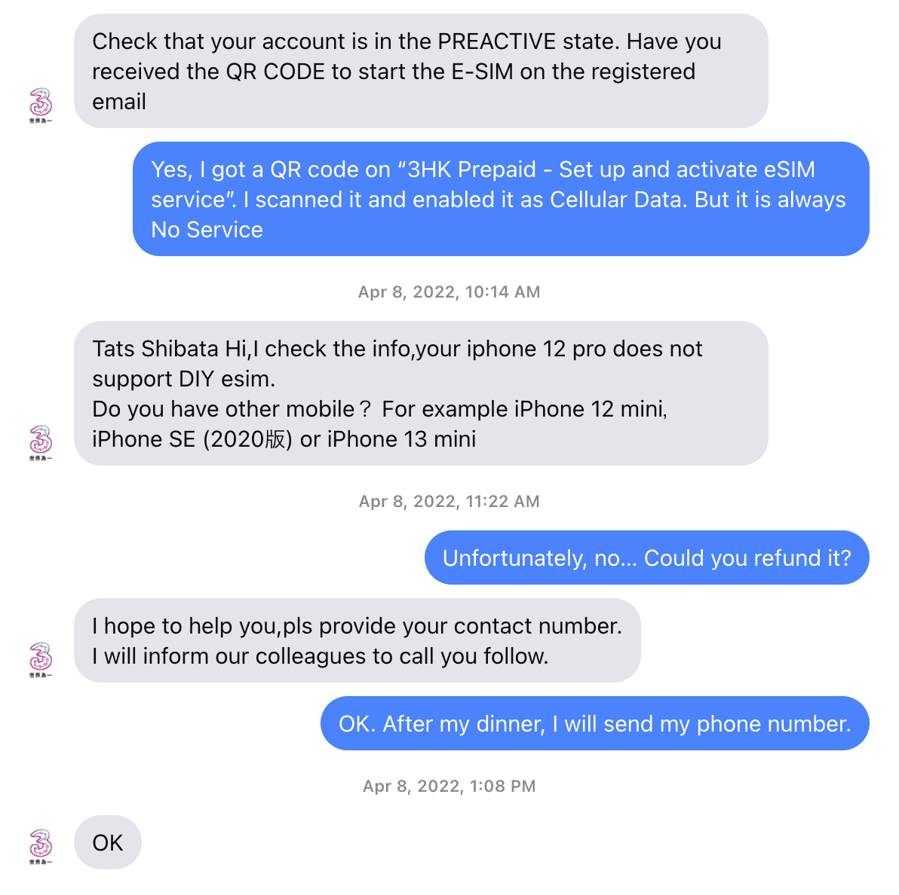
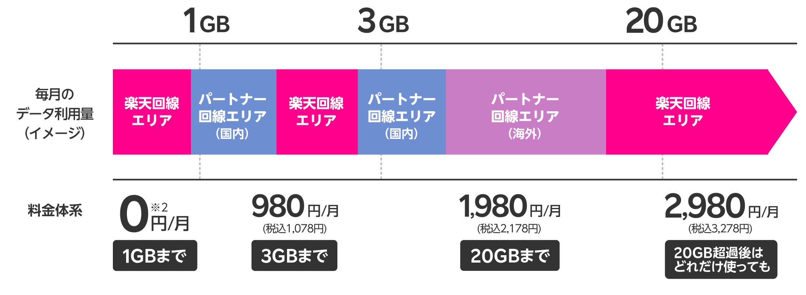
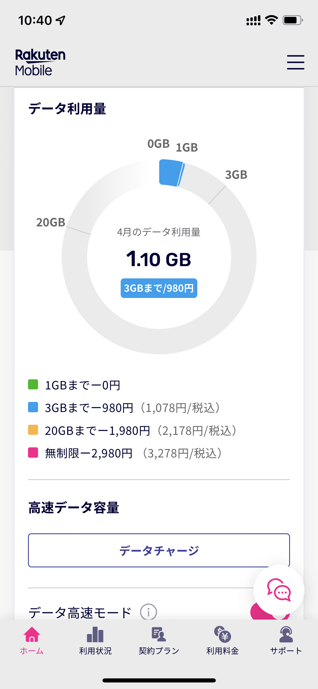

米国でのデータ通信用SIMとして、2019年から2020年1月までのコロナ禍前は3香港 (3HK) のeSIMを使っていました。当時のサービス内容は、米国だけでなく、中国、韓国、シンガポールなどのアジア、英国、フランス、イタリアなどの欧州などの28カ国 / 地域に対応、10日間 500MB/日 で、128香港ドル（当時のレートで2,000円）というものでした。

一方、[2022年4月のサービス内容](https://www.three.com.hk/prepaid/DIY/en/offer/travel)は、米国、カナダ、イギリスなどの6カ国 / 地域に対応、10日間 10GB で、138香港ドル（2,300円）というものに変わっていました。多少サービス内容が異なるものの、[Airaloの米国用eSIM](https://www.airalo.com/ja/united-states-esim)が 30日間 5GB で16米ドル（2,000円）、30日間 10GB で26米ドル（3,300円）なので、それと比べると安いです。そのため、今回の出張も3HKを利用することにしました。

支払いを済ますとメールでQRコードが届くので、それを iPhone 12 Pro で読めばアクティベーションされるという気軽さは変わりません。しかし、シアトルでいつまで待っても圏外 (No Service) のままです。同僚の iPhone 11 でも同様でした。

仕方がないので3HKに問い合わせようとするものの、[My3](https://apps.apple.com/ie/app/my3/id1477339641)というアプリが必要そうです。しかし、このアプリは日本の App Store になく、インストールできません。次に[3iChat](https://3ichat.three.com.hk/)というWebチャットを見つけたのですが、New Customer > 3HK Customer Enquiry でContinueを押すものの、何も反応しません。最終的に[Facebookの3HKアカウント](https://www.facebook.com/threeHK/)にメッセージを送ることにしました。Facebookがサポート部門とつながっているのか少し不安でしたが、10分ほどで返信があり、以下のようなやりとりを行いました。

> あなたの iPhone 12 Pro は DIY eSIM をサポートしません。ほかの携帯電話を持っていませんか？ たとえば iPhone 12 mini とか iPhone SE (2020) とか iPhone 13 mini とか
>
> 3HK

残念ながら iPhone 12 Pro しか持っていなかったので返金を求めました。すると、今度は電話で同様のやりとりをすることになりましたが、結果として、今回は返金ということになりました。

ということで、米国と香港の時差で電話のやりとりをするのも大変ですし、2022年4月現在、iPhoneでの米国用eSIMには3HKはお薦めできません。Androidだと問題ないのかどうかは分かりません。

## 3HKの代替案

3HKのeSIMが iPhone 12 Pro には対応していないことが明確になったのでAiraloを買おうと思ったのですが、サブ回線に使っている[楽天モバイルの海外ローミング](https://network.mobile.rakuten.co.jp/service/international-roaming/)が2GBまで無料なことに気づきました。とはいえ、この2GB分も Rakuten UN-LIMIT VI の毎月のデータ量に合算されるため、1GBを超えるとプラン料金のほうが1,078円になります。

[Rakuten UN-LIMIT VI カウント方法](https://network.mobile.rakuten.co.jp/fee/un-limit/)

私は楽天モバイルでまったくデータ通信していなかったので、1GBぎりぎりまではプラン料金含めて無料で使えます。そのため、1GBぎりぎりまで使って、それからAiraloを買う戦略にしました。しかし、気づいたときにはこうなっていました。

というわけで、1GBを超えてしまったので1,078円掛かることになりました。最終的には今回の出張は1.74GBで済んだため、Airaloを追加で購入する必要はありませんでした。そのため、楽天モバイルを1GB未満に抑えてAiraloを追加する戦略よりも安く済みました。ローミング先もAT&Tで、電波の入りにくいベイエリア（シリコンバレー）でも安心でした。

楽天モバイルの2GBで1,078円は悪くないものの、500円で1GB分データチャージして3GBまで使うとプラン料金が2,178円になり、合計2,678円になります。となると、5GBで16米ドル（2,000円）のAiraloのほうが安くなります。楽天モバイルのデータ通信を国内でも使っていて、すでに3GBを超えているためにプラン料金が2,178円になっている方は、おそらく追加料金なしで海外で2GB使えるのは魅力的でしょう。

AiraloのeSIMを初めて購入する方は、初回のeSIM購入の際にコード **TATS9429** を適用すると、あなたと私がそれぞれ3米ドル分の割引をもらえます。
