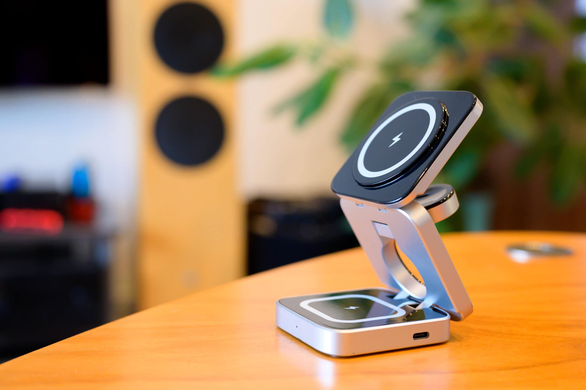

出張時はiPhoneを有線で充電しているのですが、iPhone 15 Pro に機種変更して常時画面点灯になったため、出張中もスタンドでMagSafe充電したくなりました。また、Apple Watch を [Satechi USB-C Magnetic Charging Dock for Apple Watch](https://satechi.net/products/usb-c-magnetic-charging-dock) で充電しているのですが、出張中はUSB-Cポートが十分に空いてなかったりするので、iPhoneと Apple Watch を一緒に充電できる2-in-1のスタンドを探してみました。

AliExpressで見つけたのが 3 In 1 Foldable Magnetic Wireless Charger Stand です。2-in-1で十分だったのですが、2-in-1という製品はあまりなく、AirPodsなども充電できる3-in-1のこちらにしました。私はAirPodsは持っていないのですが、[Sony WF-1000XM4](https://www.sony.jp/headphone/products/WF-1000XM4/) がQiに対応しているので充電できます。

折り畳んだときの厚さは3cmで特別薄いわけではありませんが、かばんに放りこんでおいてもかさばりません。重さも186gです。プラスチック製で、ポートはUSB-Cです。MagSafe部分の磁石も十分な強度があります。

入力は9V/2.5A, 12V/2A、出力は2.5W, 5W, 7.5W, 10W, 15Wと記載があります。しかし、MFi未認証のQi1の本製品は、iPhoneの場合は[最大7.5W](https://support.apple.com/ja-jp/HT208078)でしか充電できません。Apple Watch 用のところは最大2.5Wです。AirPods用のところは最大5Wです。AirPods用のところでiPhoneは充電できますが、Apple Watch は反応しません。

少し惜しいのは、iPhone 15 Pro が想定されておらず、iPhone 15 Pro のカメラ下部と本体上部が2mmくらい当たってしまいます。そのため、MagSafe接触部分が1mmほど浮いてしまう、または本体が2度ほど傾いてしまいます。iPhone 15 ならカメラ部分が小さいので当たらないと思います。出張用に気に入っているので、この部分が修正されてQi2対応版が出たら買い直しても良いかなと思っています。

|  |  |
| --- | --- |
| 製品名 | 3 In 1 Foldable Magnetic Wireless Charger Stand |
| 型番 | PB11 |
| 販売店 | [energy fort Official Store - AliExpress](https://s.click.aliexpress.com/e/_DBNcEFf) |
| 購入価格 | 3,121円 |
| 購入日 | 2023-10-16 |
| 納品日 | 2023-10-20 |