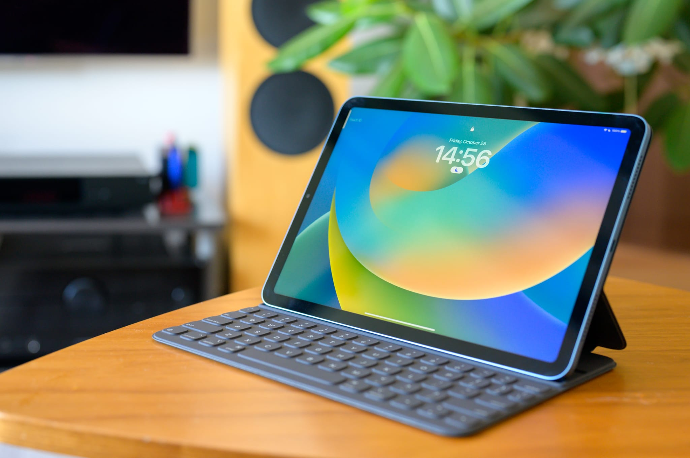
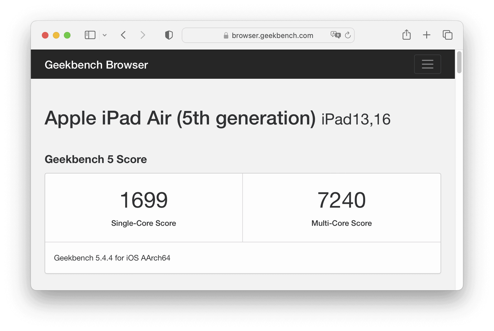
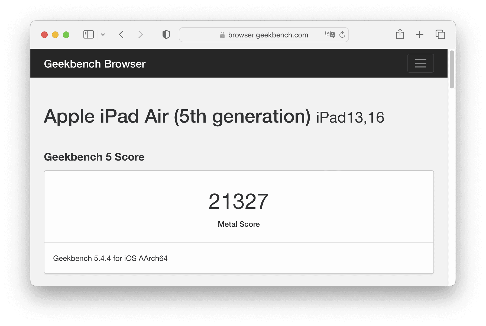
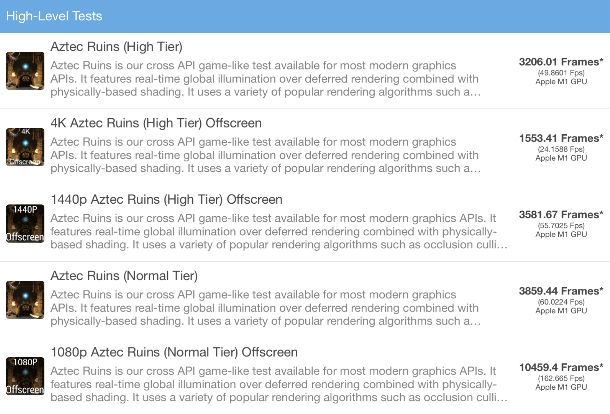
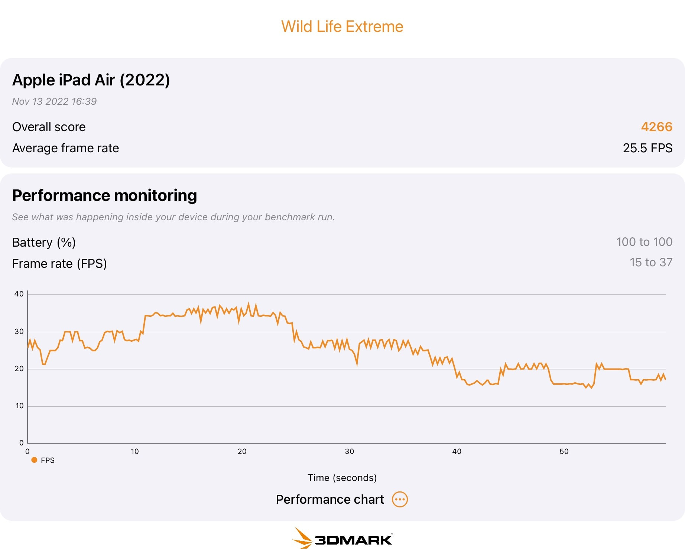
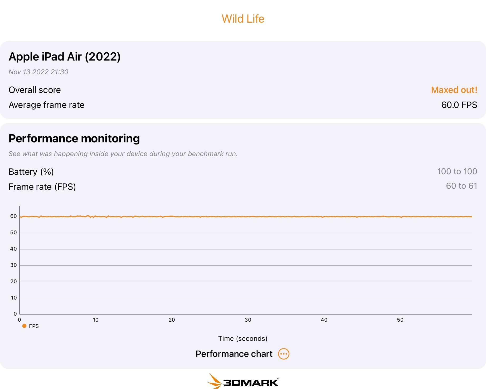

[Apple iPad Air（第3世代）](https://support.apple.com/kb/SP787?locale=ja_JP)を使っていたのですが、[iPad Air (第5世代）](https://www.apple.com/jp/ipad-air/)に買い替えました。iPad Air（第3世代）のCPU性能には特に不満はなかったのですが、当初はサブ機なので64GBで十分だと考えていたものの、実際には Adobe Lightroom Mobile やPhotosのキャッシュ、海外出張の機内で見るためにオフラインダウンロードしている Amazon Prime Video やNetflixの容量が大きく、それなりに使っているアプリもオフロードされて削除されているという機会が少なくなく、そこが一番不満点でした。

一方で、それほど頻繁に使っているわけではないので、AirではないオリジナルのiPadでも十分と考えいてたため、[iPad（第10世代）](https://www.apple.com/jp/ipad-10.9/)の発表を待っていました。しかし、iPad（第10世代）256GB は [iPad（第9世代）](https://www.apple.com/jp/ipad-10.2/)256GB に比べて21,000円も高くなっており、価格的魅力が薄れていました。また、iPad（第10世代）の発表と同時に、iPad Air（第5世代）256GB の10,000円値上げが発表されました。Yahoo!ショッピングでのポイント還元を考慮すると、値上げ前の iPad Air（第5世代）256GB はiPad（第10世代）256GB に比べて758円しか高くないという状況だったため、iPad（第10世代）が発表された数時間後の深夜に iPad Air（第5世代）256GB を購入しました。

## キーボード

[Apple Pencil](https://www.apple.com/jp/apple-pencil/)（第1世代）を持っていたのですが、ほとんど手書きでメモを取る機会がなかっため、iPad Air（第5世代）ではキーボードを付けることにしました。キーボードの候補としては、トラックパッドの付いている [Apple Magic Keyboard](https://www.apple.com/jp/shop/product/MJQK3J/A)、Logicool Folio Touch、トラックパッドの付いていない [Apple Smart Keyboard Folio](https://www.apple.com/jp/shop/product/MXNK2J/A) が候補になりました。しかし、Apple Magic Keyboard と Logicool Folio Touch はどちらも重量が600gを超え、iPad Air（第5世代）を組み合わせると1kgを超えてしまいます。1kgもあると、生産性の観点からタブレットではなくMacを持ち歩いたほうが良いのではないかという気がしてくるので、300gの Smart Keyboard Folio にしました。普通のカバーも200gくらいするので、プラス100gでキーボードが付いてくると考えたら許容範囲でしょう。

私は自宅のMacも会社のMacもUS配列を使っています。日本語と英語の切り替えは[Karabiner-Elements](https://karabiner-elements.pqrs.org/)を使って左Shiftキーで英語、右Shiftキーで日本語にしています。iPadで同じキーアサインは無理にしても、記号のキー配列の慣れから日本語配列キーボードは使いたくありません。そのため、US配列キーボードで日本語と英語をどのように切り替えるかが気になっていたのですが、左下のGlobeキーまたは Caps Lock キーを使ってトグルで切り替えられることが分かりました。また、Caps Lock / Control / Option / Command / Globe キーのアサインも変更可能だったため、Aの横の Caps Lock をControlに切り替えることも可能です。特に Magic Keyboard と Smart Keyboard Folio はEscapeキーがないため、どれかをEscapeに割り当てたほうが良いでしょう。私は Caps Locks で言語切り替え、GlobeキーをEscapeに割り当てています。

唯一問題なのは、自宅のMacでは [PFU HHKB Professional HYBRID Type-S](https://happyhackingkb.com/jp/products/hybrid_types/) を使っているので、Returnの直上がDeleteになっている点です。[Apple MacBook Pro (14-inch, 2021)](https://www.apple.com/jp/macbook-pro-14-and-16/) ではKarabiner-Elementsを使って | とDeleteを入れ替えているのですが、Smart Keyboard Folio では入れ替える方法がないため、| とDeleteのタイプミスが頻発しています。私は一般的なキーボードの | を小指、Deleteを薬指でタイプするため、場所はわずかな違いなのですが、使う指が違うので二種類が混ざるのは結構厳しいです。iOSですべてのキーのアサインが変更できるようになると良いのですが、難しいでしょう。

Smart Keyboard Folio には、11インチと12.9インチの違いだけでなく、2018年モデルと2020年モデルという4種類あります。分かりやすい違いは、2018年モデルはリアカメラ用の穴が長方形、2020年モデルは [iPad Pro（第2世代）](https://support.apple.com/kb/SP814?locale=ja_JP)に対応するため正方形になっています。iPad Air（第5世代）のリアカメラ形状は [iPad Pro（第1世代）](https://support.apple.com/kb/SP784?locale=ja_JP)と互換性があるため、2018年モデルも使用できます。逆に言うと、2018年モデルは最近の iPad Pro に対応できないため、けっこう値下げして販売しています。私は2018年モデルの11インチを実質14,062円で購入できました。

キーストロークはかなり浅いですが、適度なクリック感があり、カバーを兼用していることを考慮すると、タイプ感は悪くありません。キーボード側はナイロンのようなもので包まれており、キーと本体にすき間がありません。また、キーボードをタブレット裏側に360度回した状態ではキーボードは反応しないため、多少ゴツゴツしますが、読書の時などにもそれほど邪魔になりません。

## ベンチマーク

iPad Air（第5世代）のベンチマーク結果はすでにたくさん公開されてはいますが、長年パフォーマンスチューニングの仕事をしてきた身としては、ベンチマークを取らないわけにはいきません。

[Geekbench](https://www.geekbench.com/)はiOSの定番ベンチマークアプリです。バージョン5.4.4での iPad Air（第5世代）のCPU[計測結果](https://browser.geekbench.com/v5/cpu/18607566)は Single-Core Score が1,699、Multi-Core Score が7,240になりました。iPad Air（第3世代）のCPU[計測結果](https://browser.geekbench.com/v5/cpu/1053923)は Single-Core Score が1,116、Multi-Core Score が2,865だったので、2.53倍も速くなりました。iPad（第10世代）と同じA14の iPhone 12 ProのCPU[計測結果](https://browser.geekbench.com/v5/cpu/4328233)は Single-Core Score が1,589、Multi-Core Score が3,977だったので、iPad（第10世代）よりも1.82倍ほど速そうです。iPad Air（第5世代）のM1は高性能コア4 + 高効率コア4なのに対し、Aシリーズは高性能コア2 + 高効率コア4なところが大きそうです。

Geekbench 5 での Apple iPad Air (5th generation) のCPU計測結果

Compute (GPU) の[計測結果](https://browser.geekbench.com/v5/compute/5878077)は21,327でした。iPad Air（第3世代）のCompute[計測結果](https://browser.geekbench.com/v5/compute/450875)は4,576なので、こちらも4.66倍も速いようです。

Geekbench 5 での Apple iPad Air (5th generation) の Compute (GPU) 計測結果

[GFX Bench](https://gfxbench.com/) Metal は3Dゲームベンチマークアプリです。バージョン5.0.5での計測結果は、1440p Aztec Ruins High Tier Offscreen が 3581.67 Frames でした。[GFX Bench 5.0 Results](https://gfxbench.com/result.jsp?benchmark=gfx50&test=759&order=median&base=device) によると、[NVIDIA GeForce GTX 760 Ti](https://www.nvidia.co.jp/gtx-700-graphics-cards/gtx-760/) 程度です。

GFX Bench での Apple iPad Air (5th generation) の計測結果

[3DMark Wild Life Benchmark](https://benchmarks.ul.com/3dmark-ios) も3Dゲームベンチマークアプリです。バージョン1.1.356での計測結果は、Wild Life Extream が4,266 / 25.5FPSでした。Wild Life Extream は4Kなので、4Kでは少し力不足のようです。1440の Wild Life では60FPSを超えているので、1440では十分な性能と言えるでしょう。

3DMark Wild Life Extreme での Apple iPad Air (5th generation) の計測結果

3DMark Wild Life での Apple iPad Air (5th generation) の計測結果

|  |  |
| --- | --- |
| ブランド | [Apple](https://www.apple.com/jp/) |
| 製品名 | [iPad Air (5th generation)](https://www.apple.com/jp/ipad-air/) Blue |
| 仕様 | 256GB Wi-Fi |
| 型番 | MM9N3J/A A2588 |
| 購入店 | BeaBeA - Yahoo!ショッピング |
| 価格 | 100,600円。送料無料（- PayPayポイント7,042円相当還元） |
| 購入日 | 2022-10-19 |

|  |  |
| --- | --- |
| ブランド | [Apple](https://www.apple.com/jp/) |
| 製品名 | iPad Pro (11-inch) Smart Keyboard Folio |
| 仕様 | US配列 |
| 型番 | MU8G2ZA/A A2038 |
| 購入店 | U.S.Key - Yahoo!ショッピング |
| 価格 | 15,800円。送料無料（- PayPayポイント1,738円相当還元） |
| 購入日 | 2022-10-20 |