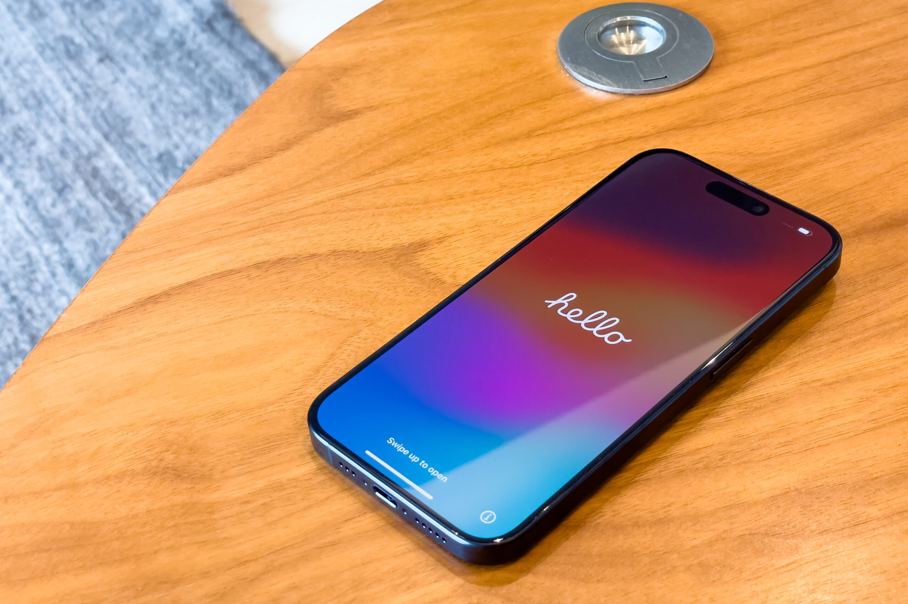
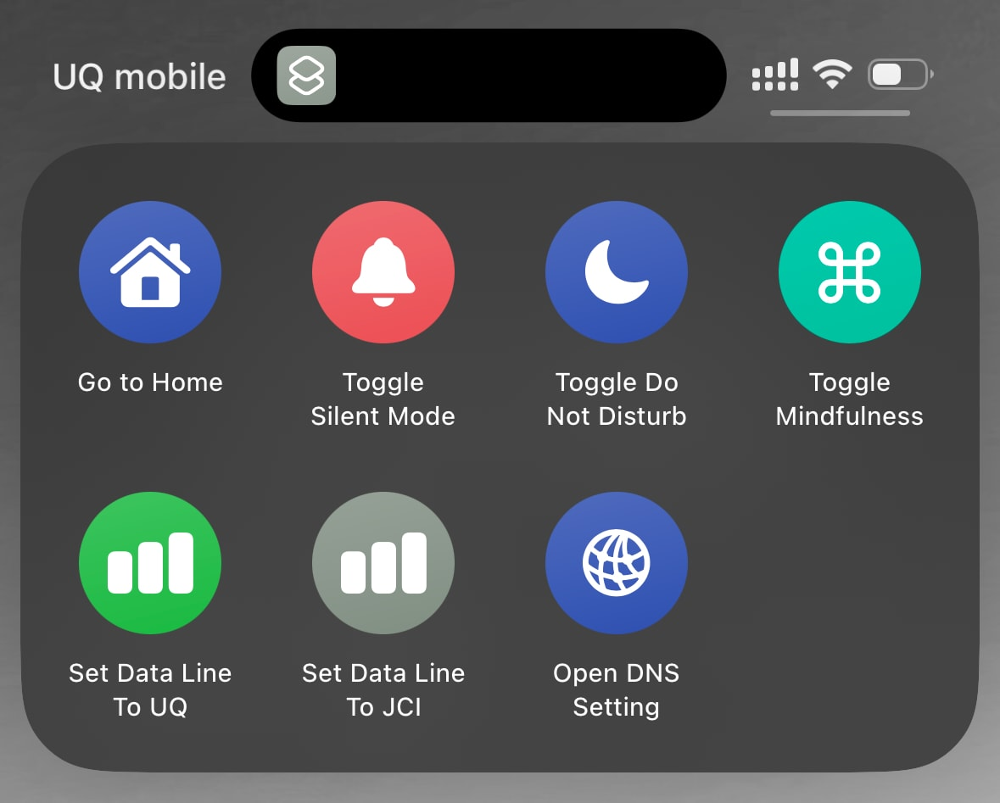
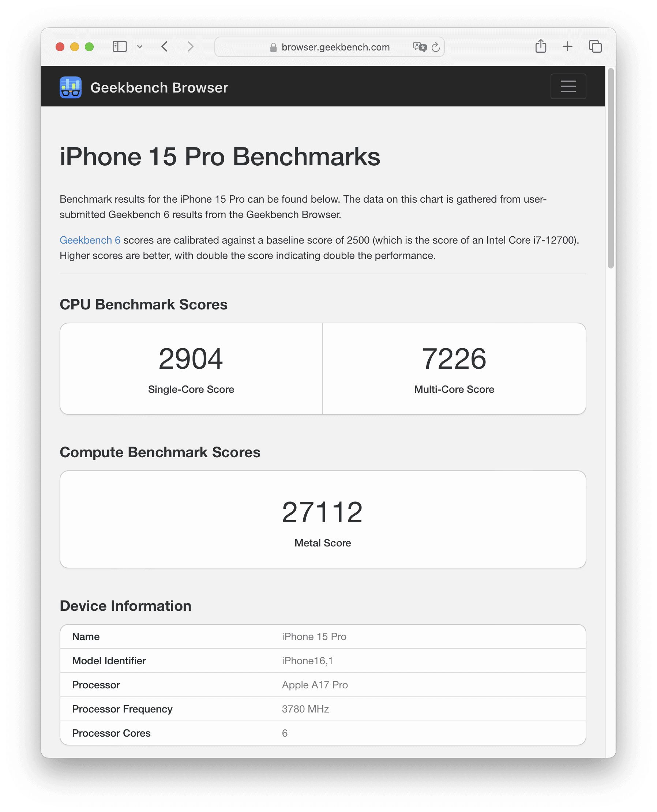
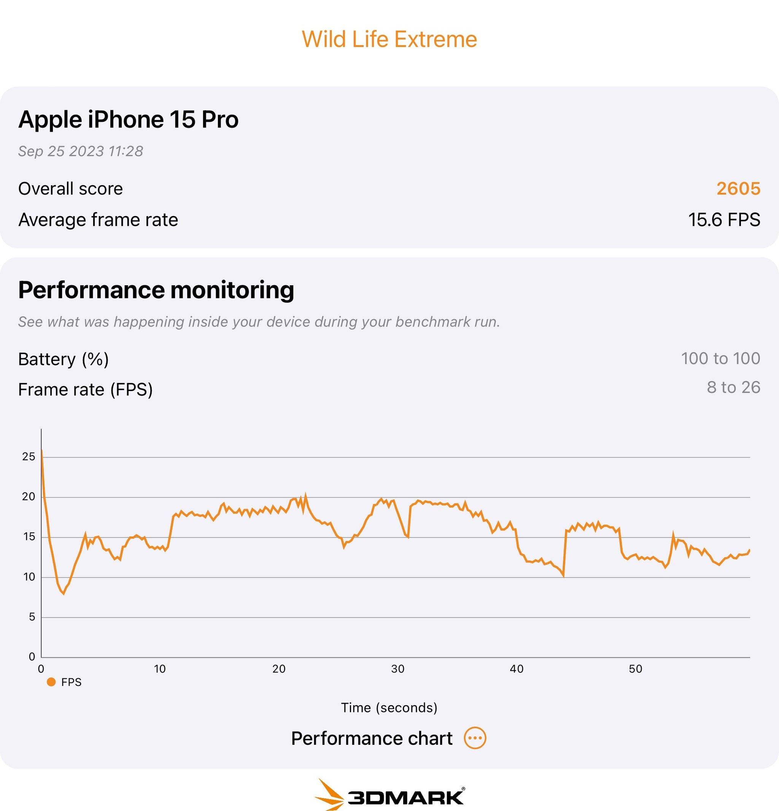

Apple iPhone 12 Pro から iPhone 15 Pro に機種変更しました。iPhone 12 Pro に目立った懸念はなかったのですが、Macにしろ電化製品にしろ「ポートの規格が変わったときは買い換え時」と考えているので、LightningからUSB-Cに変わったこのタイミングで買い替えました。終わりの見えているLightningで接続する周辺機器を買う気になれませんでしたが、USB-Cの周辺機器であれば買う気になります。

また、iPhone 15 Pro の1,200万画素での2倍ズームが標準レンズの中央部分をクロップする仕様になり、デジタルズームしなくなったのが魅力的でした。2倍ズームは35mm換算で焦点距離48mmなので、頻繁に使います。ポストプロダクションに強い Apple ProRAW で常に撮影しているので絶対にProなのですが、Pro限定の1倍ズーム (24mm) をデフォルトで1.2倍ズーム (28mm) にしておけるのも渋いですが好みの機能です。

一方、Proにしかないアクションボタンは1個の機能しか設定できないとなると微妙ですが、ここに[Shortcut](https://apps.apple.com/jp/app/%E3%82%B7%E3%83%A7%E3%83%BC%E3%83%88%E3%82%AB%E3%83%83%E3%83%88/id915249334)アプリのフォルダーを割りあてると、いろいろな機能を2タップで実行できるようになります。たとえばサブ回線への切り替えや、アドブロックしているDNSサーバーを通常のDNSサーバーに切り替えるための画面を表示する、などができます。

## Action Button にShortcutフォルダーを割り当てる方法

1. 設定 > アクションボタン
2. 「ショートカット」を選択
3. 「フォルダーを表示...」を選択
4. 表示したいショートカット群の入っているフォルダーを選択

## ベンチマーク

[Geekbench](https://www.geekbench.com/)はiOSの定番ベンチマークアプリです。Geekbenchが公開している結果によると、iPhone 15 Pro のCPU[計測結果](https://browser.geekbench.com/ios_devices/iphone-15-pro)は Single-Core Score が2,904、Multi-Core Score が7,226です。iPhone 15 Pro のCPUは A17 Pro、以前使っていた iPhone 12 Pro のCPUはA14で、 iPhone 12 Pro のCPU[計測結果](https://browser.geekbench.com/ios_devices/iphone-12-pro)は Single-Core Score が2,020、Multi-Core Score が4,511なので、A17 Pro はA14に比べて60%ほど速いようです。CPU性能的にも買い替える価値があったと言えるでしょう。

Compute (GPU) の[計測結果](https://browser.geekbench.com/ios_devices/iphone-15-pro)は27,112でした。iPhone 12 Pro のCompute[計測結果](https://browser.geekbench.com/ios_devices/iphone-12-pro)は15,879なので、こちらは70%ほど速いようです。

[GFX Bench](https://gfxbench.com/) Metal は3Dゲームベンチマークアプリです。GFX Bench が公開している結果によると、Aztec Ruins High Tier Offscreen の iPhone 15 Pro の[計測結果](https://gfxbench.com/device.jsp?benchmark=gfx50&os=iOS&api=metal&cpu-arch=ARM&hwtype=iGPU&hwname=Apple%20A17%20Pro%20GPU&did=117363999&D=Apple%20iPhone%2015%20Pro)は 3,112 Frames / 48.4 FPS でした。iPhone 12 Pro の[計測結果](https://gfxbench.com/device.jsp?benchmark=gfx50&os=iOS&api=metal&cpu-arch=ARM&hwtype=GPU&hwname=Apple%20A14%20GPU&did=90692022&D=Apple%20iPhone%2012%20Pro)は 1,858 Frames / 28.9 FPS なので、67%ほど速いようです。iPhone 15 Pro の結果は NVIDIA GeForce GTX 1050 の[結果](https://gfxbench.com/device.jsp?benchmark=gfx50&os=Windows&api=dx&cpu-arch=x86&hwtype=dGPU&hwname=NVIDIA%20GeForce%20GTX%201050&did=40772359&D=NVIDIA%20GeForce%20GTX%201050)くらいです。

[3DMark Wild Life Benchmark](https://benchmarks.ul.com/3dmark-ios) も3Dゲームベンチマークアプリです。バージョン1.2.417での計測結果は、Wild Life Extreame が2,605 / 15.6 FPSでした。

3DMark Wild Life Extreme での Apple iPhone 15 Pro の計測結果

|  |  |
| --- | --- |
| ブランド | [Apple](https://www.apple.com/jp/) |
| 製品名 | [iPhone 15 Pro](https://www.apple.com/jp/iphone-15-pro/) Blue Titanium |
| 仕様 | 256GB |
| 型番 | MTUG3J/A A3101 |
| 購入店 | [Apple](https://www.apple.com/jp/shop/buy-iphone/iphone-15-pro/6.1%E3%82%A4%E3%83%B3%E3%83%81%E3%83%87%E3%82%A3%E3%82%B9%E3%83%97%E3%83%AC%E3%82%A4-256gb-%E3%83%96%E3%83%AB%E3%83%BC%E3%83%81%E3%82%BF%E3%83%8B%E3%82%A6%E3%83%A0-sim%E3%83%95%E3%83%AA%E3%83%BC) |
| 購入価格 | 174,800円 |
| 購入日 | 2023-09-15 |
| 納品日 | 2023-09-23 |