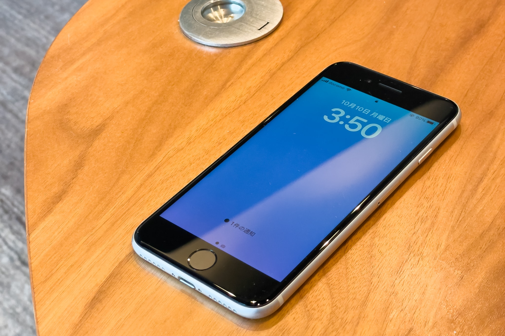
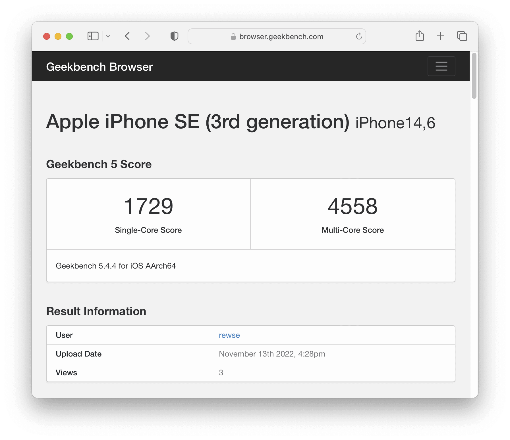
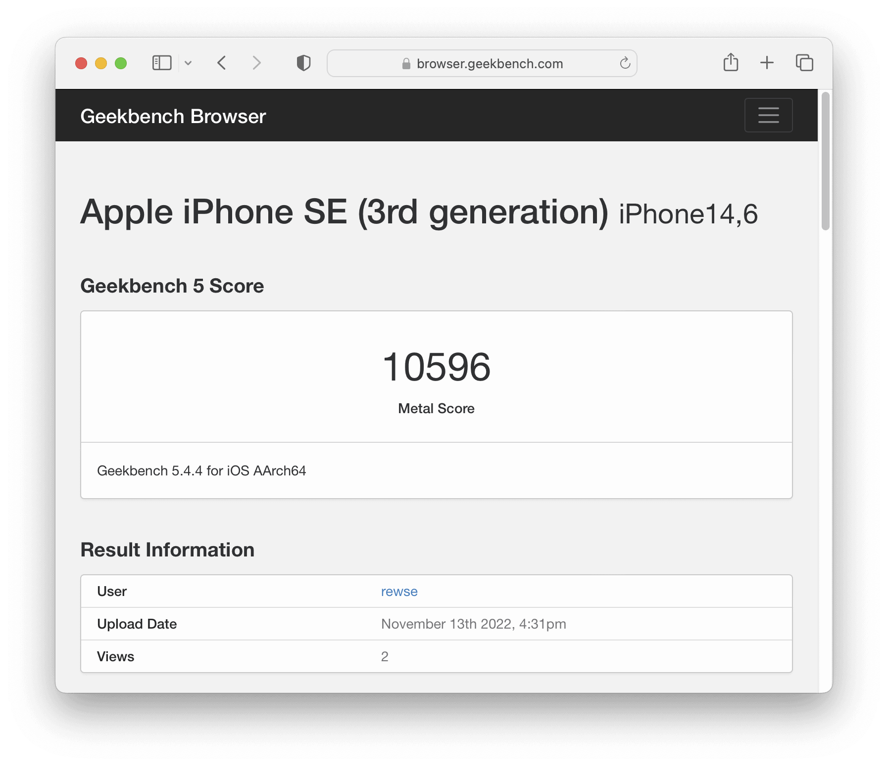
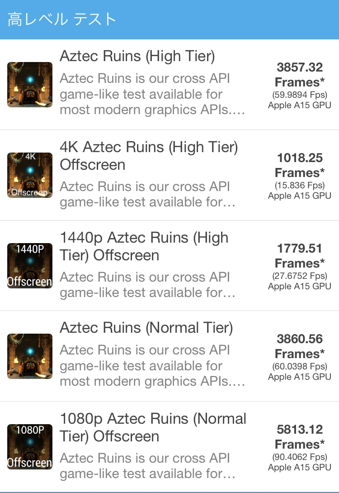
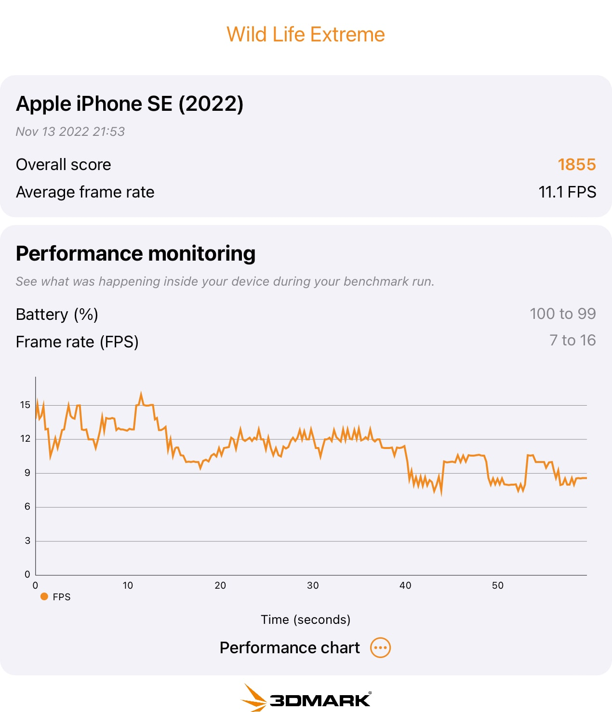
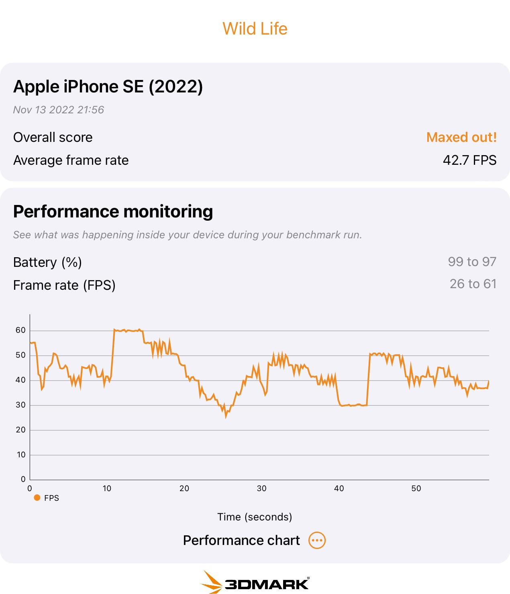

娘の10歳の誕生日プレゼントとして iPhone SE（第3世代）を購入しました。最近、周りの友達がキッズケータイを卒業しだしたので、娘も [au mamorino5](https://www.au.com/mobile/product/featurephone/mamorino5/) を卒業です。

ヨドバシカメラ 新宿西口本店 で、ドコモは128GBがMNP一括14,800円でした。ソフトバンクは64GBがMNP一括1円でしたが、メリハリ無制限プラン縛りだったのでドコモにしました。

キッズケータイからのMNPなので、ドコモの料金プランは[U15はじめてスマホプラン](https://www.docomo.ne.jp/charge/u15_hajimete_plan/)が選べました。このプランは利用者が15歳以下で、新規契約、またはキッズケータイを含むガラケーからの機種変更またはMNPだと選択できます。このプランは5GB + 1回あたり5分以内の国内通話無料で、最大12カ月間は月額1,265円、13カ月目以降は月額1,815円で18歳まで使えるという内容です。普通の[はじめてスマホプラン](https://www.docomo.ne.jp/charge/hajimete_plan/)は1GBなので容量に不安がありますが、U15はじめてスマホプランは5GBなので、小学生の間はたぶんこれで十分でしょう。

## ベンチマーク

iPhone SE（第3世代）のベンチマーク結果はすでにたくさん公開されてはいますが、長年パフォーマンスチューニングの仕事をしてきた身としては、ベンチマークを取らないわけにはいきません。

[Geekbench](https://www.geekbench.com/)はiOSの定番ベンチマークアプリです。バージョン5.4.4での iPhone SE（第3世代）のCPU[計測結果](https://browser.geekbench.com/v5/cpu/18607898)は Single-Core Score が1,729、Multi-Core Score が4,558になりました。iPhone SE（第3世代）のCPUはA15、私の使っている iPhone 12 Pro のCPUはA14で、iPhone 12 Pro のCPU[計測結果](https://browser.geekbench.com/v5/cpu/4328233)は Single-Core Score が1,589、Multi-Core Score が3,977なので、A15はA14に比べて14%ほど速いようです。

Geekbench 5 での Apple Phone SE (3rd generation) のCPU計測結果

Compute (GPU) の[計測結果](https://browser.geekbench.com/v5/compute/5878179)は10,596でした。iPhone 12 Pro のCompute[計測結果](https://browser.geekbench.com/v5/compute/1692914)は9,259なので、こちらも14%ほど速いようです。

Geekbench 5 での Apple Phone SE (3rd generation) の Compute (GPU) 計測結果

[GFX Bench](https://gfxbench.com/) Metal は3Dゲームベンチマークアプリです。バージョン5.0.5での計測結果は、1440p Aztec Ruins High Tier Offscreen が 1779.51 Frames でした。[GFX Bench 5.0 Results](https://gfxbench.com/result.jsp?benchmark=gfx50&test=759&order=median&base=device) によると、[NVIDIA GeForce GTX 650 Ti](https://www.nvidia.com/en-us/geforce/graphics-cards/geforce-gtx-650ti/) 程度です。

GFX Bench での Apple iPhone SE (3rd generation) の計測結果

[3DMark Wild Life Benchmark](https://benchmarks.ul.com/3dmark-ios) も3Dゲームベンチマークアプリです。バージョン1.1.356での計測結果は、Wild Life Extreame が1,855 / 11.1FPSでした。Wild Life Extream は4Kなので、4Kでは厳しそうです。1440の Wild Life では42.7FPSを超えているので、750の iPhone SE（第3世代）のディスプレイでプレイしている分には十分でしょう。

3DMark Wild Life Extreme での Apple iPhone SE (3rd generation) の計測結果

3DMark Wild Life での Apple iPhone SE (3rd generation) の計測結果

|  |  |
| --- | --- |
| ブランド | [Apple](https://www.apple.com/jp/) |
| 製品名 | [iPhone SE (3rd Generation)](https://www.apple.com/jp/iphone-se/) Starlight |
| 仕様 | 128GB |
| 型番 | MMYG3J/A A2782 |
| 購入店 | [ヨドバシカメラ 新宿西口本店](https://www.yodobashi.com/ec/store/0011/) |
| 価格 | 14,800円 |
| 購入日 | 2022-10-16 |