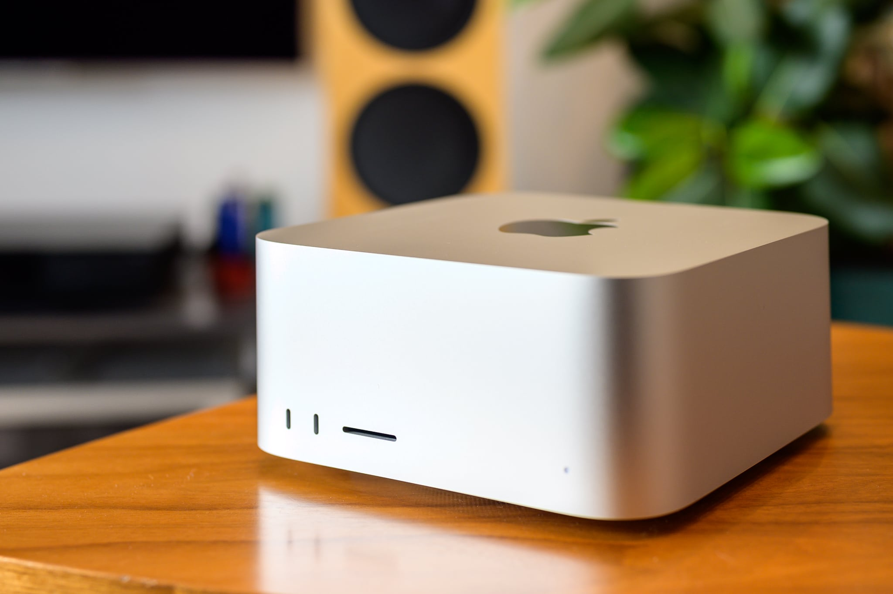
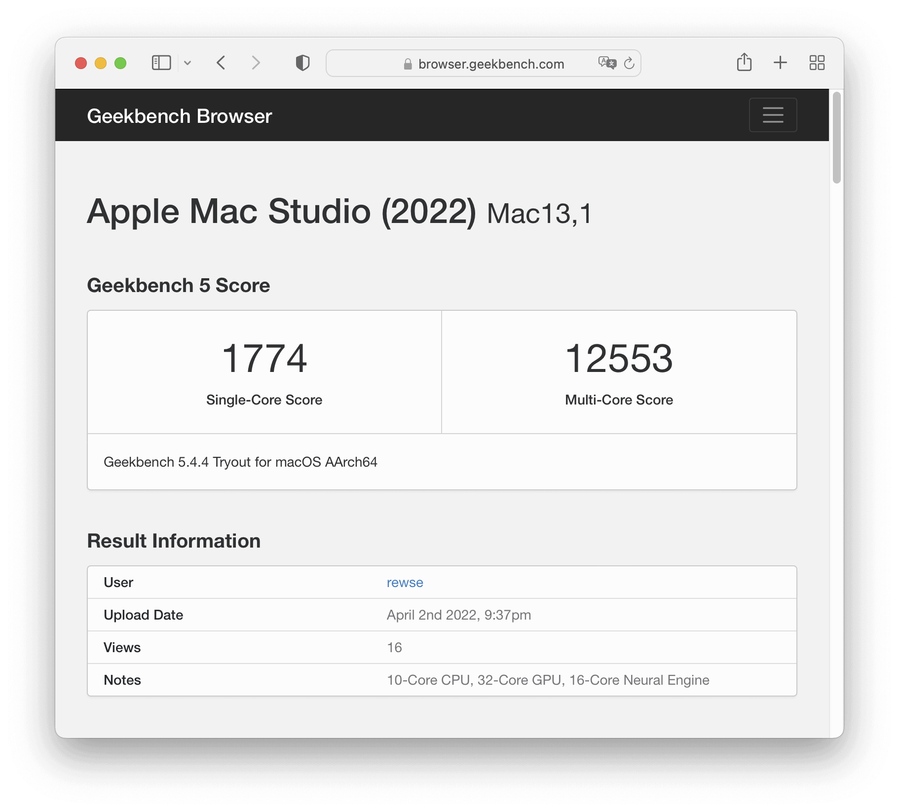
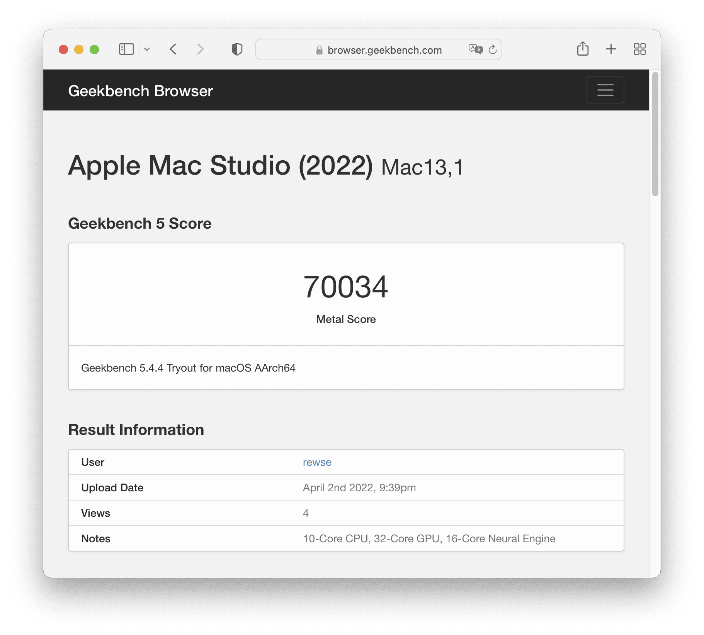
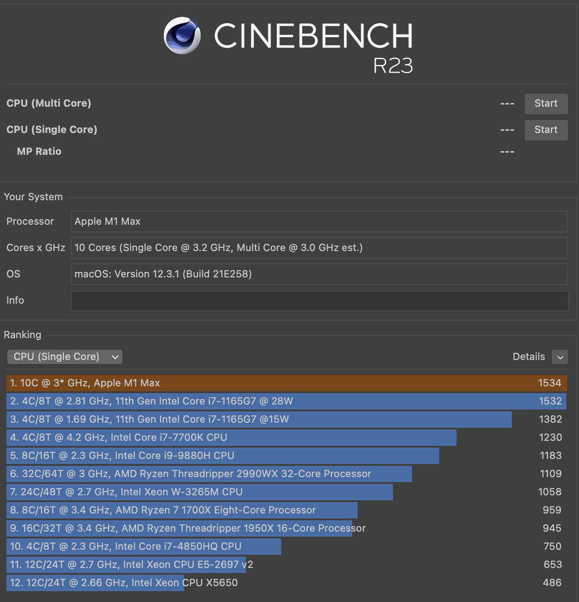
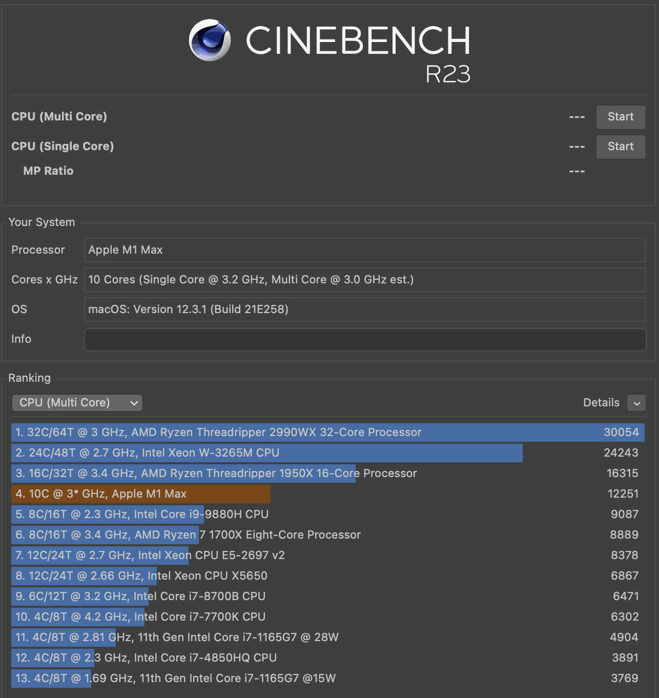
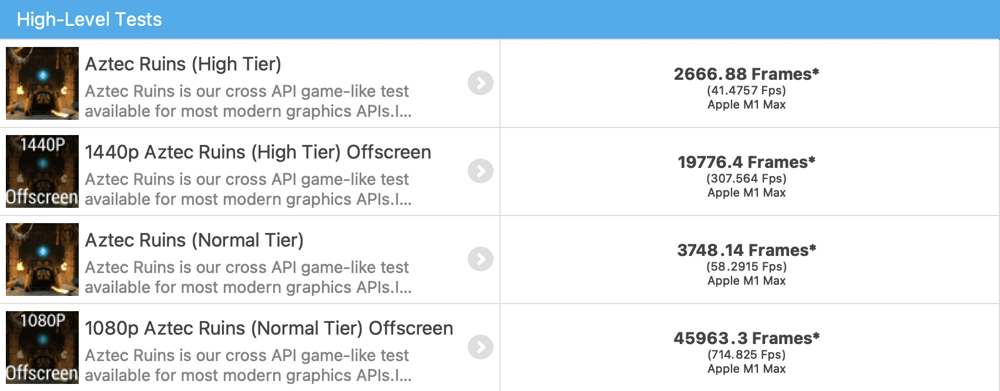
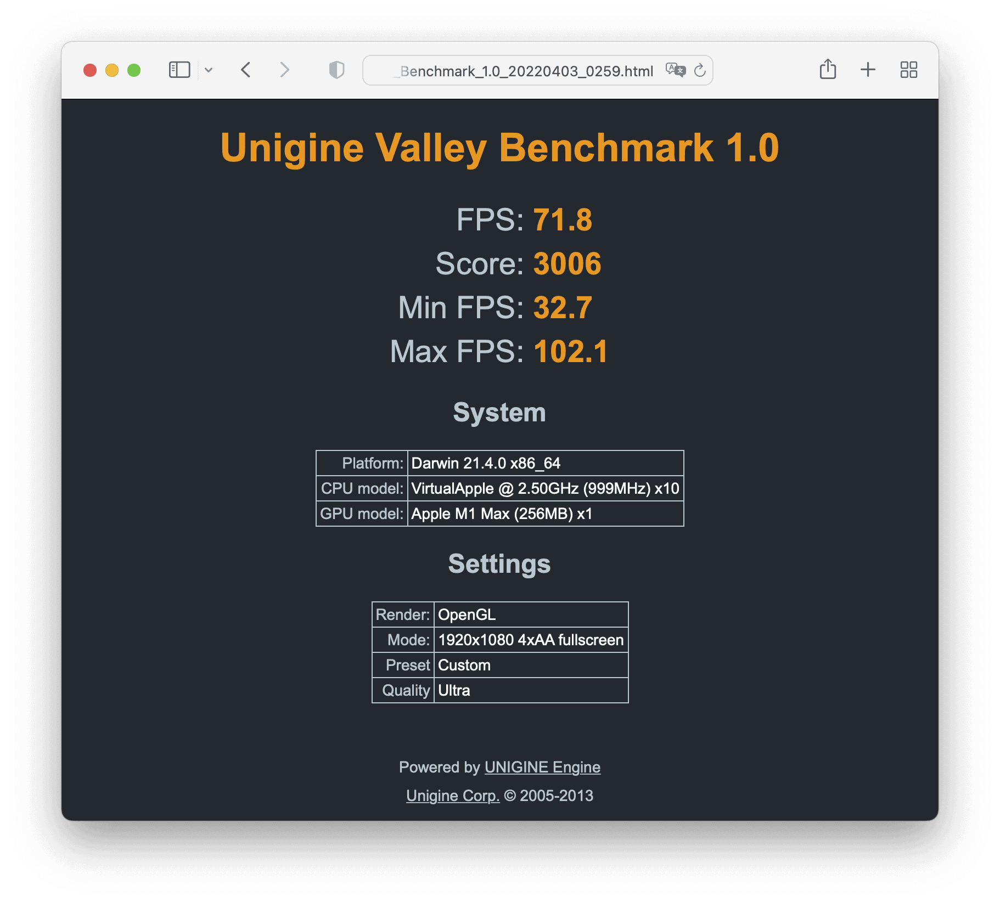
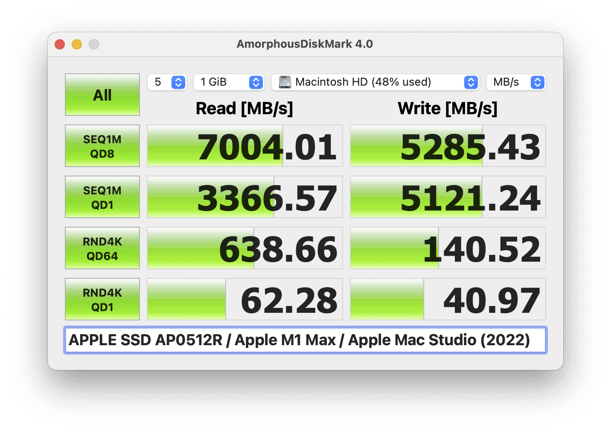
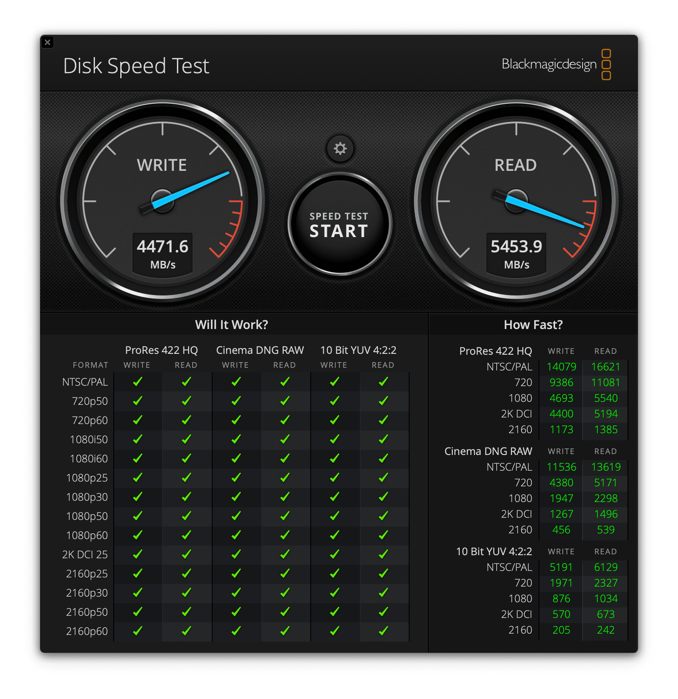

自宅でメインに使っているコンピューターが [Apple Mac mini (2018)](https://support.apple.com/kb/SP782?locale=ja_JP) [3.2GHz 6-Core Intel Core i7, 32GB Memory, 512GB SSD Storage] だったので、Apple M1 Pro / Max を搭載した Mac mini が発表されることを2021年Q4から期待していたら、2022年3月に Apple M1 Max / Ultra を搭載した [Apple Mac Studio (2022)](https://www.apple.com/jp/mac-studio/) が発表されました。Mac mini と比べると厚みは違いますが、欲しいのはモニターなしのデスクトップ機なので、もちろん購入です。

[Apple MacBook Pro (14-inch, 2021)](https://www.apple.com/jp/macbook-pro-14-and-16/) は Apple M1 Pro または Apple M1 Max から選べ、CPU数やGPU数の細かな違いも含めるとCPUのラインナップが5種類もあり、Mac mini で同様にリリースされたらどれにするか事前に悩んでいましたが、Apple Mac Studio (2022) は Apple M1 Max または Apple M1 Ultra になり、M1 Ultra は高すぎるので、選択肢が 10-Core CPU, 24-Core GPU, 16-Core Neural Engine または 10-Core CPU, 32-Core GPU, 16-Core Neural Engine の2択に絞りやすかったので、それほど悩まずに 10-Core CPU, 32-Core GPU, 16-Core Neural Engine を選びました。GPUは [Adobe Photoshop Lightroom](https://www.adobe.com/jp/products/photoshop-lightroom.html) での色補正と [DaVinci Resolve](https://www.blackmagicdesign.com/jp/products/davinciresolve/) のエンコーディングに影響するため、Apple Mac mini (2018) のときも Intel UHD Graphics 630 を補うために、eGPUとして [SAPPHIRE PULSE RX 5700 8G GDDR6](https://www.sapphiretech.com/ja-jp/consumer/pulse-radeon-rx-5700-8g-gddr6) をつないでいました。そのため、今回もGPUは重視しました。

M1 Max なので64GBメモリーを選ぶこともできましたが、現行の32GBのApple Mac mini (2018) でスワップしたことがほとんどないのと、Apple MacBook Pro (14-inch, 2021) のレビューをいくつか見てみると、8K映像の編集でもしない限り64GBは必要なさそうなので、32GBにしました。ただ、Apple Mac mini (2018) ではCPUだけに32GBで、GPUは別途8GB持っていたので、Unified Memory の Apple Mac Studio (2022) では Apple Mac mini (2018) より少なくなります。また、ファイルキャッシュとして使えるので、大きなメモリーが無駄になることはないとも思います。

ストレージは Apple Mac mini (2018) で256GB程度しか使っていなかったので、変わらず512GBにしました。最近はデータの保存先がクラウドに移行しつつあるため、ローカルにはそれほど大きなストレージが必要なくなっています。

以上を踏まえて、10-Core CPU, 32-Core GPU, 16-Core Neural Engine, 32GB Memory, 512GB SSD Storage の構成で、発表された2022年3月9日に注文し、4月1日に到着しました。

## ベンチマーク

Apple M1 Max のベンチマーク結果は Apple MacBook Pro (14-inch, 2021) も含めるとすでにたくさん公開されてはいますが、長年パフォーマンスチューニングの仕事をしてきた身としては、ベンチマークを取らないわけにはいきません。

[Geekbench](https://www.geekbench.com/)はMacの定番ベンチマークアプリです。バージョン5.4.4での Apple Mas Studio (2022) / Apple M1 Max (10-Core CPU, 32-Core GPU, 16-Core Neural Engine) のCPU[計測結果](https://browser.geekbench.com/v5/cpu/14036399)は Single-Core Score が1,774、Multi-Core Score が12,553になりました。Apple Mac mini (2018) の[計測結果](https://browser.geekbench.com/v5/cpu/973766)は Single-Core Score が1,131、Multi-Core Score が5,862だったので、シングルコアで1.57倍、マルチコアで2.15倍になっています。3年で2倍というのは、かなり進化スピードが速く、買い替える価値がありました。[Geekbench: Mac Benchmarks](https://browser.geekbench.com/mac-benchmarks) によると、シングルコアではIntel最速の [Intel Core i7-10700K](https://www.intel.co.jp/content/www/jp/ja/products/sku/199335/intel-core-i710700k-processor-16m-cache-up-to-5-10-ghz/specifications.html) (8-Core, 3.8GHz) が1,250なので、それよりも1.4倍速いです。最近の Intel CPU のシングルコアの進化が遅かったことを考慮すると、1.4倍はかなり大きいです。マルチコアでは Intel Xeon W-2191B (18-Core, 2.3GHz) が13,432なので、ワークステーション級の性能と言えるでしょう。しかし、少し前までハイエンドと自慢できた Apple M1 Max のさらに2倍の Apple M1 Ultra がリリースされた今となっては、M1 Max はこれでもミッドレンジです。

Geekbench 5 での Apple Mac Studio (2022) / Apple M1 Max (10-Core CPU, 32-Core GPU, 16-Core Neural Engine) のCPU計測結果

Compute (GPU) のMetalでの[計測結果](https://browser.geekbench.com/v5/compute/4587120)は70,034、OpenCLでの[計測結果](https://browser.geekbench.com/v5/compute/4587127)は58,818でした。Intel UHD Graphics 630 の Apple Mac mini (2018) のMetalでの[計測結果](https://browser.geekbench.com/v5/compute/414758)は2,372、AMD Radeon RX 5700 をeGPUで接続した場合のMetalでの[計測結果](https://browser.geekbench.com/v5/compute/414742)は32,081なので、Metalで比較した場合、iGPUとしては30倍、eGPUを接続した現行環境よりも2.2倍と、こちらも買い替える価値がありました。Apple M1 Max (10-Core CPU, 32-Core GPU, 16-Core Neural Engine) は、[Metalで比較](https://browser.geekbench.com/metal-benchmarks)すると AMD Radeon RX 5700 XT 相当、[OpenCLで比較](https://browser.geekbench.com/opencl-benchmarks)すると [NVIDIA GeForce GTX 1660 Ti](https://www.nvidia.com/ja-jp/geforce/graphics-cards/16-series/) 相当です。5万円弱のGPUと同等というところでしょうか。なお、Geekbenchの計測結果は3D描画に特化していないので、ゲーム用途とは評価が異なります。

Geekbench 5 での Apple Mac Studio (2022) / Apple M1 Max (10-Core CPU, 32-Core GPU, 16-Core Neural Engine) の Compute (GPU) 計測結果

|  | Apple Mac Studio (2022) | Apple Mac mini (2018) | 性能比 |
| --- | --- | --- | --- |
| CPU: Single-Core | 1,774 | 1,131 | 1.57X |
| CPU: Multi-Core | 12,553 | 5,862 | 2.15X |
| Compute (GPU): Metal | 70,034 | 2,372 | 29.53X |

[Maxon Cinebench](https://www.maxon.net/ja/cinebench) はCPUベンチマークアプリです。R23.200での計測結果は、Single Core が1,534で、[Intel Core i7-1165G7](https://www.intel.co.jp/content/www/jp/ja/products/sku/208662/intel-core-i71165g7-processor-12m-cache-up-to-4-70-ghz/specifications.html) (4-Core, 2.8GHz) と同等、Multi Core が12,251で、[Intel Core i9-9880H](https://www.intel.co.jp/content/www/jp/ja/products/sku/192987/intel-core-i99880h-processor-16m-cache-up-to-4-80-ghz/specifications.html) (8-Core, 2.3GHz) の1.34倍でした。

Cinebench R23 での Apple Mac Studio (2022) / Apple M1 Max (10-Core CPU, 32-Core GPU, 16-Core Neural Engine) の Single Core CPU 計測結果

Cinebench R23 での Apple Mac Studio (2022) / Apple M1 Max (10-Core CPU, 32-Core GPU, 16-Core Neural Engine) の Multi Core CPU 計測結果

[GFX Bench](https://gfxbench.com/) Metal はMetalを使用した3Dゲームベンチマークアプリです。バージョン5.0.3での計測結果は、1440p Aztec Ruins High Tier Offscreen が19,776.4 Frames でした。[GFX Bench 5.0 Results](https://gfxbench.com/result.jsp?benchmark=gfx50&test=759&order=median&base=device) によると、[NVIDIA GeForce RTX 3060 Ti](https://www.nvidia.com/ja-jp/geforce/graphics-cards/30-series/rtx-3060-3060ti/) 程度です。Onscreenはモニターの解像度の影響を受けますが、物理解像度3840 x 2160 / 論理解像度6720 x 3780で検証しているため、値が低めに出ています。

GFX Bench Metal: Aztec Ruins での Apple Mac Studio (2022) / Apple M1 Max (10-Core CPU, 32-Core GPU, 16-Core Neural Engine) の計測結果

[Valley](https://benchmark.unigine.com/valley)はOpenGLを使用した3Dゲームベンチマークアプリです。Extream HD Preset のままだと画面が真っ黒で何も表示されないため、Anti-aliasingをx4に変更しました。結果は 71.8 FPS でした。

Valleyでの Apple Mac Studio (2022) / Apple M1 Max (10-Core CPU, 32-Core GPU, 16-Core Neural Engine) の計測結果

[AmorphousDiskMark](https://www.katsurashareware.com/ja/amorphousdiskmark/)はストレージベンチマークアプリです。Windowsでおなじみの[CrystalDiskMark](https://crystalmark.info/ja/software/crystaldiskmark/)と同じ感覚で使えますが、結果を直接比較することはできません。4.0での計測結果は、Sequential Read で7,004.10MB/s、Sequential Write で5,285.43MB/sとなりました。

AmorphousDiskMarkでの Apple Mac Studio (2022) の計測結果

[Blackmagic Disk Speed Test](https://apps.apple.com/jp/app/blackmagic-disk-speed-test/id425264550) もストレージベンチマークアプリです。3.3での計測結果は、Readで4,471.6MB/s、Writeで5,453.9MB/sとなりました。

Blackmagic Disk Speed Test での Apple Mac Studio (2022) の計測結果

## 静音性について

特筆すべき点は、その静音性です。ベンチマークを実行しても、室温24度の環境でCPU温度が38度程度にしかならず、ファンは2個とも1,300rpmの最低速度でしか回りません。私は Apple Mac Studio (2022) を足下に置いていることもあって、完全に無音です。

## まとめ

Apple M1 Max を搭載した Apple Mac Studio (2022) のCPU性能はワークステーション級で、Apple M1 Ultra が必要な状況は、現時点でもワークステーションを利用しているような場合に限られるでしょう。GPU性能は1080pをターゲットとしたゲーミングPC程度の性能はあり、個人的には十分です。

|  |  |
| --- | --- |
| ブランド | [Apple](https://www.apple.com/jp/) |
| 製品名 | [Mac Studio (2022)](https://www.apple.com/jp/mac-studio/) |
| 仕様 | Apple M1 Max 10-Core CPU 32-Core GPU, 32GB Memory, 512GB SSD Storage |
| 型番 | Z14J0007Y A2615 |
| 販売店 | [Apple](https://www.apple.com/jp/shop/buy-mac/mac-studio) |
| 支払金額 | 271,800円。送料無料 |
| 購入日 | 2022-03-09 |
| 納品日 | 2022-04-01 |