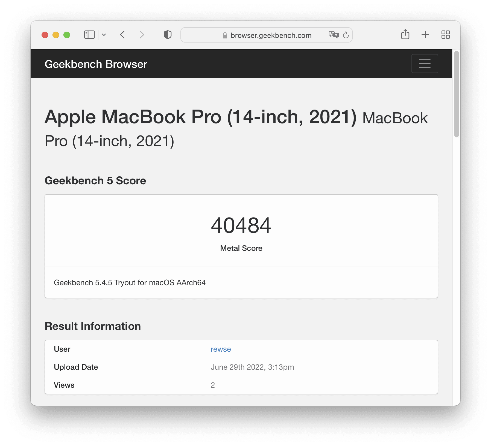
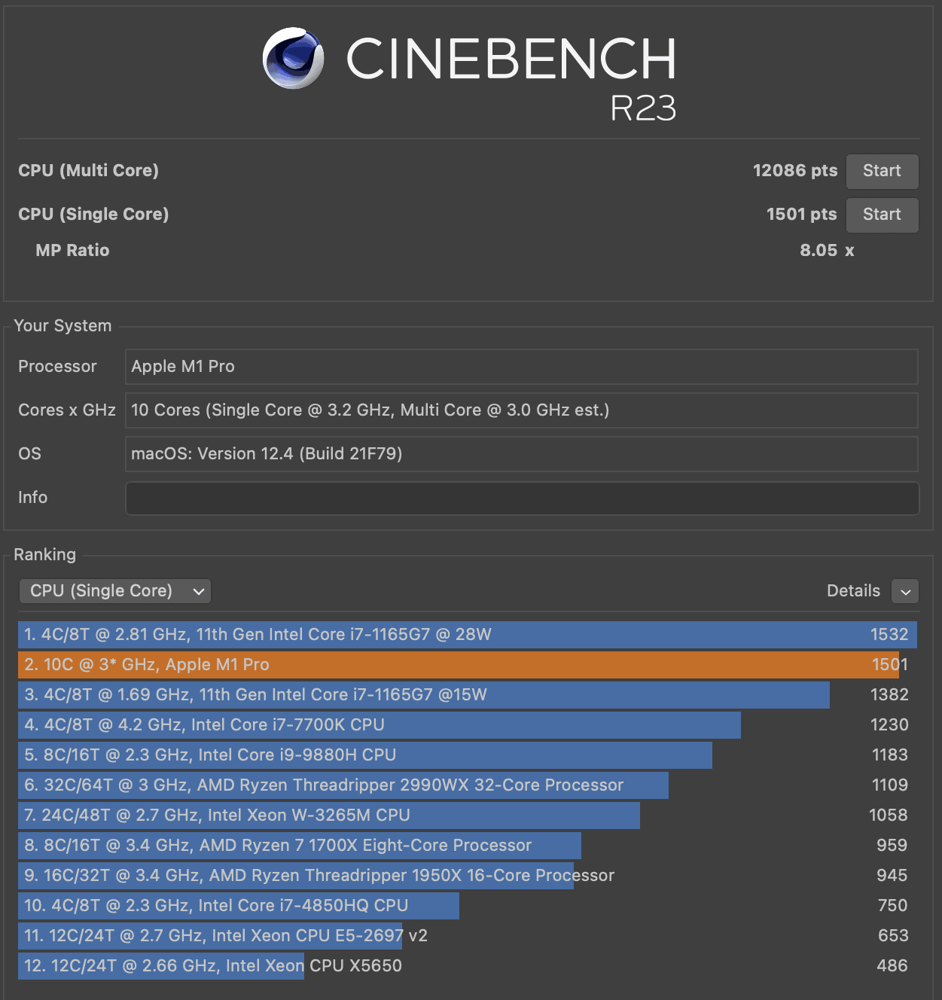
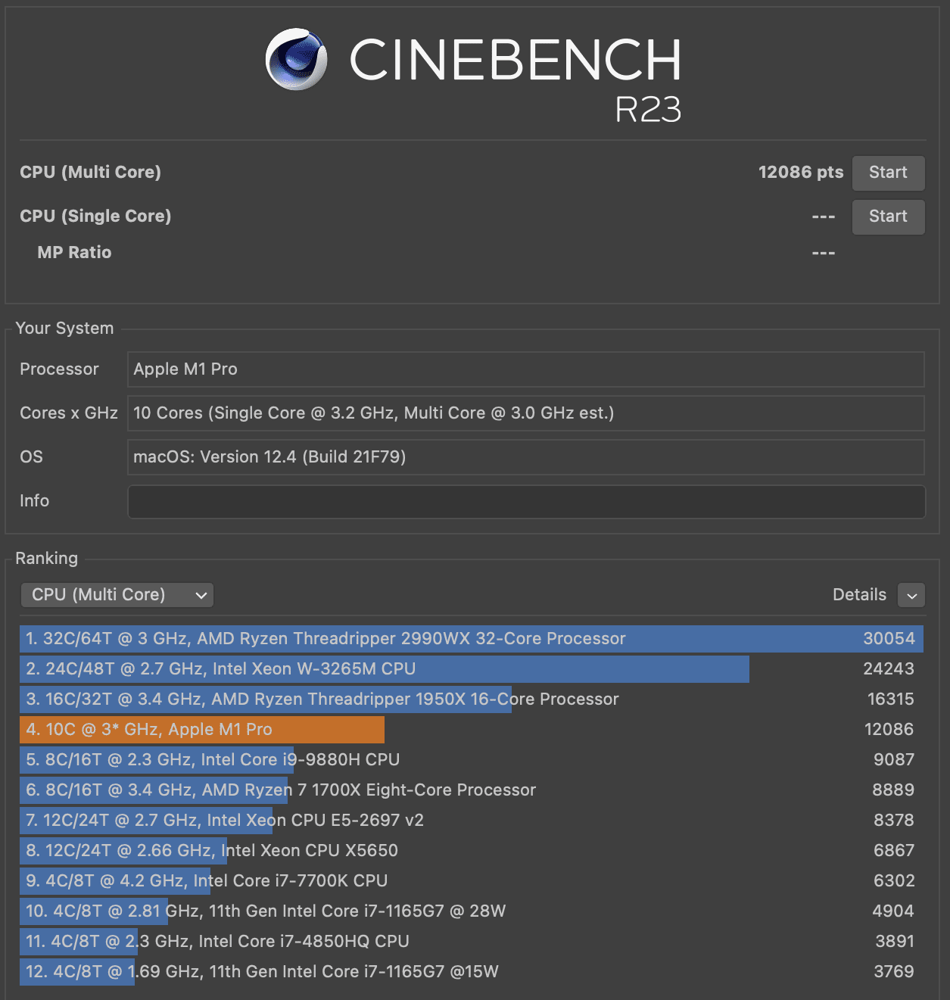
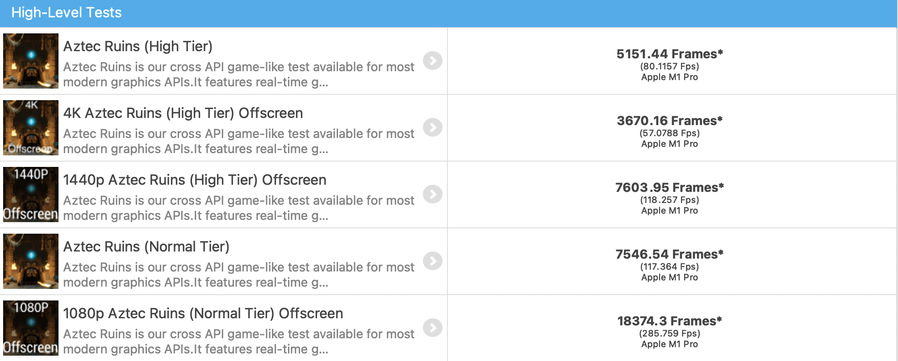
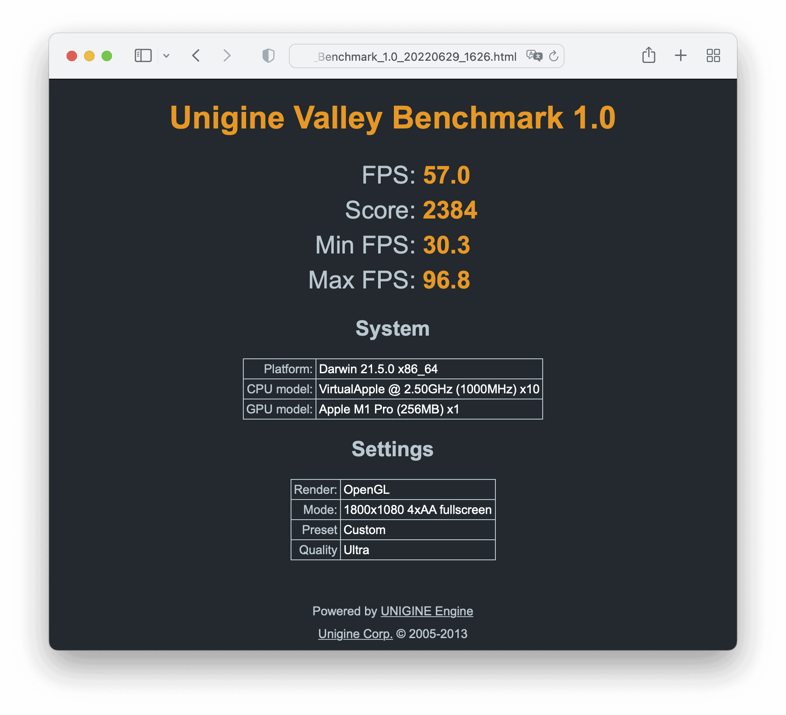
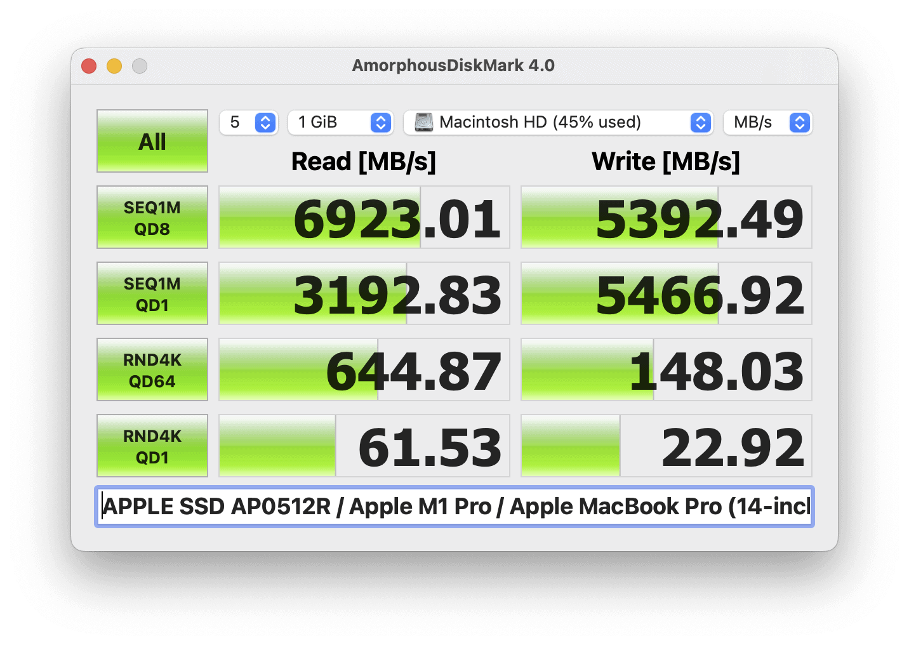
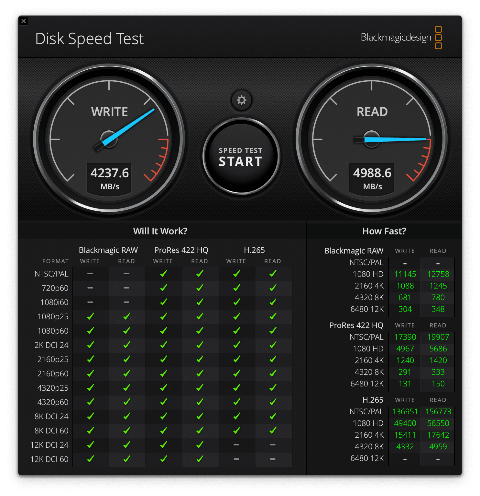

仕事用には [Apple MacBook Pro (13-inch, 2020, Two Thunderbolt 3 Ports)](https://support.apple.com/kb/SP818?locale=ja_JP) [1.4GHz 4-Core Intel Core i5, 16GB Memory, 256GB SSD Storage] を使っていたのですが、個人用のMacを [Apple Mac Studio (2022)](https://www.apple.com/jp/mac-studio/) [Apple M1 Max 10-Core CPU 32-Core GPU, 32GB Memory, 512GB SSD Storage] に変えてからは、何をするにも遅く感じるようになりました。

また、この Two Thunderbolt 3 Ports モデルは Thuderbold 3 ポートが2ポートしかなくて不便な点もそうなのですが、ファンが1個しか入っていないため、すぐにファンが全開で回り始めて、とてもうるさいということが分かりました。ベースクロックが1.4GHzでも最大3.9GHzまでブーストできることで性能が出せるはずのCPUなのですが、日本の夏ではファン全開でも温度を下げきれず、サーマルスロットリングが掛かることが頻繁にありました。また、GPU性能が弱く、4Kモニターを接続しているだけでWindowServerプロセスとkernel\_taskがCPUをだいぶ消費してしまうという問題がありました。この2020年の Two Thunderbolt 3 Ports モデルは [MacBook Pro (13-inch, 2018, Four Thunderbolt 3 Ports)](https://support.apple.com/kb/SP775?locale=ja_JP) とほとんど性能が変わらないため、4年前のモデルと考えると、もう限界なのかもしれません。

また、急激な円安進行によってAppleがいつ値上げするか分からないと考え、[Apple MacBook Pro (14-inch, 2021)](https://www.apple.com/jp/macbook-pro-14-and-16/) を Bring Your Own Device (BYOD) することにしました。上海のロックダウンなどの影響で、注文した時点で納期6週間という状況でしたが、予想どおりAppleは6月7日に同じ構成で53,000円も値上げしたため、4月20日に購入に踏み切って正解でした。

MacBook Pro (14-inch, 2021) は Apple M1 Pro または Apple M1 Max から選べ、CPU数やGPU数の細かな違いも含めるとCPUのラインナップが5種類もあります。CPUは8コアと10コアの2種類ですが、高性能コアだけで比べると6コアと8コアで33%の性能差があるので、あまり悩まず10コアを選びました。GPUは「4Kモニターが普通に使えれば良い」という目的だと一番下位の14コアで十分かなと判断し、Apple M1 Pro 10-Core CPU 14-Core GPU を選びました。

私の使用方法ではメモリー使用量が大体24GB程度のため、メモリーは32GBにしました。一方で、ストレージは MacBook Pro (13-inch, 2020, Two Thnderbolt 3 Ports) の256GBで余裕はないものの問題なかったので、512GBにしました。最近はデータの保存先がクラウドに移行しつつあるため、ローカルにはそれほど大きなストレージが必要なくなっています。

以上を踏まえて、10-Core CPU, 14-Core GPU, 16-Core Neural Engine, 32GB Memory, 512GB SSD Storage の構成で4月20日に注文し、5月31日に出荷連絡、注文時のお届け予定日どおり6月3日に到着しました。

## ベンチマーク

Apple M1 Pro のベンチマーク結果はすでにたくさん公開されてはいますが、長年パフォーマンスチューニングの仕事をしてきた身としては、ベンチマークを取らないわけにはいきません。

[Geekbench](https://www.geekbench.com/)はMacの定番ベンチマークアプリです。バージョン5.4.5での Apple MacBook Pro (14-inch, 2021) / Apple M1 Pro (10-Core CPU, 14-Core GPU, 16-Core Neural Engine) のCPU[計測結果](https://browser.geekbench.com/v5/cpu/15723552)は Single-Core Score が1,741、Multi-Core Score が11,949になりました。MacBook Pro (13-inch, 2020, Two Thunderbolt 3 Ports) の[計測結果](https://browser.geekbench.com/v5/cpu/3972573)は Single-Core Score が1,021、Multi-Core Score が3,970だったので、シングルコアで1.71倍、マルチコアで3.01倍になっています。2年で3倍というのは、かなり進化スピードが速く、買い替える価値がありました。[Geekbench: Mac Benchmarks](https://browser.geekbench.com/mac-benchmarks) によると、シングルコアではIntel最速の [Intel Core i7-10700K](https://www.intel.co.jp/content/www/jp/ja/products/sku/199335/intel-core-i710700k-processor-16m-cache-up-to-5-10-ghz/specifications.html) (8-Core, 3.8GHz) が1,250なので、それよりも1.4倍速いです。最近の Intel CPU のシングルコアの進化が遅かったことを考慮すると、1.4倍はかなり大きいです。マルチコアでは Intel Xeon W-3235 (12-Core, 2.3GHz) が11,924なので、ワークステーション級の性能と言えるでしょう。

Apple M2 のCPU[計測結果](https://browser.geekbench.com/v5/cpu/15482594)は Single-Core Score が1,919、Multi-Core Score が8,928になっています。M2と比較すると M1 Pro 10-Core CPU のシングルコアは0.91倍、マルチコアは1.34倍となります。M2のコストパフォーマンスが光るため、この1.34倍のCPU性能差に2倍の金額を払う価値のあるワークロードがあるかどうかでしょう。

Geekbench 5 での Apple MacBook Pro (14-inch, 2021) / Apple M1 Pro (10-Core CPU, 14-Core GPU, 16-Core Neural Engine) のCPU計測結果

Compute (GPU) のMetalでの[計測結果](https://browser.geekbench.com/v5/compute/5051871)は40,484、OpenCLでの[計測結果](https://browser.geekbench.com/v5/compute/5051875)は33,960でした。Intel Iris Plus Graphics 645 の MacBook Pro (13-inch, 2020, Two Thunderbolt 3 Ports) のMetalでの[計測結果](https://browser.geekbench.com/v5/compute/1570155)は6,570なので、Metalで比較した場合で5.17倍と、こちらも買い替える価値がありました。Apple M1 Max (10-Core CPU, 14-Core GPU, 16-Core Neural Engine) は、[Metalで比較](https://browser.geekbench.com/metal-benchmarks)すると AMD Radeon RX 5500 XT 相当、[OpenCLで比較](https://browser.geekbench.com/opencl-benchmarks)すると [NVIDIA GeForce GTX 1060](https://www.nvidia.com/ja-jp/geforce/10-series/) 相当です。2万円のGPUと同等というところでしょうか。4Kモニターを動かす用途には十分でしょう。なお、Geekbenchの計測結果は3D描画に特化していないので、ゲーム用途とは評価が異なります。

Apple M2 のMetalでの[計測結果](https://browser.geekbench.com/v5/compute/4981649)は29,832になので、M1 Pro 14-Core GPU のほうが1.36倍性能が良いです。

Geekbench 5 での Apple MacBook Pro (14-inch, 2021) / Apple M1 Pro (10-Core CPU, 14-Core GPU, 16-Core Neural Engine) の Compute (GPU) 計測結果


|  | Apple M2 | MacBook Pro (14-inch, 2021) | MacBook Pro (13-inch, 2020, Two Thunderbolt 3 Ports) |
| --- | --- | --- | --- |
| CPU: Single-Core | 1,919 | 1,741 | 1,021 |
| CPU: Multi-Core | 8,928 | 11,949 | 3,970 |
| Compute (GPU): Metal | 29,832 | 40,484 | 6,570 |

[Maxon Cinebench](https://www.maxon.net/ja/cinebench) はCPUベンチマークアプリです。R23.200での計測結果は、Single Core が1,501で、[Intel Core i7-1165G7](https://www.intel.co.jp/content/www/jp/ja/products/sku/208662/intel-core-i71165g7-processor-12m-cache-up-to-4-70-ghz/specifications.html) (4-Core, 2.8GHz) と同等、Multi Core が12,086で、[Intel Core i9-9880H](https://www.intel.co.jp/content/www/jp/ja/products/sku/192987/intel-core-i99880h-processor-16m-cache-up-to-4-80-ghz/specifications.html) (8-Core, 2.3GHz) の1.33倍でした。

Cinebench R23 での Apple MacBook Pro (14-inch, 2021) / Apple M1 Pro (10-Core CPU, 14-Core GPU, 16-Core Neural Engine) の Single Core CPU 計測結果

Cinebench R23 での Apple MacBook Pro (14-inch, 2021) / Apple M1 Pro (10-Core CPU, 14-Core GPU, 16-Core Neural Engine) の Multi Core CPU 計測結果

[GFX Bench](https://gfxbench.com/) Metal はMetalを使用した3Dゲームベンチマークアプリです。バージョン5.0.6での計測結果は、1440p Aztec Ruins High Tier Offscreen が7603.95 Frames でした。[GFX Bench 5.0 Results](https://gfxbench.com/result.jsp?benchmark=gfx50&test=759&order=median&base=device) によると、[NVIDIA GeForce GTX 1660](https://www.nvidia.com/ja-jp/geforce/graphics-cards/16-series/) 程度です。

GFX Bench Metal: Aztec Ruins での Apple MacBook Pro (14-inch, 2021) / Apple M1 Pro (10-Core CPU, 14-Core GPU, 16-Core Neural Engine) の計測結果

[Valley](https://benchmark.unigine.com/valley)はOpenGLを使用した3Dゲームベンチマークアプリです。Extream HD Preset のままだと画面が真っ黒で何も表示されないため、Anti-aliasingをx4に変更しました。結果は 57.0 FPS でした。

Valleyでの Apple MacBook Pro (14-inch, 2021) / Apple M1 Pro (10-Core CPU, 14-Core GPU, 16-Core Neural Engine) の計測結果

[AmorphousDiskMark](https://www.katsurashareware.com/ja/amorphousdiskmark/)はストレージベンチマークアプリです。Windowsでおなじみの[CrystalDiskMark](https://crystalmark.info/ja/software/crystaldiskmark/)と同じ感覚で使えますが、結果を直接比較することはできません。4.0での計測結果は、Sequential Read で6,923.01MB/s、Sequential Write で5,392,49MB/sとなりました。

AmorphousDiskMarkでの Apple MacBook Pro (14-inch, 2021) の計測結果

[Blackmagic Disk Speed Test](https://apps.apple.com/jp/app/blackmagic-disk-speed-test/id425264550) もストレージベンチマークアプリです。3.4.1での計測結果は、Readで4,988.6MB/s、Writeで4,237.6MB/sとなりました。

Blackmagic Disk Speed Test での Apple MacBook Pro (14-inch, 2021) の計測結果

## 性能以外の特筆すべき点

特筆すべき点は、その静音性です。ベンチマークを実行しても、室温27度の環境でCPU温度が50度程度にしかならず、ファンは2個とも2,300rpmの最低速度でしか回りません。私は MacBook Pro (14-inch, 2021) を膝くらいのキャビネットの上に置いていることもあって、完全に無音です。

また、スピーカーの品質が良いです。定位が良いため、Dolby Atmos が楽しめます。[Sonos Roam](https://www.sonos.com/ja-jp/shop/roam) と比べると多少劣りますが、短期出張程度なら内蔵スピーカーでも満足できそうです。

|  |  |
| --- | --- |
| ブランド | [Apple](https://www.apple.com/jp/) |
| 製品名 | [MacBook Pro (14-inch, 2021)](https://www.apple.com/jp/macbook-pro-14-and-16/) |
| 仕様 | Apple M1 Pro 10-Core CPU 14-Core GPU, 32GB Memroy, 512GB SSD Storage |
| 型番 | Z15G0022A A2442 |
| 販売店 | [Apple](https://www.apple.com/jp/shop/buy-mac/macbook-pro/14%E3%82%A4%E3%83%B3%E3%83%81) |
| 支払金額 | 305,800円。送料無料 |
| 購入日 | 2022-04-20 |
| 納品日 | 2022-06-03 |
