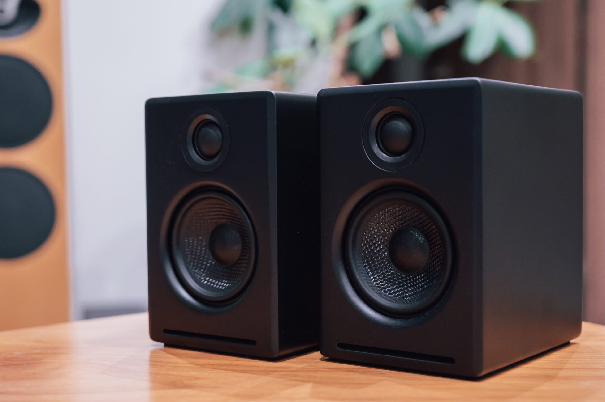
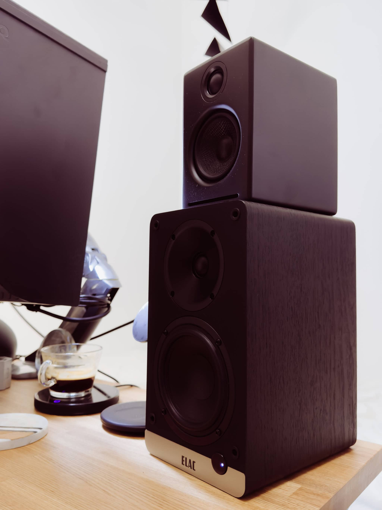
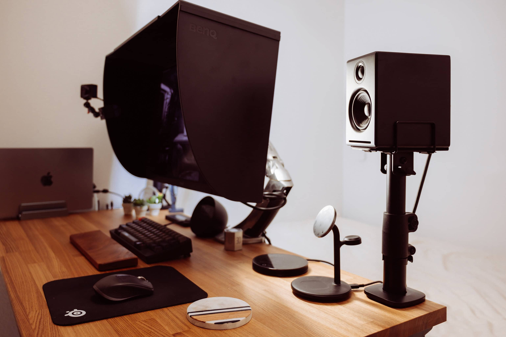

Macに接続してデスク上で使うスピーカーとして [Audioengine A2+ Home Music System w/ Bluetooth aptX](https://audioengine.com/shop/wirelessspeakers/a2-wireless-computer-speakers/) を購入しました。Audioengineはアクティブスピーカーを得意とする2005年に設立された米国オースティンの会社で、A2+は [Adete Tan](https://www.facebook.com/profile.php?id=61555724046725) という世界中のデスクトップ写真を投稿しているFacebookページで比較的よく見る定番機種です。

評判の良いアクティブスピーカーとしては、10万円前後だと [ELAC Debut ConneX DCB41](https://www.elac.com/dcb41) / [Airpulse A80](http://www.airpulseaudio.com/en/product/a80) / [Q Acoustics M20](https://www.qacoustics.co.uk/collections/powered-wireless-speakers/products/q-acoustics-m20) などがありますが、DCB41とA80が奥行き20cm前後で一台あたり7L、M20に至っては奥行き30cmで14Lもあり、120cm × 60cmのデスクの上で使うにはやや大きすぎる印象です。一方、Audioengine A2+ は奥行き13cmで2Lと、圧倒的に小さいです。似たようなサイズで評判の良い他機種となると、奥行き10cmで1.6Lの [KRIPTON KS-33G](https://www.kripton.jp/fs/kripton/ks-33g) くらいでしょうか。しかし、KS-33Gは見た目があまり好みではなく、A2+以外の候補がない状況でした。そのようなときにA2+がタイムセールで2割引の32,736円、さらに4,092円相当ポイント還元になっていたので、試聴なしでA2+を購入しました。

## アクセサリー

コンパクトな分、スピーカースタンドなしで机にじか置きでは耳の位置との差が大きすぎるため、[Audioengine DS1M Desktop Stands](https://audioengine.com/shop/accessories/ds1m-desktop-stands/) で角度を付けようと思いましたが、本体が実質28,644円なのに対して、スタンドだけで6,270円というのは割高に感じました。[Kanto S2 Desktop Speaker Stand](https://www.kantoaudio.com/speaker-accessories/s2/) というのが定番のようで見た目も全く一緒なのですが、4,980円という微妙な価格差です。すると、[Sanyun SW601 Metal Desktop Speaker Stand](https://amzn.to/3YEjm2N) というのを2,999円で見つけました。DS1Mと比べると脚部にやや丸みがありますが、まあ似たようなものです。届いてみると十分な厚さと重みがあり、何も問題ありませんでした。

付属のケーブルは銅色で目立ったため、[Canare 4S6 4心スピーカケーブル](https://www.canare.co.jp/products/cables/index.php?tid=4_008) に変更しました。4S6は4心でむくのが面倒なので、脱着時のダメージ防止のために [AZUKI Tech 24K 金メッキ バナナプラグ](https://amzn.to/4cp0w2R) を付けました。

## 第一印象

さて、MacとUSB接続して、リスニング距離1m程度のニアフィールドでの第一印象です。リビングにあるスピーカーが今では693,000円まで値上がった [Linn Majik 140](https://www.linn.co.uk/speakers/majik-140) なので、評価基準はやや高めです。

まず驚いたのは音場の広さです。しかも音場が広いにも関わらず、定位がはっきりしており、空間オーディオのような鳴り方をします。解像度は価格相応ですが、低域から高域までのバランスは良く、安っぽい感じはしません。低域はキレがあるもののポコポコしてしまうのはキャビネットが小さいため仕方がないでしょう。一方で、ボーカルが前に出てくるため、キャビネットの小ささの割に迫力があります。

欠点があまりなく、デスクトップスピーカーとして定番になる理由が分かる機種です。A2+にはRCA出力があるので、低域が物足りない場合はサブウーファーを増設するのが良さそうです。

## ELAC Debut ConneX DCB41 との比較

Audioengine A2+ にはある程度満足していたものの、当然ですが Linn Majik 140 との差は大きいです。そうなると「10万円クラスだとA2+より良いのでは？」という気持ちが拭い切れません。そんなとき、たまたま [Onsite Audio](https://onsite.audio/) で ELAC Debut ConneX DCB41 が自宅視聴できることを知りました。アクティブスピーカーを静かな環境で視聴できる店が見つけられず、環境との相性も大きいので、自宅で視聴できるというシステムは素晴らしいです。金額は5泊6,980円で新品が送られてきて、そのまま返却しなければデポジットの68,691円が引き落とされ、合計75,671円で購入できるという仕組みです。

2機種をMacにUSB接続して聞き比べてみます。聞き比べる前は「やっぱり ELAC DCB41 は2倍高いだけある！ 買い替えちゃう！」となる期待がひそかにあったのですが、実際の第一印象は「あんまり変わらなくない!?」でした。

もっと真剣に聞き比べてみます。まずは「[Here, There and Everywhere / akiko](https://music.apple.com/jp/album/here-there-and-everywhere/1752997577?i=1752998165)」です。ELAC DCB41 は繊細に鳴らしますが、その分ホワイトノイズが気になります。一方、Audioengine A2+ は10cm程度まで近づかないとホワイトノイズは聞こえず、全体的にクリアです。

「[stay tune / 7co](https://music.apple.com/jp/album/stay-tune/1728217761?i=1728217762)」では、A2+の特徴である広い音場 / はっきりした定位 / 前に出てくるボーカルがとても良いです。一方、DCB41はメリハリがなく、ボーカルが後ろに下がるのが気になります。「[Supernatural / NewJeans](https://music.apple.com/jp/album/supernatural/1752131587?i=1752131592)」も同様で、PopsはA2+が良さそうです。

逆に「[JuJu / Wayne Shorter](https://music.apple.com/jp/album/juju/1444117518?i=1444117522)」はA2+だとにぎやかすぎ、DCB41はしっとり鳴らして雰囲気があります。ただ、インストはDCB41が得意なのかと思うと「[The Imperial March / Los Angeles Philharmonic & Gustavo Dudamel](https://music.apple.com/jp/album/%E5%B8%9D%E5%9B%BD%E3%81%AE%E3%83%9E%E3%83%BC%E3%83%81-%E3%83%80%E3%83%BC%E3%82%B9-%E3%83%99%E3%82%A4%E3%83%80%E3%83%BC%E3%81%AE%E3%83%86%E3%83%BC%E3%83%9E-%E3%82%B9%E3%82%BF%E3%83%BC-%E3%82%A6%E3%82%A9%E3%83%BC%E3%82%BA-%E3%82%A8%E3%83%94%E3%82%BD%E3%83%BC%E3%83%895-%E5%B8%9D%E5%9B%BD%E3%81%AE%E9%80%86%E8%A5%B2-%E3%81%8B%E3%82%89/1454543666?i=1454543691)」はDCB41だと迫力がなく、A2+のほうが迫力があります。

「[Gravity / Bei Xu](https://music.apple.com/jp/album/gravity/1491608428?i=1491608429)」「[Every Breath You Take / Shanti](https://music.apple.com/jp/album/every-breath-you-take/605249386?i=605249616)」といった曲はDCB41の繊細だけどボーカルが後ろに下がる特徴と、A2+のはっきりしたボーカルという特徴の差で好みが分かれるところでしょう。私はA2+のほうが好きですが、「[Don’t Know Why / Nora Jones](https://music.apple.com/jp/album/%E3%83%89%E3%83%B3%E3%83%88-%E3%83%8E%E3%83%BC-%E3%83%9B%E3%83%AF%E3%82%A4-%E3%83%95%E3%82%A1%E3%83%BC%E3%82%B9%E3%83%88%E3%82%BB%E3%83%83%E3%82%BD%E3%83%B3%E3%83%87%E3%83%A2/1624173298?i=1624173757)」はA2+だとボーカルがちょっと主張しすぎで、DCB41のほうがしっとり全体の雰囲気がある印象です。

予想外だったのは「[ロメオ / Blankey Jet City](https://music.apple.com/jp/album/%E3%83%AD%E3%83%A1%E3%82%AA/1475719930?i=1475720236)」です。A2+だとボーカルが主題で楽器がサブな印象を受けますが、DCB41ではボーカルと楽器が対等で、BJCの3ピースバンドとしての魅力はDCB41のほうが伝わりました。

私が知っている中で最も鳴らしにくい「[行っちゃった / 長谷川白紙](https://music.apple.com/jp/album/%E8%A1%8C%E3%81%A3%E3%81%A1%E3%82%83%E3%81%A3%E3%81%9F/1742101178?i=1742101179)」はどちらもエッジが立っていなくてダメです。

そのようなわけで、「クラス差を感じるほどの差はないが、雑にまとめると、ボーカル中心なら Audioengine A2+、楽器中心なら ELAC DCB41」という結論になり、私は価格差とコンパクトさも考慮してA2+を選ぶことにしました。

## スピーカースタンドの交換

Audioengine A2+ を ELAC DCB 41 の上から降ろして Sanyun SW601 に戻すと、A2+の特徴である音場が顔の位置より下に広がる点が気になってきました。9.7cm上げられる [Kanto SE2 Desktop Speaker Stand](https://www.kantoaudio.com/speaker-accessories/se2/) も気になりましたが、昇降デスクを65cm程度の低めで使っていることもあって、最大29.4cm上げられる [サンワサプライ 100-SPSTN03 スピーカースタンド 小型用・クランプ式](https://direct.sanwa.co.jp/ItemPage/100-SPSTN03) に入れ替えることにしました。台座のサイズがA2+にちょうど良く、見た目のバランスも良いです。音場が顔の位置になったことで、体感が1ランク向上しました。机の上のスペースも少し空きました。

## Bluetooth接続について

なお、USB接続ではどちらも自動スリープせず、Macから音量を調整することもできてPCスピーカーとして使いやすいです。

一方でBluetooth接続はどちらもややくせがあります。Audioengin A2+ はオーディオソースが自動選択のため、Bluetoothが何らかのデバイスと接続されていると、Bluetooth側がアイドル状態であってもUSB側は途切れ途切れに鳴ってしまうため、必ずデバイスからBluetoothを切断する必要があります。

ELAA DCB41 はソースセレクターがあるものの、Bluetoothソースで15分間アイドルが続くと自動スリープしてしまい、USBで鳴らすときも裏側のソースセレクターを押して電源をオンにする必要があります。

## まとめ

Audioengine A2+ Home Music System w/ Bluetooth aptX は、コンパクトなボディながら広い音場と明瞭な定位感、前に出てくるようなボーカル再生が特徴的なデスクトップスピーカーです。低音の迫力には若干の物足りなさがありますが、ポップスなどのボーカル中心の音源に適しています。

一方で、ELAC Debut ConneX DCB41 はボーカルが控えめで楽器の雰囲気が出るため、ジャズやロックなどの楽器本位の音源に適しています。しかしながら、価格差とコンパクトさを考えると、A2+の方がコストパフォーマンスに優れていると判断し、最終的にA2+を選択しました。

コンパクトなボディと高音質を両立したA2+は、デスクトップスピーカーとして定番の製品になり得る逸品だと言えます。低音が物足りない場合はサブウーファーの増設を検討するのが良いでしょう。

|  |  |
| --- | --- |
| ブランド | [Audioengine](https://audioengine.com/) |
| 製品名 | [A2+ Home Music System w/ Bluetooth aptX](https://audioengine.com/shop/wirelessspeakers/a2-wireless-computer-speakers/) |
| 購入店 | [Amazon](https://amzn.to/3Ah30Tq) |
| 購入価格 | 32,736円（- 4,092円相当ポイント還元） |
| 購入日 | 2024-06-28 |

|  |  |
| --- | --- |
| ブランド | Sanyun |
| 製品名 | SW601 Metal Desktop Speaker Stand |
| 購入店 | [Amazon](https://amzn.to/3yDh89g) |
| 購入価格 | 2,999円（- 30円相当ポイント還元） |
| 購入日 | 2024-07-04 |

|  |  |
| --- | --- |
| ブランド | [Canare](https://www.canare.co.jp/) |
| 製品名 | [4S6 4心スピーカケーブル](https://www.canare.co.jp/products/cables/index.php?tid=4_008) |
| 購入店 | [Sound House](https://www.soundhouse.co.jp/products/detail/item/21331/) |
| 購入価格 | 140円/m |
| 購入日 | 2024-07-08 |

|  |  |
| --- | --- |
| ブランド | AZUKI Tech |
| 製品名 | 24K 金メッキ バナナプラグ 8本セット |
| 購入店 | [Amazon](https://amzn.to/3SPhXTi) |
| 購入価格 | 950円 |
| 購入日 | 2024-07-16 |

|  |  |
| --- | --- |
| ブランド | [サンワサプライ](https://www.sanwa.co.jp/) |
| 製品名 | [100-SPSTN03 スピーカースタンド 小型用・クランプ式](https://direct.sanwa.co.jp/ItemPage/100-SPSTN03) |
| 購入店 | [サンワダイレクト - Yahoo!ショッピング](https://store.shopping.yahoo.co.jp/sanwadirect/100-spstn03.html) |
| 購入価格 | 5,380円（- 343円相当ポイント還元） |
| 購入日 | 2024-08-12 |