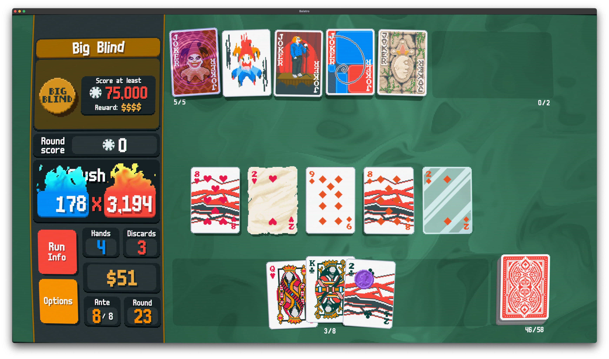

[Baldur’s Gate 3](https://baldursgate3.game/) を140時間掛けてクリアしたので、もう少しさくっと遊べるゲームとして [Metascore 90](https://www.metacritic.com/game/balatro/) / [Steam Positive Rate 97%](https://store.steampowered.com/app/2379780/Balatro/) と非常に評判の良い[Balatro](https://www.playbalatro.com/)を始めました。Balatroはローグライクデッキ構築型カードゲームです。



役はポーカーですが、ポーカーよりもマージャンっぽいです。スコアは Chip x Mult で決まるので、符 x 飜のマージャンと同じです。Chipを増やしても大したことがないので、いかにMult（飜）を増やすかがポイントなのもマージャンと同じです。

役を作るだけでなく、そこにドラのようなバフを自分にだけ効かせられます。「字牌は+1飜」みたいな強烈なインフレ麻雀です。で、さらに「刻子は+4飜」みたいな相性の良いバフを組み合わせると加速できるわけです。なので、そのバフをどう組み合わせていくかがデッキ構築部分です。

例えば下の画面では2と8のツーペアにしか見えませんが、デッキのジョーカーと組み合わせることで非常に強力な手になっています。

ジョーカーは左から以下のような効果があります。

- Greedy Joker: ダイヤのスートをプレイするごとに、得点時に +4 Mult
- Smeared Joker: ハートとダイヤは同じスートとして数える。スペードとクラブは同じスートとして数える。
- Hack: 2, 3, 4, 5をプレイするごとに再発動
- Fibonacci: Ace, 2, 3, 5, 8をプレイするごとに、得点時に +8 Mult
- Ancient Joker: 指定されたスートをプレイするごとに、得点時に x1.5 Mult。指定されたスートはラウンド終了時に変わる

この結果、Smeared Joker によってハートとダイヤを混ざっていてもフラッシュが成立し、Greedy Joker と Smeared Joker の組合わせにより、ハートまたはダイヤ一枚ごとに +4 Mult されます。2と8はFibonacciで +8 Mult されるだけでなく、HackとFibonacciで共通の数字である2, 3, 5は +8 Mult が再発動されるので、2は +16 Mult になります。そして Ancient Joker の指定されたスートがダイヤまたはハートだった場合、Smeared Joker との組合わせでダイヤでもハートでも一枚ごとに x1.5 Mult されます。ハートの2とダイヤの2はさらにHackによって x1.5 Mult がもう一度繰り返されます。

加えて、カード自体もバフされており、ハートの8とダイヤの8は +4 Mult する Multi Card、ハートの2は1/5の確率で +20 Mult and 1/15の確率で$20を獲得する Lucky Card、ダイヤの2は x2 Mult and 1/4の確率でカードが破壊される Glass Card となっています。ハートの2とダイヤの2はHackによって効果が再発動します。

結果として、 178 Chip が 3,194 Mult というとてつもない倍率になり、568,532点になりました。中毒の味がする脳汁が出まくります。

|  |  |
| --- | --- |
| 配給会社 | [Playstack](https://playstack.com/) |
| 開発会社 | [LocalThunk](https://x.com/LocalThunk) |
| 商品名 | [Balatro](https://www.playbalatro.com/) |
| 販売店 | [Steam](https://store.steampowered.com/app/2379780/Balatro/) |
| 購入価格 | 1,700円 |
| 購入日 | 2024-04-15 |