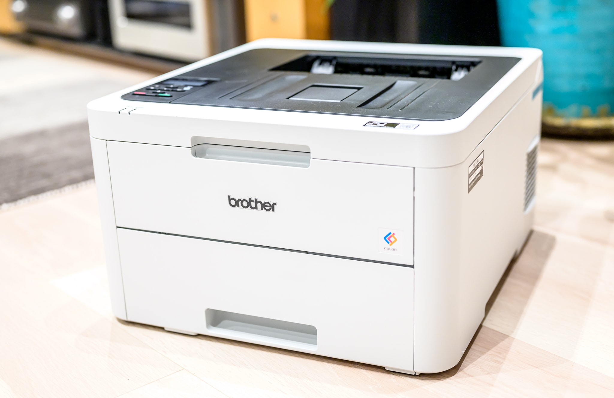

[Brother HL-L2365DW](https://www.brother.co.jp/product/printer/laserprinter/hll2365dw/index.aspx) というA4モノクロレーザープリンターを使っていたのですが、最近、縦線や横線が印刷に入るようになり、ドラムユニットを清掃しても解消しませんでした。ドラムユニット交換しても良かったのですが、A4カラーレーザープリンターの [Brother HL-L3230CDW](https://www.brother.co.jp/product/printer/laserprinter/hll3230cdw/index.aspx) が23,439円だったため、本体ごと買い替えることにしました。

[Epson Colorio](https://www.epson.jp/products/colorio/) EP-805A というA4インクジェットプリンターも持っているのですが、日常的に使用していたのはモノクロレーザープリンターのほうでした。インクジェットプリンターは「使いたいときにはインクが詰まっている。インク詰まりが直った頃にはインク切れ」ということがありがちです。一方でレーザープリンターは、ほぼノーメンテナンスで動くところが優れたところです。また、インクジェットプリンターで普通紙に印刷すると、どうしてもにじみが気になりますが、レーザープリンターではまったくにじみません。ただし、写真を印刷する場合は、インクジェットプリンターでフォト用紙に印刷したほうが遙かにきれいです。そのため、私はレーザープリンターとインクジェットプリンターの2台を使い分けています。

HL-L3230CDWは、今までのHL-L2365DWとカタログ上の見た目は似ているのですが、いざ届いてみると一回り以上大きいです。また、なにより重量が異なり、6.8kgが18.1kgになりました。めったに動かすものではないとはいえ、設置には少し苦労します。しかし、18.1kgの機械が23,439円というのは、原価割れしているとしか思えません。100g当たり129円です。

購入に当たって比較した他のA4カラーレーザープリンターは、[Canon Satera LBP621C](https://canon.jp/business/solution/business-printer/satera/lbp/lineup/622c-621c) と [RICOH P C200L](https://www.ricoh.co.jp/printer/color/p-c200l) です。

|  | Brother HL-L3230CDW | Canon LBP621C | RICOH P C200L |
| --- | --- | --- | --- |
| サイズ (W x D x H) | 410mm x 461mm x 252mm | 430mm x 418mm x 287mm | 412mm x 395mm x 244m |
| 重量 | 18.1kg | 12.8kg | 16.1kg |
| 方式 | 電子写真方式LEDプリンター | 半導体レーザー + 乾式電子写真方式 | 半導体レーザー + 乾式1成分電子写真方式 |
| 解像度 | 600 x 2400dpi | 9600dpi相当 | 600dpi x 2,400dpi相当 |
| モノクロ片面プリント速度 | 24枚/分 | 18枚/分 | 24枚/分 |
| カラー片面プリント速度 | 24枚/分 | 18枚/分 | 24枚/分 |
| モノクロ両面プリント速度 | 8ページ/分 | 12.7ページ/分 | 13ページ/分 |
| カラー両面プリント速度 | 8ページ/分 | 12.7ページ/分 | 13ページ/分 |
| スリープからの復帰時間 | 26秒以下 | 2秒以下 | 5.6秒 |
| モノクロファーストプリント | ? | 10.4秒 | 10.9秒 |
| 動作音 | 47dB | 56dB | 53dB |
| トナー交換方式 | トップカバー | フロントローディング | フロントローディング |
| インターフェース | 100Mbps Ethernet, Wi-Fi 4, USB 2.0 | 1Gbps Ethernet, Wi-Fi 4, USB 2.0 | 1Gbps Ethernet, Wi-Fi 4, USB 2.0 |
| Mac対応 | AirPrint, 独自ドライバー | AirPrint, 独自ドライバー | AirPrint |
| スマートフォン対応 | AirPrint, Mopria, Brother iPrint | AirPrint, Mopria, Canon PRINT Business | AirPrint, Mopria |
| モノクロスタートアップトナー | 1,000枚 | 910枚 | 750枚 |
| カラースタートアップトナー | 1,000枚 | 680枚 | 500枚 |
| 本体参考価格 | 23,000円 | 25,000円 | 20,000円 |
| モノクロランニングコスト（税込） | 3.4円/枚 | 3.74円/枚 | 3.85円/枚 |
| カラーランニングコスト（税込） | 19.2円/枚 | 19.8円/枚 | 20.02円/枚 |
| ブラック純正トナー参考価格 | 9,000円 / 3,000枚 | 8,000円 / 3,100枚 | 9,000円 / 3,000枚 |
| カラー純正トナー参考価格 | 10,000円 / 2,300枚 | 8,000円 / 2,300枚 | 10,000円 / 2,500枚 |
| 互換トナー | あり | あり | ? |
| 純正ブラック用ドラムユニット参考価格 | 4,000円 | 一体型 | 一体型 |

現行のHL-L2365DWの場所が幅435mmしかなかったので、Canon Satera LBP621C はぎりぎりすぎると判断し、この時点で Brother HL-L3230CDW と RICOH P C200L に候補を絞りました。Brother HL-L3230CDW は奥行きが長いですが、私の設置場所では奥行きは問題になりませんでした。ただ、上部のスペースが確保できていない設置場所のため、たまにしかないとは言え、Brother HL-L3230CDW のトナー交換方法がトップカバーを大きく開くタイプなのは気になります。紙詰まりしたときとかにも、本体を移動する必要がありそうです。

便宜上、レーザープリンターと呼んできましたが、正確には Brother HL-L3230CDW はLEDプリンターになります。LEDのメリットは、LED派の沖データによる [JB PRESS:「ビジネスにはレーザー」は本当に正しい？“世界の先駆者” となったOKIデータに聞く LEDプリンタこそビジネスに最適な理由とは](https://jbpress.ismedia.jp/ts/39391/COREFIDO3/) に載っています。ただ、LEDの Brother HL-L3230CDW よりもレーザーの RICOH P C200L のほうが小さいですし、速度も変わりません。方式の違いはあまり気にしなくても良さそうです。

私の場合、1回のプリントでたくさんの枚数を印刷しないので、プリント速度よりもファーストプリント優先ですが、Brother HL-L3230CDW はファーストプリント速度が不明なのが気になります。スリープからの復帰時間が他製品より遅すぎるので、この時間にファーストプリントを含んでいるのかもしれませんが、いずれにせよ遅いです。ただ、数十秒を争う機会は多くはありません。

ここまでだと RICOH P C200L が良いのですが、問題なのは市場に在庫がまったくないことです。また、2021年11月15日発売の新製品ため、互換トナーがまったく流通していません。互換トナーは純正トナーのリサイクル品のため、使用済み純正トナーの回収が進まないと互換トナーが作れません。Canon Satera LBP621C と Brother HL-L3230CDW はすでに多くの店から互換トナーが販売されていますが、もともと互換トナー市場が大きくないRICOHで、さらに新製品というは、互換トナーの観点ではリスクがあります。カラーレーザープリンターだとトナーを4つ交換しないといけないため、1セットのトナー交換が4万円近くします。カラーマッチングを気にするようなものを私はレーザープリンターで印刷しません。となると、インクジェットプリンターには純正インクしか使わない私も、カラーレーザープリンターについは互換トナーの選択肢を持っておきたいです。互換トナーであれば、品質にも寄りますが、4色セットで6,000円程度です。

というわけで、Brother HL-L3230CDW を購入しました。そもそも、そんなに印刷する機会があるのかという話もありますが、紙で印刷して郵送しなければいけない書類がたまにあったりしたときに、出不精の私としては、印刷のためだけにコンビニに行くのは面倒なのです。1枚印刷したいだけなのに、不慣れな人がコピー機を長時間占領していて、ずっと待たされたりしますし。また、小学生の娘は紙で勉強する機会がまだまだ多く、それに関連して印刷する機会が今は一番多いです。

|  |  |
| --- | --- |
| ブランド | [Brother](https://www.brother.co.jp/) |
| 製品名 | [HL-L3230CDW](https://www.brother.co.jp/product/printer/laserprinter/hll3230cdw/index.aspx) |
| 販売店 | [Amazon](https://amzn.to/3tMSL2w) |
| 支払金額 | 23,439円。送料無料（- Amazonポイント234円相当還元） |
| 購入日 | 2022年3月10日 |