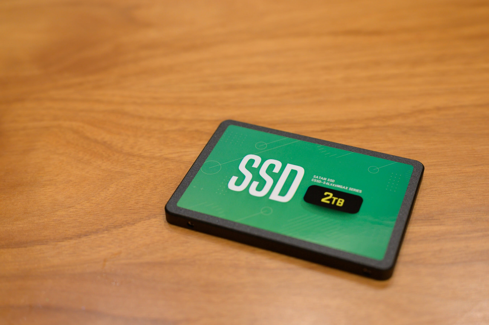
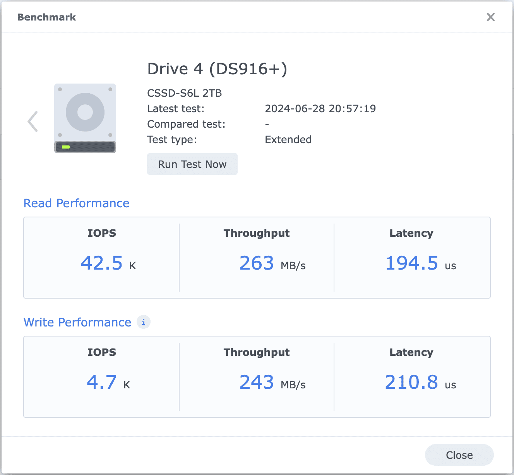

Macのバックアップは [Synology](https://www.synology.com/ja-jp) DiskStation DS916+ というNASに Time Machine で取得しているのですが、深夜でもハードディスクがカリカリ鳴るので2TBのSSD、[CFD MGAX CSSD-S6L2TMGAX](https://www.cfd.co.jp/biz/product/detail/cssd-s6l2tmgax.html) に換装しました。

当初は「[AWS Storage Gateway](https://aws.amazon.com/jp/storagegateway/) を使えばNAS自体をなくせるのでは？」と考えて構築してみたのですが、mDNSでゲートウェイが見つけられないので、Storage Gateway は Time Machine としては使用できませんでした。Time Machine は手動でホスト名を指定できるようにしてほしい……。

Time Machine 用なので遅くても構わないので、できるだけ安く、信頼もそこそこレベルで構わないということで、こちらを選びました。DS916+はそのままでは2.5インチが取り付けられなかったので、[裸族のインナー V2 (CRIN2535V2)](https://www.century.co.jp/products/crin2535v2.html) で3.5インチに変換しました。裸族のインナー V2 は金属製で前後が大きく開いているのが放熱に有利そうです。

DS916+からベンチマークが取れたので取ってみました。Time Machine は細かい書込みが多いので、IOPS Write Performance が4.7kというのは頼もしいです。

|  |  |
| --- | --- |
| ブランド | [CFD](https://www.cfd.co.jp/) |
| 製品名 | [MGAX CSSD-S6L2TMGAX](https://www.cfd.co.jp/consumer/product/detail/cssd-s6l2tmgax.html) |
| 購入店 | [Amazon](https://amzn.to/3X1bwil) |
| 購入価格 | 15,280円 |
| 購入日 | 2024-06-26 |

|  |  |
| --- | --- |
| ブランド | [Century](https://www.century.co.jp/) |
| 製品名 | [裸族のインナー V2 (CRIN2535V2)](https://www.century.co.jp/products/crin2535v2.html) |
| 購入店 | [ヨドバシカメラ](https://www.yodobashi.com/product/100000001007531949/) |
| 購入価格 | 1,480円（- 148円相当ポイント還元） |
| 購入日 | 2024-06-27 |