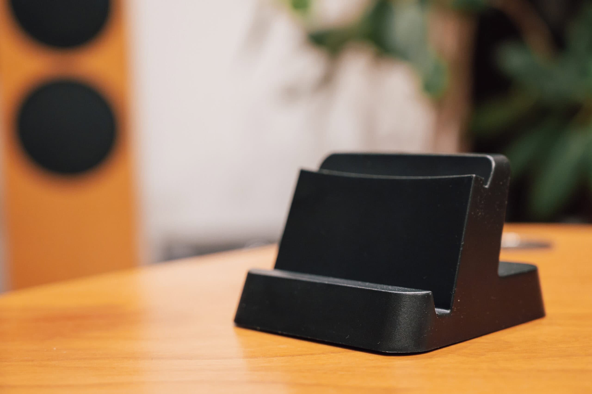

[Sony PlayStation Portal](https://www.playstation.com/ja-jp/accessories/playstation-portal-remote-player/) が発売された2023年11月には良い充電スタンドがなく、いまいち置き場に困っていました。しかし、最近になってAliExpressで良いものを見つけました。

接触充電方式なので比較的雑に置いてもチャージされます。入出力共に 5V/3A (15W) までしか対応していませんが、PlayStation Portal 自体が 5V/3A (15W) までしか対応していていないので問題ありません。

少し気になるのは、接触充電部分しか触れないため、PS Portal を触るとぐらぐらするところでしょうか。

|  |  |
| --- | --- |
| 製品名 | Charging Stand for PS Portal |
| 購入店 | [Pro Houseware Store - AliExpress](https://s.click.aliexpress.com/e/_DdpifYX) |
| 購入価格 | 1,110円 + 送料300円 |
| 購入日 | 2024-06-24 |
| 納品日 | 2024-06-28 |