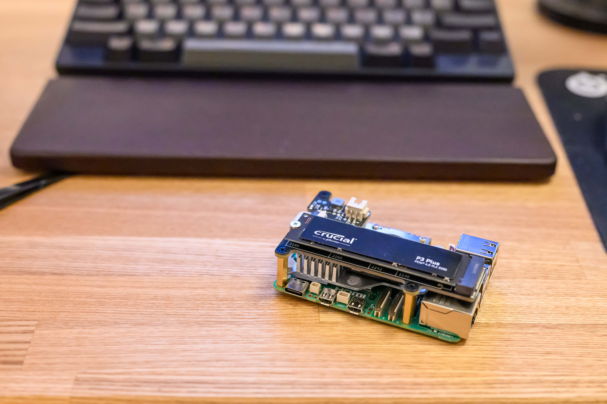
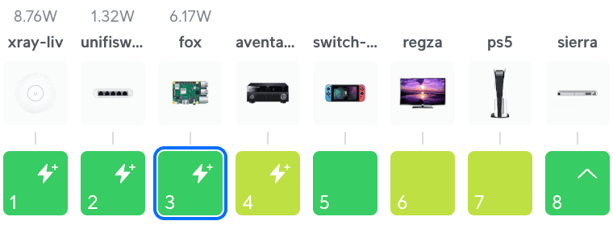

このブログを Amazon EC2 から Raspberry Pi 5 に移行したことに伴い、公開Webサーバーのアクセス頻度を壊れやすいmicroSDカードで運用するのはちょっと怖かったので、[Crucial P3 Plus Gen4 NVMe SSD](https://www.crucial.jp/products/ssd/crucial-p3-plus-ssd) 500GB と [Geekworm X1001 PCIe to M.2 Key-M NVMe SSD PIP TOP for Raspberry Pi 5](https://geekworm.com/products/x1001) を購入してSSD化しました。


[Raspberry Pi SSD Kit](https://www.raspberrypi.com/products/ssd-kit/) という純正SSDもあるのですが、512GBの読取りが 50k IOPS、書込みが 90k IOPS な一方、Crucial P3 Plus 500GB の読取りは 350k IOPS、書込みは 460k IOPS [1](#a91974a9-cddc-40b8-a6d9-d26ae783d19b) と段違いに良いです。ラズパイ5側がボトルネックになるので、ラズパイ5で使う分にはどちらも変わらないのですが、いつか他の機種に流用することがあった場合のことを考えて Crucial P3 Plus にしました。価格は Crucial P3 Plus のほうが安いです。読取りスループットが4,700MB/sから3,500MB/sに落ちる[P3](https://www.crucial.jp/products/ssd/crucial-p3-ssd)でも良かったのですが、300円しか変わらなかったので P3 Plus にしました。


私はEC2とラズパイを同じOSで動かしたいため、ラズパイにも Ubuntu 24.04 を入れています。[Geekwormのマニュアル](https://wiki.geekworm.com/NVMe_SSD_boot_with_the_Raspberry_Pi_5)には「Only support Raspberry Pi OS (Bookworm) version, Raspberry Pi OS bullseye or Ubuntu or Home Assistant OS is NOT supported（Raspberry Pi OS (Bookworm) バージョンのみサポート。Raspberry Pi OS bullseye またはUbuntu、Home Assistant OS はサポートされていません）」とある一方、Linux Kernel 6.6 で修正されたという情報 [2](#ee76fa34-2c4f-42ba-9b3a-af3ea78b0737) もありました。ラズパイ5 + Ubuntu 24.04 + Geekworm X1001 + Crucial P3 Plus という構成で動作するかどうか不安がある状況です。


しかし結果としては、Ubuntu 24.04.1 (Kernel 6.8.0) では何の問題もなく認識できました。


```
tats@fox:~$ sudo gdisk -l /dev/nvme0n1
GPT fdisk (gdisk) version 1.0.10

Partition table scan:
  MBR: not present
  BSD: not present
  APM: not present
  GPT: not present

Creating new GPT entries in memory.
Disk /dev/nvme0n1: 976773168 sectors, 465.8 GiB
Model: CT500P3PSSD8
Sector size (logical/physical): 512/512 bytes
Disk identifier (GUID): 83BC35CF-B95D-4A5E-A2A1-2E3FE0CB2A08
Partition table holds up to 128 entries
Main partition table begins at sector 2 and ends at sector 33
First usable sector is 34, last usable sector is 976773134
Partitions will be aligned on 2048-sector boundaries
Total free space is 976773101 sectors (465.8 GiB)

Number  Start (sector)    End (sector)  Size       Code  Name
```


組み立て自体は簡単ですが、純正の [Raspberry Pi Case for Raspberry Pi 5](https://www.raspberrypi.com/products/raspberry-pi-5-case/) には入らなくなってしまいました。純正の [Raspberry Pi Active Cooler](https://www.raspberrypi.com/products/active-cooler/) とは併用できます。





## ベンチマーク


今まで使っていた [SanDisk High Endurance microSD Card 64GB SDSQQNR-064G-GH3IA](https://shop.sandisk.com/ja-jp/products/memory-cards/microsd-cards/sandisk-high-endurance-uhs-i-microsd?sku=SDSQQNR-064G-GH3IA) との性能比較をしてみましょう。ベンチマークツールにはfioを使い、シナリオにはCrystalDiskMark風の [fio-CrystalDiskMark.md](https://gist.github.com/t-okkn/c805b95dde1c6b9a528d1e3095814ebd) を使いました。


### SanDisk High Endurance microSD Card 64GB


```
SEQ1M-Q8T1-Read        90.628 MB/s  
SEQ1M-Q8T1-Write       31.621 MB/s  
SEQ128K-Q32T1-Read     77.787 MB/s  
SEQ128K-Q32T1-Write    30.088 MB/s  
RND4K-Q32T16-Read      9.282 MB/s  
RND4K-Q32T16-Write     2.065 MB/s  
RND4K-Q1T1-Read        9.952 MB/s  
RND4K-Q1T1-Write       2.643 MB/s
```


### Crucial P3 Plus Gen4 NVMe SSD 500GB


```
SEQ1M-Q8T1-Read        464.421 MB/s  
SEQ1M-Q8T1-Write       413.773 MB/s  
SEQ128K-Q32T1-Read     463.819 MB/s  
SEQ128K-Q32T1-Write    414.572 MB/s  
RND4K-Q32T16-Read      445.108 MB/s  
RND4K-Q32T16-Write     350.609 MB/s  
RND4K-Q1T1-Read        66.320 MB/s  
RND4K-Q1T1-Write       99.209 MB/s
```


RND4K-Q32T16-Readが50倍、RND4K-Q32T16-Writeが175倍という圧倒的性能向上です。ただし、ラズパイ5がボトルネックになっていて、P3 Plus のカタログ値を出せていません。


## SSDをブートドライブにする方法


このままセカンダリドライブとしてSSDを運用することもできますが、SSDをプライマリドライブにしてmicroSDカードなしの構成に変更します。今回は [Running Raspbian from USB Devices : Made Easy - Raspberry Pi Forums](https://forums.raspberrypi.com/viewtopic.php?f=29&t=196778) で配布されているusb-boot.zipを使いました。2016年の書込みで古すぎると最初は思いましたが、ラズパイ5にも言及しており、ずっと最初の書込みを更新しているようです。


usb-boot.zipの中には二つのスクリプトが入っています。`usb-boot`は名前にも関わらず NVMe SSD にも対応しているSDカード以外からブートさせるためのスクリプトです。`sdc-boot`はSDカードからブートさせるためのスクリプトです。`usb-boot`はファイルコピーからすべて実行させることも可能です。なお、`dd`を使っている情報も見受けられますが、マウントしていて書込みが発生しているmicroSDカードから`dd`すると壊れたファイルが書き込まれるので、マウントしているmicroSDカードから`dd`してはいけません。


```
tats@fox:~$ cd /tmp/  
tats@fox:/tmp$ unzip usb-boot.zip  
Archive:  usb-boot.zip  
  inflating: mbr2gpt  
  inflating: sdc-boot  
  inflating: set-partuuid  
  inflating: usb-boot  
  inflating: usb-boot.txt  
tats@fox:/tmp$ chmod 755 usb-boot sdc-boot  
tats@fox:/tmp$ sudo mv usb-boot /usr/local/sbin/  
tats@fox:/tmp$ sudo mv sdc-boot /usr/local/sbin/  
  
tats@fox:~$ sudo usb-boot  
  
Use SD card to boot the USB device? <No>  
Select the USB mass storage device to boot (*) </dev/nvme0n1>  
Replicate BOOT/ROOT contents from /dev/mmcblk0 to /dev/nvme0n1? <Yes>  
Select the partition table type to use (MBR = 2TB Maximum) (*) <MBR>  
Do you wish to continue? <Yes>  
  
Replicating BOOT/ROOT contents from /dev/mmcblk0 to /dev/nvme0n1 (this will take a while)  
  
BOOT/ROOT contents replicated from /dev/mmcblk0 to /dev/nvme0n1  
  
SD card must be removed to boot the USB device
```


最初にいくつかの質問に答えるだけで全てのセットアップが完了します。SDカードを抜いて再起動して、立ち上がってきたら成功です。


```
tats@fox:~$ df  
Filesystem      Size  Used Avail Use% Mounted on  
tmpfs           794M  3.5M  790M   1% /run  
/dev/nvme0n1p2  457G   28G  407G   7% /  
tmpfs           3.9G     0  3.9G   0% /dev/shm  
tmpfs           5.0M     0  5.0M   0% /run/lock  
/dev/nvme0n1p1  510M  182M  329M  36% /boot/firmware  
tmpfs           794M   16K  794M   1% /run/user/2000  
  
tats@fox:~$ cat /etc/fstab  
PARTUUID=c4df567d-02    /       ext4    defaults        0       1  
PARTUUID=c4df567d-01    /boot/firmware  vfat    defaults        0       1  
# a swapfile is not a swap partition, no line here  
#   use  dphys-swapfile swap[on|off]  for that
```


デフォルトでは PCI Express 2.0 x1 として接続されますが、安定性と引き換えに PCI Express 3.0 x1 で動かすことで性能向上させることもできます。その場合はconfig.txtに以下のように書き込んで再起動します。


```
echo 'dtparam=pciex1_gen=3' | sudo tee -a /boot/firmware/config.txt
```


## 消費電力


私のラズパイ5は5V/4AのPoEスプリッターを使ってPoEで動かしているため、usb-bootでのファイルコピー中に消費電力について見てみました。結果としては6W程度でだいぶ余裕がある状況でした。





## まとめ


このブログをRaspberry Pi 5に移行する際、microSDカードよりも高速な Crucial P3 Plus SSD と Geekworm X1001 アダプターを使ってSSD化しました。Ubuntu 24.04 でも問題なく認識され、microSDカードに比べて読み書き速度が大幅に向上しています。


usb-bootスクリプトを使って、SSDをブートドライブに設定しました。microSDカードを抜いた状態でSSDから起動するよう構成を変更しています。また、PCI Express 3.0 x1 で動作させることで、さらなる性能向上が可能です。消費電力も6W程度と、PoEスプリッターで十分に賄えるレベルでした。


|  |  |
| --- | --- |
| ブランド | [Crucial](https://www.crucial.jp/) |
| 製品名 | [P3 Plus Gen4 NVMe SSD](https://www.crucial.jp/products/ssd/crucial-p3-plus-ssd) 500GB |
| 型番 | CT500P3PSSD8JP |
| 購入先 | [Amazon](https://amzn.to/4fveUYY) |
| 購入価格 | 4,960円 |
| 購入日 | 2024-11-27 |


|  |  |
| --- | --- |
| ブランド | [Geekworm](https://geekworm.com/) |
| 製品名 | [X1001 PCIe to M.2 Key-M NVMe SSD PIP TOP for Raspberry Pi 5](https://geekworm.com/products/x1001) |
| 購入先 | [Amazon](https://amzn.to/3DDDbyt) |
| 購入価格 | 2,540円 |
| 購入日 | 2024-11-27 |
