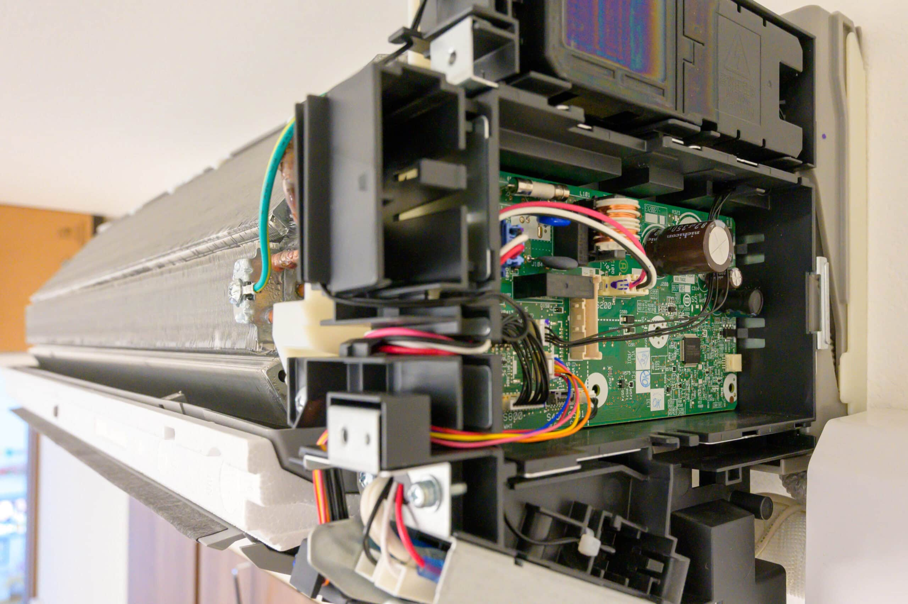
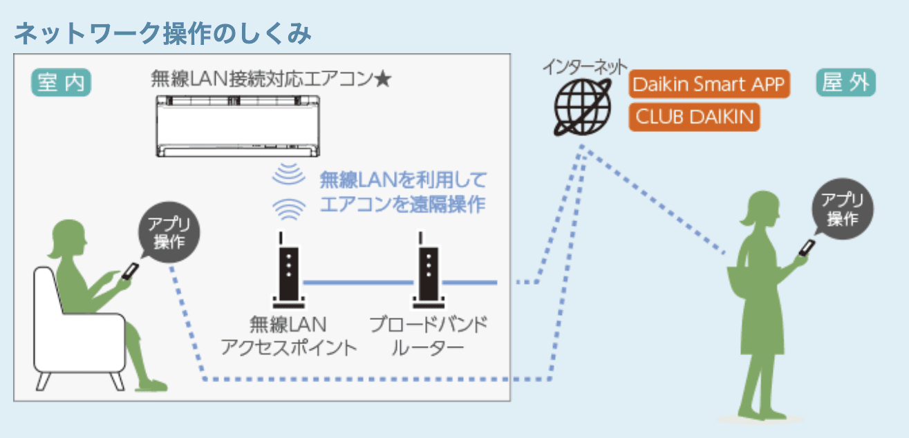
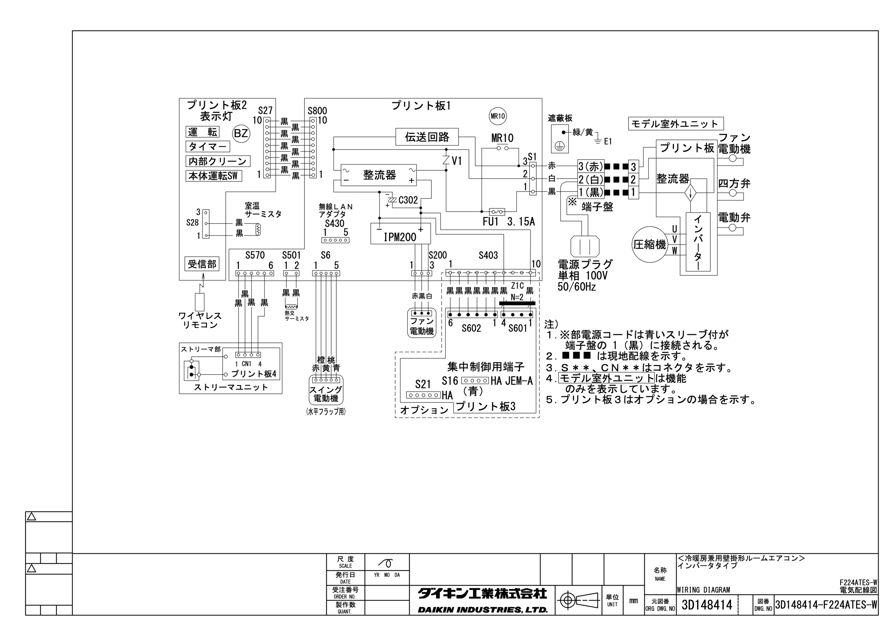
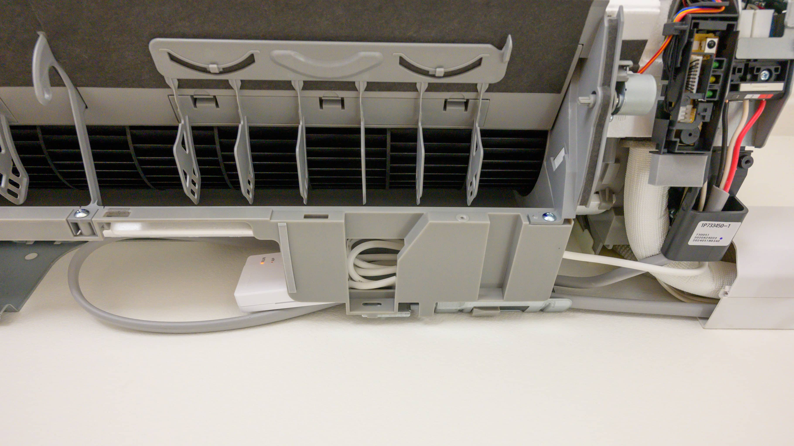
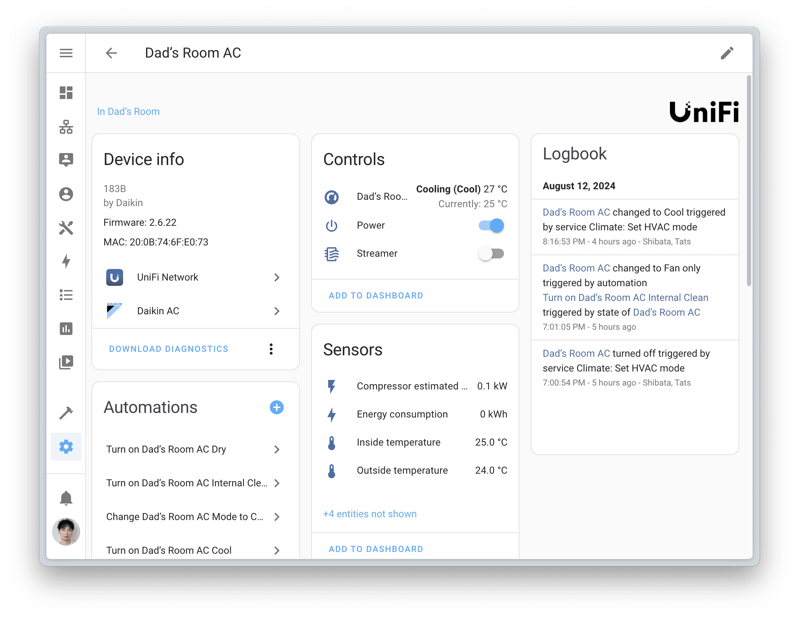

模様替えに伴い、エアコンを設置していなかった部屋に [DAIKIN S224ATES](https://www.ac.daikin.co.jp/kabekake/products/e_series) を設置しました。S224ATESは住宅設備店取扱商品で、家電量販店取扱商品のAN224AESと全く同じ仕様で、流通経路が違うだけです。住宅設備店取扱商品のほうが仲介業者が多いことを想定して卸値が安く設定されているのか、最安値で比較すると一般的には住宅設備取扱商品のほうが安くなります。私が購入したときにはS224ATESはAN224AESの半額程度でした。


住宅設備店取扱商品は家電量販店では買えないので、[XPRICE](https://www.xprice.co.jp/)で購入しました。価格がほぼ最安なだけでなく、注文確認 / 担当工事会社決定 / 商品出荷準備開始 / 出荷完了など、細かく進捗メールが来るので安心できました。また、特殊な場所に設置しないといけないという懸念点ががあったのですが、担当工事会社の[Legona](https://www.legona.jp/)が手際よく設置してくれました。


## なぜスマートリモコンでは不十分なのか


DAIKINを選んだ一番の理由はIoT機器として制御しやすいためです。DAIKINのエアコンを純正部品でスマホ対応にすると、エアコンにHTTPでアクセスできるようになります。[SwitchBot Hub Mini](https://www.switchbot.jp/products/switchbot-hub-mini-matter) や [Nature Remo](https://shop.nature.global/collections/nature-remo) のようなスマートリモコンでも操作はできるのですが、これらからは現在の状態（暖房とか冷房とかのモードや設定温度など）をエアコン本体から取得できません。


エアコンのリモコンには状態を表示する窓があるため、テレビのリモコンとは違い、設定温度を1度下げるボタンを押すと「1度下げる」がリモコンから送られるわけではなく、 [モード: 冷房, 設定温度: 25度, 風量: 自動, 風向: 自動] など全ての設定が再送信されます。つまり、リモコンが全ての状態を保存しています。そのため、スマートリモコンだけで操作している分にはスマートリモコンに保存されている状態とエアコン本体に保存されている状態は同じなので問題ないのですが、付属の純正リモコンと併用すると、スマートリモコンと純正リモコンがそれぞれ異なる状態を保存して再送信してしまうため、各リモコンとエアコン本体の状態が異なってしまいます。この問題を解決するために [SwitchBot Hub 2](https://www.switchbot.jp/products/switchbot-hub2) は IR Decording という機能があるのですが、純正リモコンから SwitchBot Hub 2 への片方向同期だけで、SwitchBot Hub 2 から変更した状態は純正リモコンに反映できません。


一方で、スマートリモコンは独自機能への対応が不足していることが多いため、スマートリモコンに一本化することは気が引けます。例えばS224ATESにはストリーマ内部クリーンという機能があり、冷房を停止すると自動的に最大140分のストリーマ照射と送風 / 暖房を自動で行ってカビを抑制できるのですが、スマートリモコンから停止するとこの機能は動作しません。これは上記のエアコンのリモコンの仕様が原因で、[モード: 停止, ストリーマ内部クリーン: オン] を送信しないといけないにも関わらず、スマートリモコンは [モード: 停止] だけを送ってしまうからです。同様の理由で、スマートリモコンからオンにすると、ストリーマ空気清浄も動作していないと思われます。


## BRP084A47を取り付けるものの失敗


というわけで、S224ATESを純正部品でスマホ対応することにします。[ダイキンスマートアプリ対応機器【ぴちょんくんのお店取扱商品】](https://www.ac.daikin.co.jp/-/media/Project/Daikin/ac_daikin_co_jp/app/pdf/ra-taiou_pichon-pdf.pdf?rev=99537d4a078f4108a07c11045cde3b84&sc_lang=ja-JP&hash=92F501FDF91963A69D5B088573F63787)によると、Eシリーズの2024年モデルにはBRP084A47無線LAN接続アダプターを増設すれば良いとのことです。S224ATESの[R224AES室内機の据付説明書](https://d-search.daikin.co.jp/open/details?mdl_name=S224ATES-W&set_div=S&content=install_manual)の「12. 必要なときに」に前面グリルの取り外し方法や電装品へのアクセス方法が載っているので、これと[BRP084A47の据付説明書](https://d-search.daikin.co.jp/open/details?mdl_name=BRP084A47&set_div=K&content=install_manual)を合わせて参照しながら自作PCが組み立てられるレベルのスキルがあれば、据付けはそれほど難しくはありません。


据付け後に動作確認すると、[Home Assistant](https://www.home-assistant.io/) からアクセスできません……。問題なく Home Assistant から制御できている DAIKIN S36NCV + BRP087A42無線LAN接続アダプターの組合わせと何が違うのか[Charles](https://www.charlesproxy.com/)で [Daikin Smart APP](https://apps.apple.com/jp/app/daikin-smart-app/id564109247) のアクセスをキャプチャしてみると、BRP087A42は /common/basic\_info にまずはアクセスしているものの、BRP084A47は /config/adapter/user\_info という全然違うURLにアクセスしていることが分かりました。Home Assistant の [Daikin AC Integration](https://www.home-assistant.io/integrations/daikin/) のページを見ると以下のようにあります。


> Daikin has removed their local API in newer products.   
> ダイキンは新しめの製品でローカルAPIを削除しました。


S224ATESの[ネットワーク対応](https://www.ac.daikin.co.jp/roomaircon/products/e_series/kinou/smartphone)のページをよく見ると、室内からもインターネットを経由してエアコンにアクセスしている絵になっています。つまり、今までのローカルAPIは廃止され、クラウドAPIだけになってしまったように見えます。


[](https://www.ac.daikin.co.jp/roomaircon/products/e_series/kinou/smartphone)


[Daikin Onecta Custom Integration](https://github.com/jwillemsen/daikin_onecta) で行けそうな気もしないでもないですが、必要な[ONECTA](https://apps.apple.com/gb/app/onecta/id1474811586?l=ja)モバイルアプリが日本の App Store で配布されておらず、ここで心が折れて放置となりました。最もIoTデバイスとして制御しやすいというダイキンのエアコンの最大の特徴がなくなってしまいました。


## BRP087A42を取り付けて成功


1カ月以上過ぎたある日、「動作実績のあるBRP087A42をS224ATESに付けられれば良いのではないか？」と思いつきます。S224ATESの[R224AES室内機の電気配線図](https://d-search.daikin.co.jp/open/details?mdl_name=S224ATES-W&set_div=S&content=install_manual)を見てみると、オプションのプリント板3を付ければ、BRP087A42を接続するためのS21端子が増設できそうです。ダイキンは、こういう電気配線図もしっかり公開しているのが良いですね。


[](https://d-search.daikin.co.jp/open/details?mdl_name=S224ATES-W&set_div=S&content=install_manual)


プリント板3が何なのかをダイキンの技術窓口で確認すると、KRP067A41遠隔制御P板セットであるとのことでした。動作保証はないですが、S224ATESにKRP067A41を取り付けて、KRP067A41にBRP087A42を取り付けることにしました。BRP087A43やBRP087A44という少し新しそうなモデルもあるのですが、違いが分からないため、実績のあるBRP087A42にしておきました。また、Eシリーズの2023年モデルはBRP087A42が適合機種のため [1](#dc6df509-0ef1-4a29-a864-47a1b45ef3d0)、BRP087A42が安心でしょう。



flowchart LR
  S224ATES[S224ATES\nエアコン] --- KRP067A41[KRP067A41\n遠隔制御P板セット]
  KRP067A41  --- BRP087A42[BRP087A42\n無線LAN接続アダプター]



S224ATESの下部にちょうど良い空間があったので、BRP087A42はそこに入れて「見えない設置」にしました。基本的には一度設定したら触らないので、見た目重視の「見えない設置」でも問題ないはず。前面グリルの取り外し方にも慣れてきたので、いざというときには前面グリルを外すことにします。





結果として、S224ATESもBRP087A42のファームウェアバージョン2.6.22によって無事ローカルAPI経由で Home Assistant から制御することができました。現在は2.6.26というものが配布されているのですが、このバージョンには怖くてアップデートできていません。リリースノートもないので、何が変わったのか不明です。BRP087A42は初期セットアップ時に最新バージョンへのアップデートが避けられないので、今後の方は2.6.26で試すしかないというリスクがあります。問題なく動作したら、[X](https://x.com/rewse)などから教えてもらえれば幸いです。





エアコン本体から状態が取得できるようになったので、Home Assistant から停止したときにも「冷房を5分以上使った後に停止したら送風を行い、2時間後に送風を停止する」というストリーマ内部クリーンのような動作を実現できるようになりました。Home Assistant の1時間以上の`delay`は信用できないため、複数のAutomationで実現しています。


```
- id: automation.plan_to_turn_on_dads_room_ac_internal_clean  
  alias: Plan to Turn on Dad’s Room AC Internal Clean  
  trigger:  
    - platform: state  
      entity_id: climate.dads_room_ac  
      to: dry  
      for:  
        minutes: 5  
    - platform: state  
      entity_id: climate.dads_room_ac  
      to: cool  
      for:  
        minutes: 5  
    - platform: state  
      entity_id: climate.dads_room_ac  
      to: heat_cool  
      for:  
        minutes: 5  
  action:  
    - service: automation.turn_on  
      target:  
        entity_id:  
          - automation.turn_on_dads_room_ac_internal_clean  
- id: automation.turn_on_dads_room_ac_internal_clean  
  alias: Turn on Dad’s Room AC Internal Clean  
  trigger:  
    - platform: state  
      entity_id: climate.dads_room_ac  
      to: "off"  
      for:  
        seconds: 10  
  condition:  
    - condition: state  
      entity_id: alarm_control_panel.dads_room_ac  
      state: armed_home  
  action:  
    - service: climate.set_hvac_mode  
      target:  
        entity_id: climate.dads_room_ac  
      data:  
        hvac_mode: fan_only  
- id: automation.turn_on_dads_room_ac_streamer  
  alias: Turn on Dad’s Room AC Streamer  
  trigger:  
    - platform: state  
      entity_id: climate.dads_room_ac  
      not_to: "off"  
      for:  
        seconds: 10  
  condition:  
    - condition: state  
      entity_id: alarm_control_panel.dads_room_ac  
      state: armed_home  
  action:  
    - service: switch.turn_on  
      target:  
        entity_id: switch.dads_room_ac_streamer  
- id: automation.turn_off_dads_room_ac_internal_clean  
  alias: Turn Off Dad’s Room AC Internal Clean  
  trigger:  
    - platform: state  
      entity_id: climate.dads_room_ac  
      to: fan_only  
      for:  
        hours: 2  
  condition:  
    - condition: state  
      entity_id: alarm_control_panel.dads_room_ac  
      state: armed_home  
  action:  
    - service: climate.turn_off  
      target:  
        entity_id: climate.dads_room_ac  
    - service: automation.turn_off  
      target:  
        entity_id:  
          - automation.turn_on_dads_room_ac_internal_clean
```


また、「冷房時に設定温度より寒くなりすぎる / まだ暑い」というよくあるエアコンの問題を解決するために外部の温度計を参照するようにして、寒すぎる場合は「リモコンに保存された設定温度に1を加える」のではなく、純正リモコンと併用しても問題が起きない「本体に保存された設定温度に1を加える」ということが Home Assistant からできるようになりました。


```
- id: automation.increase_dads_room_ac_cool_temperature  
  alias: Increase Dad’s Room AC Cool Temeperature  
  trigger:  
    - platform: state  
      entity_id: binary_sensor.dads_room_motion  
      to: "on"  
    - platform: time_pattern  
      minutes: "/5"  
      seconds: 47  
  condition:  
    - condition: state  
      entity_id: climate.dads_room_ac  
      state: cool  
      for:  
        minutes: 10  
    - "{{ states('sensor.dads_room_temperature') | float(26) - (states('input_number.dads_room_ac_cool_target_temperature') | float(26) + 0.5) < -0.5 }}"  
    - condition: state  
      entity_id: alarm_control_panel.dads_room_ac  
      state: armed_home  
  action:  
    - variables:  
        temp: "{{ state_attr('climate.dads_room_ac', 'temperature') | int(26) + 1 }}"  
    - service: climate.set_temperature  
      target:  
        entity_id: climate.dads_room_ac   
      data:  
        hvac_mode: cool  
        temperature: "{{ temp }}"  
    - delay:  
        minutes: 30
```


## まとめ


DAIKIN S224ATES エアコンを設置しました。S224ATESは家電量販店取扱商品のAN224AESと同じ製品で、流通経路が異なるだけで価格が安くなっています。DAIKIN製品を選んだ理由は、IoTデバイスとして制御しやすいためです。純正部品でスマホ対応すると、エアコンにHTTPでアクセスできます。スマートリモコンでは現在の状態を取得できないため、純正リモコンと併用すると状態が一致しなくなる問題があります。また、独自機能への対応が不足しがちです。


そこで、BRP084A47無線LAN接続アダプターを増設しようとしましたが、ローカルAPIが廃止されてクラウドAPIだけになっていたため失敗しました。その後、BRP087A42を取り付けることで無事ローカルAPIから制御できるようになりました。エアコン本体から状態が取得できるようになったため、Home Assistant から独自機能に近しい制御ができるようになりました。また、外部の温度計を参照して設定温度を調整するなど、より細かい制御が可能になりました。


|  |  |
| --- | --- |
| ブランド | [DAIKIN](https://www.daikin.co.jp/) |
| 製品名 | [S224ATES](https://www.ac.daikin.co.jp/kabekake/products/e_series) |
| 購入店 | [XPRICE](https://www.xprice.co.jp/d.php?id=300000019426901&status=1) |
| 購入価格 | 59,800円（- 598円相当ポイント還元） |
| 購入日 | 2024-06-03 |
| 据付日 | 2024-06-06 |


|  |  |
| --- | --- |
| ブランド | [DAIKIN](https://www.daikin.co.jp/) |
| 製品名 | BRP084A47 無線LAN接続アダプター |
| 購入店 | [ヨドバシカメラ](https://www.yodobashi.com/product/100000001008409227/) |
| 購入価格 | 14,140円 (- 1,414円相当ポイント還元） |
| 購入日 | 2024-06-03 |
| 納品日 | 2024-06-05 |


|  |  |
| --- | --- |
| ブランド | [DAIKIN](https://www.daikin.co.jp/) |
| 製品名 | KRP067A41 遠隔制御P板セット |
| 購入店 | [Bic Camera](https://www.biccamera.com/bc/item/2540279/) |
| 購入価格 | 6,280円（- 628円相当ポイント還元） |
| 購入日 | 2024-07-26 |


|  |  |
| --- | --- |
| ブランド | [DAIKIN](https://www.daikin.co.jp/) |
| 製品名 | BRP087A42 無線LAN接続アダプター |
| 購入店 | [Bic Camera](https://www.biccamera.com/bc/item/6522702/) |
| 購入価格 | 13,940円（- 1,394円相当ポイント還元） |
| 購入日 | 2024-07-26 |