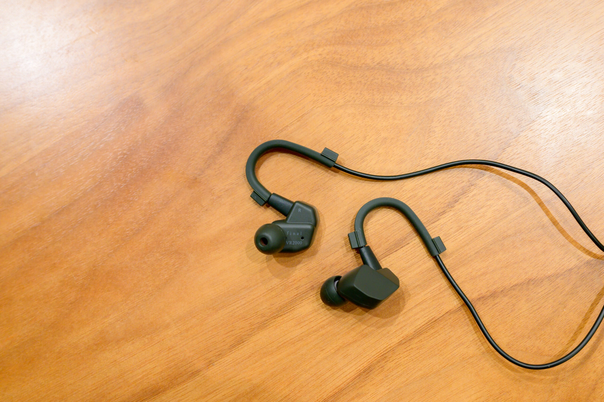

[Sony PlayStaion Portal](https://www.playstation.com/ja-jp/accessories/playstation-portal-remote-player/) と [Baldur’s Gate 3](https://www.spike-chunsoft.co.jp/baldursgate3/) の相性が良く、年末年始はこの組み合わせでずっとプレイしているのですが、PlayStation Portal はBluetoothオーディオに対応しておらず、PlayStation Link という独自規格にしか対応していません。一方で内蔵スピーカーの音はすかすかです。そのため、[Sony WH-1000XM2](https://www.sony.jp/headphone/products/WH-1000XM2/) を有線接続していたのですが、PlayStation Portal にはもっと気軽なものが欲しくて、家に転がっていた [Apple EarPods with 3.5 mm Headphone Plug](https://www.apple.com/jp/shop/product/MWU53FE/A/earpods35-mm%E3%83%98%E3%83%83%E3%83%89%E3%83%95%E3%82%A9%E3%83%B3%E3%83%97%E3%83%A9%E3%82%B0) を使ってみると、こちらのほうが PlayStation Portal との相性の良さを感じました。



そんなときにちょうど『[家電批評 2024年2月号](https://amzn.to/3RO3PrW)』でゲーミングイヤホン / ヘッドセットの記事があり、[final VR2000 for Gaming](https://final-inc.com/products/vr2000-jp) が第1位になっていたので、試聴なしでこちらを購入しました。

Baldur’s Gate 3 は前後左右のどちらから音が鳴っているかが結構重要なのですが、final VR2000 for Gaming は定位感が良好ですぐ分かります。一方で硬すぎず、サラウンド感もしっかりあります。バランスも良く、有線ゲーミングイヤホンとして良い品質です。毎日 PlayStation Portal のバッテリーが切れる4時間ほど連続使用していますが、着け心地に違和感はありません。

|  |  |
| --- | --- |
| ブランド | [final](https://final-inc.com/) |
| 製品名 | [VR2000 for Gaming](https://final-inc.com/products/vr2000-jp) |
| 型番 | FI-VR2DPLDO |
| 販売店 | [final公式ストア - Amazon](https://amzn.to/3vgyCGd) |
| 購入価格 | 6,980円（-698円相当ポイント還元） |
| 購入日 | 2023-12-29 |
