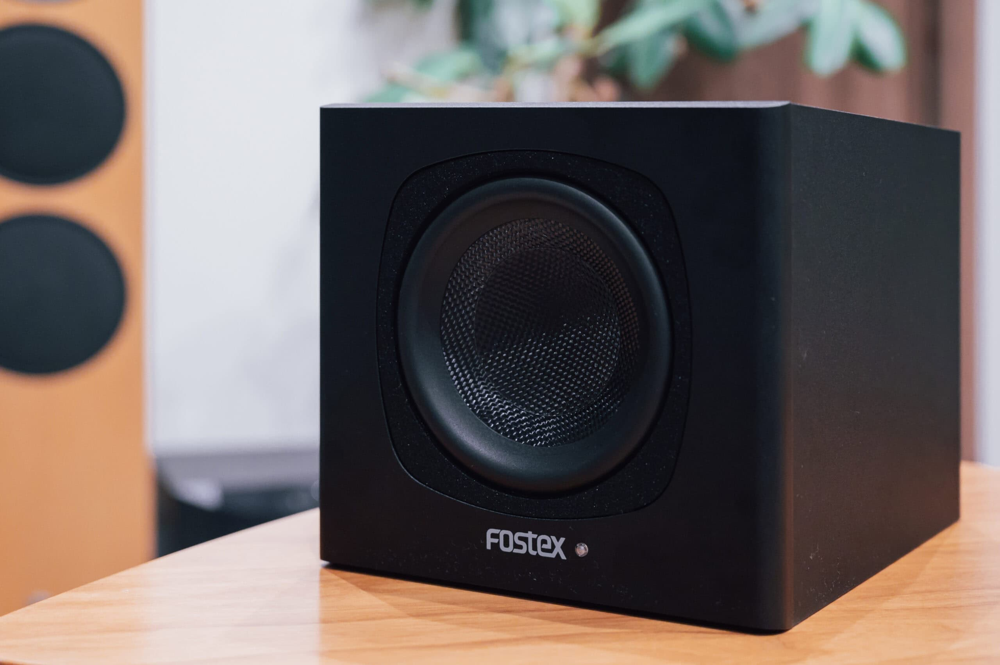
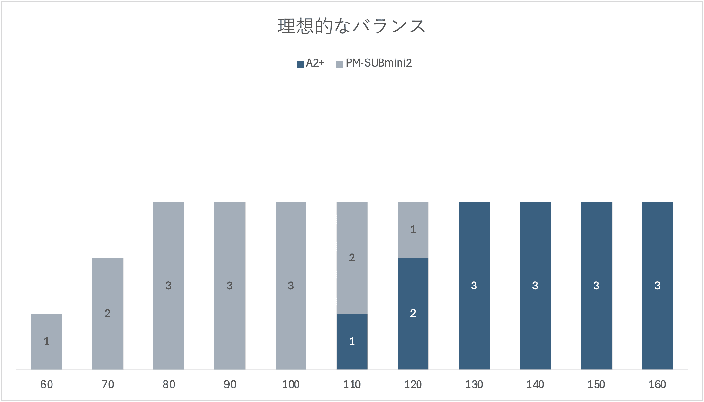
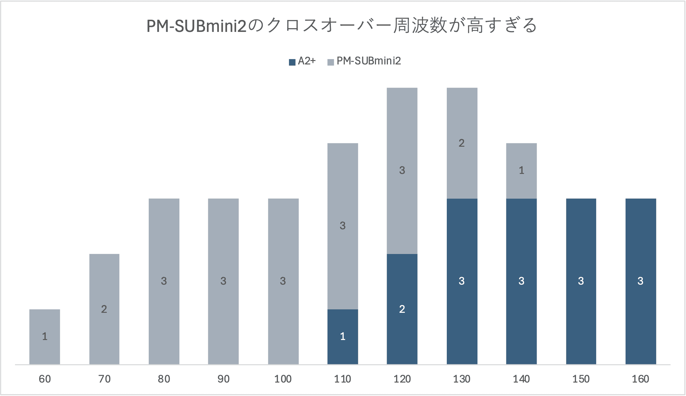
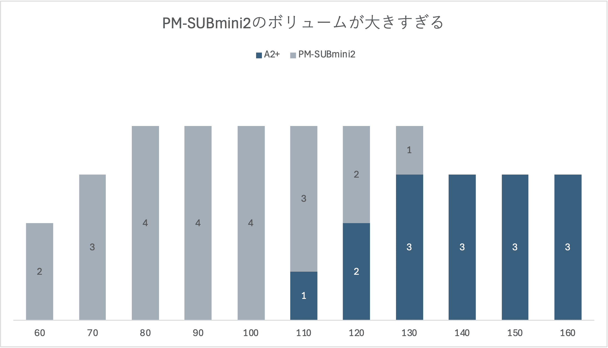

デスクトップスピーカーを [Audioengine A2+ Home Music System w/ Bluetooth aptX](https://audioengine.com/shop/wirelessspeakers/a2-wireless-computer-speakers/) にしたので、A2+の弱点である低域を補うために [FOSTEX PM-SUBmini2 Active Subwoofer](https://www.fostex.jp/products/pm-submini2/) を購入しました。

低域はスピーカーが大きければ大きいほど出しやすいので、大きさが重要になってきます。A2+が4万円程度なので、5万円以下の代表的なサブウーファーを大体のエンクロージャーの大きさでクラス分けすると以下のような感じです。

- 20cmクラス: FOSTEX PM-SUBmini2
- 25cmクラス: [Audioengine S6](https://audioengine.com/shop/subwoofers/s6-compact-powered-subwoofer/)
- 30cmクラス: [YAMAHA NS-SW50](https://jp.yamaha.com/products/audio_visual/speaker_systems/ns-sw050/index.html) / [Edifier T5](https://www.edifier.com/global/p/subwoofers/t5) / [FOSTEX PM-SUB8](https://www.fostex.jp/products/pm-sub8/)
- 35cmクラス: [Sony SA-CS9](https://www.sony.jp/audio/products/SA-CS9/index.html) / [Polk Audio PSW 10](https://jp.polkaudio.com/shop/polkaudio-subwoofers/psw10) / [Polk Audio Polk Monitor XT10 (MXT10)](https://jp.polkaudio.com/shop/polkaudio-subwoofers/xt10) / [YAMAHA NS-SW300](https://jp.yamaha.com/products/audio_visual/speaker_systems/ns-sw300/index.html)
- 40cmクラス: [Polk Audio Polk Monitor XT12 (MXT12)](https://jp.polkaudio.com/shop/polkaudio-subwoofers/xt12)

30cmクラスになると選択肢が増えてきますが、5畳の部屋には置くスペースが取れませんでした。Audioengine S6 はブランドがそろえられて何となく良い気もしますが、ほぼ5万円で、この中では最高値です。77Lの Polk Audio XT12 が36,000円なことを考えると、14LのS6を5万円で買う気になれませんでした。

一方、FOSTEX PM-SUBmini2 は8.6Lしかなくてサブウーファーとしては最小クラスですが、23,000円程度で手頃です。また、高さが18.5cmで、私のベッドの下に設置できることも決め手になりました。

## セッティング

Audioengine A2+ とはステレオRCAケーブルで接続します。付属の1.5mでは足りなかったので、3mの [Audio-Technica ATL464A/3.0](https://www.audio-technica.co.jp/product/ATL464A) を購入しました。全く色気のないケーブルですが、2万円台のサブウーファーだったらこんなものでしょう。音量はA2+と連動します。

机の上に仮置きした状態ではボリュームを上げてもすかすかだったのですが、机の横のベッド下の床にじか置きすると音場が広がり、だいぶ良くなりました。机の下の空間で増幅されているのでしょうか。

A2+と FOSTEX PM-SUBmini2 の音量とクロスオーバー周波数を調整するため、「[Test Tones / Sonic Electronix](https://youtube.com/playlist?list=PLzFvCAfIq7a2SIBfDhpCytfJ4RHVb_KLY&feature=shared)」を使用します。音量が小さいと低域は出にくく、机上のようなニアフィールド使用では音量が小さいため、カタログスペックほどの低域が出ません。A2+のカタログスペックでの周波数特性は 65Hz - 22kHz (±2.0dB) ですが、いつも聞いている音量だと110Hzくらいからあまり出ていないことが分かりました。一方、PM-SUBmini2のカタログスペックは40Hz - 150Hzですが、いつも聞いている音量だと50Hzくらいまで出ていることが分かりました。音量を上げればA2+もPM-SUBmini2も20Hzまで出ますが、いつも聞いている音量でどこまで出るかが重要です。

ここからPM-SUBmini2の設定です。まずはPM-SUBmini2のVolumeを大きめにして、よく聞く低域が多めの曲を流します。Phaseを切り替えてみて、いつものリスニング位置から聞いてみて、豊かなほうが正しい設定です。変わらない場合はどちらでも良いですが、一般的には180°です。

続いてクロスオーバー周波数の設定です。A2+とPM-SUBmini2と組み合わせたときに、A2+の下限の110Hzを中心に全体の音量ができるだけ変わらないように調整します。目指すイメージは以下のとおりです。

120MHz - 130Hz周辺が大きい場合は以下のようなバランスになってしまっています。PM-SUBmini2からもその帯域が鳴ってしまっていることが原因なので、PM-SUBmini2のFrequencyを下げます。

110Hz以下 も大きい場合は以下のようなバランスになってしまっています。A2+に対してPM-SUBmini2の音量が多すぎることが原因なので、PM-SUBmini2のVolumeを下げます。

基本的には音量よりもクロスオーバー周波数をシビアに調整したほうが良いです。クロスオーバー周波数を誤ると変なところに山（または谷）ができますし、同じ周波数が異なる音色のスピーカーから過度に混じって鳴ることになるので濁ります。音量は好みのところもあるので、好みに合わせて大きくしたり小さくできます。

結果として、Frequencyは左から三つ目になりました。10Hzずつ目盛りが打ってあるのかと思いきや11.25Hzずつになっているので、82.5Hzということでしょうか。[PM-SUBmini2の取扱説明書](https://www.fostex.jp/cms/wp-content/uploads/2015/09/PM-SUBmini2_Manual.pdf)によると、[FOSTEX PM1.0](https://www.fostex.jp/products/pm01/) のときは左から三つ目なので、同規模サイズのA2+もこの辺で正しそうです。Volumeは真ん中にしています。

## 試聴してみて

まずは分かりやすく低域盛り盛りの「[Taiko / Tomo Hirata](https://music.apple.com/jp/album/taiko/898179303?i=898179305)」と「[I Got a Feeling / 80Kidz](https://music.apple.com/jp/album/i-got-a-feeling-feat-benjamin-diamond/914387237?i=914387244)」を聞いてみます。Audioengine A2+ だけだと低域が110Hzまでだったのが、FOSTEX PM-SUBmini2 を加えたことで50Hzまで出るようになったので低域の情報量が増え、ポコポコ感がなくなりました。机の下の壁際に寄せていますが、机の下の空間で良い感じに反響しているのか指向性を感じず、A2+からそのまま低域が出ているように聞こえます。50Hzなので腹に響くほどではないですが、十分低域を楽しめます。

続いて「[Black Coffee / MAYA](https://music.apple.com/jp/album/black-coffee/290378088?i=290378092)」と「[I’m Yours / Bei Xu](https://music.apple.com/jp/album/im-yours/1491608428?i=1491608432)」では、おまけのようだったウッドベースが主役級に出てくるようになりました。ただ、弦に触れる感じや弦が揺れる感じまでは伝わらないのが2万円台の限界でしょう。

十分に視聴したタイミングでPM-SUBmini2 の電源を切ると、低域のすかすか具合が気になります。PM-SUBmini2 を手放せないことが分かりました。「デスクトップスピーカーだから」という割り切りなしで、バランスの良いシステムを組むことができました。

## オートスタンバイ

FOSTEX PM-SUBmini2 のオートスタンバイの感度は高く、デスクトップスピーカー程度のボリュームでもきちんとオンになります。反応も瞬時です。スタンバイの状態では正面のLEDがオレンジ、起動すると青くなります。

ただ、テレビ台などの視界に入る場所に設置するにはLEDが明るすぎる気もします。そういう場合は[LED調光ステッカー](https://amzn.to/3AqxWki)というものが売っているので、それを貼るのがおすすめです。完全に遮光してしまうと不便だけど調光シール1枚では明るすぎる場合は、調光シールを重ね貼りすると良いでしょう。

## まとめ

Audioengine A2+ のデスクトップスピーカーに低域を補強するため、FOSTEX PM-SUBmini2 Active Subwoofer を追加購入しました。コンパクトなボディと手頃な価格で、PM-SUBmini2はA2+との組み合わせに最適でした。

適切なクロスオーバー周波数とボリューム調整を行うことで、A2+とPM-SUBmini2を自然に一体化させることができました。低域が60Hzまで出力されるようになったことで情報量が増え、ポコポコ感がなくなりました。また、ウッドベースがはっきりと再現されるようになりました。PM-SUBmini2の追加によりデスクトップスピーカーシステムの低域特性が大幅に改善され、よりバランスの取れた高音質な再生が可能になりました。

|  |  |
| --- | --- |
| ブランド | [FOSTEX](https://www.fostex.jp/) |
| 製品名 | [PM-SUBmini2 Active Subwoofer](https://www.fostex.jp/products/pm-submini2/) |
| 購入店 | [ビックカメラ](https://www.biccamera.com/bc/item/3238538/) |
| 購入価格 | 25,300円（- 2,530円相当ポイント還元） |
| 購入日 | 2024-08-14 |

|  |  |
| --- | --- |
| ブランド | [Audio-Technica](https://www.audio-technica.co.jp/) |
| 製品名 | [ATL464A/3.0 Line Cable](https://www.audio-technica.co.jp/product/ATL464A) |
| 購入店 | [ビックカメラ](https://www.biccamera.com/bc/item/1704619/) |
| 購入価格 | 1,060円（- 106円相当ポイント還元） |
| 購入日 | 2024-08-14 |