米国出張に合わせて、トラベル VPN Wi-Fi ルーター [GL.iNet Slate (GL-AR750S-Ext)](https://www.gl-inet.com/products/gl-ar750s/) を購入しました。このWi-Fiルーターは手のひらサイズで86gしかなく、電源も5V/2AのUSBから取れます。また、WireGuardとOpenVPNに対応しており、Site-to-Site VPN を構築できます。

以前から私はトラベルWi-Fiルーターを好んで使っていました。米国のホテルでは Captive Portal 経由でWi-Fiに接続することが一般的ですが、多いときだとMac / iPhone / iPad / Kindle / Nintendo Switch それぞれから24時間ごとに Captive Portal 経由でログインする必要があってストレスでした。しかし、Wi-Fiルーターを挟むと、いずれかの端末からログインすれば全ての端末から使えるようになります。今までは [TP-Link TL-WR902AC](https://www.tp-link.com/jp/home-networking/wifi-router/tl-wr902ac/) を使っていたのですが、自宅のネットワーク環境にメインのWi-Fiアクセスポイントとは別経路のWi-Fiを通す必要があり、そちらに転用してしまいました。

また、米国のホテルではWPA2などの暗号化がされておらず、オープンネットワークであることが増えてきました。そうすると無線通信経路が暗号化されていない点も気になってきました。また、IP Geolocation で日本からしかアクセスできないコンテンツが一部にあります。例えば Amazon Prime Video は以下のよう画面になり、多くの動画が見られなくなります。そこで、自宅にVPNを張って、上記2点の問題を解消したくなりました。

GL.iNetのWi-Fiルーターは[OpenWrt](https://openwrt.org/)ベースで作られており、非常に機能が豊富です。WireGuard / OpenVPN それぞれでサーバーにもクライアントにもなれます。また、最終的にはSSHログインすればなんとかなるという安心感もあります。しかし、良くも悪くもトラベルルーターのラインアップが豊富で、どれを買うべきか悩みます。


|  | [Beryl (GL-MT1300)](https://www.gl-inet.com/products/gl-mt1300/) | [Opal (GL-SFT1200)](https://www.gl-inet.com/products/gl-sft1200/) | [Slate (GL-AR750S-Ext)](https://www.gl-inet.com/products/gl-ar750s/) |
| --- | --- | --- | --- |
| 対応規格 | Wi-Fi 5 | Wi-Fi 5 | Wi-Fi 5 |
| チャンネル | 5GHz / 2.4GHz | 5GHz / 2.4GHz | 5GHz / 2.4GHz |
| 速度 | 867Mbps + 400Mbps | 867Mbps + 300Mbps | 433Mbps + 300Mbps |
| WireGuard速度 | 91Mbps | 65Mbps | 68Mbps |
| サイズ | 118 x 85 x 30mm | 118 x 85 x 30mm | 100 x 68 x 24mm |
| 重量 | 184g | 145g | 86g |
| 電源 | Type-C, 5V/3A | Type-C, 5V/3A | Micro USB, 5V/2A |
| 参考価格 | 8,999円 | 5,999円 | 7,999円 |

|  | [Creta (GL-AR750)](https://www.gl-inet.com/products/gl-ar750/) | [Shadow (GL-AR300M)](https://www.gl-inet.com/products/gl-ar300m/) | [Mango (GL-MT300N-V2)](https://www.gl-inet.com/products/gl-mt300n-v2/) |
| --- | --- | --- | --- |
| 対応規格 | Wi-Fi 5 | Wi-Fi 4 | Wi-Fi 4 |
| チャンネル | 5GHz / 2.4GHz | 2.4GHz | 2.4GHz |
| 速度 | 433Mbps + 300Mbps | 300Mbps | 300Mbps |
| WireGuard速度 | 50Mbps | 50Mbps | 45Mbps |
| サイズ | 88 x 68 x 24mm | 58 x 58 x 25mm | 58 x 58 x 25mm |
| 重量 | 66g | 40g | 40g |
| 電源 | Micro USB, 5V/2A | Micro USB, 5V/1A | Micro USB, 5V/1A |
| 参考価格 | 5,999円 | 3,799円 | 3,599円 |

|  | [TP-Link TL-WR902AC](https://www.tp-link.com/jp/home-networking/wifi-router/tl-wr902ac/) | [TP-Link TL-WR802N](https://www.tp-link.com/jp/home-networking/wifi-router/tl-wr802n/) |
| --- | --- | --- |
| 対応規格 | Wi-Fi 5 | Wi-Fi 4 |
| チャンネル | 5GHz / 2.4GHz | 2.4GHz |
| 速度 | 433Mbps + 300Mbps | 300Mbps |
| サイズ | 74 x 67 x 22mm | 57 x 57 x18 mm |
| 重量 | 56.7g | ? |
| 電源 | Micro USB, 5V/2A | Micro USB, 5V/1A |
| 参考価格 | 2,911円 | 1,991円 |

TP-Link TL-WR902AC とCretaが同じくらいのサイズと重量ですが、Beryl / Opal は体積比や重量比で3倍も大きく、極小というほどでもないTL-WR902ACの3倍は、気軽に持って行けない気がします。また、電源にType-Cが必要なのも、ホテルでは気軽に使いづらいです。一方、ホテル側の速度がどうせ大して速くないのと、WireGuardを有効にするとCPU性能ネックでSlateと速度がそれほど変わらなくなるので、Beryl / Opal を選ぶ強い理由がありません。

Shadow / Mango はたしかに小さくて軽いのですが、2.4GHzにしか対応していません。ホテルのような人口密度が高くて統制されていない環境では2.4GHzはとても汚れているので、5GHz対応が必要です。

となると、Slate / Cretaが本命となります。Cretaは少しCPU性能が落ちるという違いはあるものの、大きな違いはアンテナの有無のように見えます。ホテルという狭くて壁越しに使うことがない環境を考えるとアンテナは不要です。また、スーツケースで持ち運ぶことを考えると、可動部分が少ないほうが壊れにくそうです。となるとアンテナのないCretaのほうが良さそうですが、自宅で転用したりする可能性を考えるとSlateのほうが応用力はありそうです。そのようなわけで悩ましいところですが、Slateのほうを買ってみました。

自宅ではすでに [YAMAHA RTX1200](https://network.yamaha.com/products/routers/rtx1200/) で L2TP/IPsec VPN できるようにはなっていましたが、高速で設定が容易という噂のWireGuardでVPNできるように、自宅にすでにあった [Raspberry Pi 4 Model B](https://www.raspberrypi.com/products/raspberry-pi-4-model-b/) にWireGuardサーバーを新たに構築しました。確かに設定は容易で、10行程度の設定ファイルだけで動作しました。

GL.iNetのWi-FiルーターはUSBテザリングにも対応しているため、iPhoneをUSB-Lightningケーブルでつなぐことで、在宅したまま自宅外ネットワークからの接続検証が行えました。その検証中に、WireGuardのDNS設定が反映されず、クライアントがアップストリームのDNSをそのまま使ってしまうことに気づきました。これでは自宅内に設置した内向きDNSサーバーが使われず、自宅内のホストの名前解決ができません。この問題は [Wireguard client not honoring DNS setting [workaround discovered] - GL.iNet Routers Technical Support / Firmware & Software - GL.iNet](https://forum.gl-inet.com/t/wireguard-client-not-honoring-dns-setting-workaround-discovered/7542) で2019年に報告されていますが、いまだに直っていないようです。ワークアラウンドがフォーラムに載っているものの、出張前に十分な時間が取れなかったので、ひとまずクライアントに手動でDNSサーバーを記載することで回避しました。

なお、見た目に関しては、外装のプラスチックの質感が安っぽく、エッジが緩くて、バリも目立ちます。また、USB Type-A ポートの抜き差しが非常に堅かったり、高級感はありません。一方、発熱はそれほどでもなく、少しだけ温かいくらいです。

## Hyatt at Olive 8 での計測結果

以下は米国シアトルの Hyatt at Olive 8 での計測結果です。まずはホテルのオープンネットワークのWi-Fiに5GHzで直接つないだときの [Cloundflare Internet Speed Test](https://speed.cloudflare.com/) の結果です。高速インターネットが有償だったため無料の範囲で使ったところ、10Mbps以下に制限されているようです。しかし、今思えば私は Hyatt Explorerist なので、ステータス特典で高速インターネットが使えたのかもしれません。


flowchart LR
    Mac -- Wi-FI 5GHz --- Hotel


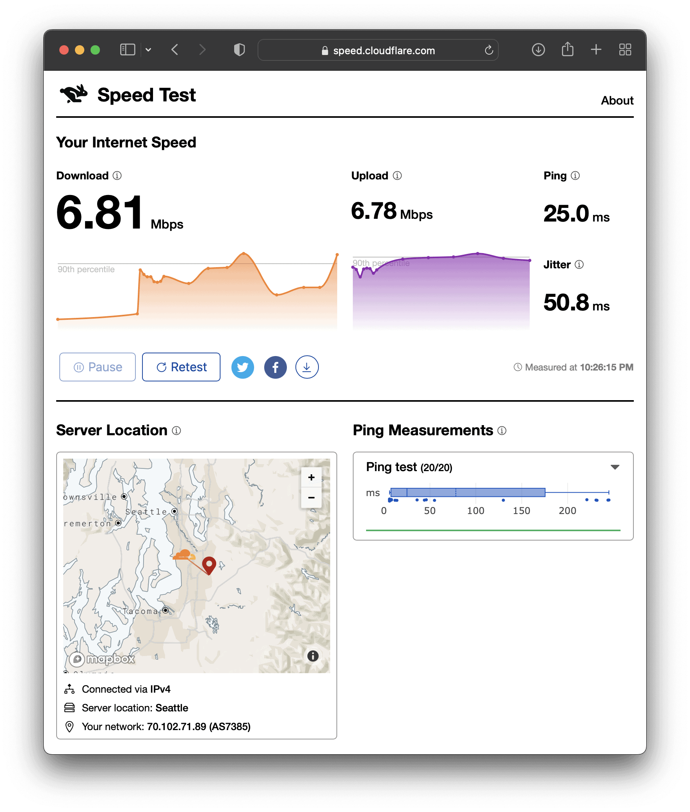

以下はSlateで中継したときの計測結果です。多少速くなっていますが、誤差の範囲でしょう。


flowchart LR
  Mac-- Wi-Fi 5GHz ---Slate-- Wi-Fi 5GHz ---Hotel


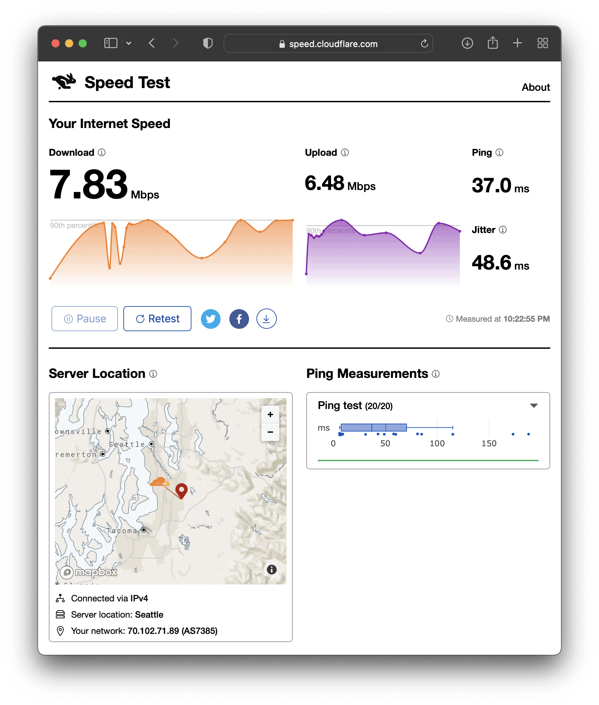

以下はSlateからWireGuardで自宅と Site-to-Site VPN したときの計測結果です。Server Location がTokyoになっており、VPNが機能していることが分かります。東京経由になったのでPingは144msで5倍程度遅くなっていますが、速度は誤差の範囲でしょう。ホテルのインターネット速度が10Mbps程度の場合は、SlateやWireGuardのスループットへの影響はないようです。


flowchart LR
  Mac-- Wi-Fi 5GHz ---Slate-- Wi-Fi 5GHz + WireGuard ---Hotel


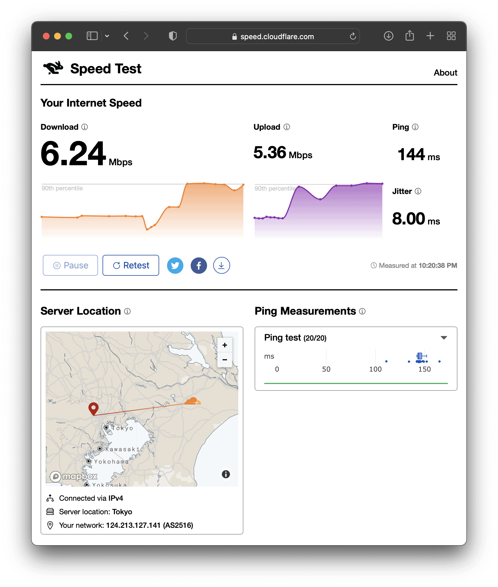

## Sheraton Palo Alto での計測結果

以下は米国パロアルトのSheratonでの計測結果です。まずはホテルのオープンネットワークのWi-Fiに5GHzで直接つないだときの結果です。当初の部屋では64Kbpsしか出なくて話にならなかったので、部屋を交換してもらいました。交換後の部屋では88.2Mbpsという、ホテルとしてはかなり速い速度が出ています。交換前の64Kbpsと極端すぎます。


flowchart LR
  Mac-- Wi-Fi 5GHz ---Hotel


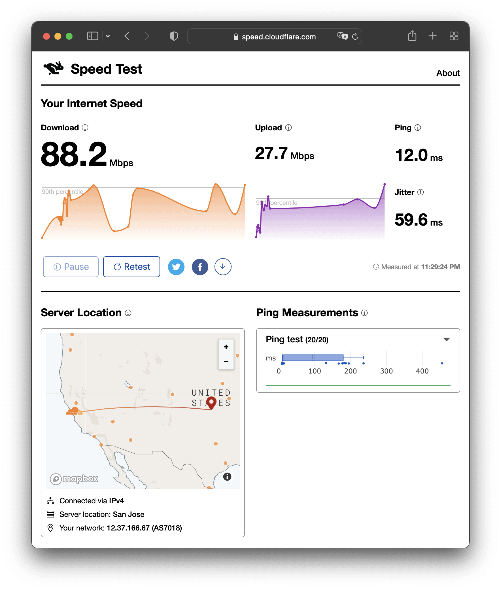

以下はSlateで中継したときの計測結果です。上記88.2Mbpsと比べるとだいぶ遅くなったので、Slateがボトルネックになっています。


flowchart LR
  Mac-- Wi-Fi 5GHz ---Slate-- Wi-Fi 5GHz ---Hotel


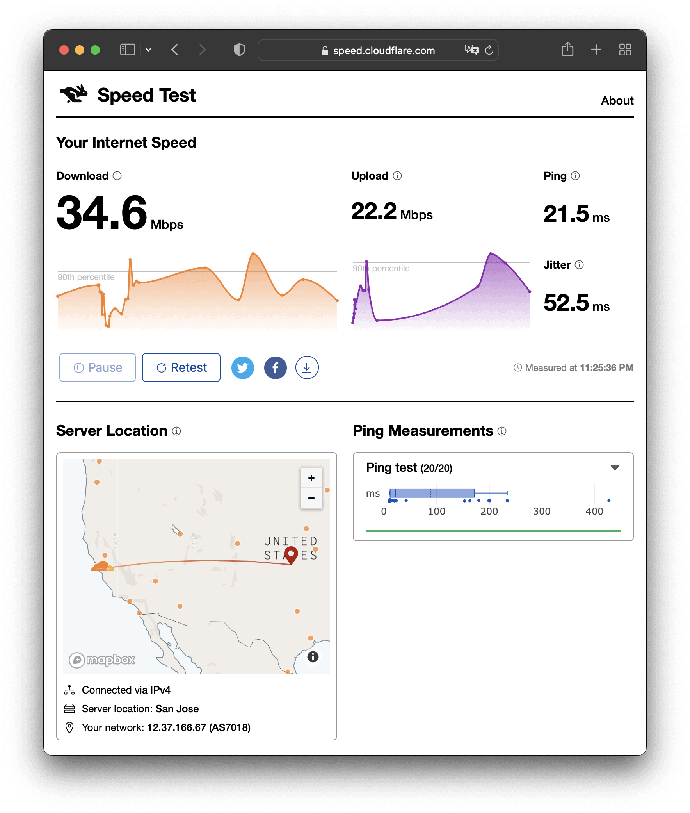

以下はSlateからWireGuardで自宅と Site-to-Site VPN したときの計測結果です。東京経由になったのでPingは135msになり、速度も15.9Mbpsまで落ちました。Server Location はTokyoになっており、VPNが機能していることが分かります。15.9Mbpsで困るかと言えば困りはしませんが、ホテルのWi-Fi直接の88.2Mbpsと比べるとだいぶ遅くなりました。


flowchart LR
  Mac-- Wi-Fi 5GHz ---Slate-- Wi-Fi 5GHz + WireGuard ---Hotel


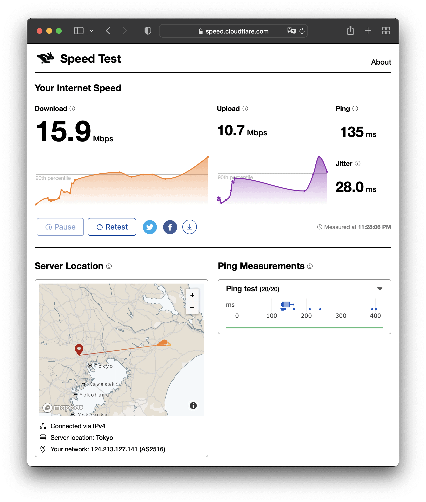

「ホテルのWi-Fiに5GHzでつないで、SlateとMacも5GHzでつないだら、アンテナの帯域が半分になっているのでは？」と思い、SlateとMacを2.4GHzでつないだときが以下です。34.6Mbpsと比べると、誤差とは言えないほど速くなりました。この状態でWireGuardしたときの結果は計り忘れました。


flowchart LR
  Mac-- Wi-Fi 2.4GHz ---Slate-- Wi-Fi 5GHz ---Hotel


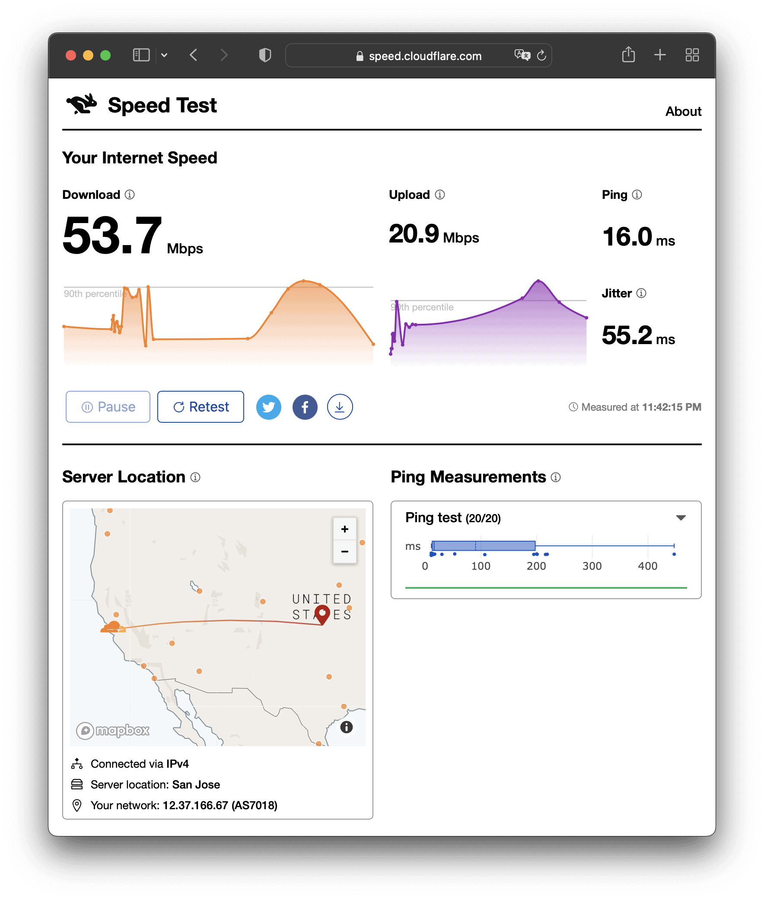

部屋にはLANも来ていたので、そちらでも計測してみました。ちなみに、交換前の部屋のLANは断線しており、リンクアップしませんでした。まずはMacを直接LANでつないだ場合です。Wi-Fi同等の結果です。


flowchart LR
  Mac-- LAN ---Hotel


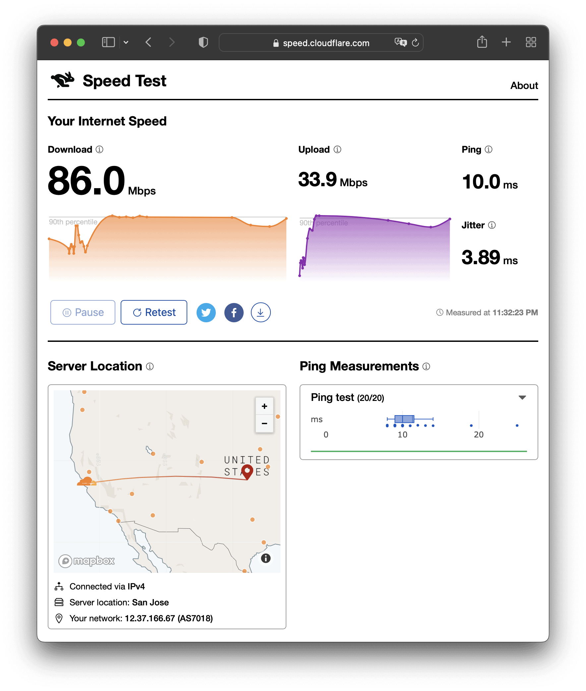

SlateをLANにつなぎ、SlateとMacは Wi-Fi 5GHz でつないだ結果が以下です。LANとWi-Fiにすると負荷分散されるようで、Slateがボトルネックにならなくなりました。LANがあるホテルの場合は、LANを優先したほうが良さそうです。


flowchart LR
  Mac-- Wi-Fi 5GHz ---Slate-- LAN ---Hotel


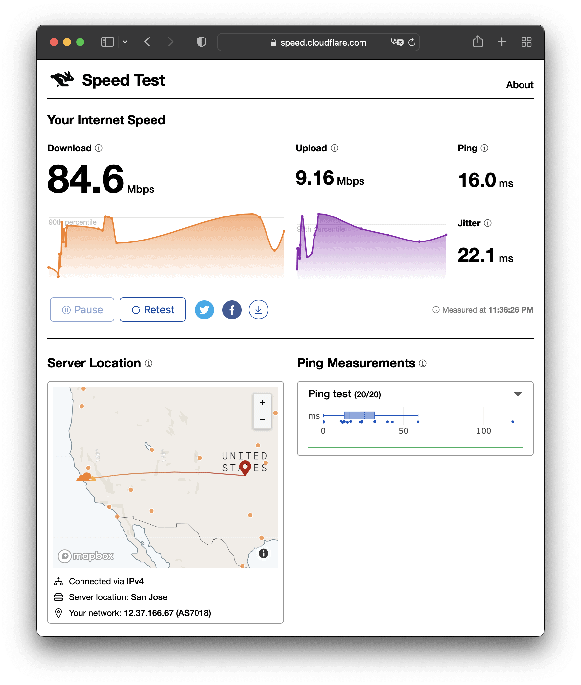

この状態でWireGuardを有効にしました。だいぶ遅くなったとはいえ、Wi-Fiを中継したときの15.9Mbpsよりは速いです。


flowchart LR
  Mac-- Wi-Fi 5GHz ---Slate-- LAN + WireGuard ---Hotel


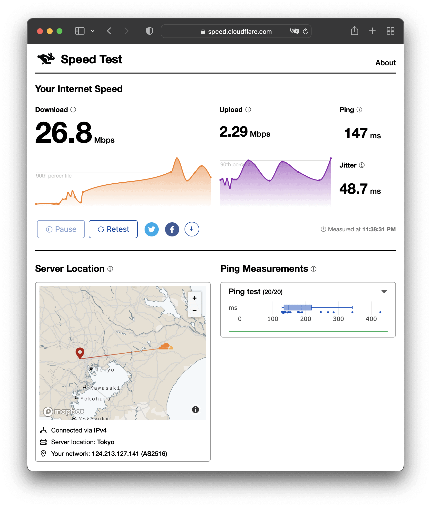

## アパホテル新宿御苑前での計測結果

以下はアパホテル新宿御苑前での計測結果です。Wi-Fiを介さない構成での計測をしてみました。ホテルなのに749Mbpsってすごい。


flowchart LR
  Mac-- LAN ---Hotel


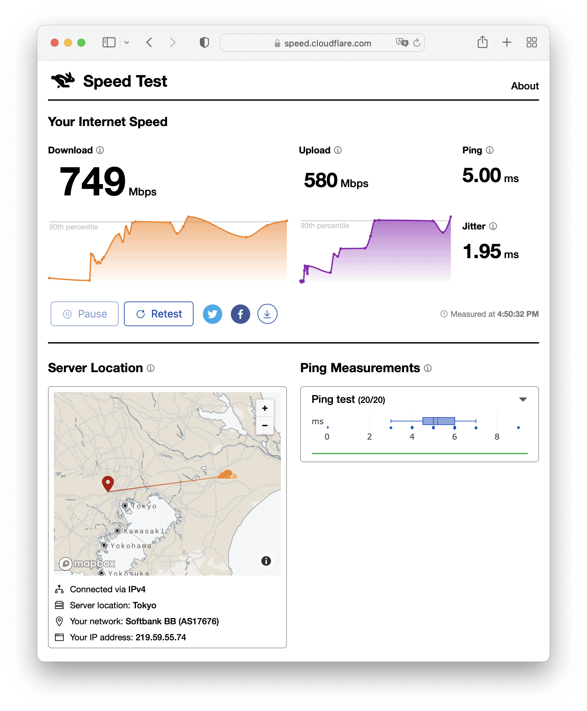

[uni Unet | USB-C Hub ( 4 in 1 ) | USB 3.0 EHUB01](https://uniaccessories.com/collections/usb-hub-w-ethernet/products/usb-c-to-ethernet-3-usb-adapter) USB-Ethernetアダプターを持ってきていたので、MacとSlateもLANで接続し、WireGuardを有効にしました。すると、カタログスペックが68Mbpsなので、それに近しい値が出るようになりました。やはり、LANがあるホテルの場合は、LANを優先したほうが良さそうです。


flowchart LR
  Mac-- LAN ---Slate -- LAN + WireGuard ---Hotel


## まとめ

GL.iNet Slate (GL-AR750S-Ext) はWireGuardで Site-to-Site VPN を構築できるトラベルルーターです。ホテルのWi-Fiに Captive Portal 経由で接続するとき、多くの端末があっても、いずれかの端末からログインすれば全ての端末から使えるようになります。また、WireGuardで自宅にVPNすることで、海外にいても IP Geolocation は日本になり、日本からのみにアクセス制限されているコンテンツも見られるようになります。WireGuardを有効にしたWi-Fi接続では下り25Mbps程度、LAN接続では下り55Mbps程度の性能が出ます。

|  |  |
| --- | --- |
| ブランド | [GL.iNet](https://www.gl-inet.com/) |
| 製品名 | [Slate](https://www.gl-inet.com/products/gl-ar750s/) |
| 型番 | GL-AR750S-Ext |
| 販売店 | [Amazon](https://amzn.to/3kddsjt) |
| 支払金額 | 6,999円。送料無料（- Amazonポイント70円相当還元） |
| 購入日 | 2022-03-31 |
