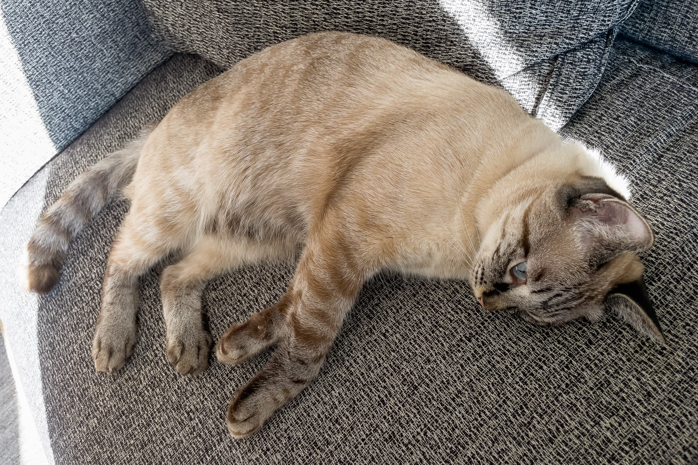

ある日の朝、うちの猫が朝食前に嘔吐と下痢をしました。嘔吐は普通の猫並みにしていましたが、食事前というのは珍しく、下痢も子猫の時以来です。その日は食欲が全くなかったものの、翌日の昼からは、いつもの [AIXIA 黒缶パウチ しらす入りまぐろとかつお](https://www.aixia.jp/product/detail_4571104713005) を食べ、調子を取り戻しました。ところが、その日の夜から黒缶パウチを全く食べなくなり、その翌日も一切食べません。あんなに好きだった黒缶パウチなのに。おなかを壊した原因を猫なりに考えた結果なのでしょうか。（ネオフィリアとかネオフォビアでしょうか）

調子の良くない猫

そのような背景で、新たなウェットフードを探すことになりました。今までは [Nestle Purina ONE メタボリック エネルギーコントロール](https://nestle.jp/brand/one/cat/lineup/dry-metabolic-chicken/) を中心に1日1袋の黒缶パウチを食べていました。人間の食事に対する執着が肉より魚のほうが強いため、魚が主原料のウェットフードから選ぶことにします。高タンパク質 / 低脂質で、保存料 / 着色料不使用のものという条件で、[いなば 金のだし パウチ まぐろ・かつお かつお節入り](https://www.inaba-petfood.co.jp/product/detail/%E9%87%91%E3%81%AE%E3%81%A0%E3%81%97/5145) と [はごろもフーズ 無一物パウチ まぐろ](https://www.hagoromofoods.co.jp/products/petcare/detail/?id=93) を試しに買ってきました。アイシアはマルハニチログループなので、人間用ツナ缶メーカー勢ぞろいの比較となりました。

|  | AIXIA 黒缶パウチ | いなば 金のだし パウチ | はごろもフーズ 無一物パウチ |
| --- | --- | --- | --- |
| 総合栄養食？ | Yes | No | No |
| 内容量 | 70g | 60g | 50g |
| 1袋当たりカロリー | 56kcal | 35kcal | 33kcal |
| 100g当たりカロリー | 80kcal | 58kcal | 66kcal |
| タンパク質 | 13.9%以上 | 10.0%以上 | 15%以上 |
| 脂質 | 0.9%以上 | 0.2%以上 | 0.3%以上 |
| 水分量 | 82.0%以下 | 87.0%以下 | 84%以下 |
| 参考価格 | 60円 | 65円 | 110円 |

黒缶パウチが総合栄養食だし、カロリー当たりの金額も安くて人間には優しいです。しかし、食べない分には仕方がありません。

金のだし パウチ は、見た目も黒缶パウチよりは水分が多めですが、[金のだし カップ](https://www.inaba-petfood.co.jp/product/detail/%E9%87%91%E3%81%AE%E3%81%A0%E3%81%97/5268) と違ってしっかりとした固まりになっています。うちの猫は皿に盛っているそばから興奮気味で、お皿をきれいになめとって、食後はまるで洗ったあとのようにピカピカです。一方、無一物パウチもよく食べるものの、普通においしくいただいた感じです。ゼリータイプではないからか、少し食べ散らかし気味です。

皿に盛った いなば 金のだし パウチ まぐろ・かつお かにかま入り

ということで、今週から 金のだし パウチ を1日2袋食べています。1袋当たりカロリーが黒缶パウチに比べると3分の2程度しかないため2袋にしていますが、1袋にしてドライフードをその分多めにするか悩み中です。

|  |  |
| --- | --- |
| ブランド | [いなば](https://www.inaba-petfood.co.jp/) |
| 製品名 | [金のだし パウチ まぐろ・かつお かつお節入り](https://www.inaba-petfood.co.jp/product/detail/%E9%87%91%E3%81%AE%E3%81%A0%E3%81%97/5145) |
| 販売店 | [York Foods](https://www.york-inc.com/) |
| 支払金額 | 81円 |
| 購入日 | 2022-03-11 |
