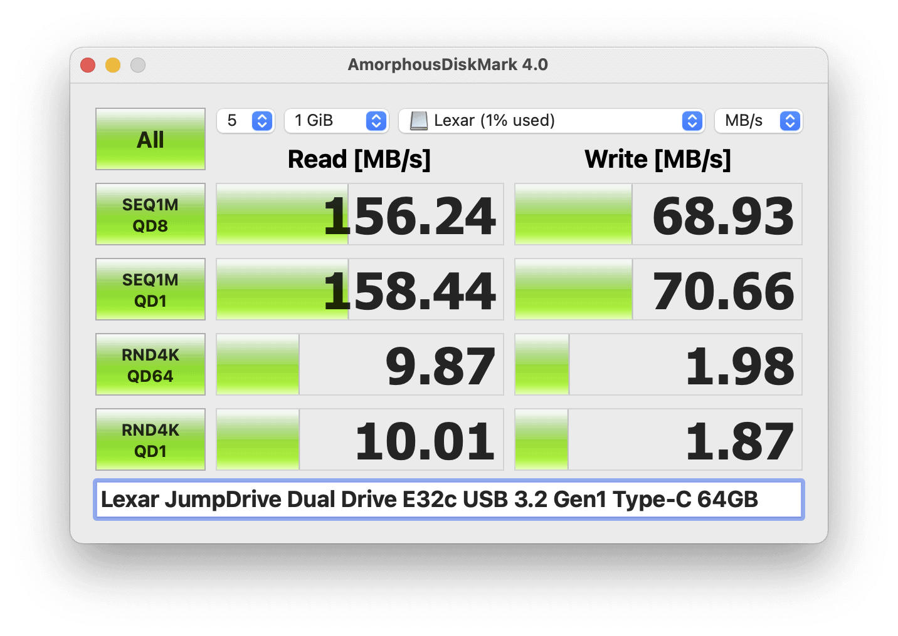
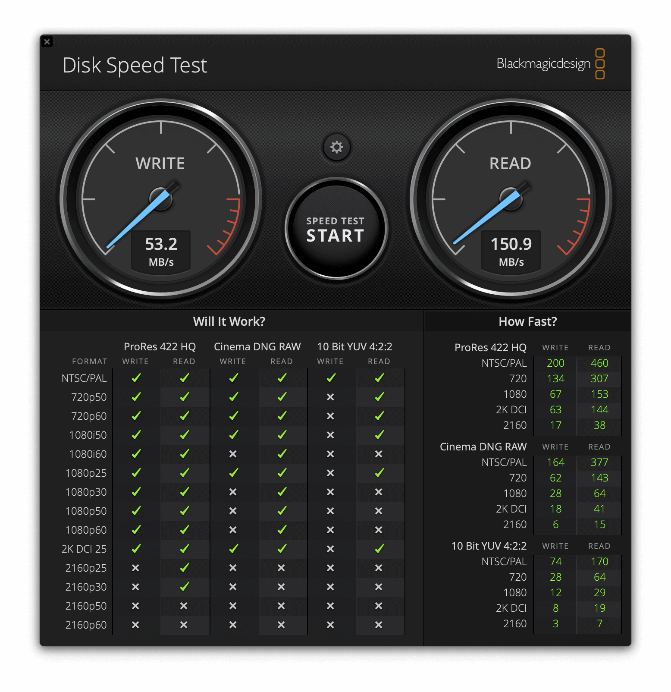

Type-AとType-Cが両端にある回転式キャップのUSBメモリーが好きで、PNY HP x5000m USB 3.1 OTG Flash Drive 16GB を使っていたのですが、今となっては、より安い製品が他にあるので、[Lexar JumpDrive Dual Drive E32c USB 3.2 Gen1 Type-C](https://www.lexar.com/product/lexar-jumpdriver-dual-drive-e32c-usb-3-2-gen1-type-c/) 64GB を買ってみました。[SanDisk Ultra Dual Drive Go USB Type-C](https://www.westerndigital.com/products/usb-flash-drives/sandisk-ultra-dual-drive-go-usb-3-1-type-c) 64GB SDDDC3-064G-G46 も良さそうだったのですが、サイズが少し大きかったので、Lexarにしました。


|  | PNY x500m | Lexar E32c | SanDisk SDDDC3-064G-G46 |
| --- | --- | --- | --- |
| サイズ | 33mm x 13.2mm x 6.6mm | 40.5mm x 12.2mm x 7.2mm | 44.4mm x 12.1mm x 8.6mm |
| 重量 | 6.6g | 8g | ? |
| 読み取り | 最大150MB/s | 最大100MB/s | 最大150MB/s |
| 書き込み | 最大50MB/s | 最大30MB/s | ? |
| 64GBの参考価格 | 5,300円 | 1,181円 | 1,465円 |


Lexar JumpDrive Dual Drive E32c はカタログスペックでは読み取り性能が劣るように見えましたが、実際に計測してみるとカタログスペック以上が出ており、性能は遜色なさそうです。




AmorphousDiskMark




Blackmagic Disk Speed Test


64GB全てに書き込んでみました。46分掛かり、平均書き込み速度は22MB/sでした。


```
[tats@youth ~]% sudo dd if=/dev/zero of=/dev/rdisk4 bs=1m
dd: /dev/rdisk4: Input/output error
59001+0 records in
59000+0 records out
61865984000 bytes transferred in 2762.139540 secs (22397849 bytes/sec)
```


|  |  |
| --- | --- |
| ブランド | [Lexar](https://www.lexar.com/ja/) |
| 商品名 | [JumpDrive Dual Drive E32c USB 3.2 Gen1 Type-C 64GB](https://www.lexar.com/product/lexar-jumpdriver-dual-drive-e32c-usb-3-2-gen1-type-c/) |
| 販売店 | [Lexar storage store - Amazon](https://amzn.to/34YJc7Y) |
| 支払金額 | 1,181円。送料無料（- Amazonポイント12円相当還元） |
| 購入日 | 2022-02-19 |
