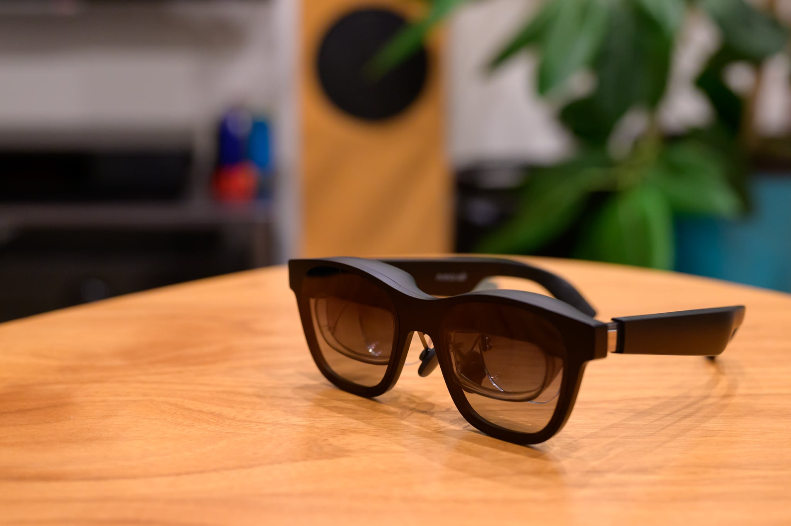
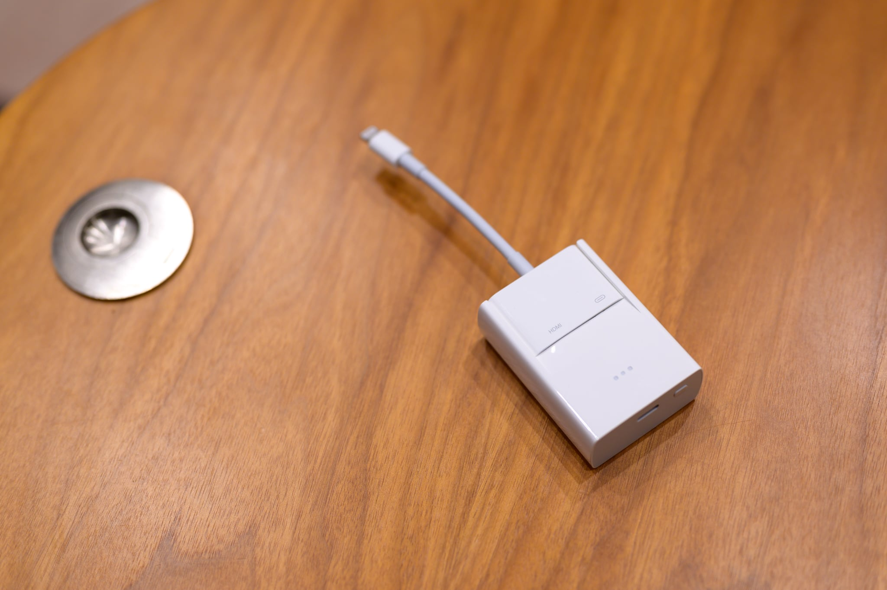
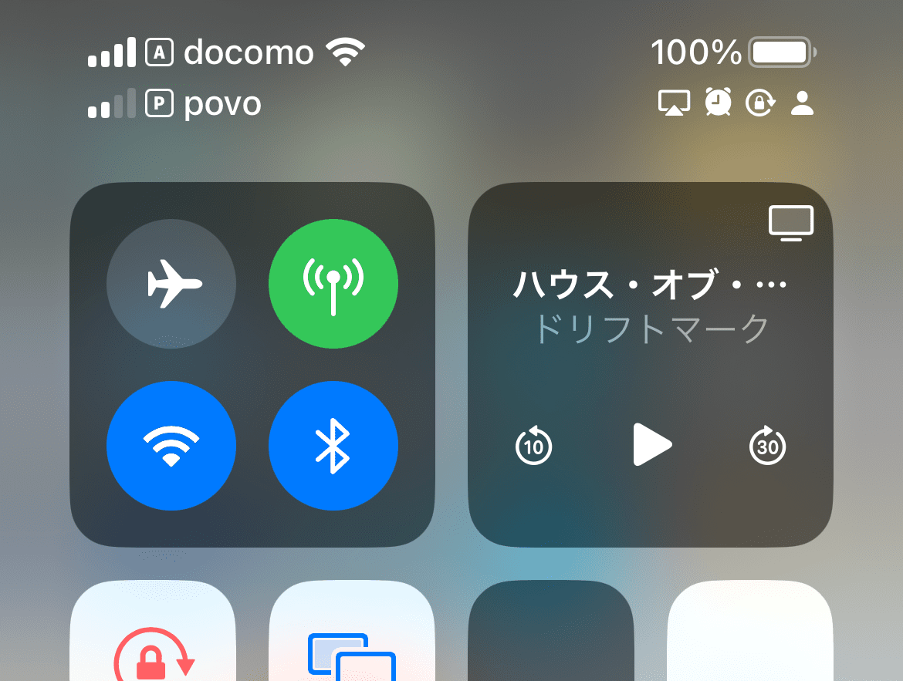
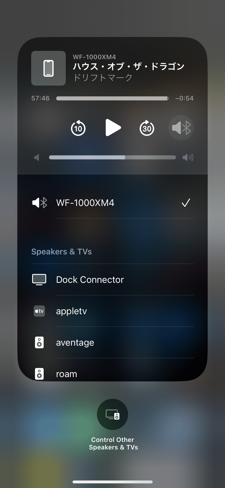

XREAL Air（旧: Nreal Air）は現実世界の空中に大画面のスクリーンを表示することができるARグラスなのですが、海外出張の直前に「飛行機で [XREAL Air](https://www.xreal.com/jp/air) を使って映画を見たら、最高の体験なのではないか」となぜか突然思いつきました。機内では [iPad Air（第3世代）](https://support.apple.com/kb/SP787?locale=ja_JP)をいつも使っているのですが、機内のモニターより小さい画面なのが少し気になっていました。しかし、XREAL Air を使えばスクリーンが眼前に広がり、しかもどんな姿勢でも常に目の前に画面が広がるという点は、ずっと同じ姿勢だと体が痛くなる機内では大きな魅力になりそうです。また、XREAL Air は度付きインサートレンズが装着できるため、メガネが欠かせない私もメガネ on メガネで無理する必要がない点も大きなポイントです。ARグラスは、度付きレンズに対応できるかが個人的にはかなり重要なポイントです。



XREAL Air ついてあまり詳しく知りませんでしたでしたが、調べてみると DisplayPort over USB Type-C (DP USB-C) でしか接続できないため、Lightiningの iPad Air（第3世代）や [iPhone 12 Pro](https://support.apple.com/kb/SP831?locale=ja_JP) にはつながらないということが分かり、買う気が一気に失せました。ところがその数日後、[XREAL Adapter](https://www.xreal.com/jp/adapter) が発表され、[Apple Lightning - Digital AVアダプタ](https://www.apple.com/jp/shop/product/MW2P3AM/A/lightning-digital-av%E3%82%A2%E3%83%80%E3%83%97%E3%82%BF) と組み合わせることで、Lightning → HDMI → DP USB-C と変換して使えるようになりました。Nreal Air はUSB-Cから受電するものの、HDMIは給電できないため、XREAL Adapter はバッテリーを積んでいます。少し重くはなりますが、iPhone自体のバッテリーを消費しないというメリットもあります。

## XREAL Air をレンタル

iPhoneに接続できるようになったものの、XREAL Air 本体だけでなく、度付きインサートレンズ、XREAL Adapter、Apple Lightning - Digital AVアダプタ も購入しないといけないため、合計金額がけっこうします。出張時の機内だけでしか使わないのであればコストパフォーマンスが悪いです。自宅でも使えば許容範囲ですが、本当に飽きずに使いつづけるか不安がありました。

そこで、[Rentio](https://www.rentio.jp/products/nrealair)で14泊6,980円でレンタルしてみることにしました。度付きインサートレンズは付属していないのでコンタクトレンズにして、ソースは DP USB-C に対応している [MacBook Pro (14-inch, 2021)](https://www.apple.com/jp/macbook-pro-14-and-16/) を使用しました。MacBook Pro からは単なる外部モニターとして認識されますが、ARグラスなので現実世界の空中にスクリーンを表示されます。暗い場所ではそのまま楽しめますが、照明が視界に入るなどのコントラストの高い場所や全体が明るい場所ではスクリーンに集中しづらいです。そういう場所ではライトシールドをつけることで非透過にできます。もはやARでも何でもなくなるのですが、非透過のほうがスクリーンは格段に見やすくなります。ただし、早送りなどの際の映像ソースの操作はしづらくなります。

スクリーンとの距離感がよく分からないので仕様の「4m先に130インチ」というはなんとも言えませんが、ひとまず視界いっぱいにスクリーンが広がります。解像度は1920x1080ですが、精細感は予想以上に高く、字幕も全く問題なく読めます。色域は sRGB 108% という仕様ですが、体感も問題ありません。最大輝度400nitis、最大コントラスト100,000:1という仕様は、むしろ高すぎて、暗いシーンから突然明るいシーンに変わるとまぶしいです。テンプル部には開放型スピーカーがあり、アクション映画には物足りないですが、会話中心のドラマはけっこうこれで十分でした。79gという重量はメガネとしては重いですが、2時間程度は問題なく掛けてられます。トラベルケースのサイズも大きめのサングラスケース程度で、カバンに気軽に入れられます。この辺がVRゴーグルとの大きな違いでしょう。

機内でも使ってみました。ビジネスクラスへのマイルアップグレードに成功したので MacBook Pro でもそれなりに使えましたが、エコノミークラスでは取り回しがストレスになりそうです。音声は [Sony WH-1000XM2](https://www.sony.jp/headphone/products/WH-1000XM2/) をBluetooth接続しました。結果、サングラス + マスク + ヘッドフォンというかなり怪しい雰囲気になりましたが、飛行機や新幹線なら許容範囲でしょう。在来線では勇気がいります。

## XREAL Air を購入

MacBook Pro がソースの時の取り回しのしづらさ以外は気に入ったので、XREAL Adapter でiPhoneとつながるようになったら完璧になるはずということで、XREAL Air を購入することにしました。Nreal Air はあまり値引きされていないので、Yahoo!ショッピングで日曜日か5の付く日に購入してポイント割引を得るのが良いでしょう。私は8,089円相当のポイント還元で購入できました。

度付きインサートレンズはAmazonで購入しました。レンズフレームとレンズ度数データを [JUN GINZA](https://junginza.com/) に送らないといけないので、いつものAmazonショッピング体験に比べると少し面倒です。私は度数データが分かっていたのでそれを注文書に転記しました。度数データが不明な場合は眼科で処方箋を作ってもらうか、使用しているメガネを JUN GINZA に送付します。厚みは悩んだのですが、[JINS](https://www.jins.com/jp/)で1.6がいつも提案されていたので、1.6の薄型にしました。ただ、今見るとS値とC値からの参考が [JUN GINZA のページ](https://junginza.com/nreal)に載っており、右が合計-5.5、左が合計-4.75の私は超薄型が推奨だったようです。とはいえ、実際届いたレンズはレンズ自体が小さいこともあって、1.6でも厚さもゆがみも気になりませんでした。

自宅ではベッドに寝っ転がって MacBook Pro をベッドサイドに置いて楽しんでいました。寝っ転がって見られるのはリビングのテレビに勝るメリットです。寝返りを打っても常にスクリーンは目の前にありますし。ただ、付属のUSB-Cケーブルが1.2mと少し短く、視界がさえぎられた状態でゴロゴロしすぎると MacBook Pro が引っ張られそうです。

そんなわけで、映像ソースをiPhoneにできる XREAL Adapter を待ち焦がれていたところ、Amazonで予約が始まっていることに気づいて注文しました。これが正解で、発売日の10月1日にはAmazonを含めたどの店でも売り切れになっていました。また、Apple Lightning - Digital AVアダプタ がビックカメラで特価になっていることにも気づいて、15%オフで購入できました。

## XREAL Adapter を入手

XREAL Adapter + Apple Lightning - Digital AVアダプタ

XREAL Adapter はHDMIケーブルをつなげられるものの、iPhoneをメインターゲットとしているため、Apple Lightning - Digital AVアダプタ との相性は抜群で、1個のアダプターに見えます。ただ、Apple Lightning - Digital AVアダプタ の充電用USB-Cポートが塞がれてしまうのはちょっと残念で、iPhoneを充電しながら使うにはQiワイヤレス充電する必要があります。バッテリーは3時間ほど持つので、LED1個が1時間という目安になります。30分で40%、1時間で80%、2時間で100%チャージできます。

iOSのインターフェースが分かりづらいのですが、映像はLightning 、音声はBluetoothという接続も可能です。XREAL Adapter をつなぐと[コントロールセンター](https://support.apple.com/ja-jp/HT202769)のメディアコントロールの右上にモニターのピクトが出るので、それを押すと音声出力先を Dock Connector からBluetoothヘッドフォンなどに変更することができます。

XREAL Air を使うことで、家族が在宅していても一人で大画面で映像を楽しめるようになりました。しかも、ソファで寝っ転がるどころか、ベッドで寝っ転がりながら見ることができます。XREAL Air によって、突然のお色気シーンでお茶の間を凍らせる海外ドラマを消化しやすくなりました。

なお、XREAL Air はアクティベーションが必要です。アクティベーションには DP USB-C に対応したAndroidがあればNebulaアプリから、それ以外であれば[Webブラウザー](https://ota.xreal.com/jp/air-update?version=1)から行えます。

XREAL Air レンタルのために初めてRentioを使う方は、[こちら](https://www.rentio.jp/?invite=7cc5476b)からアクセスすると、あなたと私がそれぞれ500円割引をもらえます。2022年10月7日現在は14泊5,800円でレンタルできます。

## まとめ

XREAL Air は現実世界の空中に大画面のスクリーンを表示することができるARグラスです。映像ソースには DP USB-C 対応のデバイスが必要でしたが、XREAL Adapter と Apple Lightning - Digital AVアダプタ を使うことでiPhoneとつなぐことができるようになりました。映像はLightning、音声はBluetoothという構成も取れるので、飛行機の機内や自宅のベッドで寝っ転がりながら視界いっぱいのスクリーンを楽しむことができます。

|  |  |
| --- | --- |
| ブランド | [XREAL](https://www.xreal.com/jp/) |
| 製品名 | [XREAL Air](https://www.xreal.com/jp/air) |
| 型番 | NR-7100RGL |
| 販売店 | [コジマPayPayモール店](https://store.shopping.yahoo.co.jp/y-kojima/) |
| 支払金額 | 45,980円。送料無料（- PayPayポイント8,089円相当還元) |
| 購入日 | 2022-09-11 |

|  |  |
| --- | --- |
| ブランド | [JUN GINZA](https://junginza.com/) |
| 製品名 | [XREAL Air 度付きインサートレンズ](https://junginza.com/nreal) 単焦点・薄型 |
| 販売店 | [Amazon](https://amzn.to/3eaYc7r) |
| 支払金額 | 7,480円。送料無料（- Amazonポイント75円相当還元) |
| 購入日 | 2022-09-11 |

|  |  |
| --- | --- |
| ブランド | [XREAL](https://www.xreal.com/jp/) |
| 製品名 | [XREAL Adapter](https://www.xreal.com/jp/adapter) |
| 型番 | NR-7100AGL |
| 販売店 | [Amazon](https://amzn.to/3EnyreT) |
| 支払金額 | 8,980円。送料無料（- Amazonポイント90円相当還元) |
| 購入日 | 2022-09-18 |
| 納品日 | 2022-10-01 |

|  |  |
| --- | --- |
| ブランド | [Apple](https://www.apple.com/jp/) |
| 製品名 | [Lightning - Digital AVアダプタ](https://www.apple.com/jp/shop/product/MW2P3AM/A/lightning-digital-av%E3%82%A2%E3%83%80%E3%83%97%E3%82%BF) |
| 型番 | MD826AM/A |
| 販売店 | [ビックカメラ](https://www.biccamera.com/bc/item/3155812/) |
| 支払金額 | 6,780円。送料無料（- ビックポイント339円相当還元) |
| 購入日 | 2022-09-18 |