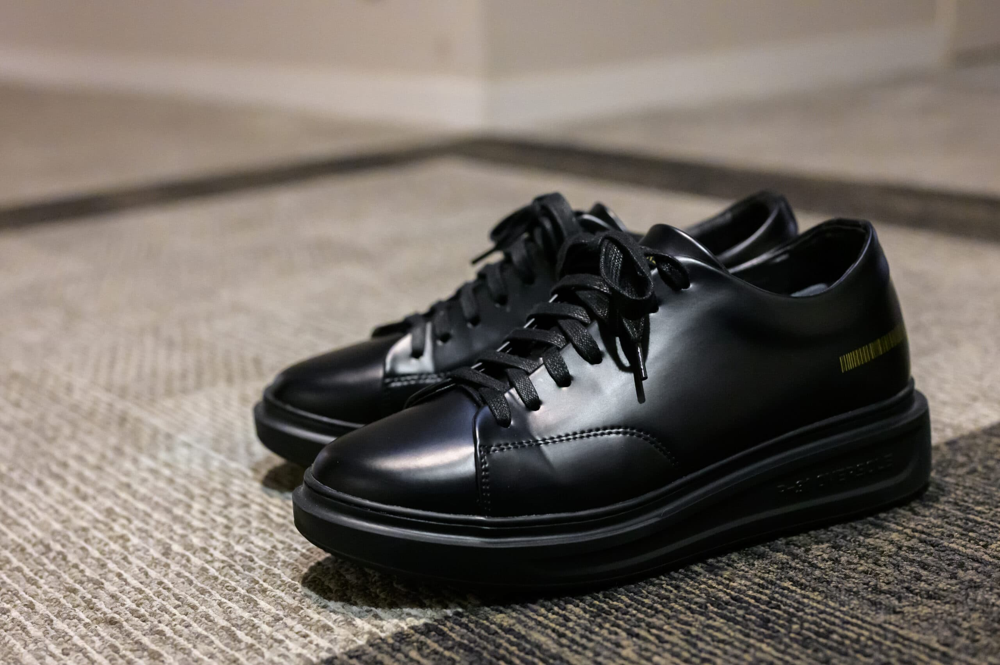

そこそこボリュームのあるきれいめスニーカーを探していたら韓国ブランドの [P-31 Oversole Black Edition 7cm](https://ja.p-31.kr/product/p-31-oversole-black-edition-7cm/72/) を見つけました。Alexander McQueen Men’s Oversized Sneaker in Black へのオマージュをかなり感じますが、ドレスとカジュアルのバランスがちょうど良いです。

合皮ですがビニールな感じはあまりなく、ガラスレザーっぽく見えます。しわが寄ったときにどうなるかが気になりますが、やや硬めなので、しわ自体ができにくそうです。むしろ合皮なので水に強いので、どんな服にでも合わせやすいこともあって、雨の日はだいたいいつもこれを履いています。

メーカーは靴ひもをシングルで結んでいますが、皮が硬くてフィット感が悪いため、アンダーラップで結び直しています。アンダーラップの見た目も個人的には好きです。

見た目からは7cmヒールな感じを受けませんが、履いてみると目線の違いを感じます。一方で履いているときの足の違和感はありません。この靴を履いたあとだと他の靴のヒールの高さが物足りなくなってしまい、他の靴すべてにインソールを入れるようになりました。

東京で試し履きできる店舗がないのでサイズに悩みますが、Nikeなら26.5cm、New Balance なら26.0cmを履く私は、これは26.5cmでちょうど良かったです。私はQoo10メガ割とタイムセールの組み合わせで安く買えました。

|  |  |
| --- | --- |
| ブランド | [P-31](https://ja.p-31.kr/) |
| 製品名 | [Oversole Black Edition 7cm](https://ja.p-31.kr/product/p-31-oversole-black-edition-7cm/72/) |
| 販売店 | [P-31 - Qoo10](https://www.qoo10.jp/su_move/1407620878) |
| 購入金額 | 12,328円 |
| 購入日 | 2023-09-01 |
| 納品日 | 2023-09-05 |