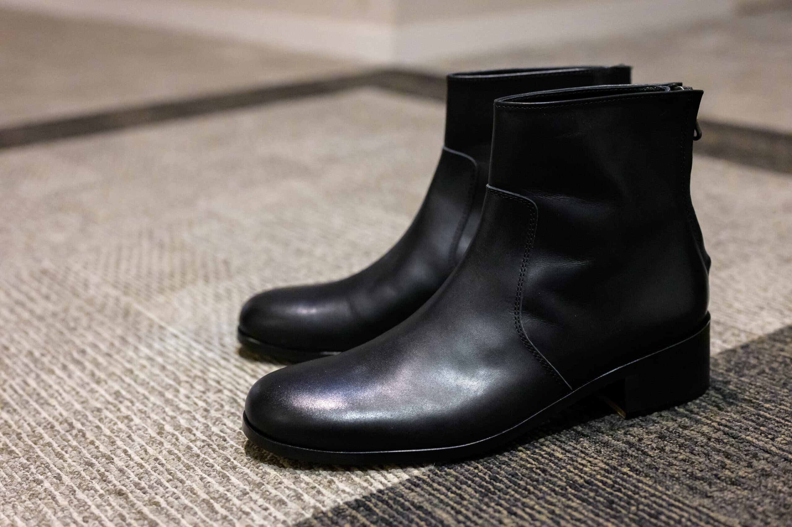

PADRONEのバックジップブーツは以前から持っていたのですが、試着したにも関わらずサイズ選びを間違ってしまい、しばらく履いていると甲が痛くなっていました。また、最近はチャンキーソールの靴ばかり買っているのでヒールの高さが普通のものは何か物足りなさが。そうなると、いよいよ履かなくなってきたので、トレンドのヒールが高めな2023年モデルのものに買い替えました。

メンズのヒールブーツが流行っているとは言え、7cmヒールくらいだとレディースっぽすぎて、まだ難しいと思っています。[BL Backzip Boots PU8395-1106-23A](https://www.padrone.co.jp/pt_items/pu8395-1106-21a) は4.5cmヒールで、ビジネスシューズと見た目がそれほど変わらない印象です。[Innergore Boots with Chunky Sole PU8054-1143-23C](https://www.padrone.co.jp/pt_items/pu8054-1143-23c-2) というチャンキーソールのモデルもあり、一見こちらのほうがヒールの高さがありそうですが、実は4.2cmで、BL Backzip Boots のほうが若干高いです。

メンズのショートブーツというとサイドゴアブーツが定番ですが、サイドゴアブーツって脱ぎ履きしやすい分、履き心地がちょっと緩いんですよね。あと、どうしてもゴムが伸びて見た目が早く悪くなりがちです。そして、[GU リアルレザーサイドゴアブーツ](https://www.gu-global.com/jp/ja/products/E347382-000) が5,990円（セールで4,990円）となると、3万円でサイドゴアブーツを買う理由探しが必要になってきます。一方でバックジップブーツはそれほど手間なく脱ぎ履きできるのに、ジップを上げると足とブーツが完全に密着するので、私はこちらが好きです。

私はNikeなら26.5cm、New Balance なら26.0cmを履きますが、これは41でちょうど良かったです。

|  |  |
| --- | --- |
| ブランド | [PADRONE](https://www.padrone.co.jp/) |
| 製品名 | [BL Backzip Boots](https://www.padrone.co.jp/pt_items/pu8395-1106-21a) |
| 型番 | PU8395-1106-23A |
| 販売店 | STUDIOUS MENS - ZOZOTOWN Yahoo!店 - Yahoo!ショッピング |
| 購入価格 | 36,500円（-8,953円相当ポイント還元） |
| 購入日 | 2023-11-23 |