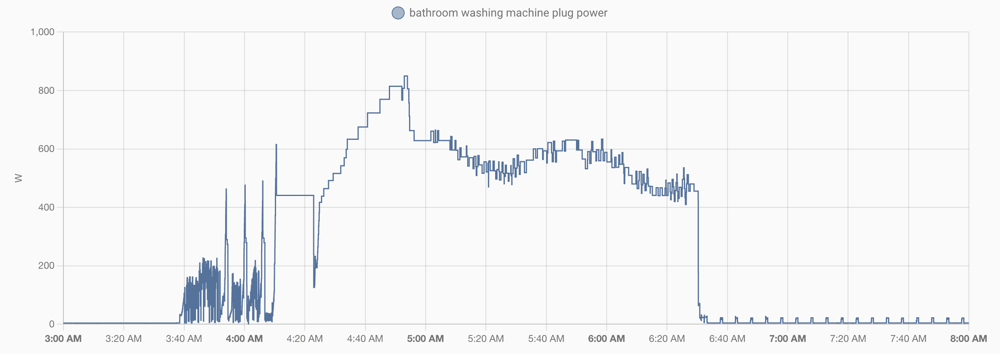
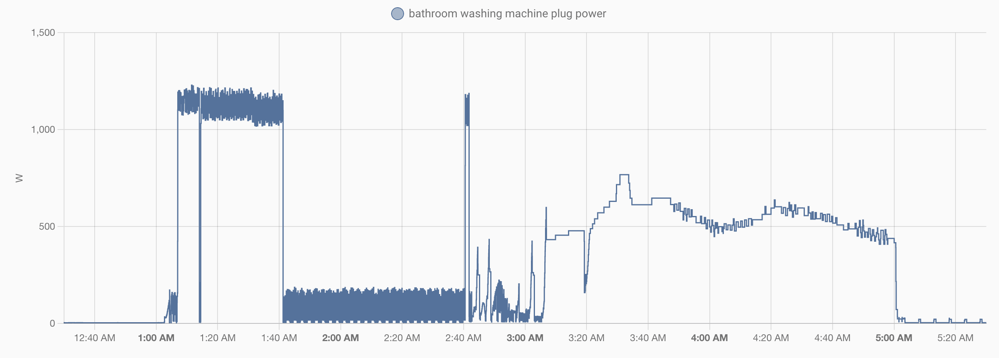

今まで使っていたドラム式洗濯乾燥機 [Hitachi BD-NV120CL](https://kadenfan.hitachi.co.jp/support/wash/item/BD-NV120CL/index.html) が乾燥時に75dBくらいの騒音が鳴るようになって、だましだまし使っていたものの、いよいよ生乾きになってきてダメなので、[Panasonic NA-LX127AL](https://panasonic.jp/wash/p-db/NA-LX127AL.html) を買いました。

[【2022年】ドラム式洗濯機のおすすめランキング6選 | 『家電批評』が人気製品を徹底比較 | 360LiFE [サンロクマル]](https://360life.shinyusha.co.jp/articles/-/4372) を参考に、Panasonic NA-LX127A と [TOSHIBA TW-127XP1](https://www.toshiba-lifestyle.com/jp/laundries/tw-127xp1/) を候補としました。本記事内でNA-LX127Aは最下位ですが、乾燥をしっかりコースにするだけで1位に相当になると判断しました。TW-127XP1は東芝のフラッグシップなのに、NA-LX127Aより4万円も安くて魅力的だったのですが、価格.comにTW-127XP1は不具合に関するコメントが散見される一方、NA-LX127Aは価格以外の不満点がありませんでした。


|  | Panasonic NA-LX127A | TOSHIBA TW-127XP1 |
| --- | --- | --- |
| 洗濯 / 脱水容量 | 12kg | 12kg |
| 乾燥容量 | 7kg | 7kg |
| 乾燥方式 | ヒートポンプ | ヒートポンプ |
| 温水洗浄 | 15℃、30℃、40℃、60℃ | 15℃、30℃、40℃、50℃、60℃ |
| 洗剤自動投入 | 液体洗剤、柔軟剤、おしゃれ着洗剤 | 液体洗剤、柔軟剤 |
| スマホ対応 | 対応 | 対応 |
| 操作パネル | ホワイト液晶パネル | カラータッチパネル |
| 価格.com | [リンク](https://kakaku.com/item/K0001378681/) | [リンク](https://kakaku.com/item/J0000036317/) |
| 参考価格 | 268,290円 | 226,000円 |

Hitachi BD-NV120CL の前は [Hitachi BD-V9800L](https://kadenfan.hitachi.co.jp/support/wash/item/BD-V9800L/index.html) を使っていたのですが、3年目にドラムモーター → ファンモーター → ドラムモーター → ファンモーターと4カ月連続で壊れ、日立にお気持ちを伝えてBD-NV120CLに交換してもらったという経緯があります。しかし、これも結局3年でファンモーターが壊れたという状況のため、今回は信頼性を重視し、NA-LX127Aを選びました。また、東芝は2015年のTW-117X3からフルモデルチェンジしておらず、おそらく間もなくフルモデルチェンジすると予想される一方、NA-LX127Aはフルモデルチェンジ直後なため、新しもの好きとしてはNA-LX127Aのほうが魅力的に思えました。

最近の洗濯機は「温水洗浄」「洗剤自動投入」「スマホ対応」「操作パネル」の違いでラインナップを区別しているメーカーが多いので、それぞれに価格差を支払えるかどうかを検討すると良いでしょう。Panasonicだと以下のようなラインナップになっています。私は「温水洗浄」「洗剤自動投入」「スマホ対応」3つに合計5万円は出せるけど、カラータッチパネルだけに5万円は出せないと考え、NA-LX127Aにしました。

|  | [NA-LX129A](https://panasonic.jp/wash/p-db/NA-LX129AL.html) | NA-LX127A | [NA-LX125A](https://panasonic.jp/wash/p-db/NA-LX125AL_spec.html) |
| --- | --- | --- | --- |
| 温水洗浄 | ○ | ○ | - |
| 洗剤自動投入 | ○ | ○ | - |
| スマホ対応 | ○ | ○ | - |
| 操作パネル | カラータッチパネル | ホワイト液晶パネル | ホワイト液晶パネル |
| 参考価格 | 318,780円 | 268,290円 | 221,880円 |

スマホ対応についてですが、洗濯機に遠隔操作性は求めていないものの、洗濯終了通知は欲しかった機能です。終了アラームを聞き逃して洗濯後の服が入りっぱなしということがよくあり、スマートプラグで電力量を監視して Home Assistant から通知する仕組みを[自作していました](https://github.com/rewse/ansible-playbooks/commit/b1314074ad18136d12d10edb6f12b78d6de025fc)。しかし、洗濯機は脱水と乾燥の間に電力量がゼロになるタイミングがあったり、False Alarm をゼロにすることは難しかったので、洗濯機自体が対応してくれるのは助かります。

## 購入店舗

Panasonic NA-LX127A とNA-LX129Aはパナソニックからの委託販売という契約になっており、在庫リスクをパナソニックが持つ代わりに、価格をパナソニックが決めています。そのため、大手販売店はどこも同じ価格で、店頭値引きもしてくれません。そのため、ポイント還元とアフターサービス、そして納期の観点から選ぶことになります。ただし、[Panasonic Care](https://ec-plus.panasonic.jp/store/page/pcare/) というパナソニック純正の延長保証サービスがあり、15,000円でメーカー保証を5年に延ばすという選択肢もあります。

- **ビックロ ビックカメラ新宿東口店:** 9日後に入荷。無料で5年延長保証（何度でも修理費100%補償）。ポイント還元なし。287,100円
- **ヨドバシカメラ 新宿西口本店:** 14日後に入荷。15,950円で5年延長保証（何度でも修理費100%補償）。10%ポイント還元。319,000円
- **ノジマ 新宿タカシマヤタイムズスクエア店:** 在庫あり。8,910円で7年延長保証（何度でも修理費100%補償）。dポイント1%還元。287,100円

ビックカメラの無料で5年延長保証は魅力的でしたが、「即納可能」「有償ながら7年延長保証」「店頭でしか使えない2022年7月末までの期間限定ポイントが2万ポイントあった」「店員がいつも感じが良い」という理由でノジマにしました。ノジマ 新宿タカシマヤタイムズスクエア店 は新しいこともあって、あまり知られていませんが、新宿エリアで候補に入れるべき店だと私は思っています。オムニチャンネル化が進んでいないのと、タカシマヤ タイムズスクエア の11階という行きづらい場所にあるので、ポイントが使いにくいところが気になる点ですが。なお、納期を優先しないのであれば、Yahoo!ショッピングで[5のつく日](https://shopping.yahoo.co.jp/promotion/campaign/5day/)や[日曜日](https://shopping.yahoo.co.jp/promotion/campaign/cp_sunday/)に購入するのがポイント還元を考慮すると最も安く買えるでしょう。

## 電力消費量

上記の通り、終了通知を飛ばすためにスマートプラグをつけていたので、電力消費量について見ることができます。まずは前機種の Hitachi BD-NV120C で洗濯乾燥を行ったときです。

以下が Panasonic NA-LX127A で洗濯乾燥を行ったときです。縦軸の最大がそろっていない点にご注意ください。どちらも乾燥の後半80分は500Wくらいですが、NA-LX127Aのほうが何か考えながら実行しているようなグラフになっています。違いは乾燥前半で、BD-NV120Cは60分ほど800Wで動いていますが、NA-LX127Aは30分ほどの700Wに留まっています。計算するとBD-NV120Cの乾燥前半は0.8kWh、NA-LX127Aの乾燥前半は0.35kWh、1kWh当たり30円とすると14円程度の差なので、気になるほどではありませんが。なお、乾燥全体でBD-NV120Cは44円、NA-LX127Aは30円程度の電気代です。

以下は Panasonic NA-LX127A で約40℃おまかせコースにしたときです。縦軸の最大がそろっていない点にご注意ください。40℃の温水を作るため、30分ほど1200Wで動いていることが分かります。0.6kWhなので、約40℃おまかせコースにすると追加で18円の電気代が掛かる計算です。

## 細かい気になるところ

ドラム式洗濯機は乾燥を使うたびに乾燥フィルターのホコリを取る必要があります。Hitachi BD-NV120C では[ゴムべら状のパーツ](https://kadenfan.hitachi.co.jp/support/wash/q_a/a48.html)が付いており、スライドさせるだけホコリが落とせました。一方、Panasonic NA-LX127A には何もなく、濡れたティッシュなどで取る必要があります。自動洗剤投入より簡単な機構だと思うので、ここは改善してほしいです。私はセリアでシリコンスクレーパーを買ってきて、それを使っています。

もう一点は、洗剤投入口を開けるとフタが20cmくらい立ち上がるため、我が家では洗濯機ラックと干渉するようになりました。フタの真ん中に関節を追加して、20cmも立ち上がらないようにしてほしいです。私はタンクに洗剤を入れるときなどには、このフタを外しています。割れにくそうな素材でできているので気軽に取り外しはできるのですが。

## まとめ

1カ月使ってみたところでは、不満点は上記の細かい2点だけで、Panasonic NA-LX127A には満足しています。家電批評の結果と異なり、乾燥も今のところ標準コースのままで問題ありません。乾燥時のしわの量も、Hitachi BD-NV120Cもたくさん入れるとしわがそれなりに付いていたので、あまり差を感じません。

|  |  |
| --- | --- |
| ブランド | [Panasonic](https://panasonic.jp/) |
| 製品名 | [NA-LX127AL](https://panasonic.jp/wash/p-db/NA-LX127AL.html) |
| 販売店 | [ノジマ 新宿タカシマヤタイムズスクエア店](https://www.nojima.co.jp/shop/tokyo/sinjukutakasimaya/) |
| 支払金額 | 278,190円（- dポイント2,782円相当ポイント還元） |
| 購入日 | 2022-04-23 |
