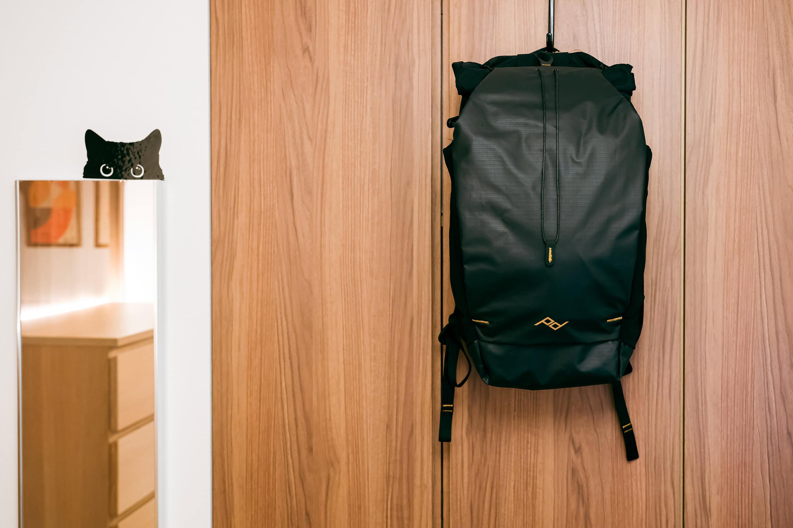
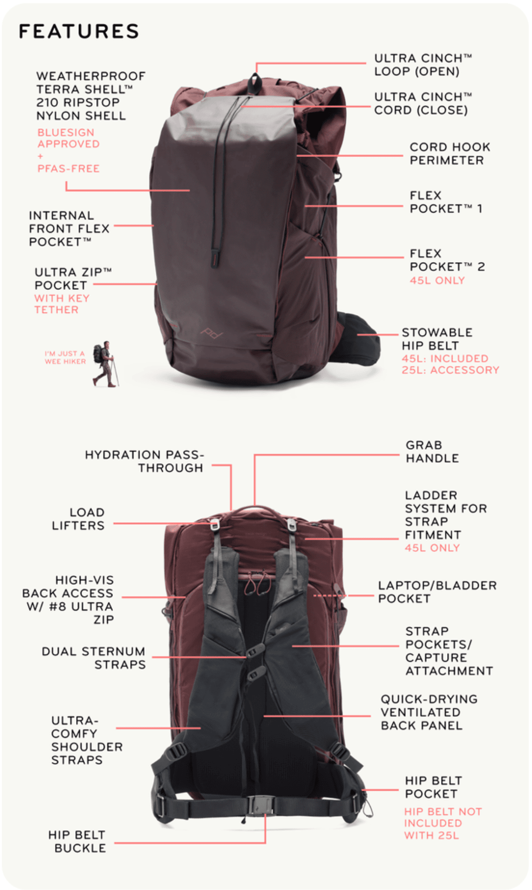
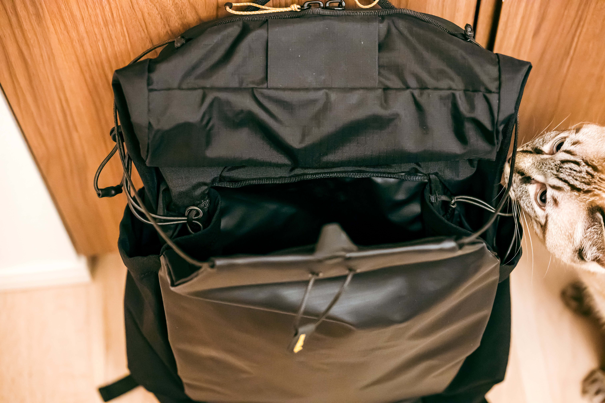
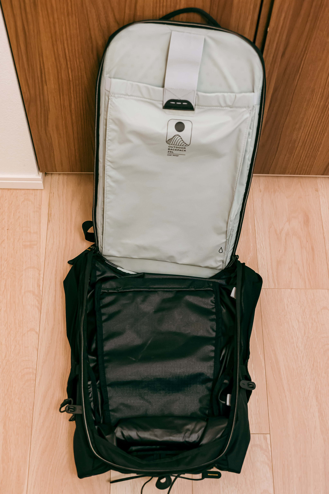
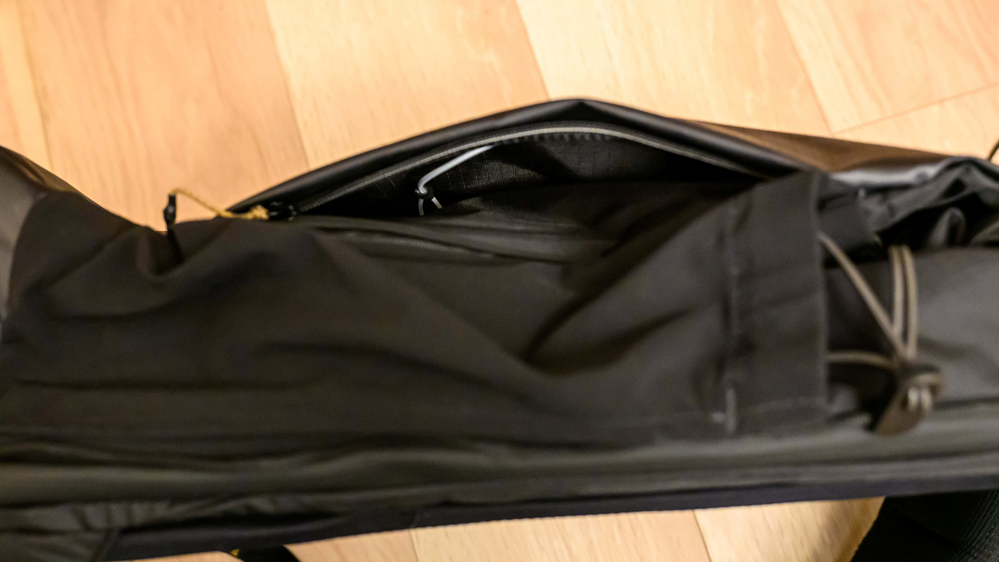
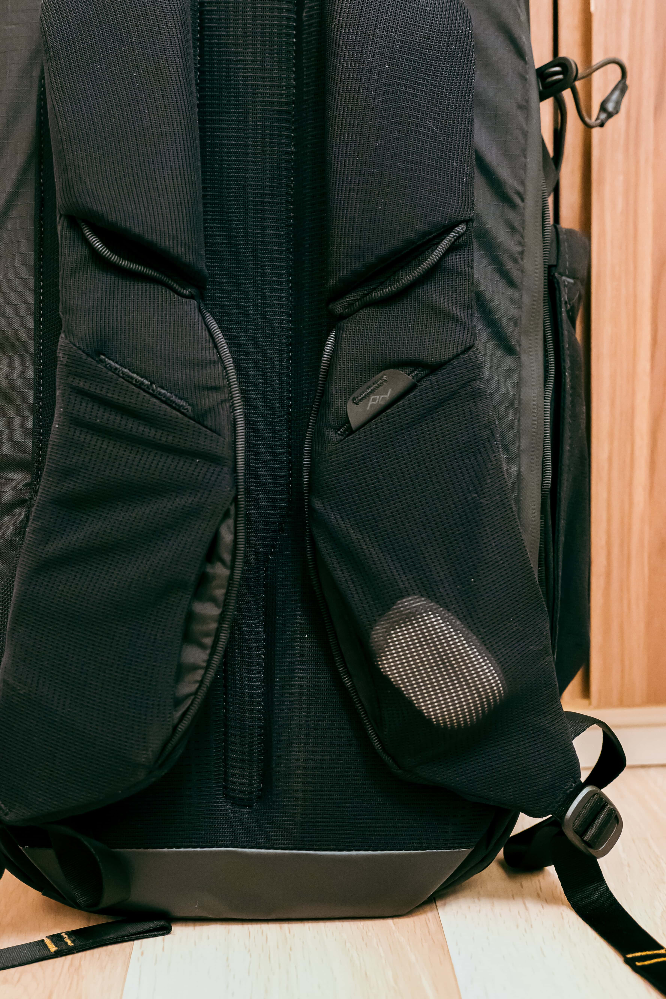

[WANDRD](https://www.wandrd.com/) Duo Daypack を今まで使っていたのですが、傷みが激しくなってきたので買い替えることにしました。25L前後で機能的だけどデザインもよいものを探していたところ、ちょうど Peak Design が [Outdoor Backpack](https://www.kickstarter.com/projects/peak-design/the-outdoor-line-by-peak-design) をKickstarterで募集していました。

デザインは好みだったものの細かいところが分からなかったのですが、[Peak Design Tokyo](https://www.peakdesign.com/en-jp/pages/tokyo-store) に試作品がすでに置いてあるとのことだったので見てきました。特に「どこに鍵束を入れられるか」が気になっていたのですが、正面のナイロンシェルの両側が大きなポケットになっており、真ん中は仕切られているため、鍵束を入れるにはちょうど良いサイズになっていました。ナイロンは硬めで、鍵束を入れても表面がでこぼこすることもないです。右側にはコードフックが入っているので、デザイナーもここに鍵束を入れることを想定していそうです。ただし、Cloud（白）は中のものがやや透けます。

使い勝手が良さそうなので、9月8日に199米ドル + 送料45米ドル = 244米ドル（37,204円）で Outdoor Backpack 25L を支援しました。予定価格より51米ドル引きでしたが送料が45米ドル掛かっているので、国内一般発売されたときの価格メリットはあまりなさそうでした。また、流通経路の違いから、支援者に個別配送するよりも先に市販が始まるかもしれないという事前説明もあり、価格も入手時期もメリットがないかもしれない状況での支援は悩みました。

結果としては11月15日に届き、米国では12月から一般発売されたものの日本ではまだ始まっておらず、価格も予告どおり250米ドルなものの、日本円では税抜き47,000円というだいぶ高い為替レートで設定されたので、安く早く買うことができました。

## 構造

特徴的な Ultra Cinch Cord でメイン収納とサブ収納を開閉しますが、Ultra Cinch Loop を引っ張るとアンロックされる構造になっており、ナイロンシェルを直接引っ張って開けることができないようになっているので、安全性が高いです。Ultra Cinch Loop を引きながらナイロンシェルを開けると、まずは8cmほどのマチで底まであるサブ収納にアクセスできます。財布やモバイルバッテリーなんかを入れておくのにちょうど良さそうです。また、満員電車で Ultra Cinch Cord をぶらぶらさせていると引っかけそうで怖いので、そういうときは隙間からこの収納に入れています。

メイン収納へのアクセスの仕方は2通りあります。まずは Ultra Cinch Cord を緩めて、折りたたまれて磁石で閉まっている真上を開けるとメイン収納にアクセスできます。服などを入れる時にはここからが良さそうです。背中側にはノートPCを入れられるポケットがあります。マチは3cmほどあるので、MacBook Pro だけでなく、iPadも一緒に入れられます。

もう一つのアクセス方法は、上記写真の上部に写っているベージュのひもがついたファスナーを開ける方法です。ノートPCを出し入れするだけならこちらのほうが簡単ですし、このファスナーを全開にすると3方向開くようになるので、ぎちぎちに詰めたいときや、下のものを取り出すときに便利です。

鍵束を入れておきやすそうなナイロンシェルの両サイドは、マチはないものの間口は広いです。私は鍵束と、反対側のポケットに社員証を入れています。

ストラップポケットにはiPhoneも入りますが、けっこうぎりぎりで出し入れの余裕はあまりありません。私はここにはiPhoneではなく、ワイヤレスイヤホンのケースを入れています。なお、胸ストラップは写真のように取り外せます。

詳しくは公式ビデオが参考になります。



## まとめ

今まで使っていた WANDRD Duo Daypack の代わりに、Peak Design Outdoor Backpack 25L を購入しました。Kickstarterで支援したものですが、一般発売より先に届き、為替レートの違いで割安な価格で入手することができました。

このバックパックには、Ultra Cinch Cord でメイン収納を開閉する特徴的な構造があり、安全性が高くなっています。メイン収納へのアクセス方法は2通りあり、ノートPCを入れるポケットも備わっているのが便利です。

ナイロンシェルの両サイドには鍵束を入れられるポケットがあり、使い勝手が良さそうです。ストラップポケットにはワイヤレスイヤホンのケースを入れています。機能性とデザイン性を兼ね備えた製品に満足しています。

|  |  |
| --- | --- |
| ブランド | [Peak Design](https://www.peakdesign.com/en-jp/) |
| 製品名 | [Outdoor Backpack 25L Black](https://www.peakdesign.com/en-jp/products/outdoor-backpack?Size=25L&Color=Black) |
| 購入場所 | [Kickstarter](https://www.kickstarter.com/projects/peak-design/the-outdoor-line-by-peak-design/description) |
| 購入価格 | 244米ドル（37,204円） |
| 購入日 | 2024-09-08 |
| 納品日 | 2024-11-15 |