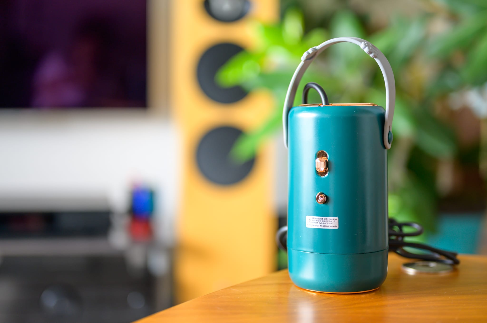

AliExpressにポータブル衣類乾燥機というものが売っていたので、グアム旅行に合わせて買ってみました。ホテルだと水着が翌朝までに乾かせず、ぐっしょりした冷たい水着を着る羽目にいつもなるので、その問題をこれで解決できるのではと考えました。また、出張時に下着などを自分で洗濯すると、自然乾燥だといつまで経ってもその辺に干しておかないといけないのが嫌だったので、その問題も解決できそうです。

いろいな店を見比べていると500Wモデルと400Wモデルがあるように思えますが、私のところには製品説明では500Wだったものの、パッケージには400Wと記載されているものが届きました。対応電圧はパッケージにも110V/220Vと記述がありますが、タイプA (JP / US) の電源コードには125Vと記述があるので、ユニバーサル電圧に対応しているわけではなく、「タイプA (JP / US) モデルは110V、タイプC (EU) モデルは220V」と考えたほうが良さそうです。タイプAの刃は2本で、日本でも使いやすいです。

2022年7月15日に注文して、7月21日に届きました。AliExpress Standard Shipping を選んだのですが、数字12桁の追跡番号で、中国側はCainiao、日本側はヤマト運輸の経路はとても速いです。

大きさは1.5Lペットボトルの高さを半分にしたくらいのサイズです。スーツケースで持っていくには少し大きいですが、重さは470gです。構造としてはヘアドライヤーと同じです。騒音もヘアドライヤーに近いので、けっこううるさいです。UVライト機能があるのですが、これを使うと風量が少し落ちます。

本体底に袋が内蔵されており、それの中に衣類を入れます。これによって温風を効率良く当てることができます。ただし、ちゃんとした衣類乾燥機と違って衣類が回転しないため、乾燥ムラがかなりあります。適宜手動で上下や畳み方などを替えたほうが良いです。また、衣類を入れれば入れるほど乾燥ムラがひどくなるので、袋にはシャツ2枚ほどが入りますが、1枚にしておいたほうが良いでしょう。男性の水着1枚で2時間、女性の水着1枚で4時間ほど掛かります。脱水が洗濯機と違って甘い状態で入れることになるので、その辺も時間が掛かる理由になっています。

そのため、自宅で常用する気にはなれませんが、ホテルで私の問題を解決するためには十分でした。水着は完全に乾かなくても、温風で暖まっているだけでもだいぶ快適です。出張時には、1日分の肌着 / 下着 / 靴下をまとめて入れておけば、日中の仕事中や夕食の外食時に乾かせているでしょう。価格に対してストレス軽減度が高いので、230Vのシンガポール出張用にタイプC (220V) モデルも購入しました。

|  |  |
| --- | --- |
| 製品名 | Portable Multi-Function Dryer |
| 型番 | RF168 |
| 販売店 | [Pavritam Fun Cleaning Store - AliExpress](https://www.aliexpress.us/item/3256803481431411.html?gatewayAdapt=glo2usa4itemAdapt&_randl_shipto=US) |
| 支払金額 | 25.24米ドル（3,370円） - AliExpressクーポン 6米ドル（800円）。送料無料 |
| 購入日 | 2022-07-15 |
| 納品日 | 2022-07-21 |