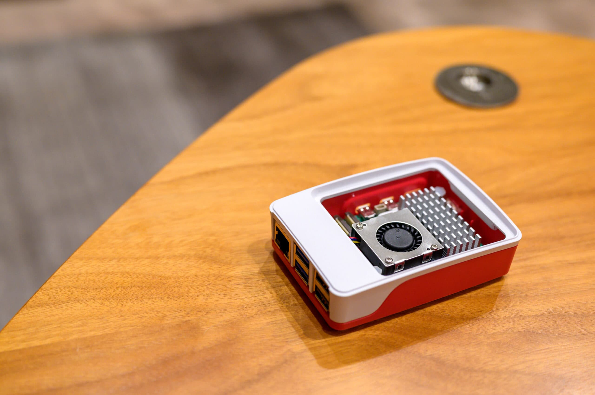

自宅では [Home Assistant](https://www.home-assistant.io/) とDNSサーバー用に [Raspberry Pi 4 Model B](https://www.raspberrypi.com/products/raspberry-pi-4-model-b/) を使っていたのですが、2から3倍の性能向上と [Raspberry 5](https://www.raspberrypi.com/products/raspberry-pi-5/) は言われていたので、思わず購入してしまいました。ラズパイ4で性能的に特に困っていたわけではないのですが。


また、合わせて [Raspberry Pi Case for Raspberry Pi 5](https://www.raspberrypi.com/products/raspberry-pi-5-case/) と [Raspberry Pi Active Cooler](https://www.raspberrypi.com/products/active-cooler/) も購入しました。[Raspberry Pi 4 Case](https://www.raspberrypi.com/products/raspberry-pi-4-case/) は密封度が高すぎるところが気になっていたのですが、Raspberry Pi Case for Raspberry Pi 5 では上部に1mmほど隙間が空くようになり、底部にもスリットが入りました。Raspberry Pi Case for Raspberry Pi 5 にもファンが付いているのですが、[最新版Raspberry Pi 5レビュー、ラズパイ4との違い - ラズパイスクール](https://raspi-school.com/raspberry-pi-5-review/) によると Raspberry Pi Active Cooler のほうがさらに10度近く下げられるようなので、こちらも購入しました。PWM対応なのでOSが入っていないと全開で回ってけっこううるさいですが、OSインストール後は室温27度で5,600rpm程度で無音です。


```
$ cat /sys/devices/platform/cooling_fan/hwmon/hwmon2/fan1_input  
5592  
$ echo "scale=3; $(cat /sys/class/thermal/thermal_zone0/temp) / 1000" | bc  
57.300
```


CPUがラズパイ4の 1.8GHz Quad-Core Arm Cortex-A72 からラズパイ5では2.4GHz Quad-Core Arm Cortex-A76 になった結果、Geekbench 6.2 の Single Core 比較で2.28倍、Multi Core 比較で2.22倍の性能 [1](#d388ea56-4f01-4c36-82f0-ab5cdff095e2) が出ています。Multi Core 1604 という結果は [MacBook Air (Mid 2017) の結果](https://browser.geekbench.com/macs/macbook-air-mid-2017)と同じくらいです。とは言え、ラズパイ5は本体と8GBメモリーだけで15,000円程度する一方、3.4GHz Quad-Core Intel N95 + 16GBメモリー + 500GB SSD + ケース + Windows 11のミニPCが2万円程度で買える [2](#33bfae1a-a1f6-4e37-b1b9-c63ec36a1d6d) ことを考えるとコストパフォーマンスは微妙です。


Amazon EC2 とラズパイでOSを共通化させたいため、私はラズパイにもUbuntuを使っています。しかし、Ubuntu 22.04 はラズパイ5に対応していないことに購入後に気づき、4月26日のUbuntu 24.04 のリリースを待ってからセットアップしました。[Zabbix](https://www.zabbix.com/jp/)が Ubunt 24.04 未対応だったのですが、3日後の4月29日に対応しました [3](#c840234f-4b95-4867-b301-819107c156d6)。また、二酸化炭素センサーの [mh-z19](https://github.com/UedaTakeyuki/mh-z19) Pythonライブラリが Raspberry Pi 5 に未対応だったのですが、[Issue](https://github.com/UedaTakeyuki/mh-z19/issues/53)を上げたら即座に対応してもらえました。


一時期は世界中で品切れになっていたラズパイですが、今はどこでも在庫があります。


|  |  |
| --- | --- |
| ブランド | [Raspberry Pi](https://www.raspberrypi.com/) |
| 製品名 | [Raspberry Pi 5](https://www.raspberrypi.com/products/raspberry-pi-5/) |
| 仕様 | 8GB |
| 購入店 | [Switch Science](https://www.switch-science.com/collections/raspberry-pi/products/9250) |
| 購入価格 | 15,290円 |
| 購入日 | 2024-02-27 |


|  |  |
| --- | --- |
| ブランド | [Raspberry Pi](https://www.raspberrypi.com/) |
| 製品名 | [Raspberry Pi Case for Raspberry Pi 5](https://www.raspberrypi.com/products/raspberry-pi-5-case/) |
| 購入店 | [Switch Science](https://www.switch-science.com/collections/raspberry-pi/products/9251) |
| 購入価格 | 1,672円 |
| 購入日 | 2024-02-27 |


|  |  |
| --- | --- |
| ブランド | [Raspberry Pi](https://www.raspberrypi.com/) |
| 製品名 | [Raspberry Pi Active Cooler](https://www.raspberrypi.com/products/active-cooler/) |
| 購入店 | [Switch Science](https://www.switch-science.com/collections/raspberry-pi/products/9253) |
| 購入価格 | 836円 |
| 購入日 | 2024-02-27 |