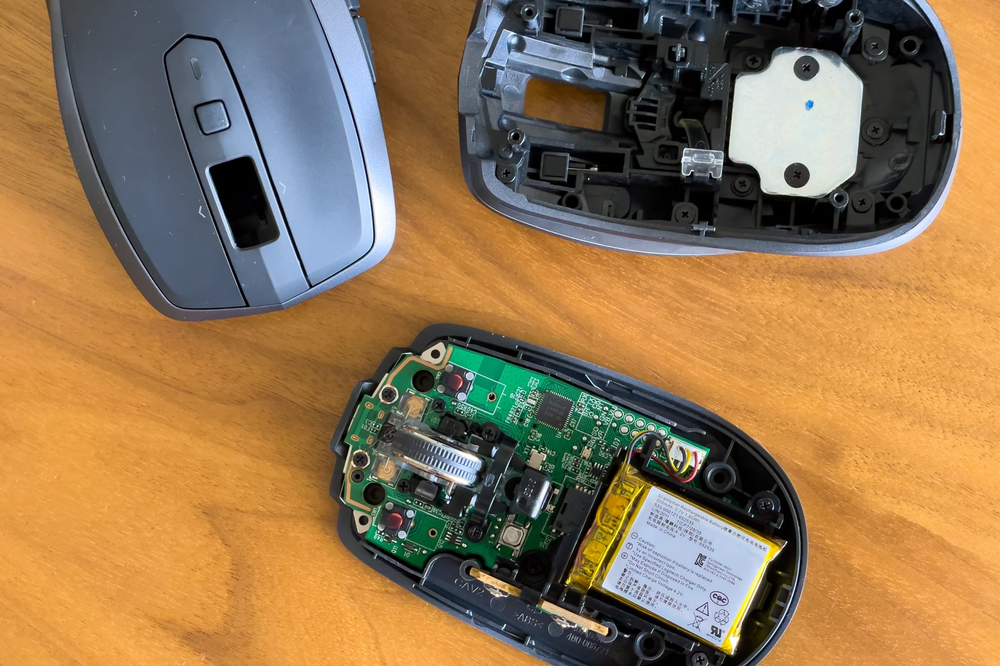
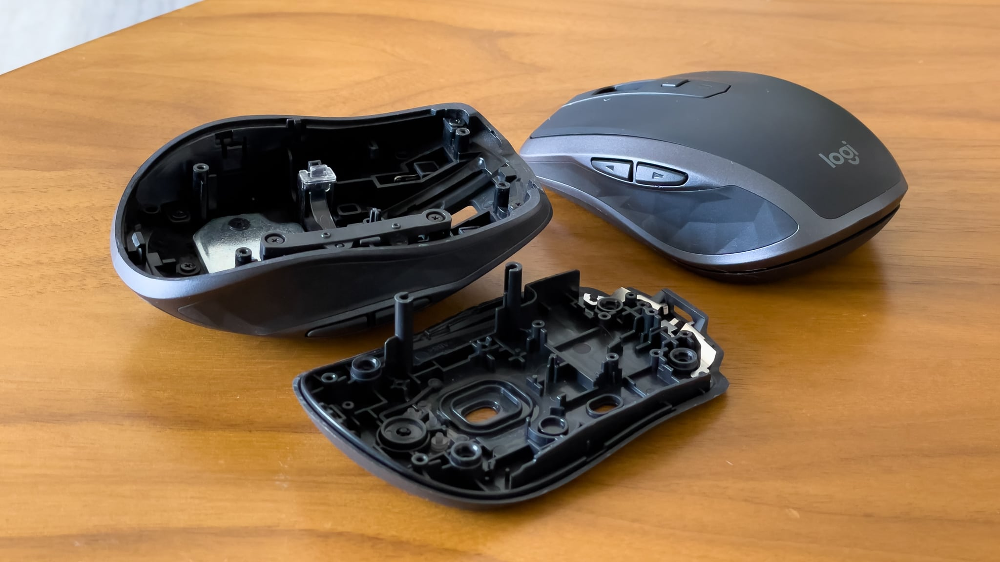
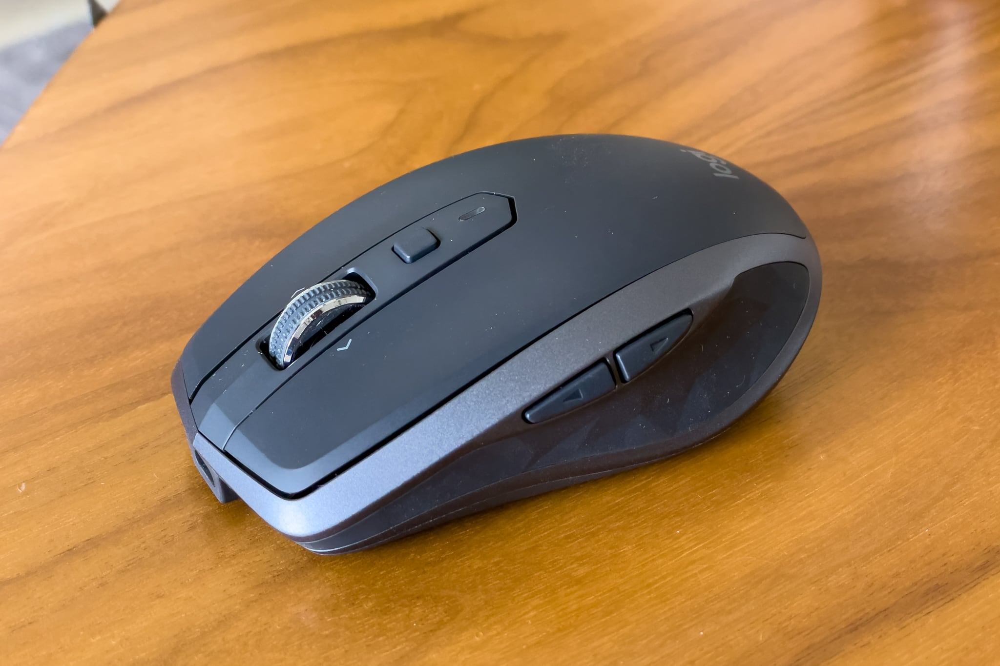

愛用している [Logicool MX Anywhere 2S](https://www.logitech.com/en-us/eol/mx-anywhere-2s-mouse.910-005132.html) のラバー部分が自宅用と会社用の2台とも加水分解してベトベトしてきました。アルコールで拭いたらベトベトした感じは取れたのでそのまま使っていたのですが、そこに触っている親指がヒリヒリ & ツルツルしてきて、そのまま使いつづけることが難しくなってきました。どうやらポリウレタンが加水分解すると酸とアルコールに分解されるようなので、おそらく酸の影響を受けているのでしょう。

しかし、後継機種の [MX Anywhere 3](https://www.logicool.co.jp/ja-jp/products/mice/mx-anywhere-3s.html) はホイールがチルトしない点で移行候補になりません。また、私の MX Anywhere 2S はクリックボタンを [Kailh Mute MINI 2 Pin Silent Micro Switch For Mouse](https://www.kailhswitch.com/micro-switches/mouse-micro-switches/mute-mini-2-pin-silent-micro-switch-for-mouse.html) に交換しているため、問題のない基盤部分はできれば交換したくありませんでした。

すると、なぜかAliExpressに外装だけ売っていたので、それを買って交換することにしました。

分解は、底面シールを剥がすと出てくるネジを4つ外すだけなので、5分もかかりません。下パーツは交換する必要性がなかったのと、元のパーツにはシリアル番号と技適マークが印刷されている一方、新しいほうにはなかったので、下パーツは交換しないことにしました。また、上パーツには重りが付いているので、これを外して軽量化しました。

外装交換後の Logicool MX Anywhere 2S

上パーツを交換しただけですが、見た目は新品のようになって、とても満足です。当然、ラバー部分も加水分解していません。また、この商品には新品の底面シールも付いてきたので、分解痕も残りませんでした。

今回の注文は AliExpress Standard Shipping 利用で10日で届きました。トラッキング番号がJPで始まり、国内伝票は [SINOTRANS AIR JAPAN](http://www.sinoair.co.jp/) が発送元で、佐川急便で届く経路は速くてとても良いです。

|  |  |
| --- | --- |
| 商品名 | Mouse Shell for Logitech MX Anywhere 2S |
| 販売店 | [Shop911263039 Store - AliExpress](https://s.click.aliexpress.com/e/_9iEohr) |
| 支払金額 | 1個あたり6.30米ドル + 送料合計6.21米ドル ※1個の場合の送料は4.95米ドル |
| 購入日 | 2022-04-22 |
| 納品日 | 2022-05-02 |