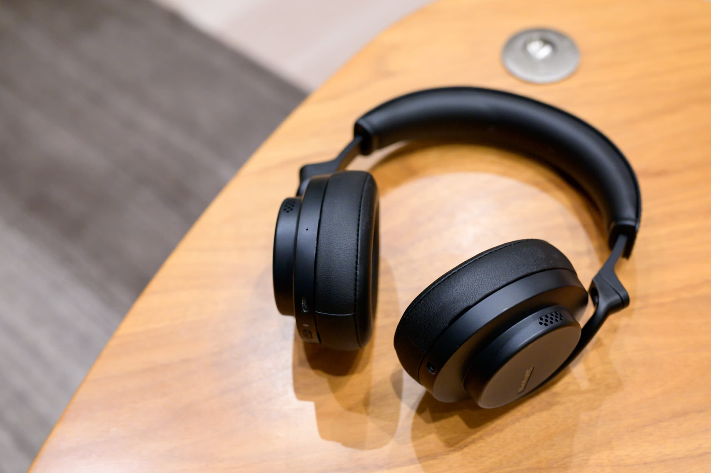

深夜に映画を見たり音楽を聴いたりするときには [Sony WH-1000XM2](https://www.sony.jp/headphone/products/WH-1000XM2/) を使っていたのですが、7年目に入ってイヤーパッドに無数のひび割れができ、ヘッドバンドも少し破れていて痛みが激しかったため、買い直すことにしました。

ここ最近はノイズキャンセリングBluetoothヘッドホンは [Shure AONIC 50 Gen 1](https://www.shure.com/ja-JP/products/headphones/aonic50-d) の評判が良く、弱点であったノイズキャンセリングの弱さなどを克服した [Shure AONIC 50 Gen 2](https://www.shure.com/ja-JP/products/headphones/aonic50) が2023年9月に発売されて注目です。一方で、価格が35,000円前後から55,000円前後に大幅に値上がりました。また、Sony WH-1000XM2 は折りたためるので飛行機に持ち込むことも可能でしたが、Shure AONIC 50 は折りたためず、ケースは付いているものだいぶ大きいため、折りたためる弟機である [Shure AONIC 40](https://www.shure.com/ja-JP/products/headphones/aonic40) も気になるところです。しかも2023年12月28日までは冬の大感謝祭で6,000円引きで20,000円前後になっていました。

この3機種を比較しにヨドバシカメラに行ってみました。Apple iPhone 15 Pro から Apple Music の『[そして僕は途方に暮れる / Shanti](https://music.apple.com/jp/album/%E3%81%9D%E3%81%97%E3%81%A6%E5%83%95%E3%81%AF%E9%80%94%E6%96%B9%E3%81%AB%E6%9A%AE%E3%82%8C%E3%82%8B/448265225?i=448265238)』をBluetooth経由で掛けてみると、Shure AONIC 50 Gen 2 が圧倒的に良いです。この曲のイントロは左耳側に寄っているのですが、50 Gen 1 と 50 Gen 2 は違和感なく「左側でギターが鳴っているな」という感じですが、Shure AONIC 40 は右側からまったく聞こえていないからか「ん？ 左からしか鳴ってない？」と違和感があります。そして、22秒目から右側でもギターが鳴り始めたときの解像度がまったく違い、50 Gen 1 / Gen 2 は非常に情報量が多いです。ギターの弦の動きまで感じられます。40と50の違いほどではないですが、50 Gen 1 と 50 Gen 2 では 50 Gen 2 のほうがやや解像度が高いです。『[Lovin’ You / Shanti](https://music.apple.com/jp/album/lovin-you/495911378?i=495911388)』や『[Can’t Take My Eyes Off You (JAM ver.) / Shanti](https://music.apple.com/jp/album/cant-take-my-eyes-off-you-jam-ver/495911378?i=495911632)』を聞いてもギターの表現力が Shure AONIC 50 Gen 2 は素晴らしいです。

ついでに [Sony WH-1000XM5](https://www.sony.jp/headphone/products/WH-1000XM5/) も試聴してみましたが、Shure AONIC 40 と同じような雰囲気で、同一価格帯の Shure AONIC 50 Gen 2 のほうが音質は優れています。ただ、[Sony Headphones Connect](https://www.sony.jp/headphone/special/hpc/) によって静止中なのか歩行中なのか電車の中なのかや、自宅なのか会社なのかを自動認識してノイズキャンセリングの外音取り込み量を調整してくれる機能は [Sony WF-1000XM4](https://www.sony.jp/headphone/products/WF-1000XM4/) で使っていて非常に便利なので、外出中に使用するならWH-1000XM5が魅力的だったかもしれません。また、Shure AONIC 50 Gen 2 は人間の声はあまりキャンセルしない傾向があるのと、外音取り込みモードの外音にかなり違和感があります。しかし、最近は外出中は Sony WF-1000XM4 しか使っていないので、オーバーイヤーヘッドホンは自宅専用と考えると Shure AONIC 50 Gen 2 で決めました。

Shantiのギターだけで決めてしまいましたが、自宅に帰ってUSB接続で Hi-Res Lossless で配信されている Apple Music の『[I Love You / Bei Xu](https://music.apple.com/jp/album/i-love-you/1491608428?i=1491608431)』を聞いてみました。Shure AONIC 50 Gen 2 はUSB接続すると最大 32 bit / 384 kHz のハイレゾに対応しています。この曲のハイハットとピアノの表現力も素晴らしいです。Bluetooth接続時とUSB接続時で比べるとUSB接続のほうが若干繊細ですが、それよりも [ShurePlus PLAY](https://www.shure.com/ja-JP/products/software/shure_plus_play) によるイコライザーと空間オーディオが効かない違いが大きいです。空間オーディオはピュアオーディオ感が薄まって、ややウォームになりますが、音場がかなり広がります。また、USB接続の場合はノイズキャンセリングを有効にできません。

|  |  |
| --- | --- |
| ブランド | [Shure](https://www.shure.com/ja-JP) |
| 製品名 | [AONIC 50 Gen 2](https://www.shure.com/ja-JP/products/headphones/aonic50) |
| 型番 | SBH50G2-BK-J |
| 販売店 | [ヨドバシカメラ マルチメディア新宿東口](https://www.yodobashi.com/ec/store/0013/) |
| 購入価格 | 55,000円（-5,500円相当ポイント還元） |
| 購入日 | 2023-12-28 |