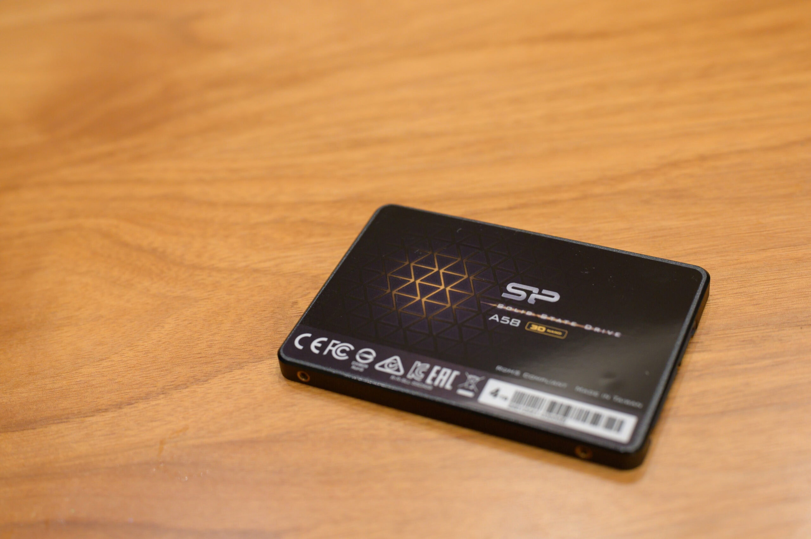
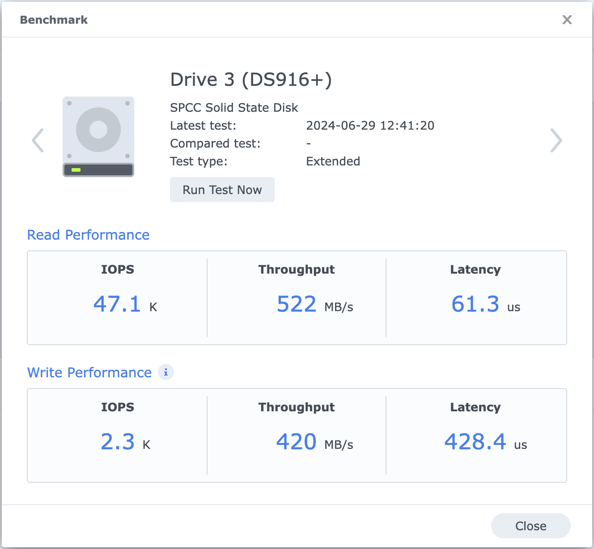

[Synology](https://www.synology.com/ja-jp) DiskStation DS916+ の Time Machine 用のハードディスクを 2TB SSD、[CFD MGAX CSSD-S6L2TMGAX](https://www.cfd.co.jp/consumer/product/detail/cssd-s6l2tmgax.html) に交換したらメインのハードディスクもSSDに交換して完全無音化したくなりました。再び CFD MGAX でも良かったのですが、MGAXには4TBがラインナップされていなかったので、[Silicon Power Ace A58 SP004TBSS3A58A25](https://www.silicon-power.com/web/jp/product-A58) を購入しました。

[TEMP DISABLED]

メインとはいえ、それほどアクセス頻度は高くないため、遅くても構わないので、できるだけ安く、信頼もそこそこレベルで構わないということで、こちらを選びました。DS916+はそのままでは2.5インチが取り付けられなかったので、[裸族のインナー V2 (CRIN2535V2)](https://www.century.co.jp/products/crin2535v2.html) で3.5インチに変換しました。裸族のインナー V2 は金属製で前後が大きく開いているのが放熱に有利そうです。

DS916+からベンチマークが取れたので取ってみました。スループットはSATA3の限界の600MB/s近く出ていて、CFD CSSD-S6L2TMGAX の2倍ほど出ているのですが、CSSD-S6L2TMGAX と比べると IOPS Write Performance が半分の2.3kしか出ていないところが少し気になります。

|  |  |
| --- | --- |
| ブランド | [Silicon Power](https://www.silicon-power.com/web/jp/) |
| 製品名 | [Ace A58 SP004TBSS3A58A25](https://www.silicon-power.com/web/jp/product-A58) |
| 購入店 | [Amazon](https://amzn.to/3X2wZHN) |
| 購入価格 | 34,480円（- 340円相当ポイント還元） |
| 購入日 | 2024-06-28 |

|  |  |
| --- | --- |
| ブランド | [Century](https://www.century.co.jp/) |
| 製品名 | [裸族のインナー V2 (CRIN2535V2)](https://www.century.co.jp/products/crin2535v2.html) |
| 購入店 | [ヨドバシカメラ](https://www.yodobashi.com/product/100000001007531949/) |
| 購入価格 | 1,480円（- 148円相当ポイント還元） |
| 購入日 | 2024-06-28 |