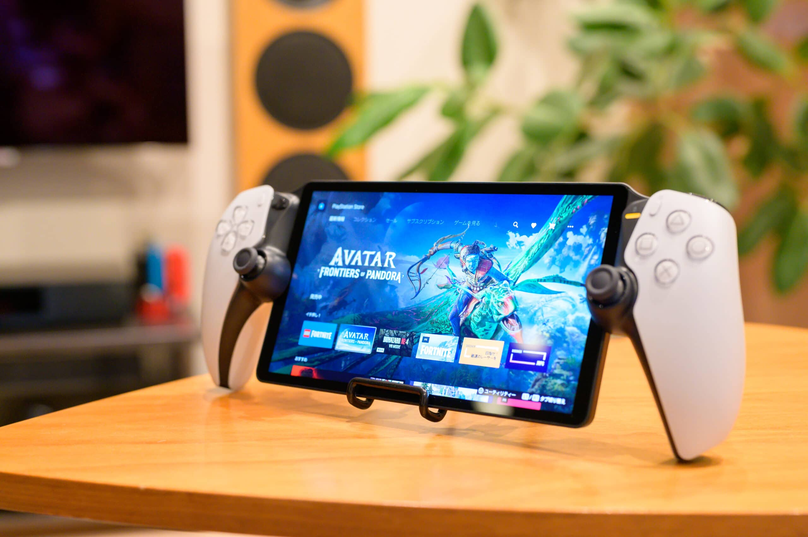

Nintendo Switch にあって Sony PlayStation 5 になかった魅力の一つは、ベッドでごろごろしながらプレイできないことでしょう。それを解決するのが Sony PlayStation Portal Remote Player です。一見、Sony PlayStation 5 のポータブル版にも見えますが、PlayStation 5 にリモートアクセスする周辺機器で、PlayStation 5 が別途必要です。Nintendo Switch が32,978円なのに、リモートアクセスするだけで29,981円するのはどうなんだという気が多少しましたが、[DualSense Wireless Controller](https://www.playstation.com/ja-jp/accessories/dualsense-wireless-controller/) が7,780円、[DualSense Edge Wireless Controller](https://www.playstation.com/ja-jp/accessories/dualsense-edge-wireless-controller/) なんか29,981円もすることを考えると、なんだか高くない気がしてきまして予約しました。転売ヤーの餌食になって、欲しいと思ったときには手に入らないでしょうし。

発売日に届いたので触ってみると、PlayStation 5 と同じLAN内からプレイする分にはまったくリモートアクセスであることを感じさせず、とても快適です。PlayStation 5 がスリープの状態の時からだとゲーム開始までに1分程度掛かるくらいでしょうか。15 Mbps 以上のダウンロード速度が出ればインターネット経由でも、レスポンスに厳しくないゲームであれば違和感なくプレイできます。1時間当たりの通信量は 3 GB 程度なので、テザリングでプレイする場合は注意が必要です。

Nintendo Switch 有機ELモデル が720pの7インチディスプレイなのに対して PlayStation Portal は1080pの8インチディスプレイで、Nintendo Switch より一回り大きいです。重量は Nintendo Switch の420gに対して PlayStation Portal は530gでやや重いのですが、Nintedo Swtich よりコントローラー部がしっかりしているので、あまり重さは感じません。コントローラーが完全にDualSenseなところが [Backbone One](https://playbackbone.com/jp/products/backbone-one-usb-c-playstation/) より優れているところです。

スピーカーの音質はあまり良くないのでヘッドフォンを使いところですが、Bluetoothには非対応で PlayStation Link に対応した [Sony PULSE Elite Wireless Headset](https://www.playstation.com/ja-jp/accessories/pulse-elite-wireless-headset/) などしか無線で接続できません。PlayStation Portal にはUSB-Cポートがあるものの充電専用で、[Steel Series Arctis 7P](https://jp.steelseries.com/gaming-headsets/arctis-7p) のトランスミッターを接続してみましたが認識しませんでした。PlayStation Postal のためだけに PlayStation Link に対応したヘッドフォンを買う気になれないので、ひとまずは [Sony WH-1000XM2](https://www.sony.jp/headphone/products/WH-1000XM2/) にステレオミニケーブルをつないで使いたいと思います。また、このUSB-Cポートは USB PD 非対応で、5V/3A (15W) までしか対応していませんし、充電しながらはプレイできません。製品特性上、もう少し早く充電できてほしいのですが。

Nintendo Switch のDockのようなものがないので置き場所に困りますが、[ダイソー スマートフォンスタンド](https://jp.daisonet.com/products/4947678025729) で立てることはできました。大きいので外出時に持っていくか怪しいですが、家の中でむき出しで置いておくには画面が大きくて不安なので、AliExpressでキャリングケースを購入しました。

|  |  |
| --- | --- |
| ブランド | [Sony](https://www.sony.jp/) |
| 製品名 | [PlayStation Portal Remote Player](https://www.playstation.com/ja-jp/accessories/playstation-portal-remote-player/) |
| 型番 | CFIJ-18000 |
| 購入店 | [Amazon](https://amzn.to/3SO7s3f) |
| 価格 | 29,981円 |
| 予約日 | 2023-09-29 |
| 納品日 | 2023-11-15 |

|  |  |
| --- | --- |
| 製品名 | Carrying Case for PS Portal Console |
| 購入店 | [an Illustion - AliExpress](https://s.click.aliexpress.com/e/_DDdkE3L) |
| 価格 | 1,611円 |
| 購入日 | 2023-11-24 |