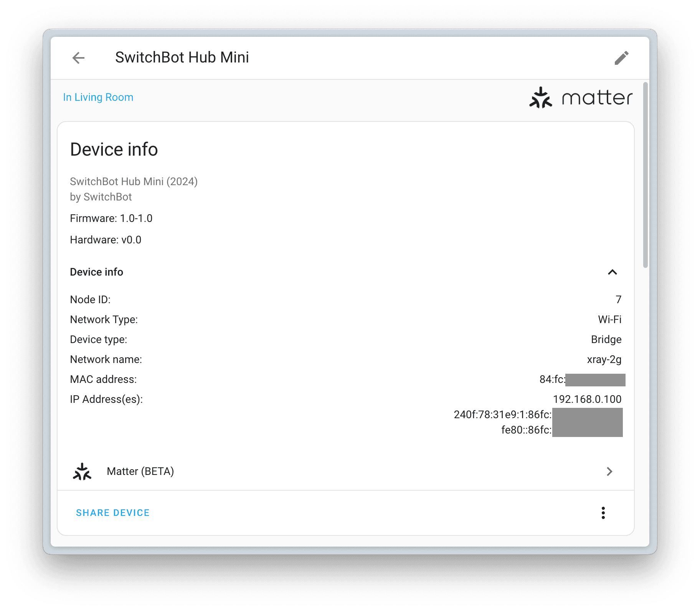
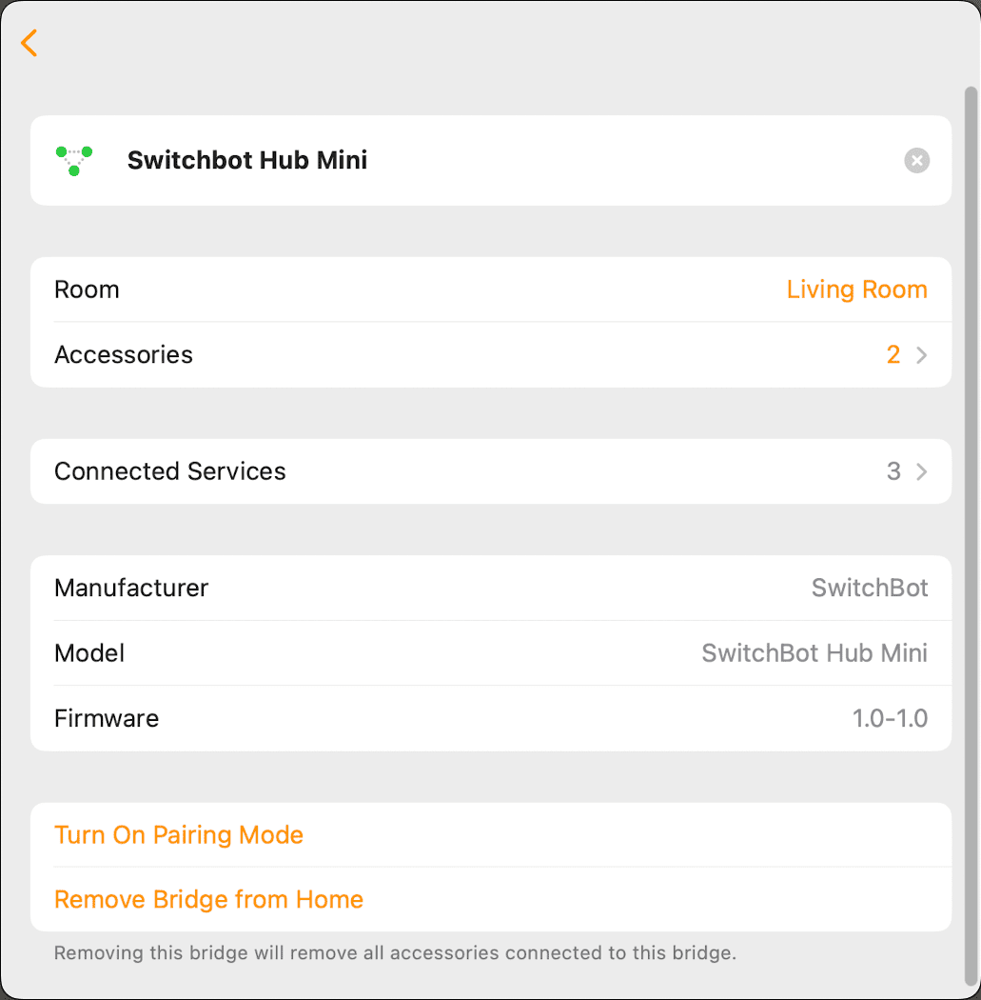

リビングの調光機能付きLEDダウンライトは Home Assistant → [Nature Remo](https://shop.nature.global/collections/nature-remo) mini → [Panasonic ワイド21 とったらリモコン（調光タイプ）](https://www2.panasonic.biz/jp/densetsu/haisen/switch_concent/cosmo_wide21/lineup/switch/dimmer/)経由で操作していたのですが、[Nature Remo Custom Integration](https://github.com/yutoyazaki/hass-nature-remo) が3年以上更新されていないことと、Matter Controller である [Open Home Foundation Matter Server](https://github.com/home-assistant-libs/python-matter-server) をラズパイに立ち上げたこともあって [SwitchBot Hub Mini Matter Enabled](https://www.switchbot.jp/products/switchbot-hub-mini-matter) に入れ替えました。この製品は Matter Bridge として動作し、Bluetoothで接続しているSwitchBotデバイスや赤外線通信デバイスを Mater Fabric に入れられるようにします。

SwitchBot Hub Mini Matter Enabled は最大4台のデバイスを変換でき、すでに持っている [SwitchBot Hub 2](https://www.switchbot.jp/products/switchbot-hub2) が6台のデバイスを変換できるので、合計10台のデバイスをMatter対応させることができるようになりました。一方、[Nature Remo nano](https://shop.nature.global/products/nature-remo-nano) は3台のデバイスしか変換できず、[Nature Remo Lapis](https://shop.nature.global/products/nature-remo-lapis) は20台を変換できるものの高額でした。

## 設置

プラスチックの質感が安っぽかったり、Matterのシールが見えるところに貼ってあるのが気になりますが、目立たないところに設置するので許容範囲とします。

[ELECOM USB2.0ケーブル 0.15m MPA-AC01NWH](https://www.elecom.co.jp/products/MPA-AC01NWH.html) と余っていた Apple 5W USB電源アダプター でコンパクトに収めました。SwitchBot Hub Mini Matter Enabled は画びょうでぶら下げているだけだとUSBケーブルに引っ張られて傾いてしまうので、[KOKUYO ひっつき虫](https://www.kokuyo-st.co.jp/stationery/hittsuki/) でも貼っています。

[SwitchBot Hub Mini 壁掛けホルダー](https://amzn.to/3DyFcMw) というのもあります。当時はMatter非対応のMicro-B版にしか対応してなかったのですが、今ではMatter対応のUSB-C版にも対応しているようです。

## Matterの設定

一点注意なのは、「リモコンのボタン学習」で登録した赤外線デバイスはMatterサブデバイスとして登録できないことです [1](#117f337b-d644-4594-ab3c-766a89a09844)。私はODELICのシーリングファンをリモコンのボタン学習させていたので登録できなかったのですが、赤外線リモコンのタイプを扇風機ではなくその他にすることでMatterサブデバイスとして登録できるようになりました。

これによって、[Home Assistant モバイルアプリ](https://apps.apple.com/jp/app/home-assistant/id1099568401)のSettings > Devices & services > Add Integration > Add Matter deviceから SwitchBot Hub Mini Matter Enabled を追加すると、自動的にサブデバイスも見えるようになります。

Apple TV などの Matter Controller になれる製品 [2](#5162510d-4ddb-43cb-996d-595b19f0fb44) や iOS 18 以降 [3](#6b49eefe-a1ec-46c7-ba69-4bab177e25eb) が あれば Apple Home からも同時に制御できるようになります。

|  |  |
| --- | --- |
| ブランド | [SwitchBot](https://www.switchbot.jp/) |
| 製品名 | [Hub Mini Matter Enabled](https://www.switchbot.jp/products/switchbot-hub-mini-matter) |
| 購入場所 | [Amazon](https://amzn.to/4gtspJV) |
| 購入価格 | 4,780円 |
| 購入日 | 2024-07-11 |
