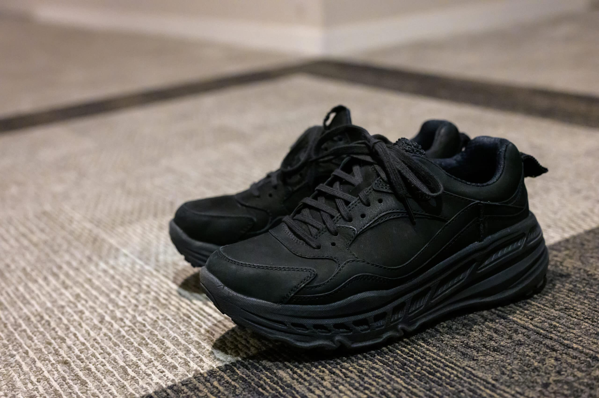

[UGG](https://www.ugg.com/jp/)というとレディースのムートンブーツの印象しかなかったのですが、CA805というスニーカーはメンズサイズも出していることに気づきました。メンズではあまり見ない厚さのチャンキーソール（厚底ソール）が良さげな一方、Webで見ている感じではコロンと丸みがあってレディース感が強い気もします。そんなわけで原宿の UGG Tokyo Flagship に実物を見にいくことにしました。UGGは LUMINE EST や伊勢丹新宿店にも入っていますが、メンズの取扱いがありません。UGG Tokyo Flagship もほとんど女性客ばかりですが。

履いてみるとワイドパンツとの相性がとても良くて気に入りました。ただ、UGG Tokyo Flagship にあった、やや光沢感のある23FWモデルの Black / Black Lether 1149690-bblt よりも、ヌバックレザーを使った[atmos](https://www.atmos-tokyo.com/)限定23SSモデルの Black 119850-blk のほうが好みで、セールで安くなっていたこともあって119850-blkのほうを購入しました。

チャンキーソールですが重くもなく、ソールの柔らかさが絶妙で、とても歩きやすいです。しかもさらに2cmほどのインソールを入れても履き心地が悪くならず、5.7cmのアウトソールと合わせると8cm近くになります。私の持っている靴の中で一番手が伸びるのは今はこれです。私はNikeなら26.5cm、New Balance なら26.0cmを履きますが、これは26.0cmでちょうど良かったです。

|  |  |
| --- | --- |
| ブランド | [UGG](https://www.ugg.com/jp/) |
| 製品名 | CA805 |
| 型番 | 119850-blk |
| 販売店 | atmos - ZOZOTOWN Yahoo!店 - Yahoo!ショッピング |
| 購入価格 | 19,360円（-3,012相当ポイント還元） |
| 購入日 | 2023-10-08 |