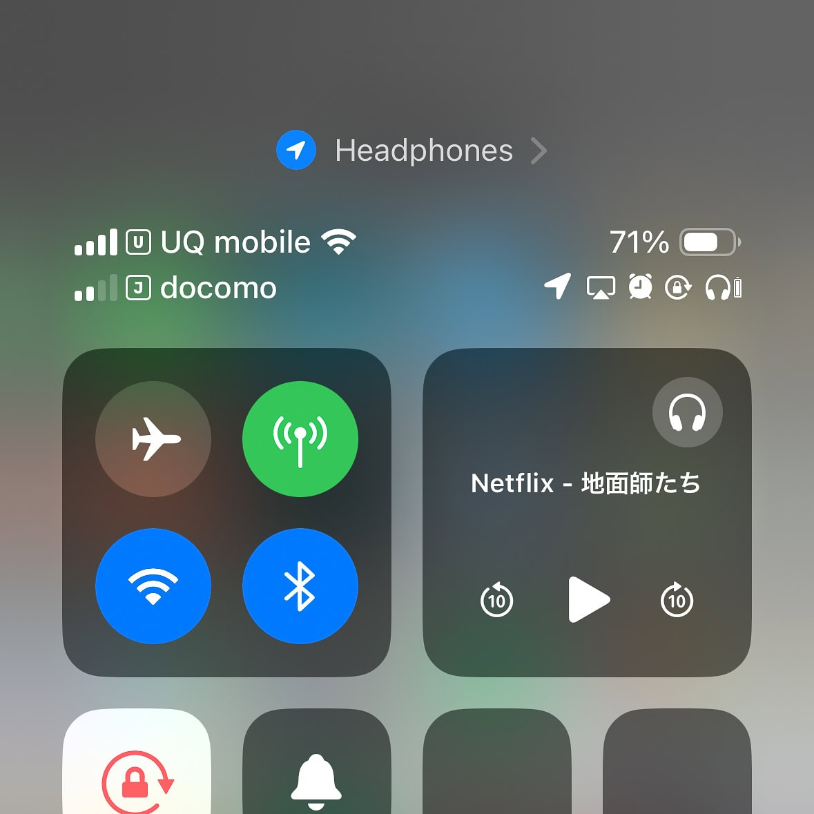
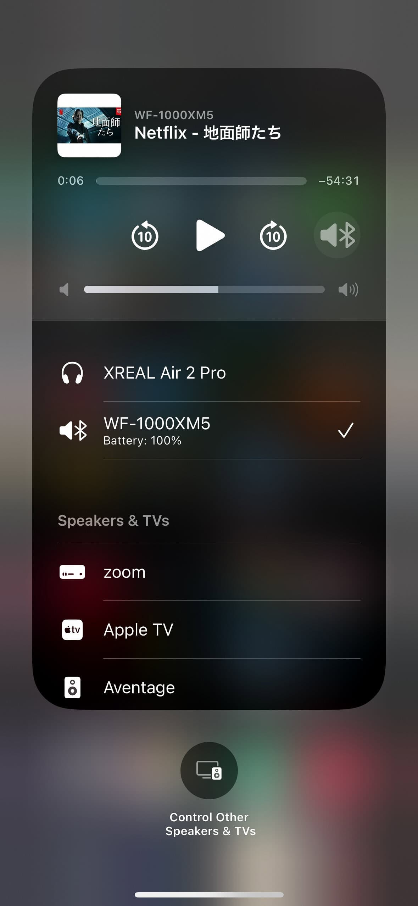

[XREAL Air](https://www.xreal.com/jp/air/)（旧: Nreal Air）は現実世界の空中に大画面のスクリーンを表示することができるXRグラスで、飛行機の中でも大画面が楽しめる点や、どんな体勢でも常に画面が正面にある点から気に入っていました。また、ジムでバイクをこぐときや、ベッドに寝っ転がりながら大画面で見たいときにも便利でした。



そんなときに発表されたのが [XREAL Air 2 Pro](https://www.xreal.com/jp/air2) です。XREAL Air 2 と XREAL Air 2 Pro の違いはエレクトロクロミック調光によってグラスの透け具合をボタンで変更できるかどうかだけなのですが、この機能がどうしても欲しくて、Amazonでセールになっているタイミングで XREAL Air から XREAL Air 2 Pro に買い替えました。

## エレクトロクロミック調光

エレクトロクロミック調光がない XREAL Air を使っていたときは、明るい環境では透けすぎて映像に集中できず、付属のシェードを付けていました。シェードを付けると透過度は0%になるのですが、0%になると操作する際のiPhoneの画面が見えず、下のすき間から無理矢理のぞいたり、XREAL Air を持ち上げる必要がありました。

一方、XREAL Air 2 Pro のエレクトロクロミック調光では、iPhoneを操作するときは透過度100%、やや暗い環境では35%、明るい環境では0%に簡単に変えられるようになったため、操作性と映像への集中度が向上しました。

ただし、明るい環境ではグラスの下や横から光が入ってくるので、視界が完全に真っ暗になるわけではありません。XREAL Air 2 Pro 付属のシェードは XREAL Air のものよりも下からの遮光ができるようになっているのですが、それでもVRヘッドセットのような密閉型には全く及びません。

## オーディオの向上

第2世代音響システムと呼ばれるものになり、XREAL Air に比べて XREAL Air 2 Pro はオーディオの質が向上しました。迫力が必要な映像は引き続きイヤフォンを併用したほうが良いですが、ドラマくらいであれば内蔵オーディオで十分な印象です。

iOSのインターフェースが分かりづらいのですが、映像はXREAL Air 2 Pro 、音声はBluetoothという接続も可能です。XREA Air 2 Pro をつなぐと[コントロールセンター](https://support.apple.com/ja-jp/HT202769)のメディアコントロールの右上にヘッドフォンのピクトが出るので、それを押すと音声出力先を XREAL Air 2 Pro からBluetoothヘッドフォンなどに変更することができます。

## 映像について

スクリーンとの距離感がよく分からないので、仕様の「4m先に130インチ」というはなんとも言えません。2m先の60インチにも見えますし、1m先の27インチにも見えます。端から端まで見るには目を動かさないと見えないような映像に包まれている感じではなく、正面を見た視界に収まる範囲のサイズです。実用途ではこれ上大きくても見づらいと思いますが、[XREAL Beam](https://www.xreal.com/jp/beam) があれば約3倍に大きくすることができます。

解像度は1920×1080ですが、精細感は高く、字幕も全く問題なく読めます。色かぶりはなく、カラーバランスは良いです。ただ、暗いシーンでのトーンジャンプ (Banding) [1](#0daad9a7-bcb7-410a-aaef-728f571f39ea) が気になります。

## 接続方法

私の Apple iPhone 15 Pro は DisplayPort over USB Type-C (DP USB-C)  に対応しているので、XREAL Air 2 Pro を直接挿すだけで見られます。LightningであるiPhoneの場合は 、[XREAL Adapter](https://www.xreal.com/jp/adapter) と [Apple Lightning - Digital AVアダプタ](https://www.apple.com/jp/shop/product/MW2P3AM/A/lightning-digital-av%E3%82%A2%E3%83%80%E3%83%97%E3%82%BF) の二つのアダプターを組み合わせて、Lightning → HDMI → DP USB-C と変換する必要があります。XREAL Air 2 Pro はUSB-Cから受電するもののHDMIは給電できないため、XREAL Adapter はバッテリーを積んでいます。少し重くはなりますが、iPhone自体のバッテリーを消費しないというメリットもあります。ゲーム機などをHDMI接続したい場合も XREAL Adapter が必要になります。

## 視力調整

裸眼では視界がぼやける人は XREAL Air 2 Pro も同様なので、[JUN GINZA](https://junginza.com/xreal) で度付きインサートレンズを作る必要があります。XREAL Air と XREAL Air 2 でインサートレンズは互換性があり、私は XREAL Air で使っていたものをそのまま使っています。私は右-5.5 / 左-4.75で、JUN GINZA の推奨は超薄型ですが、レンズが小さいため薄型でも最厚部でも3mm程度しかなく、薄型で十分でした。

なお、競合製品の [VITURE Pro](https://store.viture.jp/products/viture-pro-xr-glasses) だと-5.0までは本体だけで調整可能なので、次期 XREAL Air もこの機能を付けてほしいものです。価格もそうなのですが、度付きインサートレンズを作るのはけっこう手間なので。

## まとめ

XREAL Air から XREAL Air 2 Pro に買い替えました。エレクトロクロミック調光機能により、グラスの透過度を簡単に調整できるようになり、操作性と映像への集中度が向上しました。オーディオ品質も向上し、ドラマ視聴程度であれば内蔵スピーカーで十分です。

映像は1920×1080の解像度で精細感が高く、カラーバランスも良好ですが、暗いシーンでのトーンジャンプが気になりました。Apple iPhone15 Pro は DP USB-C 対応のため直接接続可能ですが、Lightning端子の場合は変換アダプターが必要になります。視力調整が必要な場合は、JUN GINZA で度付きインサートレンズを作成する必要があります。


|  |  |
| --- | --- |
| ブランド | [XREAL](https://www.xreal.com/jp/) |
| 製品名 | [XREAL Air 2 Pro](https://www.xreal.com/jp/air2) |
| 販売店 | [Amazon](https://amzn.to/3XL4Oxz) |
| 購入金額 | 52,680円 |
| 購入日 | 2024-07-11 |
