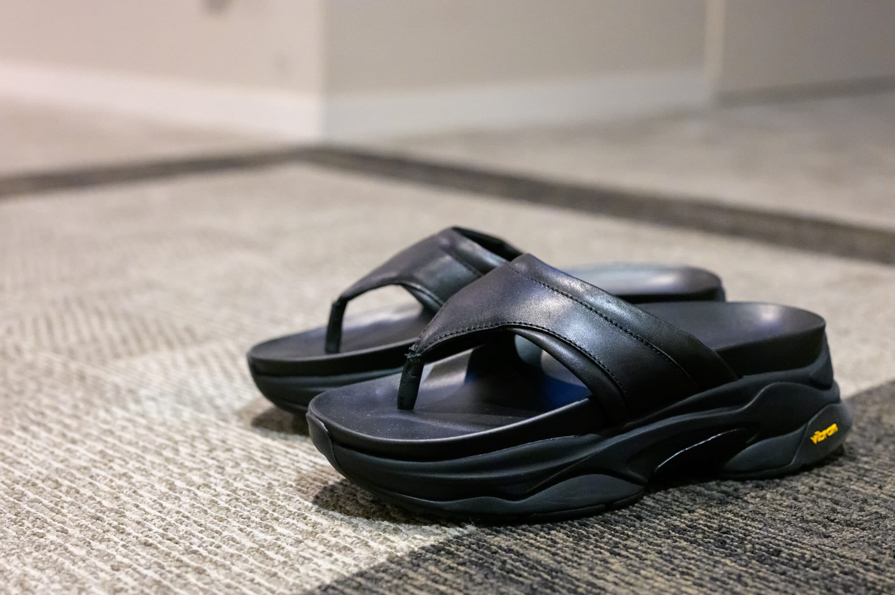

最近は厚底のスニーカーばかり履いているので、サンダルも厚底のもが欲しくなり購入したのが ZARA VIBRAM Leather Sandal です。

最近のZARAはVIBRAMソールを使ったスニーカーをたくさんリリースしていますが、こちらもその流れです。厚みはあるものの土踏まずのところが絞られているので、ぼってりした見た目になっていません。また、ZARAの合皮の見た目はあまり好きではないのですが、高級感はないものの、一応こちらは本革です。

私はNikeなら26.5cm、New Balance なら26.0cmを履きますが、これは40 (25.8cm) でちょうど良かったです。

|  |  |
| --- | --- |
| ブランド | [ZARA](https://www.zara.com/jp/) |
| 製品名 | ZARA VIBRAM Leather Sandal |
| 型番 | 2780/320 |
| 購入店 | ZARA Tokyo-Shinjuku |
| 購入価格 | 16,990円 |
| 購入日 | 2024-04-30 |