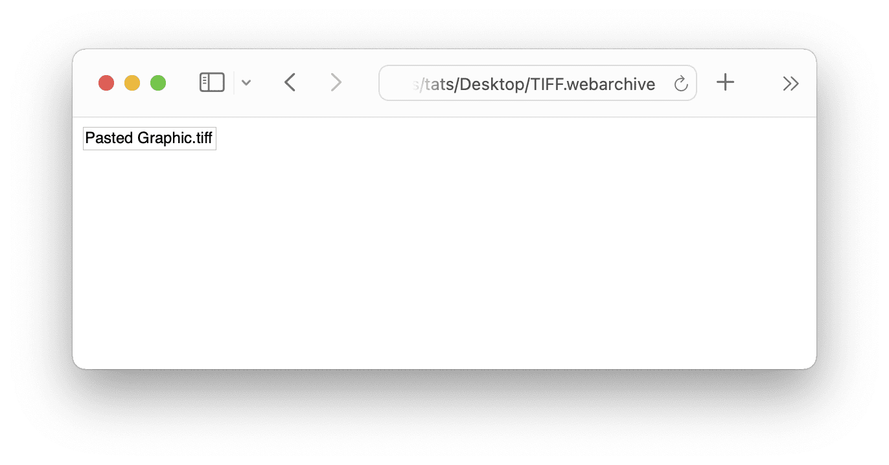
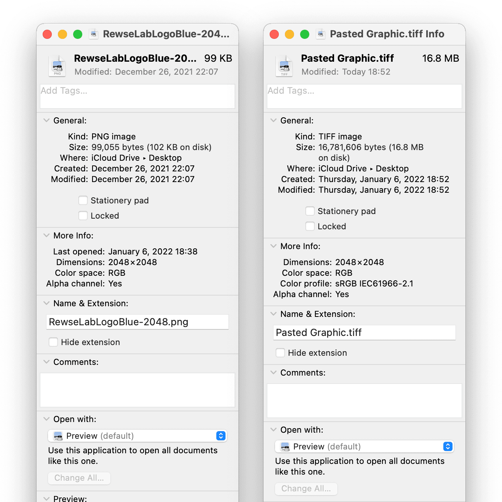
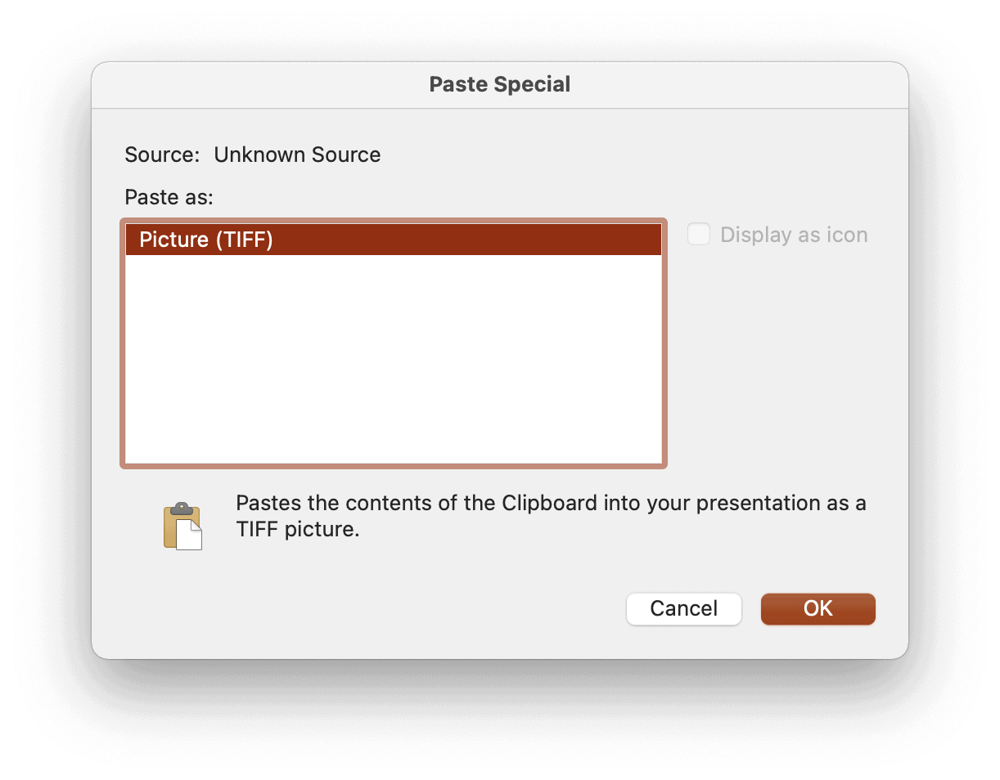
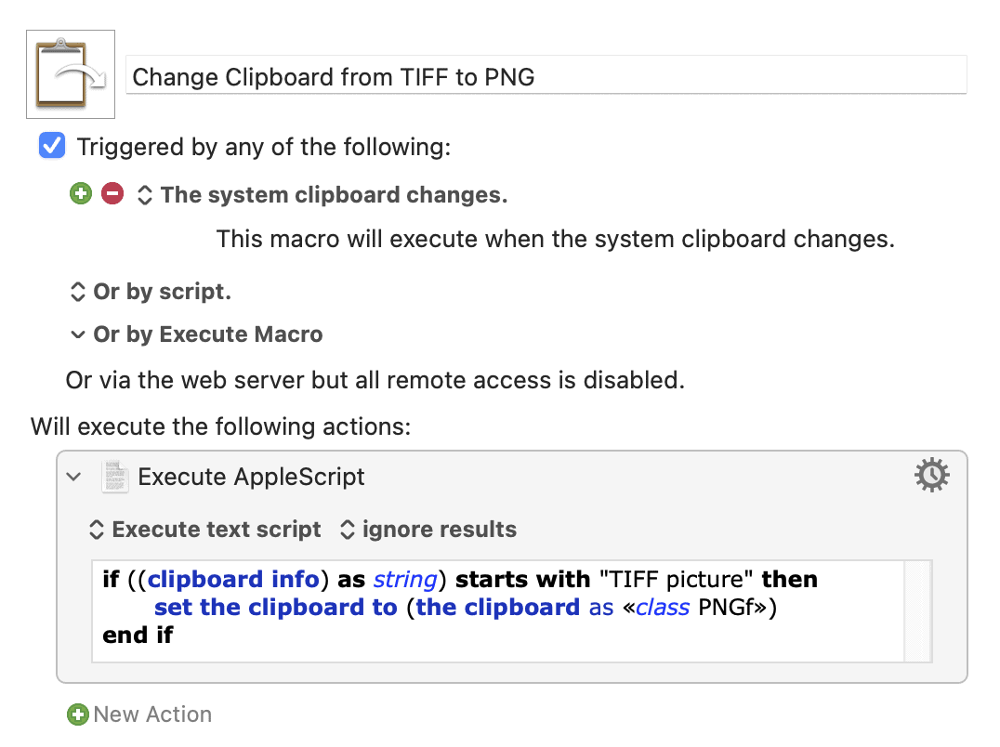
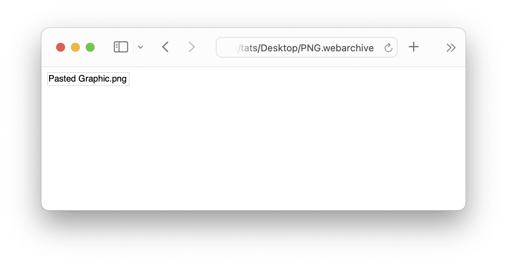
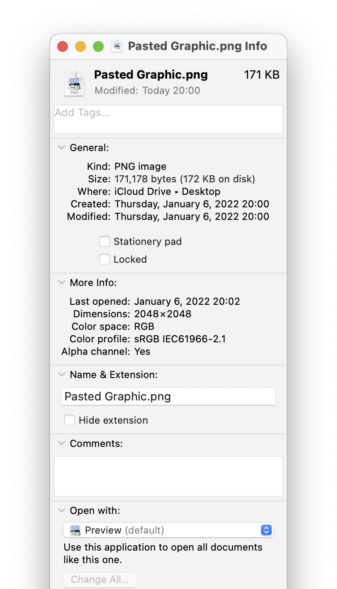

Macでは、クリップボードにコピーされた画像はデフォルトではTIFFとしてペーストされます。そのため、コピペしただけでファイルの容量が大きく増えるなどの様々な問題が発生する場合があります。この記事では、[Keyboard Maestro](https://www.keyboardmaestro.com/) を使ってクリップボード内の画像のデフォルトをPNGに自動的に変更することで、この問題を解消します。


Keyboard Maestro


## TIFFでコピペされることの確認方法


何らかの画像をPreviewで開いてクリップボードにコピーしたあと、Terminalで以下のコマンドを実行してみてください。先頭に `TIFF picture` と表示された場合、ペーストされるアプリケーション側が特定のフォーマットを要求しない限り、その画像はTIFFとしてペーストされます。


```
tats@youth:~% osascript -e "clipboard info"
TIFF picture, 16781606, «class 8BPS», 801978, GIF picture, 38055, «class jp2 », 307880, JPEG picture, 172620, «class PNGf», 171178, «class BMP », 16777270, «class TPIC», 26427
```


また、以下の方法でも確認できます。


1. 何らかの画像をPreviewで開いてクリップボードにコピー
2. TextEditにペースト
3. 保存 > ファイルフォーマット「Webアーカイブ書類」として保存
4. そのWebアーカイブ書類をSafariで開く
5. Pasted Graphic.tiff と表示される（セキュリティ上の理由で、ローカルファイルへのリンクは表示されないため、画像自体は表示されない）





上記のWebアーカイブ書類は以下のコマンドでHTMLとリソースに展開できます。展開して入手できた Pasted Graphic.tiff を見てみると、私の使用した99KBのPNGは16.8MBのTIFFとして保存されていました。コピペしただけで、およそ170倍に膨れ上がってしまったわけです。


```
tats@youth:Desktop% textutil -convert html TIFF.webarchive
```





Microsoft Office でも確認できます。コピーした画像を Microsoft PowerPoint などに「形式を選択してペースト」しようとすると、「画像 (TIFF)」だけが選択できます。





## Keyboard Maestro の設定


[Keyboard Maestro](https://www.keyboardmaestro.com/) はMac上のさまざまな振る舞いをトリガーにして、何らかのアクションを実行できる35米ドルのユーティリティです。これで以下のようなマクロを作るか、[私が作成したマクロファイル]([Wp Content](/blog/posts/wp-content/))をインポートします。





```
if ((clipboard info) as string) starts with "TIFF picture" then
    set the clipboard to (the clipboard as «class PNGf»)
end if
```


クリップボードの変更 (The system clipboard changes)、つまり何かをクリップボードにコピーしたタイミングでこのマクロは実行され、クリップボードの中身がTIFFだった場合はAppleScriptによってデフォルトをPNGに変更します。


マクロが作成できたら、画像をクリップボードにコピーしたあとにTerminalで確認してみましょう。先頭に `«class PNGf»` と表示されたら Keyboard Maestro のマクロは正しく動作しています。


```
tats@youth:~% osascript -e "clipboard info"
«class PNGf», 26852, «class 8BPS», 110706, GIF picture, 7429, «class jp2 », 55754, JPEG picture, 31236, TIFF picture, 1052060, «class BMP », 1048630, «class TPIC», 38022
```


画像を Text Edit にコピペしてWebアーカイブ書類として保存し、それをSafariで開いてみましょう。Pasted Graphic.png になっており、PNGとしてペーストされたことが確認できます。私の使用した99KBのPNGは171KB程度に収まりました。








Microsoft Office の「形式を選択してペースト」にも、「図 (PNG)」の候補が追加されました。


## Keyboard Maestro 以外の代替策


このためだけに Keyboard Maestro を購入するのは、少々高いと考えるかもしれません。その場合、ファイルをドラッグ&ドロップしたり、メニューから「挿入」を選んで画像を挿入したり、コピペに頼らない方法を使えば、元のフォーマットが維持される可能性が高いです。


## まとめ


Macでは、クリップボードにコピーされた画像はデフォルトではTIFFとしてペーストされますが、Keyboard Maestro を使うことで、クリップボードに画像がコピーされたタイミングでデフォルトをPNGに自動的に変更することが可能です。


Keyboard Maestro は非常に強力なユーティリティです。これを機会にさまざまなマクロを作ってみるのも良いかもしれません。


## 参考


[AppleScript to change clipboard image format | myByways](https://mybyways.com/blog/applescript-to-change-clipboard-image-format)