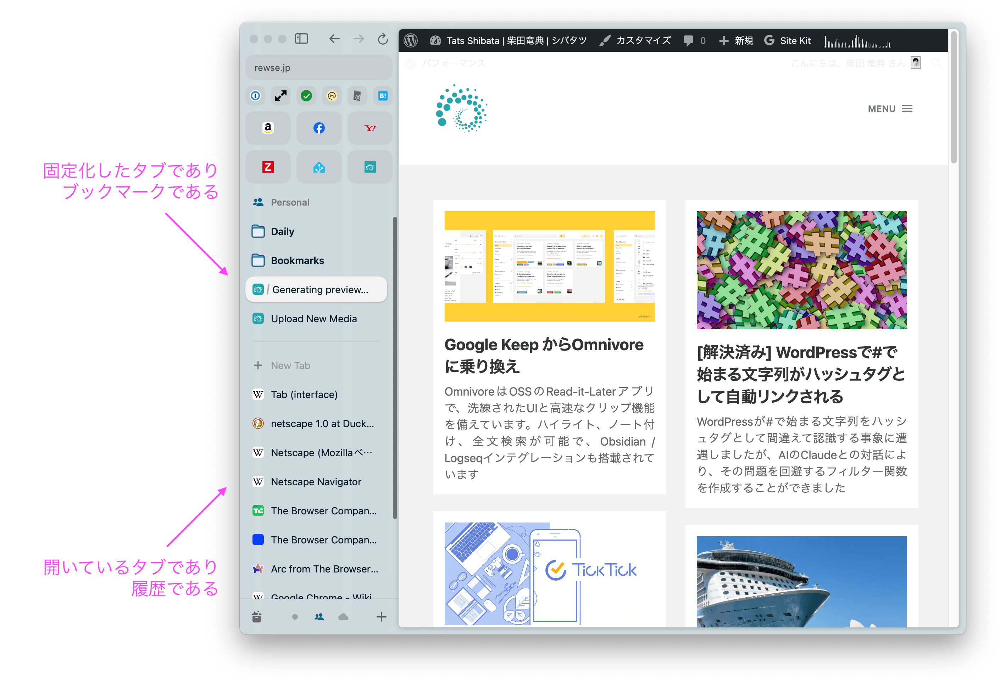
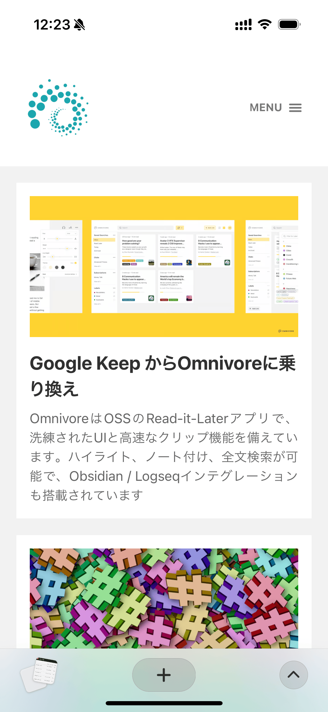
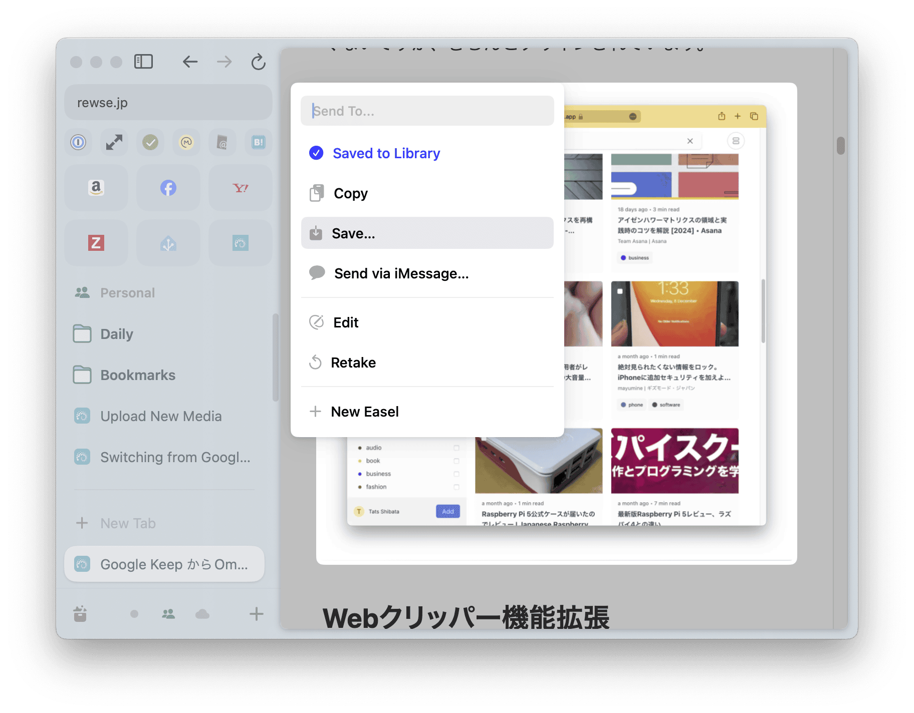
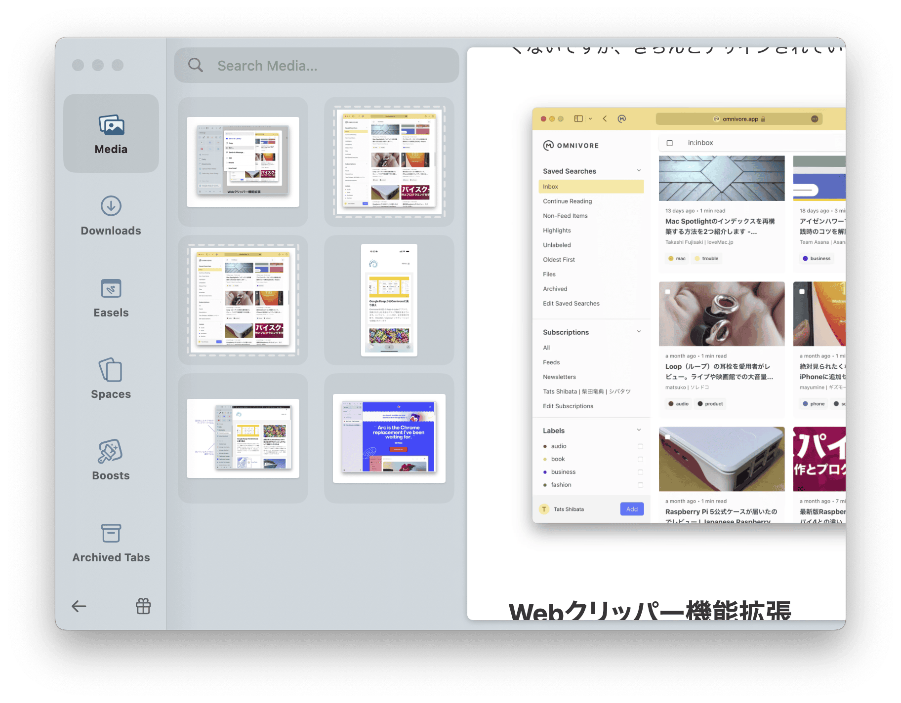
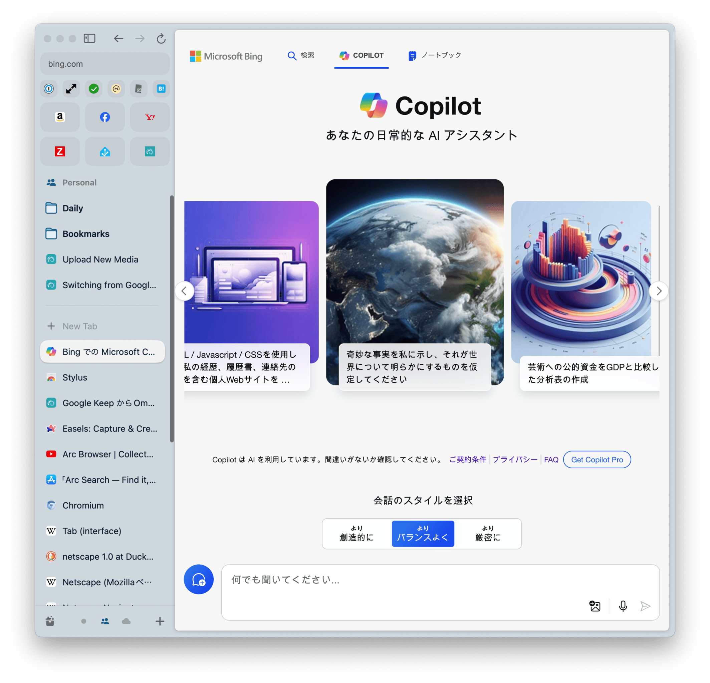
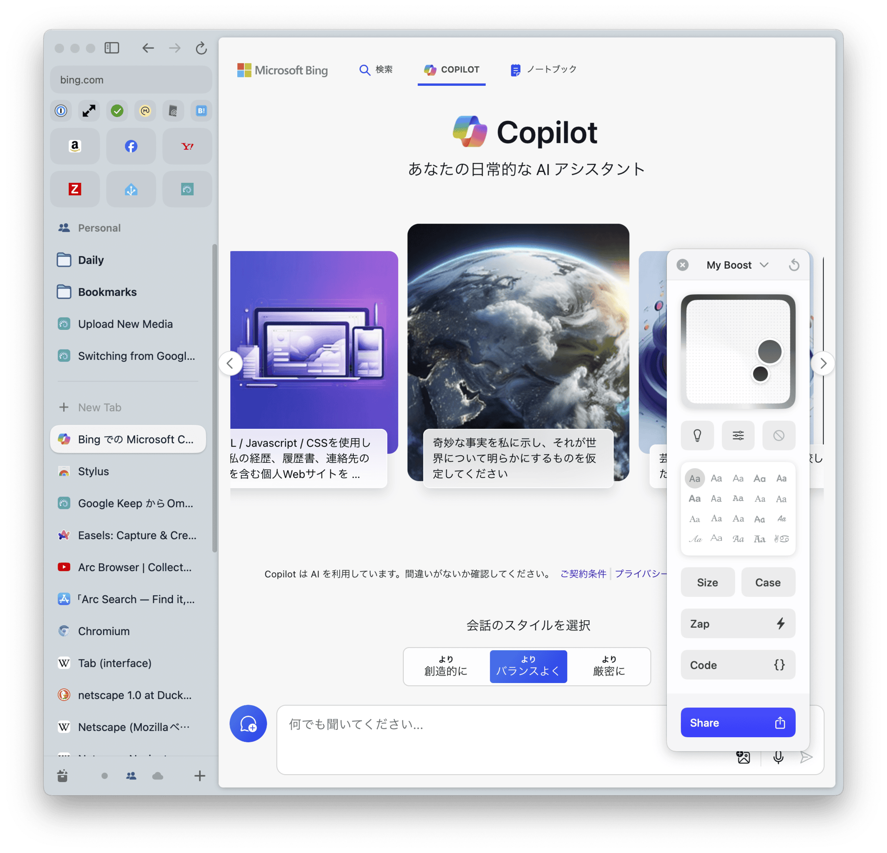

Webブラウザーを Google Chrome から[Arc](https://arc.net/gift/dbe06c2f)に乗り換えました。Arcは [The Browser Company](https://thebrowser.company/) という、すでに5億5000万ドルの評価額 [1](#5da31c68-8532-4fe6-ad3f-f95029db5409) になっているスタートアップが開発している無料のWebブラウザーです。Arcの描画エンジンは[Chromium](https://www.chromium.org/Home/)で、ほぼ全てのChrome機能拡張がそのまま使えるため、Chromeとの互換性を気にする必要はありません。Arcの優れている点はいろいろあるのですが、この記事ではその革命的なユーザーインターフェース (UI) にフォーカスします。特にタブをたくさん開いてしまうタイプの方や、タブを必要以上に閉じてしまって同じページを何度も開き直すタイプの方には分かりやすく有益です。

## タブ / 固定化したタブ / 履歴 / ブックマークの統合

WebブラウザーのUIは30年前にリリースされた Netscape Navigator 1.0 から大きく変わっておらず、27年前に追加されたタブ機能 [2](#6af1af2e-be38-44de-becc-7f43ab8b53d6) が最後の大きな変化でしょう。そこに大きな手を加えたのがArcです。そのため、最初は今までのWebブラウザーとの違いに戸惑うかもしれませんが、コンセプトが分かってしまえばとても使いやすいです。

既存のWebブラウザーのタブと固定化したタブ（ピン留めしたタブ）の違いは何でしょう？ 固定化したタブとブックマークの違いは何でしょう？ 朝に使って開きっぱなしの古いタブと履歴の違いは何でしょう？ これらは後から追加していった機能なため、似たような機能が異なるUIで実装されています。それをArcでは以下のように統合しています。

### 開いているタブであり、履歴である

ArcはURLやタブなどを全て左ペインに置いています。その結果、ワイド画面で縦が不足している最近のディスプレイではWebページ本体の見通しが良くなり、タブをどんなに増やしてもタブのタイトルが読めます。そして一本の罫線が引かれています。新規タブは罫線の下に追加されます。

Arcを上手に利用するポイントは〈タブを手動で閉じない〉〈既存のタブを再利用しない〉ことです。タブを手動で閉じたり再利用したりする理由は何でしょう？ 一つ目の理由はタブが多くなりすぎるとタブのタイトルが読めなくなり、見たいタブがどれなのか分からなくなるからですが、Arcの場合はどんなにタブを増やしてもタイトルの幅には影響ありません。二つ目の理由はメモリー消費量が増えることですが、Arcではメモリーセーバーが常にオンで、使用頻度の低いタブのメモリーは自動的に解放されます。古いタブは自動的に（デフォルトでは12時間後）に Archived Tab に移動され、左ペインから消えます。Archived Tab は従来の履歴と同じです。

そのため、タブを閉じず、新しいことをする時にタブを再利用せずに常に新規タブを作ることで、罫線の下は開いているタブの一覧で、かつ直近（デフォルトでは12時間以内）の履歴になります。ユーザーはタブがメモリーを消費しているのかしていないかのを意識する必要はありません。iOSのアプリ履歴と同じ感覚です（iOSのアプリ履歴を手動で全部消している人がいますが、古いアプリ履歴はメモリーから自動解放されるため、メモリー観点での意味はありません）。

この〈タブを手動で閉じない〉〈既存のタブを再利用しない〉というコンセプトはiOS版の [Arc Search](https://apps.apple.com/jp/app/arc-search-find-it-faster/id6472513080) では、より分かりやすいです。見えているコントロールUIの真ん中は〈新規タブを開く〉の + ボタンです。左側の〈タブの履歴〉を上にスワイプするとタブを閉じ（iOSのアプリ履歴と同じ）、右側の ^ ボタンを押すとURLが表示されます。つまり、タブを閉じたり既存のタブを再利用するより、新規タブを追加するほうが簡単なUIになっています。

### 固定化したタブであり、ブックマークである

左ペインのタブを罫線の上にドラッグ & ドロップすると自動アーカイブ（自動的に Archive Tab に移動し、左ペインから消える）されなくなります。これをArcではピン留めと呼んでおり、Chromeのタブの固定と同様です。一方、このピン留めのショートカットは Cmd + D が割り当てられており、Chrome / Microsoft Edge / Firefox の〈ブックマークに追加〉と同じショートカットになっています。また、Chromeなどから読み込んだブックマークは、フォルダーに入ったピン留めされたタブになります。

つまり、Arcではピン留めとブックマークに追加は同じ動作です。〈ピン留めされた開いているタブ〉と〈開いていないブックマークされたページ〉の見た目の違いはありません。ブックマークするとなると「将来もずっとアクセスするかどうか」ということを意識しがちですが、Arcの場合は〈履歴に埋もれないでほしい作業時のタブ〉もピン留め（ブックマーク）して、作業が終わったらピン留めを外す（ブックマークから削除）するということが気軽にできます。

なお、ブックマークのように見えているものも実体はタブなので、それぞれにページ遷移の履歴があります。タブのアイコンをクリック（さらに上のお気に入りバーのような部分のタブはダブルクリック）するとピン留めしたときのURL（ブックマークしたときのURL）に戻ります。同じページをブックマークから違うタブで開きたい場合は、既存のタブを右クリックしてDuplicate（複製）です。この辺はブックマークではなくタブであることを意識する必要があります。

## 私が好きなArcの機能

ArcのUIのフォーカスすると言ったものの、私の好きなArcの機能をいくつか紹介させてください。

### 画面キャプチャ

私はWebブラウザーの画面キャプチャ（スクリーンショット）を取ることが多いのですが、ArcではHTMLのブロック要素を認識してキャプチャ部分を自動選択してくれます。そのため、Cmd + Shift + 4 で範囲指定するより、簡単に良い感じで画面キャプチャが取得できます。ショートカットは Cmd + Shift + 2 です。また、取得した画面キャプチャはファイルとして保存するだけでなく、Arcの Media Library という場所にのみ保存することもできます。これにより、画面キャプチャを取りまくってもmacOSのデスクトップが散らかることがありません。

Media Library では Cmd + Shift + 4 などで取得してデスクトップに保存された画像も同時に参照してくれるので、画面キャプチャはどのような方法で取得しても Media Library に全て入っています。また、Media Library 内の画像を他のアプリにドラッグ & ドロップすることもできます。

### Easel

この画面キャプチャをEaselというところに保存することもできます。Easelはスクラップブックのような機能ですが、画面キャプチャは単なる画像ではなく埋め込みオブジェクトとなります。そのため、更新可能な自分だけのダッシュボードを作ったりすることもできます。詳しくは以下のYouTubeをご覧ください。私はECサイトをまたいだ Wish List として使っています。



### Boost

Boostは表示しているWebページを自分好みにカスタマイズする機能です。[Stylus機能拡張](https://chromewebstore.google.com/detail/stylus/clngdbkpkpeebahjckkjfobafhncgmne)と同じですが、GUIで操作できるので簡単です。たとえば [Microsoft Bing のCopliotのページ](https://www.bing.com/chat)はMacから見ると中華フォントになっていて見苦しいのですが、Boostならワンクリックでフォントを変更できます。また、一部のブロック要素を削除したり (Zap)、色味を変更したり、JavaScriptやCSSを追加することもできます。

Boost適用前

Boost適用後

## まとめ

Webブラウザーを Google Chrome からArcに乗り換えた理由は、Arcが提供するUIの革新性にあります。Arcは、これまでWebブラウザーに不可欠と考えられていたタブ / 固定タブ / ブックマーク / 履歴などの機能を統合し、シンプルで直感的に使えるUIを実現しています。特にタブの管理が煩雑になりがちなユーザーに大変有益です。また、固定化したタブとブックマークを同一視することで、作業中のタブをブックマークとして保持しておくことが容易になりました。

さらに、Arcには画面キャプチャやEasel（スクラップブック）、Boost（カスタマイズ）といった生産性の高い機能が備わっています。これらの機能を活用することで、より快適なWeb閲覧体験が得られます。Arcは従来のWebブラウザーの概念を大きく変革し、ユーザーの使い勝手を向上させる次世代のWebブラウザーといえるでしょう。
