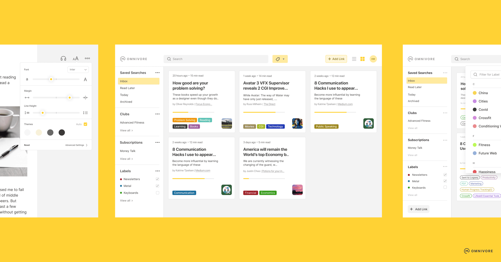

**⚠️ 2024/11/06追記**  
Omnivoreサーバーのシャットダウンが発表されました。詳細は [Details on Omnivore shutting down - Omnivore Blog](https://blog.omnivore.app/p/details-on-omnivore-shutting-down)


Webブラウザーを Google Chrome から[Arc](https://arc.net/)に乗り換えたところ、[Google Keep Chrome 機能拡張](https://chromewebstore.google.com/detail/google-keep-chrome-%E6%8B%A1%E5%BC%B5%E6%A9%9F%E8%83%BD/lpcaedmchfhocbbapmcbpinfpgnhiddi) がログイン時に Custom scheme URI not allowed エラーで動作しなくなってしまいました。Arcや Microsoft Edge などのChromiumベースのWebブラウザーは Google Chrome と機能拡張の互換性があるのですが、Google Keep Chrome 機能拡張 が Google Chrome 以外のWebブラウザーでの利用を想定していなそうです。


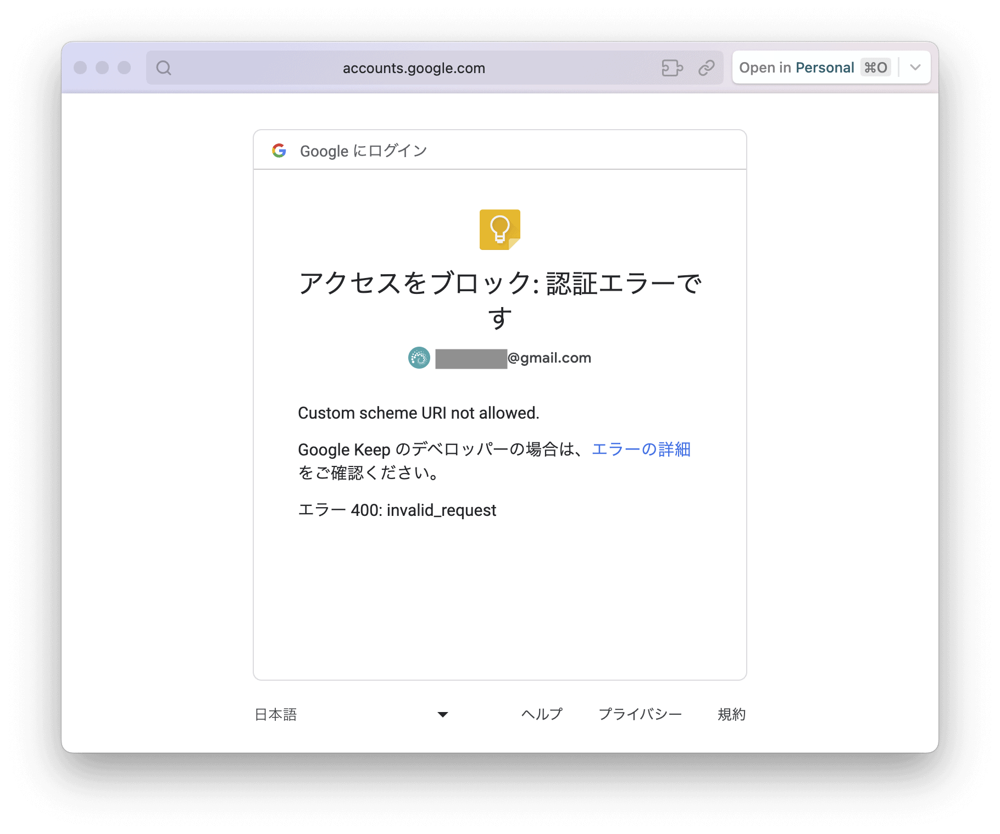


Google Keep はWebクリッパーとしてしか使っていなかったので、Webクリッパーの代替を探すことにしました。Google Keep の前は[Evernote](https://evernote.com/ja-jp)を使っていたのですが、現在の状況でEvernoteに戻る気にはなれません。[Pocket](https://getpocket.com/ja/)も昔からあるRead-it-Later（あとで読む）アプリですが、本文の保存と全文検索には$44.99/年の Pocket Premium が必要です。[Notion](https://www.notion.so/ja-jp)も一時期Webクリッパーとして使っていたのですが、TABLEが保存されない点と、クリップ時にラベルを付けられない点が気になっていました。そんなときに見つけたのが [Comparing web clipper capabilities between Omnivore, Notion, and Evernote - Omnivore Blog](https://blog.omnivore.app/p/comparing-web-clipper-capabilities) という記事でした。以下のように、比較表を見るとOmnivoreも良さげです。


[](https://blog.omnivore.app/p/comparing-web-clipper-capabilities)


OmnivoreはAGPL-3.0のオープンソースソフトウェア (OSS) で、コミュニティによって開発されています。クラウドベースのシステムなので、Evernoteの経験から収益モデルが気になるところですが、[Pricing | Omnivore Docs](https://docs.omnivore.app/about/pricing.html) によると、将来的には有償アドオンを計画しているものの、現在のところは完全に無料で、寄付だけに頼っているそうです。


Webに早速ログインしてみると、見た目のきれいさが好印象です。OSSだと見た目が後回しになっているものが少なくないですが、きちんとデザインされています。


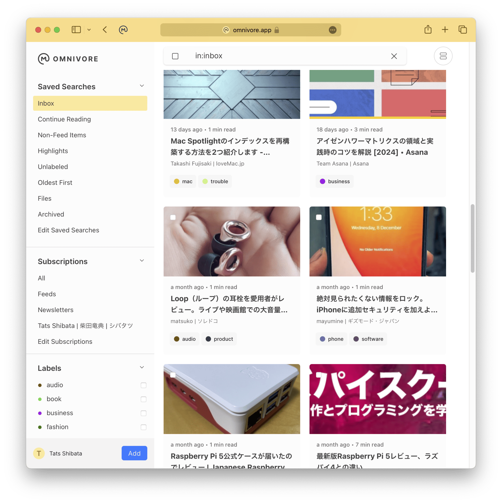


## Webクリッパー機能拡張


[Omnivore機能拡張](https://chromewebstore.google.com/detail/omnivore/blkggjdmcfjdbmmmlfcpplkchpeaiiab)はワンクリックするだけでクリップできます。[Evernote Web Clipper 機能拡張](https://chromewebstore.google.com/detail/evernote-web-clipper/pioclpoplcdbaefihamjohnefbikjilc) は動作が遅めな一方、Omnivoreは非常に高速です。Evernote Web Clipper は全文なのか一部なのか選択でき、Google Keep Chrome ではクリップする部分を選択する必要がありましたが、Omnivoreはワンクリックで全文取得のみです。


Omnivoreはハイライトという機能があるので、全文取得しつつ選択した部分はハイライトしてくれると、より良かったのですが、メモを Add Note に記載することはできます。OmnivoreはRead-it-Laterアプリと自称しているので、ちゃんと読む前に（ハイライト部分が不明な時点で）クリップするという想定なのでしょう。


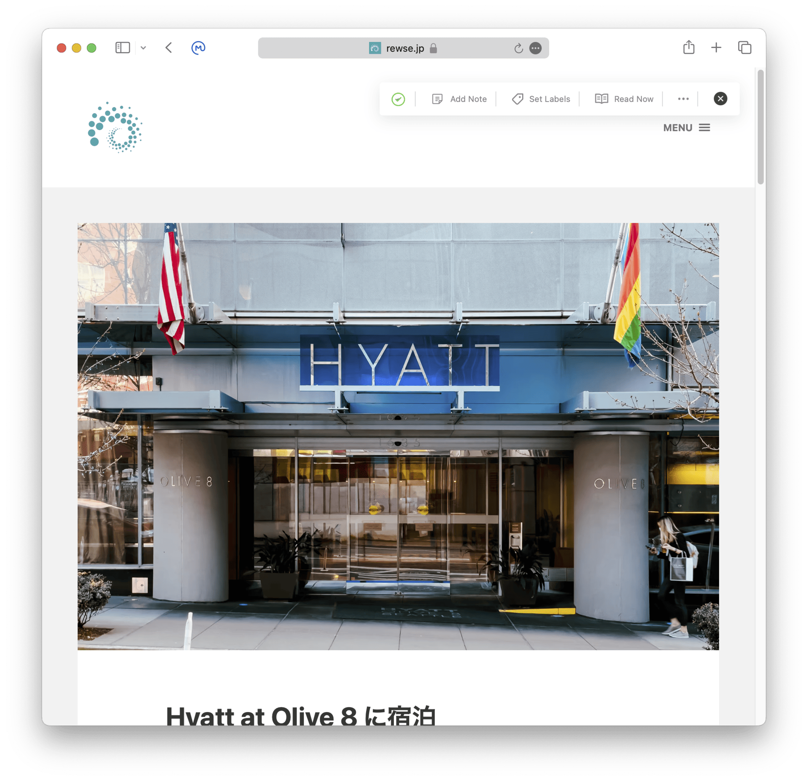


## ネイティブアプリ


[iOS (iPhone / iPad) 版](https://apps.apple.com/jp/app/omnivore-read-it-later/id1564031042)とAndroid版のモバイルアプリが用意されています。こちらの見た目も洗練されています。


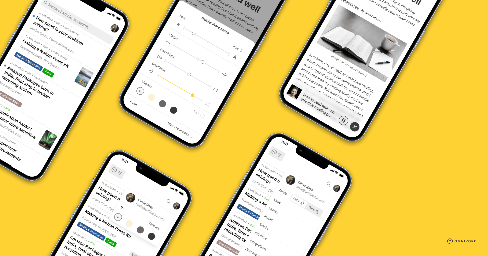


また、Mac版のネイティブアプリもありますが、Web版に比べるとやや機能が少なめです。


## Omnivoreの機能


### 自動取得されるメタ情報


Omnivoreのリーダーはきれいで高速に動いて快適です。テーマや文字サイズ変更 / マージンや行間の変更もできます。ヘッダー部分にはタイトルだけでなく、Webページの発行日 / 読むのに必要な想定時間 / 著者名 / オリジナルへのリンクが含まれています。


また、取得日時 / 概要も自動取得されています。


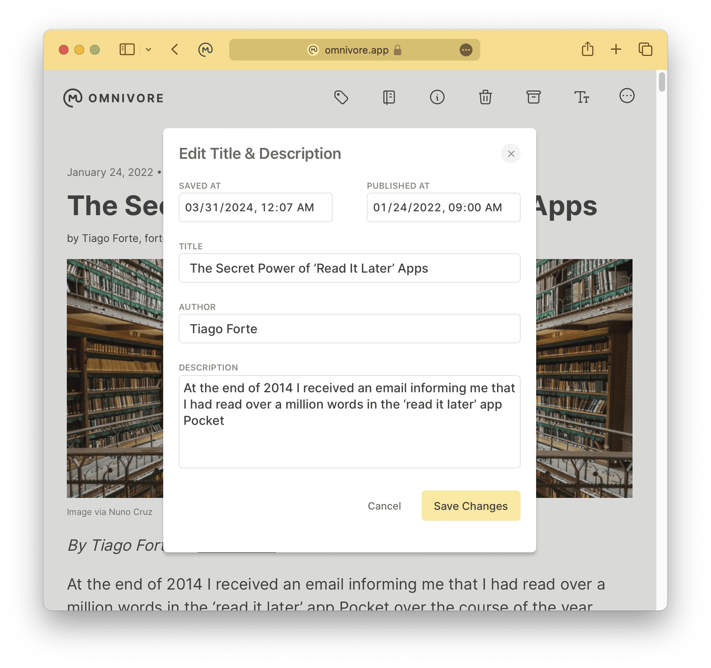


### HighlightとNote


本文の一部をハイライトさせ、ハイライト部分だけを抽出したペインがあります。また、ハイライト部分にメモを付けることや、ページ全体へのメモを書くこともできます。


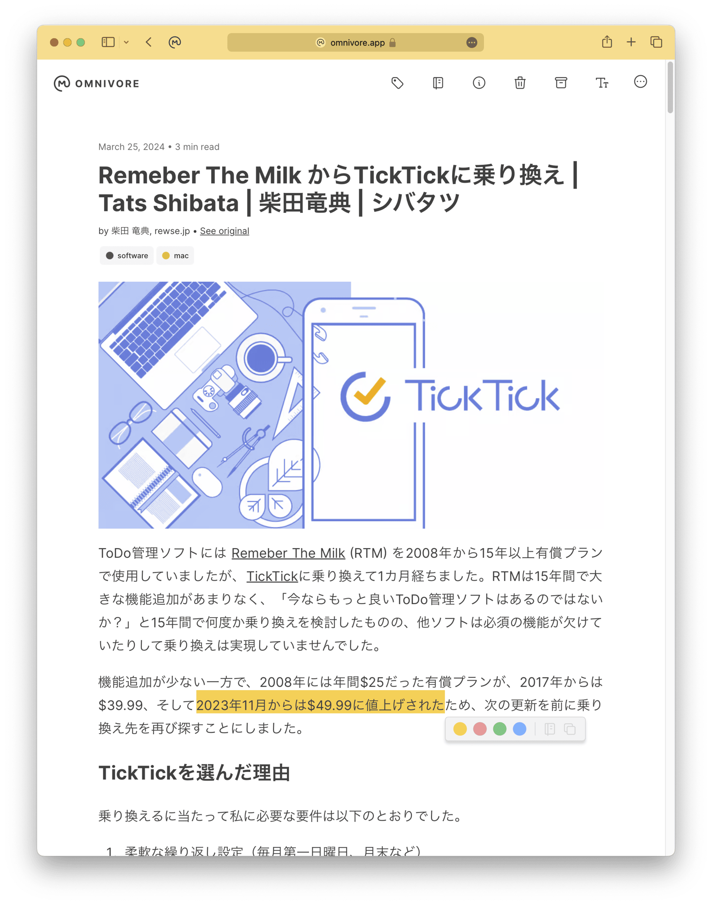


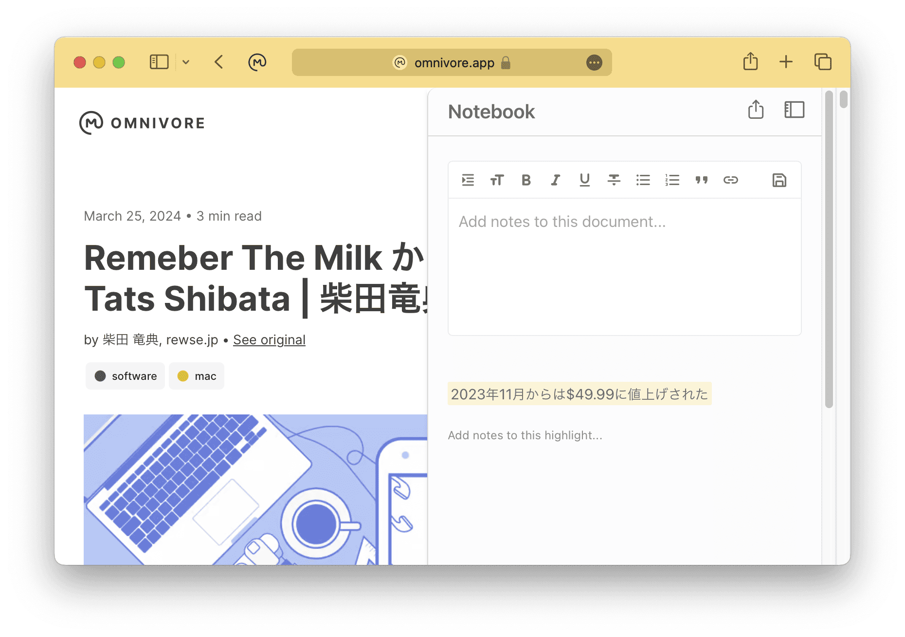


また、ハイライトされた記事だけをフィルターして一覧することもできます。


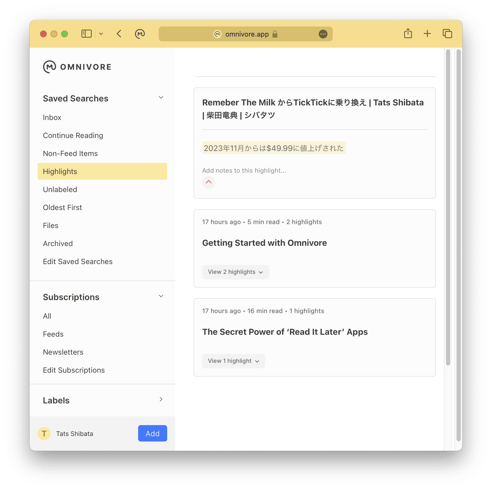


### 全文検索


[検索フィルター](https://docs.omnivore.app/using/search.html)は充実しており、それを Saved Searches として保存しておくことができます。しかし、日本語検索に未対応です。全文検索にはPostgreSQLの`tsvector_update_trigger()`を使用しているものの、これが英語辞書 (pg\_catalog.english) しか現在は参照していないので、pg\_catalog.japanese も選べるようになることが期待されます。コア開発チームにシンガポール在住の方がいて、公式Discordでも[話題になっている](https://discord.com/channels/844965259462311966/1140479581439143937/1180043216469364766)ので、きっとなんとかなるでしょう。あとで公式Discordの Feature Request に入れておきます。


### Obsidian Integration


この日本語検索ができない問題の回避策にもなるのが [Obsidian Integration](https://docs.omnivore.app/integrations/obsidian.html) です。obsidian-omnivore Plugin をObsidianにインストールすると、Omnivoreの記事がObsidianに自動レプリケーションされるようになります。


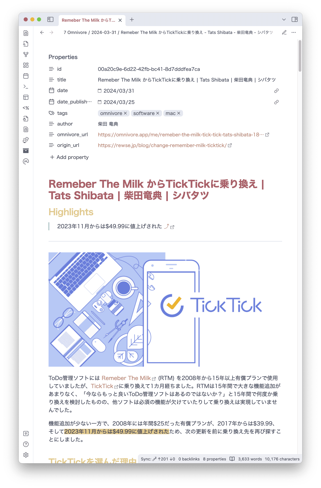


ObsidanなのでOmnivoreで直接見るよりも地味ですが、自分のメモとWebクリップを（日本語で）串刺し検索できるというのは大きな強みです。デフォルトではハイライトとノート部分のみがレプリケーションされますが、さまざまな変数でテンプレートを作れるので、本文を追加することも容易です。私は以下のようなテンプレートを使っています。


```
# {{{title}}}

{{#highlights.length}}
## Highlights

{{#highlights}}
> {{{text}}} [⤴️]({{{highlightUrl}}}) {{#labels}} #{{name}} {{/labels}} ^{{{highlightID}}}
{{#note}}

{{{note}}}
{{/note}}

{{/highlights}}
---
{{/highlights.length}}

{{{content}}}
```


また、Front Matter もテンプレートを使用して作成することができます。私は以下のようなテンプレートを使っています。


```
id: {{{id}}}
title: ">"
  {{{title}}}
date: "{{#formatDate}}{{dateSaved}},"yyyy-MM-dd"{{/formatDate}}"
{{#datePublished}}
date_published: {{#formatDate}}{{datePublished}},"yyyy-MM-dd"{{/formatDate}}
{{/datePublished}}
tags:
  - "omnivore"
{{#labels.length}}
{{#labels}}  - {{{name}}}
{{/labels}}
{{/labels.length}}
{{#author}}
author: >
  {{{author}}}
{{/author}}
omnivore_url: {{{omnivoreUrl}}}
origin_url: {{{originalUrl}}}
```


[Logseq Integration](https://docs.omnivore.app/integrations/logseq.html) も用意されていますし、[API](https://docs.omnivore.app/integrations/api.html)や[Webhook](https://docs.omnivore.app/integrations/webhooks.html)もあります。


### RSSリーダー & メルマガリーダー


Omnivoreを[RSSリーダー](https://docs.omnivore.app/using/feeds.html)としても使えます。ただ、RSSファイルのURLを直接指定しないといけないため、やや使い勝手が良くありません。


Omnivoreで[メルマガを読む](https://docs.omnivore.app/using/inbox.html)こともできます。@inbox.omnivore.appのメールアドレスを発行できるので、ここにメルマガを転送するとOmnivoreに取り込まれます。


### Text-to-Speech


Omnivore for iOS には[Text-to-Speech](https://docs.omnivore.app/using/text-to-speech.html)機能が付いています。ただし、日本語には未対応です。


## Self-Hosted Omnivore


勤務先のセキュリティポリシー上、クラウドに情報をアップロードできなかったり、将来Omnivoreが有償になった場合でも、Omnivoreを自己ホストすることで対処できます。詳しくは [Deploying a minimal self-hosted Omnivore using fly.io and bonsai.io - Omnivore Blog](https://blog.omnivore.app/p/deploying-a-minimal-self-hosted-omnivore) にあります。pg\_catalog.japaneseを使うようにコードを修正して自己ホストすれば、日本語が検索できない問題を今すぐ解消できるかもしれません。


## Google Keep からOmnivoreへのデータ移行


Omnivoreは[データインポート機能](https://docs.omnivore.app/using/importing.html)をいくつか備えています。MatterとPocketのデータはそのまま取り込めるのですが、Google Keep のデータはCSVインポートを利用するしかありません。そのため、Google Keep のJSONファイルをCSVファイルに変換するスクリプトを作成してインポートしました。


1. [Goole Data Export](https://takeout.google.com/) から Google Keep のデータの出力依頼
2. データ準備完了の通知が来たら Export management.zip を取得
3. Export management.zip を展開すると、Takeout/Keep というフォルダ内にHTMLとJSONが入っている
4. [conv\_googlekeep\_omnivore.sh](https://gist.github.com/rewse/a32475f3aa7ebe24d4c56be84b3560eb) をダウンロードして Takeout/Keep などにコピー
5. conv\_googlekeep\_omnivore.shに実行権限を付与
6. すべてのJSONファイルをconv\_googlekeep\_omnivore.shに入力
7. ヘッダーを追加
8. data.csvをLibraryにドラッグ&ドロップ


```
% cd Takeout/Keep
% chmod 755 conv_googlekeep_omnivore.sh
% for FILE in *.json; do
>   echo "Converting $FILE..." 1>&2
>   cat $FILE | ./conf_googlekeep_omnivore.sh >> converted.csv
> done
% echo 'url,state,labels,saved_at,published_at' > data.csv
% cat converted.csv >> data.csv
```


エラー処理はまじめにやっていないので、適宜修正して利用してください。特にラベルがないノートを想定しておらず、ラベルがないとjqが `(at :0): Cannot iterate over null (null)` エラーになります。


正規表現が多くて何をやっているのか分かりづらいですが、正規表現のような人間が読みづらく機械が読みやすいものは生成AIの[Claude](https://claude.ai/chat/)などが得意としています。


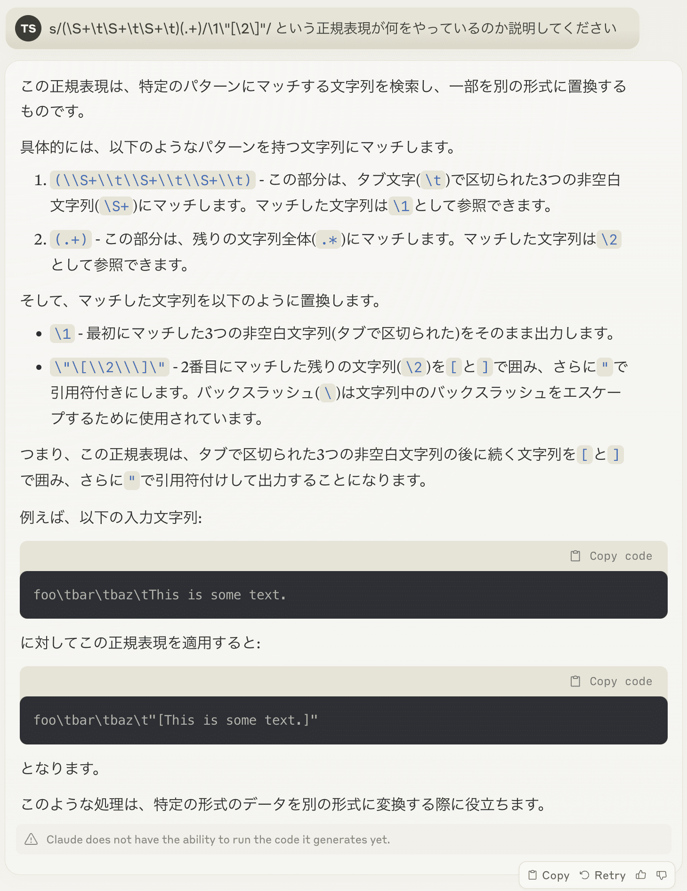


なお、Google Keep はノートアプリな一方、OmnivoreはRead-it-Laterアプリなので、OmnivoreではURLが必須で、これが一意である必要があります。また、OmnivoreのCSVインポートはタイトルや本文を取り込まず、URLから改めて取得に行くため、現時点でそのURLが無効だったりアクセスできなかった場合、本文などが取得できません。


## まとめ


Google Keep Chrome 拡張機能が Arc / Microsoft Edge 等のChromiumベースブラウザーで動作しないため、Webクリッパーの代替としてOmnivoreに乗り換えました。OmnivoreはAGPL-3.0のOSSで、洗練されたUIと高速なクリップ機能を備えています。ハイライトやノート付け、全文検索も可能で、Obsidian / Logseqインテグレーションもあります。ただし日本語検索には未対応です。Google Keep のデータを自作のスクリプトでJSONからCSVに変換してインポートしました。オールインワンのWebクリッパー / Read-it-Laterアプリとして、Google Keep の代替に有力な選択肢となりそうです。