オンライン会議の機会が増えたことで、状況によってMacのマイクとスピーカーのデバイスを切り替えて使う方も増えたと思います。例えば私は、家族が在宅しているときは [Shokz OpenComm](https://jp.shokz.com/products/bone-conduction-headphone-opencomm) ヘッドセットを使い、家に私しかいないときは [Jabra Speak 510](https://www.jabra.jp/business/speakerphones/jabra-speak-series/jabra-speak-510) スピーカーフォンを使っています。


Optionキーを押しながらメニューバーの音量ボタンを押すと、出力（スピーカー）だけでなく入力（マイク）も切り替えられるものの、マイクとスピーカーの両方をヘッドセットからスピーカーフォンに切り替えるには4回クリックする必要があります。この記事ではショートカットからShellスクリプトを呼び出すことで、マイクとスピーカーをまとめて変更します。


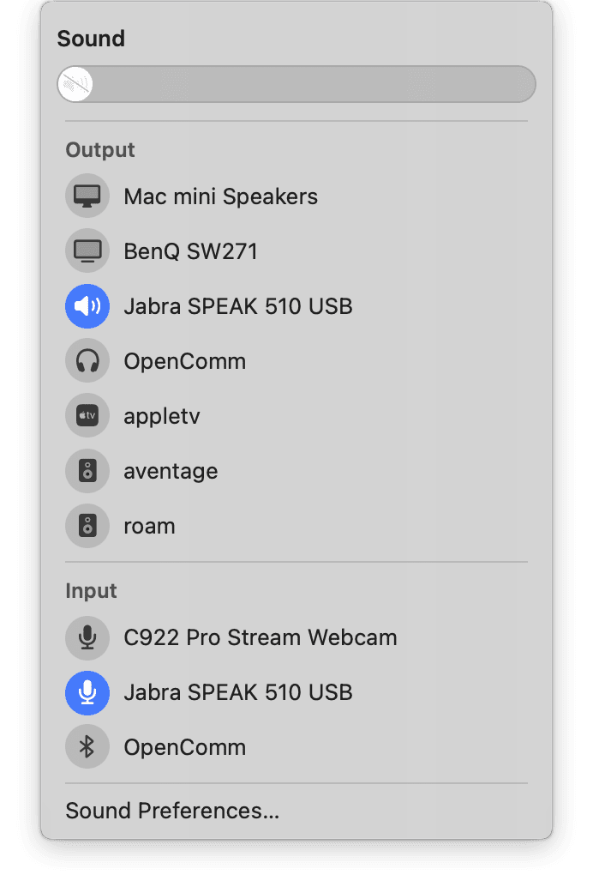


## コマンドラインからの変更


まずは、コマンドラインからオーディオデバイスを変更できる [switchaudio-osx](https://github.com/deweller/switchaudio-osx) をインストールします。GitHubではswitchaudio-osxのバイナリーが配布されていないため、[Homebrew](https://brew.sh/ja/)経由が手軽でしょう。


```
[tats@youth ~]% brew install switchaudio-osx
```


`brew`コマンドが使えない場合はHomebrewがインストールされていません。Homebrewは以下のコマンドでインストールできます。


```
[tats@youth ~]% /bin/bash -c "$(curl -fsSL https://raw.githubusercontent.com/Homebrew/install/HEAD/install.sh)"
```


switchaudio-osxがインストールできたら、現在使用している入力 (input。マイク) / 出力 (output。スピーカー）それぞれのデバイスを表示してみましょう。


```
[tats@youth ~]% SwitchAudioSource -c -t input
OpenComm
[tats@youth ~]% SwitchAudioSource -c -t output
OpenComm
```


以下のコマンドで、入力 / 出力それぞれで使用可能なデバイスの一覧を取得してみましょう。`-f json` をつけると詳細表示になり、デバイスのIDやUIDが取得できます。


```
[tats@youth ~]% SwitchAudioSource -a -t input
OpenComm
C922 Pro Stream Webcam
Jabra SPEAK 510 USB
[tats@youth ~]% SwitchAudioSource -a -t output
OpenComm
BenQ SW271
Jabra SPEAK 510 USB
Mac mini Speakers
[tats@youth ~]% SwitchAudioSource -a -t input -f json
{"name": "OpenComm", "type": "input", "id": "99", "uid": "20-74-CF-73-18-F6:input"}
{"name": "C922 Pro Stream Webcam", "type": "input", "id": "78", "uid": "AppleUSBAudioEngine:Unknown Manufacturer:C922 Pro Stream Webcam:6154913F:3"}
{"name": "Jabra SPEAK 510 USB", "type": "input", "id": "86", "uid": "AppleUSBAudioEngine:Unknown Manufacturer:Jabra SPEAK 510 USB:70BF92C19DC7021900:2"}
[tats@youth ~]% SwitchAudioSource -a -t output -f json
{"name": "OpenComm", "type": "output", "id": "94", "uid": "20-74-CF-73-18-F6:output"}
{"name": "BenQ SW271", "type": "output", "id": "90", "uid": "AppleGFXHDAEngineOutputDP:480001:0:{D109-7F5F-00005445}"}
{"name": "Jabra SPEAK 510 USB", "type": "output", "id": "82", "uid": "AppleUSBAudioEngine:Unknown Manufacturer:Jabra SPEAK 510 USB:70BF92C19DC7021900:1"}
{"name": "Mac mini Speakers", "type": "output", "id": "72", "uid": "BuiltInSpeakerDevice"}
```


デバイスを変更してみましょう。デバイスのタイプにはinput / outputのほかに、systemという警告音を鳴らすためのものがあります。そのため、3つのタイプを変更します。デバイスは名前 / ID / UIDのいずれかで指定できますが、以下では名前で指定しています。名前にスペースを含む場合はダブルクォートで囲みます。


```
[tats@youth ~]% SwitchAudioSource -t input -s "Jabra SPEAK 510 USB"
input audio device set to "Jabra SPEAK 510 USB"
[tats@youth ~]% SwitchAudioSource -t output -s "Jabra SPEAK 510 USB"
output audio device set to "Jabra SPEAK 510 USB"
[tats@youth ~]% SwitchAudioSource -t system -s "Jabra SPEAK 510 USB"
system audio device set to "Jabra SPEAK 510 USB"
```


コマンドラインから変更できたことが確認できます。また、実際にデバイスを使用して、変更されたことを確認しましょう。


```
[tats@youth ~]% SwitchAudioSource -c -t input
Jabra SPEAK 510 USB
[tats@youth ~]% SwitchAudioSource -c -t output
Jabra SPEAK 510 USB
[tats@youth ~]% SwitchAudioSource -c -t system
Jabra SPEAK 510 USB
```


以上で、コマンドラインからの動作確認は完了です。


## Automator Quick Action からの変更


このコマンドをショートカットから呼び出せるようにするためにはAuatomatorを使用します。アプリケーションからAutomatorを起動し、「新規ドキュメント」> 「クイックアクション」を選択します。


Automator


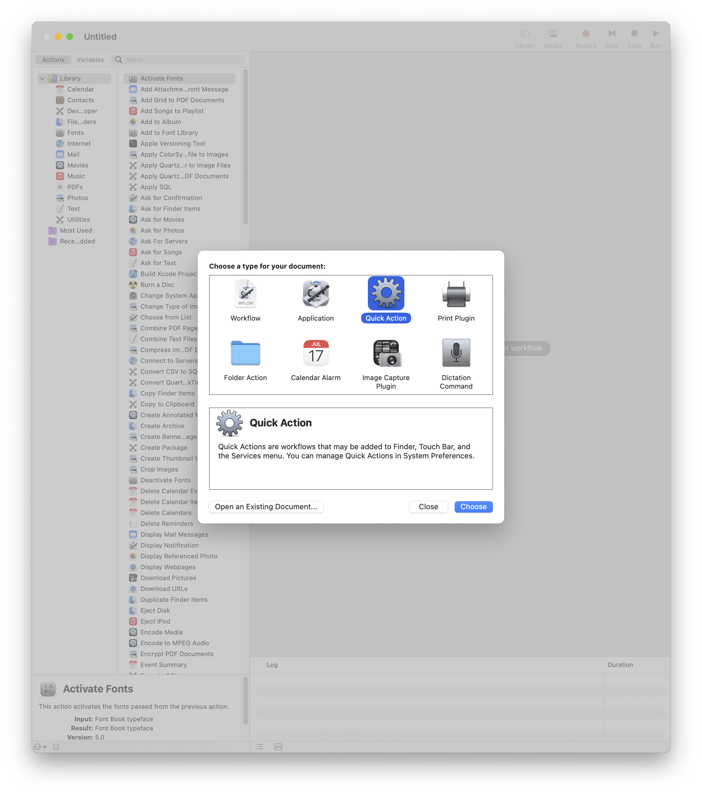


まずは、**上部の「ワークフローが受け取る項目」を「入力なし」に変更します。**その後、左パネルから「ユーティリティ」>「シェルスクリプトを実行」を選択し、右パネルにドラッグ&ドロップします。また、「コンピューターの音量を設定」と「通知を表示」も追加しましょう。


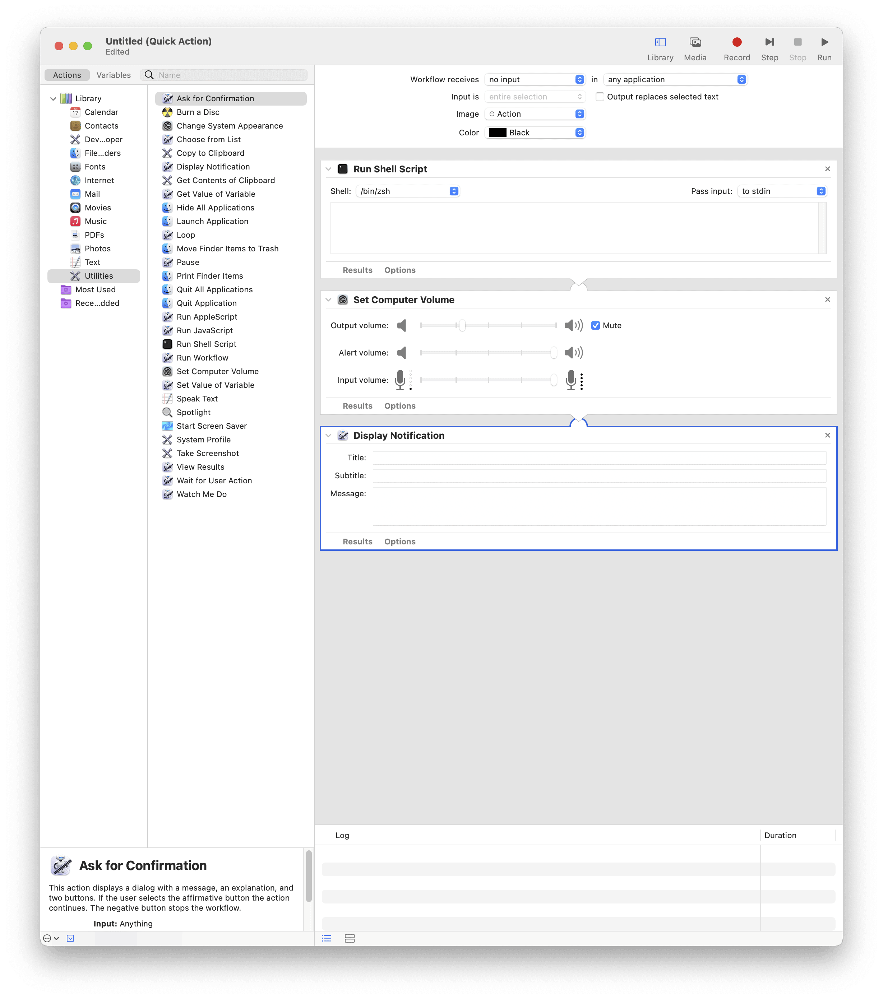


AutomatorからのShellスクリプトでは `/usr/local/bin` が自動補完されないので、「シェルスクリプトを実行」にはパスを付与して、以下のように記述します。また、適切な音量を設定して、通知に表示したい文字列を入力します。


```
/usr/local/bin/SwitchAudioSource -t input -s "Jabra SPEAK 510 USB"
/usr/local/bin/SwitchAudioSource -t output -s "Jabra SPEAK 510 USB"
/usr/local/bin/SwitchAudioSource -t system -s "Jabra SPEAK 510 USB"
```


右上の「実行」を押し、期待通り動作することを確認しましょう。問題なければ、名前をつけて保存します。


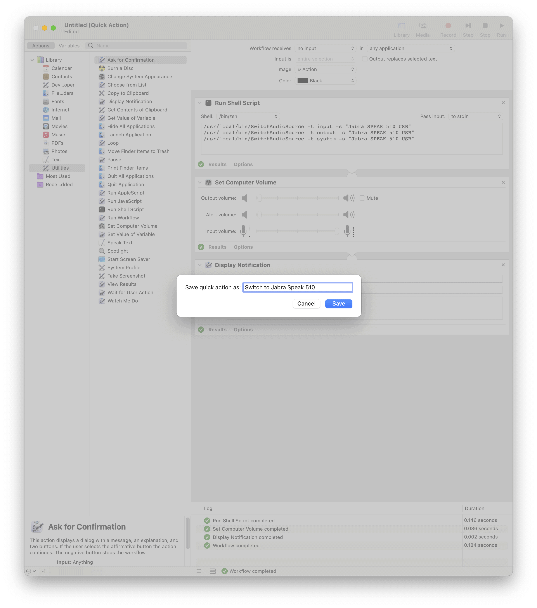


システム環境設定を開いて、「キーボード」>「ショートカット」>「サービス」を選ぶと、先ほど作成したクイックアクションが登録されています。ショートカットを追加し、そのショートカットでデバイスが変更できるかを確認しましょう。 作成したワークフローが「一般」の下ではなく「テキスト」の下にある場合は、「ワークフローが受け取る項目」が「入力なし」になっているかを確認しましょう。作成したクイックアクションの名前を右クリックすると「Automatorで開く」が選べ、修正できます。


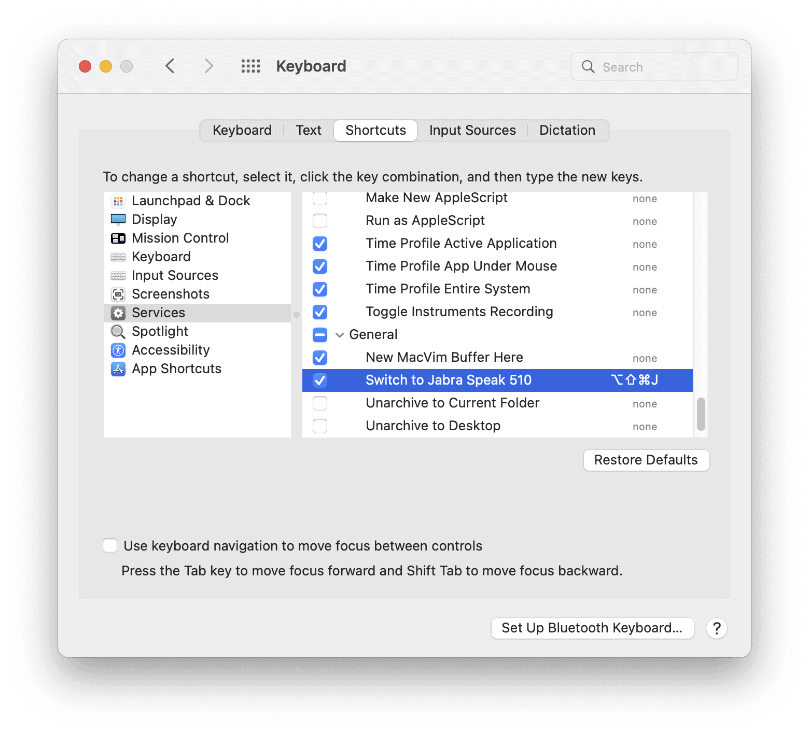


同様のクイックアクションをデバイスごとに作成すれば、ショートカットからデバイスを変更できるようになります。


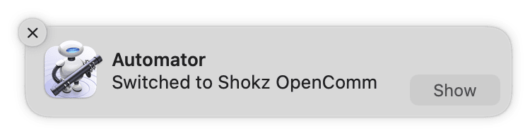


## Alfred Workflow からの変更


[Alfred](https://www.alfredapp.com/)はキーワードをトリガーにMacで様々なことが実行できるランチャーです。Alfred自体は無料ですが、29英ポンドのPowerpackを購入すると、今回使用するWorkflow機能などが使えるようになります。必要がある方は、ショートカットの代わりにキーワードでもオーディオデバイスを変更できるようにしてみましょう。


Alfred


左パネルからWorkflowを選択し、下部の + マークから Templates > Essentials > Keyword to Script to Notification を選び、Nameを入力します。ほかの人にワークフローを配布しない場合は、Bundle Id などは不要です。


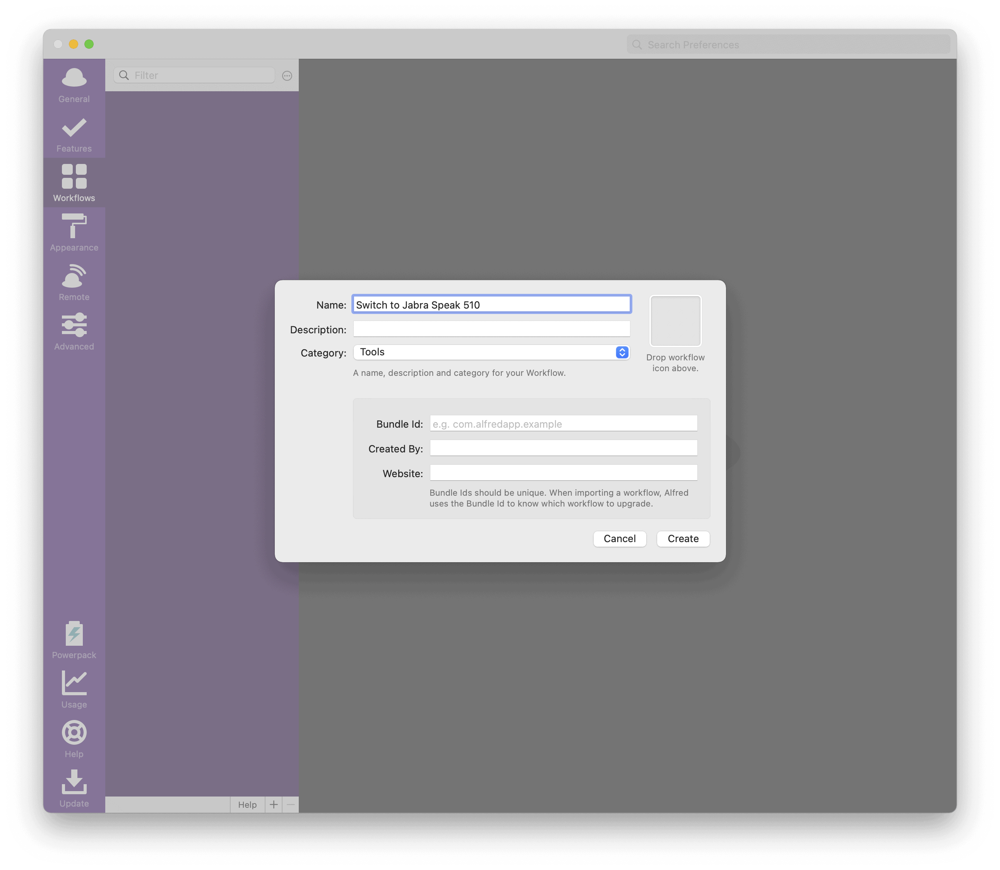


Keywordをダブルクリックし、Alfredに入力するKeywordと、Alfredに表示されるTitleを入力します。また、**No Argument を選びます**。


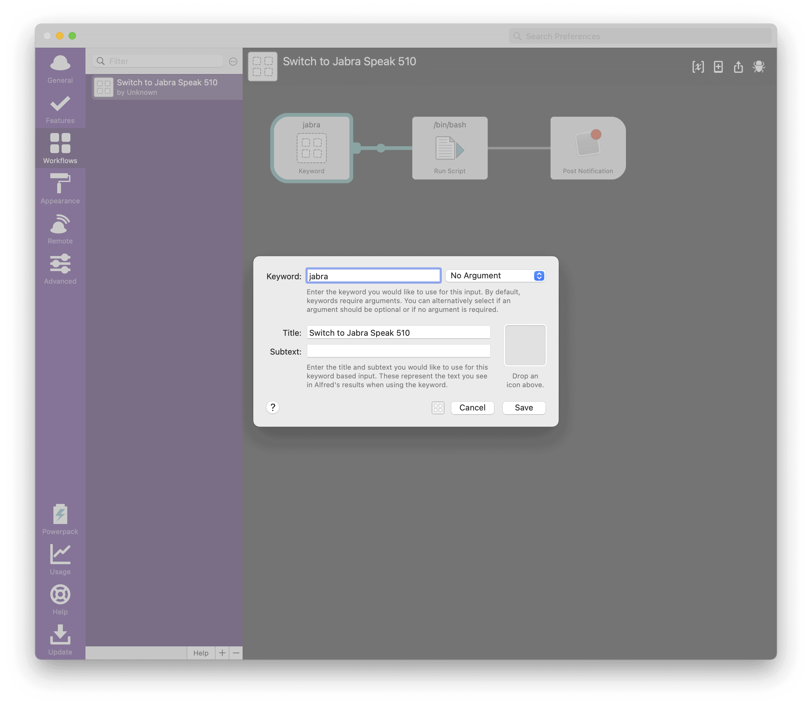


/bin/bash をダブルクリックし、Shellスクリプトを入力します。


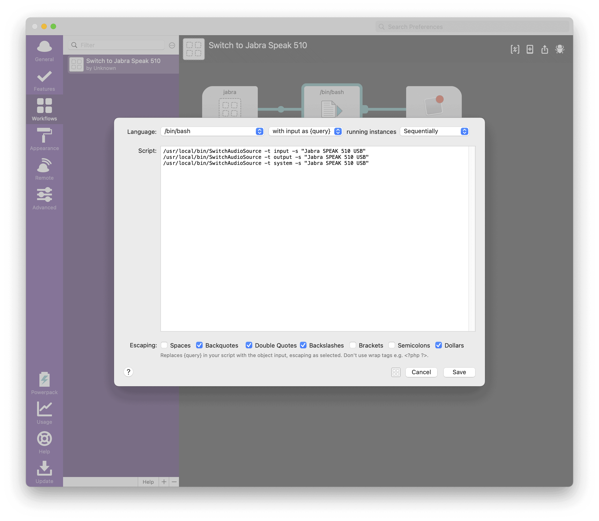


```
/usr/local/bin/SwitchAudioSource -t input -s "Jabra SPEAK 510 USB"
/usr/local/bin/SwitchAudioSource -t output -s "Jabra SPEAK 510 USB"
/usr/local/bin/SwitchAudioSource -t system -s "Jabra SPEAK 510 USB"
```


Post Notification をダブルクリックし、通知に表示したい文字列を入力します。


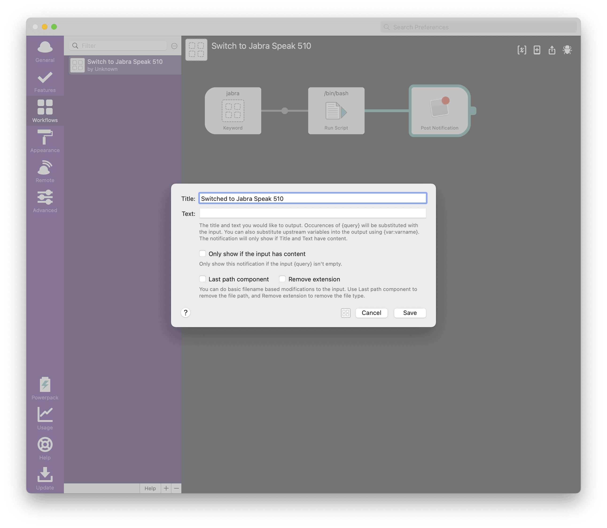


完成したら、Alfredに設定したキーワードを入力し、デバイスが変更できるかを確認しましょう。


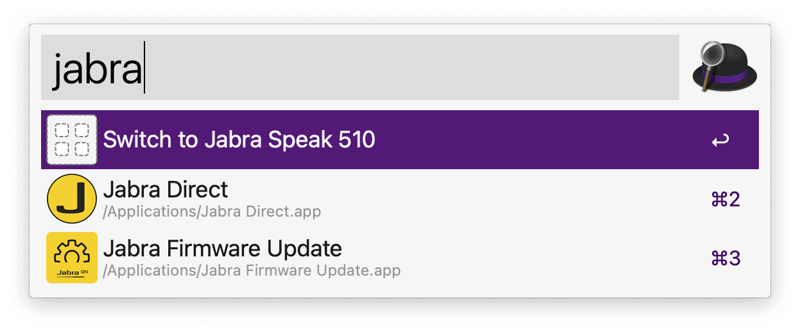


デバイス名を変数にしたり、アイコンを設定したり、お好みでより良くしていきましょう。


## まとめ


switchaudio-osxを使えばコマンドラインからMacのオーディオデバイスを変更することができます。そのため、switchaudio-osxを呼び出すShellスクリプトを Automator Quick Action や Alfred Workflow から呼び出すことで、簡単にオーディオデバイスを変更することができます。
