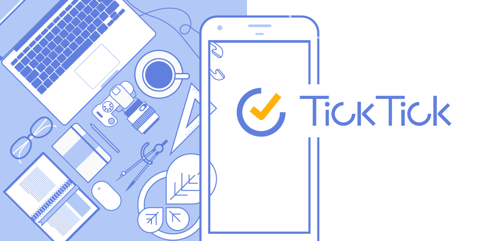
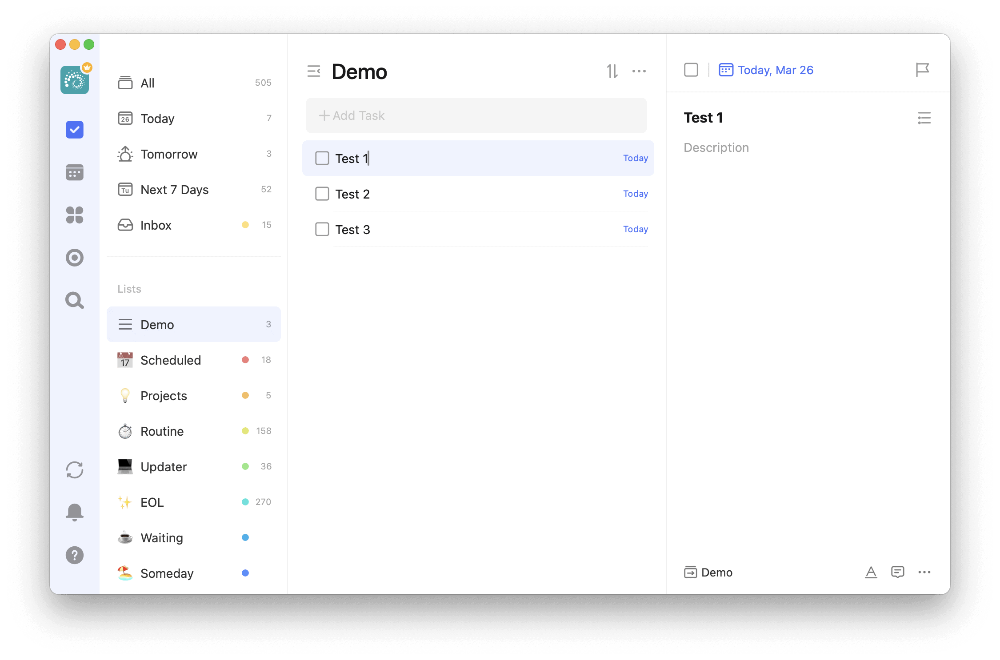
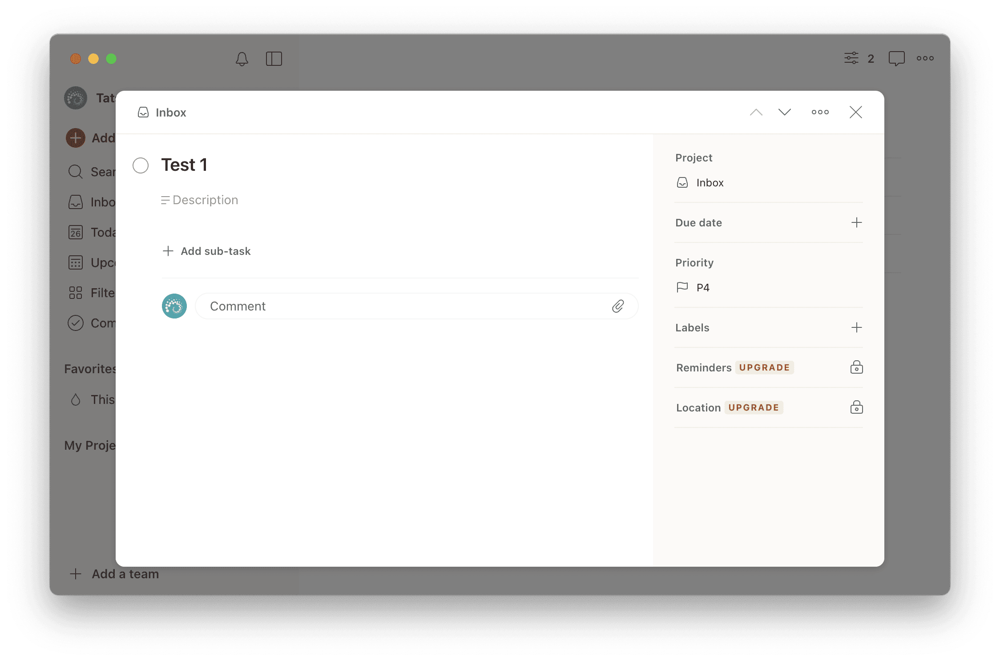
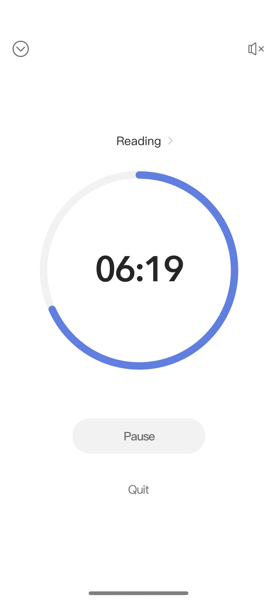

ToDo管理ソフトには [Remember The Milk](https://www.rememberthemilk.com/) (RTM) を2008年から15年以上有償プランで使用していましたが、[TickTick](https://www.ticktick.com/)に乗り換えて1カ月経ちました。RTMは15年間で大きな機能追加があまりなく、「今ならもっと良いToDo管理ソフトはあるのではないか？」と15年間で何度か乗り換えを検討したものの、他ソフトは必須の機能が欠けていたりして乗り換えは実現していませんでした。

機能追加が少ない一方で、2008年には年間$25だった有償プランが、2017年からは$39.99、そして2023年11月からは$49.99に値上げされたため、次の更新を前に乗り換え先を再び探すことにしました。

## TickTickを選んだ理由

乗り換えるに当たって私に必要な要件は以下のとおりでした。

1. 柔軟な繰り返し設定（毎月第一日曜日、月末など）
2. ワンライナーで期限やタグを設定できる（RTMの Smart Add）
3. スマートフォルダーのような検索条件の保存
4. キーボードショートカットで完了
5. 完了直後のUndo
6. 複数タスクをまとめて編集（バッチ処理）
7. 起動画面をInbox以外で保存
8. Mac / iOS / Apple Watch 対応

たとえば [Apple Reminder](https://apps.apple.com/jp/app/%E3%83%AA%E3%83%9E%E3%82%A4%E3%83%B3%E3%83%80%E3%83%BC/id1108187841) や[Things](https://culturedcode.com/things/)はこれらのいずれかを満たさず、全て満たしたのは[Todoist](https://todoist.com/ja)とTickTickでした。TodoistとTickTickの機能は似ており、有償プランの価格もTodoistが年間5,856円、TickTickが App Store からだと年間5,000円（[Web](https://ticktick.com/upgrade)からだと$35.99でちょっと高い）とそれほど変わりません。

大きな違いはユーザーインターフェース (UI) にありました。TickTick for Mac は RTM for Mac 同様、3ペインのUIで、タスクの詳細は右ペインに表示されます。一方、Todoist for Mac はタスクの詳細はモーダルウインドウで表示されます。

TickTick -〈Test 1〉選択時に〈Test 2〉〈Test 3〉も見えている

Todoist -〈Test 1〉選択時に〈Test 2〉〈Test 3〉が見えなくなる

そのため、一つ目のタスクを選択した後、他のタスクを選択したい時、TickTick for Mac と RTM for Mac では他のタスクを選ぶだけで詳細が見られますが、Todoist for Mac では一つ目のタスクの詳細を閉じる必要があります。〈次のタスク〉の矢印とショートカットはありますが、これでは連続しているタスクにしか移動できません。

また、Todoist for Mac のタスクをショートカットで完了させるには〈1. タスクを選ぶ〉〈2. ショートカット〉〈3. タスクを閉じる〉という3ステップが必要です。一方、TickTick for Mac と RTM for Mac では〈1. タスクを選ぶ〉〈2. ショートカット〉という2ステップで済みます。

このように、Todoist for Mac のモーダルウインドウの欠点が目立つ一方、メリットが感じられなかったため、RTMからの移行先はTickTickにしました。

## RTMになくてTickTickにある機能

RTMになくてTickTickにある、私が気に入っている機能をいくつか紹介します。

### Focus

[Focus](https://help.ticktick.com/articles/7055782025193586688)はポモドーロテクニックのための機能です。ToDo管理とポモドーロテクニックは非常に相性が良いので、一つのソフトで管理すべきでしょう。TickTickではポモドーロタイマーだけでなく、そのタスクが何ポモドーロで完了したのか（何分で完了したのか）が自動的に記録されます。また、雨音や虫の音などのホワイトノイズ機能も付いています。タイマーがMacとiOSで同期するので、開始などの制御はMac、表示はiPhoneと使い分けることができます。

### Check Items

RTMでもサブタスクは作れましたが、TickTickではサブタスクに加えて [Check Item](https://help.ticktick.com/articles/7055782408586526720#check-items) が作れます。サブタスクでは全ての子タスクを完了にしても親タスクは自動的に完了になりませんが、Check Item は全ての子タスクを完了にすると、自動的に親タスクも完了になります。

サブタスクは独立したタスクであるため、それぞれに期日やタグを設定できますが、Check Item は独立したタスクではないため、期日などを設定することはできません。サブタスクのほうが上位互換のように思えますが、日常では Check Item で十分なことが多いです。たとえば〈スーパーで買い物〉というタスクに具体的な買ってくる品物のリストを作るとき、サブタスクよりも Check Item のほうが自然です。

### Template

RTMではテンプレートを作れないので、私は海外旅行の持ち物リストを[Obsidian](https://obsidian.md/)で管理していました。しかし、TickTickには[Template](https://help.ticktick.com/articles/7055782408586526720#save-as-template)機能があるので、海外旅行の持ち物リストもTickTickで管理できるようになりました。

### Constant Reminder

RTMのリマインダーは通知音が1回鳴るだけなので気づかないことが多く、信用できませんでした。しかし、TickTickの [Constant Reminder](https://help.ticktick.com/articles/7055782395743567872#constant-reminder) を使うことで、自分で止めるまで鳴らし続けることができます。

### Section

[Section](https://help.ticktick.com/articles/7055782309420597248)はリスト内に作成できるグループです。一つのリストをSectionで分けるときと複数のリストを使い分けるときの違いは、Sectionは Group by Date などにすることでSectionなしにすることもできますが、複数のリストだとまとめて見ることができません。そのため、〈まとめて見ることもあるし、区切りたいときもある〉というときにはSectionが有効です。

### その他

私は使っていないものの、他の方には良さそうな機能をいくつか紹介します。

#### カレンダーとの統合

[カレンダー](https://help.ticktick.com/articles/7055782166172532736)に含まれる予定とToDo管理ソフト内のタスクを一括して管理するという点は理にかなっているのですが、なぜか会社のExchangeにはつながらなかったので使えていません。カレンダーにはGoogle, Outlook, Exchange, iCloud, CalDAV, iCalに対応しています。

#### Kanban View

TickTickは Kanban View にも対応しています。つまり、TickTickで各タスクの状態まで管理できるということです。今後使ってみるかもしれません。

#### Eisenhower Matrix

[アイゼンハワーマトリックス](https://help.ticktick.com/articles/7055782071033135104)は緊急度と重要度の二軸にタスクをプロットして優先度を決める方法です。ただ、アイゼンハワーマトリックスの考えに慣れていると、わざわざマトリックスの画面で見なくても重要度フラグで十分なので、私は使っていません。

#### Habit Tracker

[Habit Tracker](https://help.ticktick.com/articles/7055781896457814016) は日常習慣を管理する機能です。〈水を飲む〉とか〈薬を飲む〉とかもタスクではあるのですが、毎日やることを他のタスクとまとめて管理すると煩雑なので、毎日やることだけ別に管理できるのは良い点です。しかし私は〈水を飲む〉は[Waterllama](https://apps.apple.com/jp/app/waterllama-%E3%82%8F%E3%81%9F%E3%81%97%E3%81%AE%E6%B0%B4-%E6%B0%B4%E5%88%86%E8%A3%9C%E7%B5%A6-%E6%B0%B4/id1454778585)、〈薬を飲む〉は [Apple Healthcare](https://apps.apple.com/jp/app/apple-%E3%83%98%E3%83%AB%E3%82%B9%E3%82%B1%E3%82%A2/id1242545199) といった専用ソフトを使っているので、今のところ使っていません。

#### Desktop Sticky Note

[Desktop Sticky Note](https://help.ticktick.com/articles/7055780431722971136) は、いわゆるポストイット機能です。TickTickのウイドウ内にあるだけでは忘れてしまうのでデスクトップにポストイットを貼っておきたいというときに使えます。

#### Notes

私はあまり必要性を感じていないのですが、[ノート](https://help.ticktick.com/articles/7055780476358754304)（メモ書き）とタスクを一括して管理することもできます。

#### Summary

完了したタスクの[サマリー](https://help.ticktick.com/articles/7055780476358754304#summary)を作成することができます。たとえば別アプリで毎日のアクティビティを記録している人には便利でしょう。

## 移行方法

RTMには書き出し機能があるものの、設定なども含めた1個の巨大なJSONファイルとしてダウンロードされ、パースが面倒そうだったので、[Remember The Milk CSV export script](https://evanhahn.com/remember-the-milk-csv-export-script/) を使用しました。このMilkScriptでは繰り返しやノートは出力できないため、自分で書くことも検討したのですが、`setRecurrence()`はあるものの`getRecurrence()`がないため、繰り返し情報はどうやっても取得できないことに気づきました。

上記MilkScriptで出力されたCSVを Microsoft Excel で読み取るなり、awkなりで、Completed列と Estimate (minustes) 列を削除し、Priority列のMediumなどの文字列を!Mediumに変更します。Due Date 列はそのままで大丈夫です。全行をコピーしてTickTickのタスク追加バーにまとめてペーストすると1行ずつタスクとして登録されます。

あとは日付の自動認識がうまくいかなかったところや、繰り返しやノートなどの移行できなかった情報を手入力して移行完了です。

## まとめ

機能追加の少なさと料金値上げが理由で、15年間使用していた Remember The Milk からTickTickに乗り換えました。TickTickを選んだ主な理由は、必要な機能を全て備えていたことと、UIがRTMに近かったことです。Todoistはモーダルウィンドウでの操作が面倒でした。RTMにない気に入っているTickTickの機能は、ポモドーロタイマー / チェックリスト項目 / テンプレート / 連続リマインダー / セクション機能などです。RTMからの移行にはCSVエクスポートツールを使い、Excelなどで手直ししてTickTickにインポートしました。

|  |  |
| --- | --- |
| 開発元 | [Appest](https://appest.com/) |
| 製品名 | [TickTick](https://www.ticktick.com/home) |
| 販売店 | [App Store](https://apps.apple.com/jp/app/ticktick-todo%E3%83%AA%E3%82%B9%E3%83%88%E3%81%A8%E3%82%BF%E3%82%B9%E3%82%AF%E7%AE%A1%E7%90%86%E3%81%A8%E3%82%AB%E3%83%AC%E3%83%B3%E3%83%80%E3%83%BC/id626144601) |
| 価格 | 年間5,000円 |
| 購入日 | 2024-02-26 |