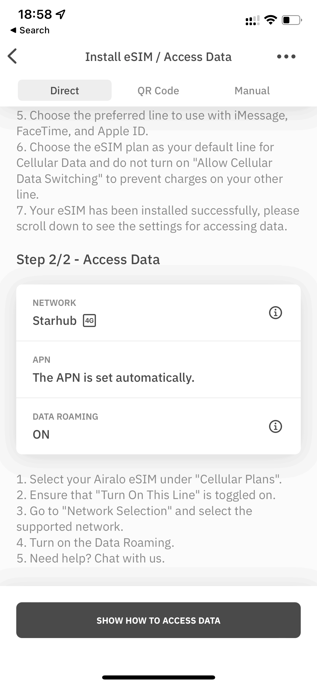

シンガポール出張のデータ通信には、久しぶりに[Airalo](https://t.afi-b.com/visit.php?a=Z14221Y-3467229x&p=o845890r)のeSIMを使いました。シンガポールでのプランは 3GB 30日 が15米ドルで、お手頃です。

現地で iPhone 12 Pro を使ってアクティベートすると、キャリアは[3香港](https://www.three.com.hk/en/home.html) (3HK) であることが分かりました。米国出張で3HKのeSIMが使えなかったので嫌な予感がしますが、やはり米国同様、シンガポールでも圏外のままです。



Airaloに問い合わせると、以下のポイントを確認してほしいとの回答がもらえました。

- 「モバイルデータ通信」に、当該eSIMが選ばれている
- 「データローミング」がオン
- アクティベーションが終わるまで、メインのSIMを一時的にオフ（アクチ後はオンに戻して良い）
- 「モバイルデータ通信ネットワーク」のAPNに mobile.three.com.hk を設定（他項目は空白）
- 「ネットワーク設定」からStarHubを選ぶ
- 端末からeSIMを絶対に削除しない

データローミングがオフになっていたのでオンにしました。以前のiPhoneはデフォルトがオンだった気がするのですが、今はデフォルトがオフなので忘れずにオンにしましょう。私は久しぶりのプリペイドeSIM過ぎて、完全に忘れていました。また、ネットワーク設定は「自動」ではSingtelが選ばれていたので、自動をオフにしてStarHubを手動で選んだところ、問題なくアクティベーションできました。

ただ、「いちいちサポートに聞かないと設定できないのは困るな。StarHubを選べとかどこに書いてあるんだよ」と思いながら調べていたら、I can’t connect with my eSIM on my iOS device - Airalo Help Center というFAQを見つけました。そして、そのFAQに「インストールガイドに書いてあるぞ」とありました。見直してみると……

確かに完璧に書いてありました。どうも、Step 1/2 の Install eSIM の時点で「そんなの知っているよ」と読み飛ばして、Step 2/2 までスクロールしなかったのだと思われます。ちゃんと読まないとダメですね。

## 圏外ではないものの通信できない場合

シンガポール出張が2023年11月にあり、久しぶりにAiraloを使いました。すると、アンテナピクトは立つものの通信できません。これはサブ回線を povo 2.0 から日本通信SIMに乗り換えていたため日本通信のプロファイルがインストールされていたので、Airaloに日本通信SIM用のAPNが設定されているためでした。

AiraloのAPN設定が「The APN is set automatically」で、MVNOを利用していてプロファイルをインストールしている方は、一度そのプロファイルを削除しましょう。

1. 設定 > 一般 > VPNとデバイス管理
2. 「構成プロファイル」からMVNOのプロファイルを選んで「プロファイルを削除」
3. 設定 > モバイル通信 > AiraloのSIM
4. 「モバイルデータ通信ネットワーク」の設定をすべて空欄に
5. 「この回線をオンにする」を一度オフにして、再度オン
6. 「モバイルデータ通信ネットワーク」が自動的に設定されることを確認

私はモバイルデータ通信ネットワークのUsernameがjci@jciになっていて、この問題に気づきました。JCIは Japan Communications Inc.（日本通信）の略です。
