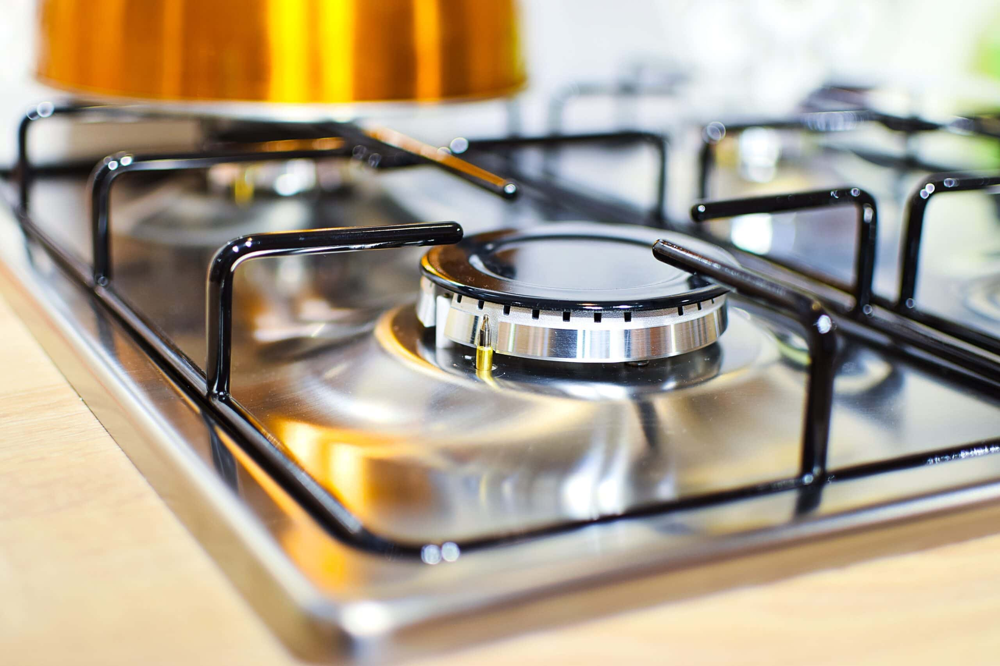

2021年11月から隔週の頻度で掃除代行サービスのCaSyを利用しています。隔週定期の場合、2時間5,738円で、例えばキッチン、トイレ、風呂、洗面所の水回り4点を掃除してくれます。ハウスクリーニングと違う点は、自宅にある洗剤や用具を使用する点です。

CaSyは定期利用だけでなく、2時間6,200円でスポット利用することもできます。初回は試しにスポット利用してみるのが良いでしょう。訪問日時候補を選んで、しばらくすると日時が確定します。訪問日時候補が多ければ、速いときには10分以内に確定しますが、少なすぎるとキャストがマッチングしない可能性があります。あなたの依頼条件を見てキャストが応募する仕組みになっているので、なかなかマッチングしない場合は依頼条件を再考しましょう。

日時が確定したタイミングではキャストの氏名や顔写真は確認できません。キャンセル料が全額負担になる前々日の18時になるとキャストの氏名や顔写真が分かります。また、このタイミングからキャストとチャットができるようになります。

初回のサービスに満足して定期利用を検討する場合は、まずは[キャストお試しオプション](https://casyhelp.zendesk.com/hc/ja/articles/4407772442637-%E3%82%AD%E3%83%A3%E3%82%B9%E3%83%88%E3%81%8A%E8%A9%A6%E3%81%97%E3%82%AA%E3%83%97%E3%82%B7%E3%83%A7%E3%83%B3)が良いでしょう。このオプションをつけると最大5人の異なるキャストが順次セットされます。私の経験では「この人はちょっと……」というキャストは全くいませんでしたが、「こちらが指定した場所を2時間で完璧に仕上げる人」と「こちらが指定した場所を1.5時間で仕上げて、残り30分で他のことをしてくれる人」がいたり、「事前にチャットであいさつをくれる人」と「必要最小限のコミュニケーションで全部やってくれる人」がいたり、依頼者と相性が良い人というのはいるでしょう。

相性が良い人が見つかったら[キャスト指名オプション](https://casyhelp.zendesk.com/hc/ja/articles/360049264551-%E3%82%AD%E3%83%A3%E3%82%B9%E3%83%88%E6%8C%87%E5%90%8D%E3%82%AA%E3%83%97%E3%82%B7%E3%83%A7%E3%83%B3%E3%81%AB%E3%81%A4%E3%81%84%E3%81%A6)をつけて定期利用にすることができます。このオプションは1時間440円ですが、毎回同じキャストが来てくれると洗剤や用具の場所を説明する必要がなくなり、「次回はここをきれいにしましょう」という提案があったりします。一方で、どのキャストでも満足できたので、キャスト指名オプションなしで定期利用にするという判断もあるでしょう。

依頼者の予定が不規則なため、毎週同じ時刻に来てもらうことができない場合は、定期利用ではなくスポット利用が良いでしょう。スポット利用でもキャスト指名オプションをつけることはできます。ただ、あなたが指名したいキャストは人気キャストかもしれず、人気キャストとあなたの予定はなかなかマッチングしないかもしれません。スポット利用の場合は、複数のキャストを指名することができるので、それでマッチングの可能性を高めたほうが良いかもしれません。

キャスト指名オプション付きの定期利用の場合、そのキャストの日時は繰り返し確保されているため、マッチングしないということがなくなります。一方で、依頼者の都合で特定の日にサービスを受けられないということはあるでしょう。その場合、前々日18時までなら無料でキャストに[日時変更依頼](https://casyhelp.zendesk.com/hc/ja/articles/360048780532-%E5%AE%9A%E6%9C%9F%E3%82%B5%E3%83%BC%E3%83%93%E3%82%B9%E3%81%AE%E3%81%86%E3%81%A1-%E4%B8%80%E9%83%A8%E3%81%AE%E3%82%B5%E3%83%BC%E3%83%93%E3%82%B9%E3%81%AE%E6%9B%9C%E6%97%A5%E3%82%84%E6%99%82%E9%96%93%E3%82%92%E5%A4%89%E6%9B%B4%E3%81%97%E3%81%9F%E3%81%84)、または特定日だけのキャンセルができます。

指名している[キャストを変更したくなった](https://casyhelp.zendesk.com/hc/ja/articles/360052167851-%E3%82%AD%E3%83%A3%E3%82%B9%E3%83%88%E3%82%92%E5%A4%89%E6%9B%B4%E3%81%97%E3%81%9F%E3%81%84)場合は定期利用を一度キャンセルし、新たに依頼を出すことで変更できます。

今は私はほぼ毎日在宅勤務のため検討していませんが、コロナ禍前のように平日は毎日出社するようになった場合は、月額1,078円で[鍵預かりオプション](https://casyhelp.zendesk.com/hc/ja/articles/360048782252-%E9%8D%B5%E9%A0%90%E3%81%8B%E3%82%8A%E3%82%AA%E3%83%97%E3%82%B7%E3%83%A7%E3%83%B3%E3%81%AB%E3%81%A4%E3%81%84%E3%81%A6)を利用するかもしれません。これを利用すると、不在でもサービスを実施してくれます。

CaSyを初めて利用する方は、[新規登録](https://casy.co.jp/invite/FBI8C)後にクーポンコード **FBI8C** を適用すると、あなたと私がそれぞれ1,000円分の割引をもらえます。また、Benefit Station が利用できる方は、[こちらのページ](https://bs.benefit-one.co.jp/bs/pages/bs/srch/menuPrticSrchRslt.faces?menuNo=653872)を経由することで、スポット利用が7%オフになります。

|  |  |
| --- | --- |
| サービス | [CaSy](https://casy.co.jp/) |
| 内容 | お掃除代行。2週間に1回。2時間 |
| 支払金額 | 6,618円（= 2,290円 x 2時間 + キャスト指名料400円 x 2時間 + 消費税538円 + 交通費700円） |
| 開始日 | 2021-11-16 |