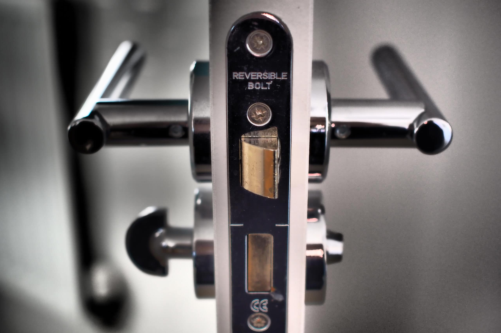
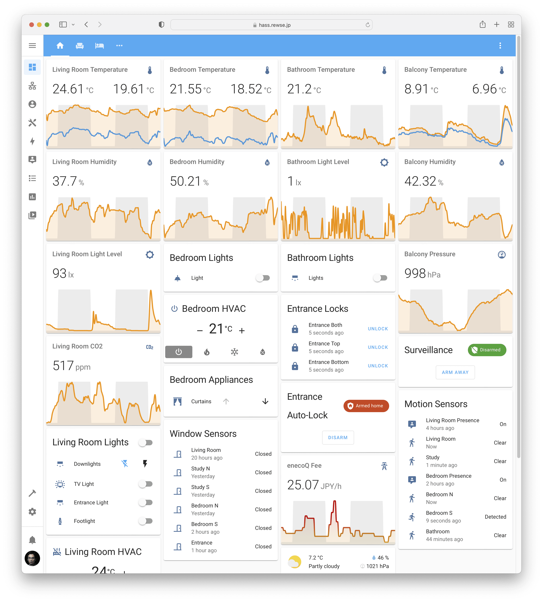
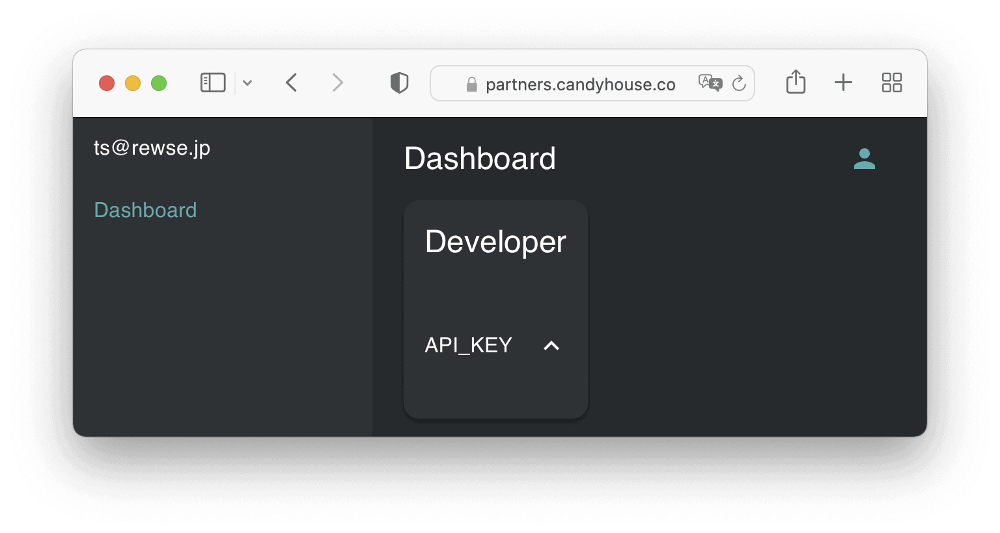
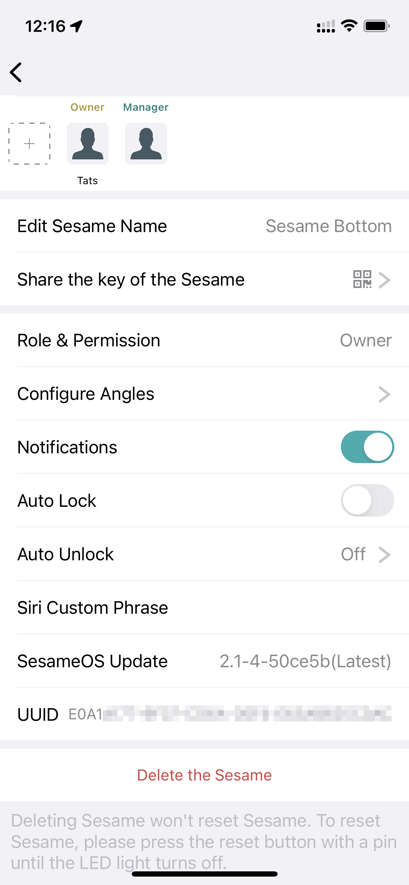
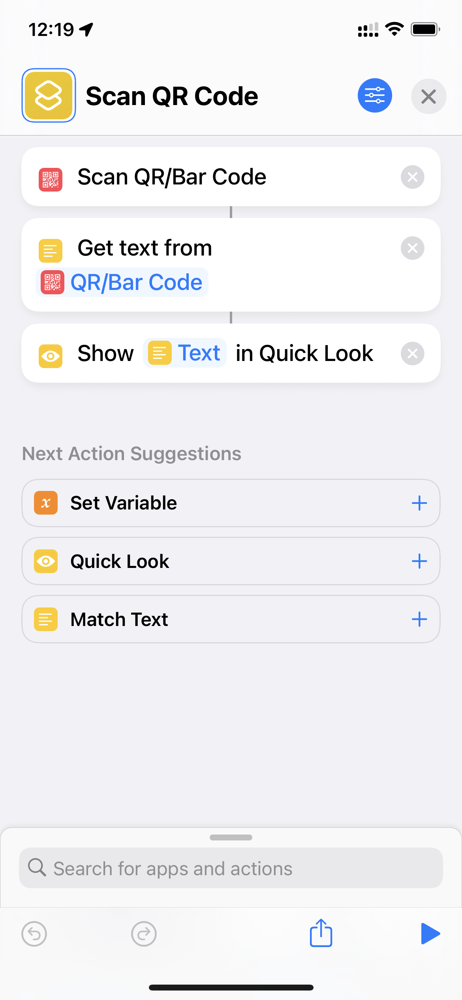
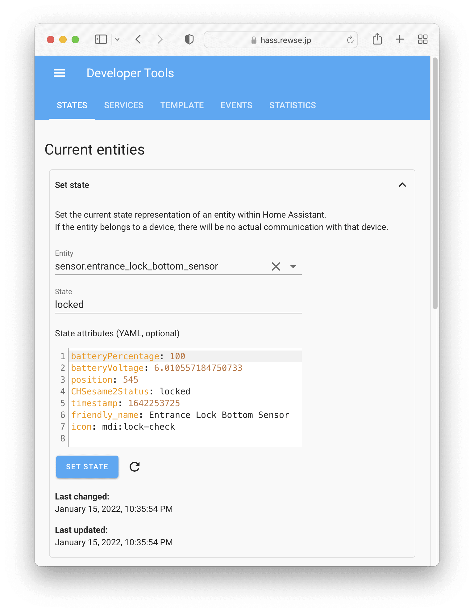
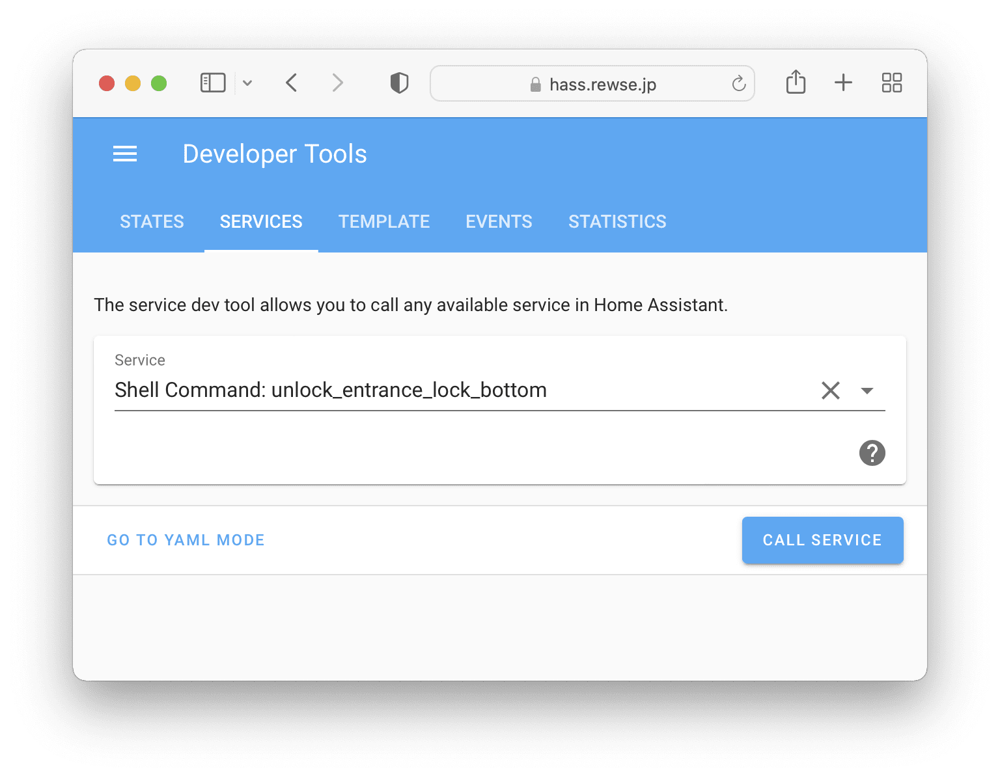
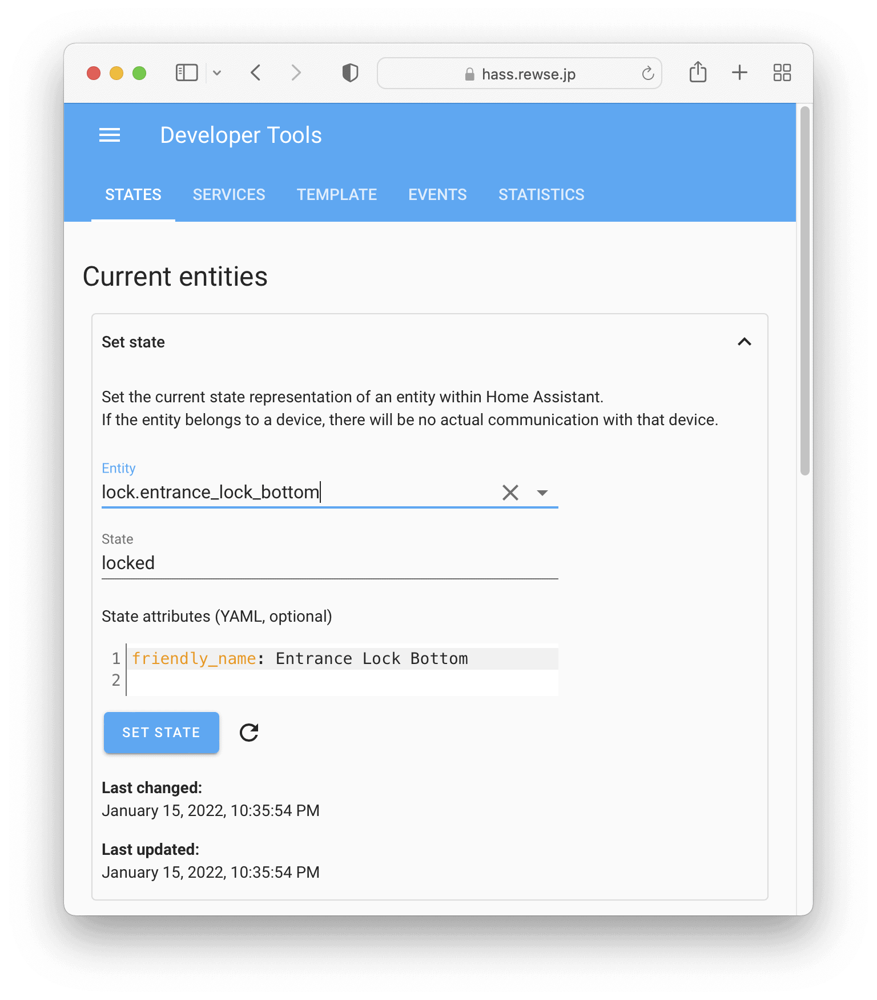
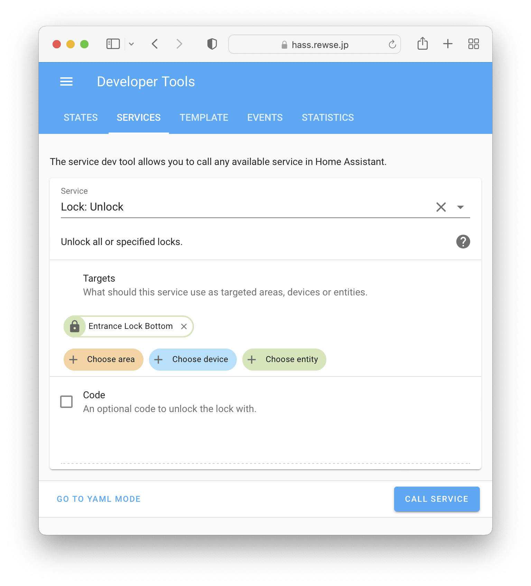
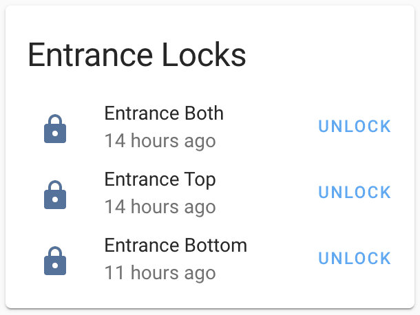

Sesame OS1 を搭載した初代SESAMEと SESAME mini は、[Sesame Smart Lock Integration](https://www.home-assistant.io/integrations/sesame/) を使えばAPIキーを設定するだけで Home Assistant から使用することができます。一方、SESAME 3 や SESAME 4、SESAME bot、SESAMEサイクルなどの Sesame OS2 を搭載したスマートロックは対応していません。そこで、この記事では [Template Lock Integration](https://www.home-assistant.io/integrations/lock.template/) を使うことで、SESAME 4 を Home Assistant に対応させます。




*My Home Assistant in Jan 2022*


## Web API の使用


まずは [Web API](https://doc.candyhouse.co/ja/SesameAPI) のAPIキーを入手します。 <https://partners.candyhouse.co/> にログインして、API\_KEYをクリックします。数分待つとAPIキーが表示されます。





制御したいSESAMEのUUIDを取得します。Sesameアプリから制御したいSESAME > 右上の… を選ぶとUUIDが表示されます。このUUIDはコピーできないので、手書きでメモします。





ここまでで、以下の2つの値が取得できました。


- APIキー: 4Zb4xxxxxxxxxxxxxxxxxxxxxxxxxxxxxxxxxxxx
- UUID: E0A1yyyy-yyyy-yyyy-yyyy-yyyyyyyyyyyy


APIキーとUUIDが取得できたら、SESAMEの状態を取得してみましょう。


```
tats@fox:~$ curl -s -H "x-api-key: 4Zb4xxxxxxxxxxxxxxxxxxxxxxxxxxxxxxxxxxxx" https://app.candyhouse.co/api/sesame2/E0A1yyyy-yyyy-yyyy-yyyy-yyyyyyyyyyyy | jq
{
  "batteryPercentage": 100,
  "batteryVoltage": 6.003519061583578,
  "position": 479,
  "CHSesame2Status": "locked",
  "timestamp": 1642253725,
  "wm2State": true
}
```


つづいて秘密鍵を入手します。UUIDの上にある「このセサミの鍵をシェア」からQRコードを表示して、信頼できるQRコードリーダーで文字列を入手します。iPhoneの場合、Shortcutsアプリから「QR/バーコードをスキャン」、「テキストとして」で「QB/バーコード」、「Quick Look で表示」で「テキスト」の3つを選ぶことで、QRコードからテキストを取得できます。QRコードのスクリーンショットを撮って、それをMacで映したり、印刷したりしたものをShortcutsアプリから読み取りましょう。





以下のような文字列が取得できるので、コピーします。


```
ssm://UI?t=sk&sk=BAAAzzzzzzzzzzzzzzzzzzzzzzzzzzzzzzzzzzzzzzzzzzzzzzzzzzzzzzzzzzzzzzzzzzzzzzzzzzzzzzzzzzzzzzzzzzzzzzzzzzzzzzzzzzzzzzzzzzzzzzzzzzzzFCuL&l=2&n=Sesame%20Bottom
```


`sk=`と`&l`に挟まれた132文字の文字列を使用します。上記の場合、`BAAA[...]FCuL`です。Pythonを起動し、以下を実行します。


```
tats@fox:~$ python3
Python 3.9.9 (main, Nov 21 2021, 03:23:44)
[Clang 13.0.0 (clang-1300.0.29.3)] on darwin
Type "help", "copyright", "credits" or "license" for more information.
>>> import base64
>>> sk = "BAAAxxxxxxxxxxxxxxxxxxxxxxxxxxxxxxxxxxxxxxxxxxxxxxxxxxxxxxxxxxxxxxxxxxxxxxxxxxxxxxxxxxxxxxxxxxxxxxxxxxxxxxxxxxxxxxxxxxxxxxxxxxxxFCuL"
>>> base64.b64decode(sk)[1:17].hex()
'0000cf3cf3cf3cf3cf3cf3cf3cf3cf3c'
```


ここまでで以下の3つの値が取得できました。SESAMEの制御にはこのような3つの値が必要です。


- APIキー: 4Zb4xxxxxxxxxxxxxxxxxxxxxxxxxxxxxxxxxxxx
- UUID: E0A1yyyy-yyyy-yyyy-yyyy-yyyyyyyyyyyy
- 秘密鍵: 0000cf3cf3cf3cf3cf3cf3cf3cf3cf3c


pysesame3というPythonライブラリがありますが、SESAME 4 で使うだけならライブラリを使わなくてもそれほど難しくないため、私は以下のようなスクリプトを用意しました。


/etc/homeassistant/bin/sesame


```
#!/usr/bin/env python3

import base64, datetime, json, requests, sys
from Crypto.Cipher import AES
from Crypto.Hash import CMAC

def main():
    try:
        command = sys.argv[1]
        api_key = sys.argv[2]
        uuid = sys.argv[3]
        secret = sys.argv[4]
    except IndexError:
        print("Usage: sesame <lock|unlock|toggle> <api_key> <uuid> <secret>")
        sys.exit(1)

    if command == "lock":
        cmd = 82
    elif command == "unlock":
        cmd = 83
    else:
        cmd = 88

    history = base64.b64encode("Python".encode()).decode()

    cmac = CMAC.new(bytes.fromhex(secret), ciphermod=AES)
    cmac.update(
        int(datetime.datetime.now().timestamp()).to_bytes(4, "little", signed=False)[1:4]
    )
    sign = cmac.hexdigest()

    url = f'https://app.candyhouse.co/api/sesame2/{uuid}/cmd'
    headers = { "x-api-key": api_key }
    body = {
        "cmd": cmd,
        "history": history,
        "sign": sign
    }

    res = requests.post(url, json.dumps(body), headers=headers)
    print(res.status_code, res.text)

if __name__ == "__main__":
    main()
```


Home Assistant OS を使用している場合は`/usr/local/bin/sesame`に、Home Assistant Container を使用している場合は`/etc/homeassistant/bin`に保存し、実行権限を与えます。


```
tats@fox:~$ sudo chmod 755 /etc/homeassistant/bin/sesame
tats@fox:~$ /etc/homeassistant/bin/sesame --help
Usage: sesame <lock|unlock|toggle> <api_key> <uuid> <secret>
```


解錠してみましょう。


```
tats@fox:~$ /etc/homeassistant/bin/sesame unlock 4Zb4xxxxxxxxxxxxxxxxxxxxxxxxxxxxxxxxxxxx E0A1yyyy-yyyy-yyyy-yyyy-yyyyyyyyyyyy 0000cf3cf3cf3cf3cf3cf3cf3cf3cf3c
```


## Home Assistant の設定


状態の取得には [RESTful Sensor Integration](https://www.home-assistant.io/integrations/sensor.rest/) を使用します。`scan_interval`が小さすぎると、しばらく後に 429 Too Many Requests で `{"message":"Limit Exceeded"}` が返ってきてしまうので、ここでは3600秒（1時間）にしています。この頻度の低さは、あとで対策します。


```
sensor:
  - platform: rest
    name: Entrance Lock Bottom Sensor
    resource: https://app.candyhouse.co/api/sesame2/E0A1yyyy-yyyy-yyyy-yyyy-yyyyyyyyyyyy
    headers:
      x-api-key: 4Zb4xxxxxxxxxxxxxxxxxxxxxxxxxxxxxxxxxxxxxxxxxxxxx
    value_template: '{{ value_json.CHSesame2Status }}'
    json_attributes:
      - batteryPercentage
      - batteryVoltage
      - position
      - CHSesame2Status
      - timestamp
    scan_interval: 3600
```


Home Assistant の Developer Tools > States から値が取得できているか確認しましょう。





制御には [Shell Command Integration](https://www.home-assistant.io/integrations/shell_command/) を使用します。sesameコマンドのパスは、Home Assistant OS ならば`/usr/local/bin`、Home Assistant Container ならば`/config/bin`になります。


```
shell_command:
  lock_entrance_lock_bottom: /config/bin/sesame lock 4Zb4xxxxxxxxxxxxxxxxxxxxxxxxxxxxxxxxxxxx E0A1yyyy-yyyy-yyyy-yyyy-yyyyyyyyyyyy 0000cf3cf3cf3cf3cf3cf3cf3cf3cf3c
  unlock_entrance_lock_bottom: /config/bin/sesame unlock 4Zb4xxxxxxxxxxxxxxxxxxxxxxxxxxxxxxxxxxxx E0A1yyyy-yyyy-yyyy-yyyy-yyyyyyyyyyyy 0000cf3cf3cf3cf3cf3cf3cf3cf3cf3c
```


Home Assistant の Developer Tools > Services から動作するか確認してみましょう。





これらのsensorとshell\_commandを [Template Lock Integration](https://www.home-assistant.io/integrations/lock.template/) で一つにまとめます。


```
lock:
  - platform: template
    unique_id: lock.entrance_lock_bottom
    name: Entrance Lock Bottom
    value_template: "{{ is_state('sensor.entrance_lock_bottom_sensor', 'locked') }}"
    lock:
      service: shell_command.lock_entrance_lock_bottom
    unlock:
      service: shell_command.unlock_entrance_lock_bottom
```


私の家の玄関はダブルロックのため、SESAME 4 を2個使用しています。そのため、この2個をまとめて制御できるように、lock.entrance\_locksも作成しています。


```
lock:
  - platform: template
    unique_id: lock.entrance_lock_bottom
    name: Entrance Lock Bottom
    value_template: "{{ is_state('sensor.entrance_lock_bottom_sensor', 'locked') }}"
    lock:
      service: shell_command.control_lock_entrance_lock_bottom
    unlock:
      service: shell_command.control_unlock_entrance_lock_bottom
  - platform: template
    unique_id: lock.entrance_lock_top
    name: Entrance Lock Top
    value_template: "{{ is_state('sensor.entrance_lock_top_sensor', 'locked') }}"
    lock:
      service: shell_command.control_lock_entrance_lock_top
    unlock:
      service: shell_command.control_unlock_entrance_lock_top
  - platform: template
    unique_id: lock.entrance_locks
    name: Entrance Locks
    value_template: "{{ is_state('sensor.entrance_lock_top_sensor', 'locked') or is_state('sensor.entrance_lock_top_sensor', 'locked') }}"
    lock:
      - service: shell_command.control_lock_entrance_lock_top
      - service: shell_command.control_lock_entrance_lock_bottom
    unlock:
      - service: shell_command.control_unlock_entrance_lock_top
      - service: shell_command.control_unlock_entrance_lock_bottom
```


Developer Tools > States と Developer Tools > Services から Template Lock の動作確認をしましょう。








sensor.entrance\_lock\_bottom\_sensorのscan\_intervalが大きいため、施解錠しても状態がなかなか反映されません。そのため、玄関ドアにZigbeeセンサーをつけ、玄関ドアが閉じた30秒後に SESAME 4 の状態を更新するオートメーションを作成します。ドアを閉めた後に手動で鍵を掛けるまでの時間を待つため、30秒遅らせています。また、その間に何度もドアを開閉する可能性があるため、`mode: restart` にしています。鍵を手動で施解錠したけどドアは開閉しないという状況はあまりないため、ドアの開閉をトリガーに SESAME 4 の状態を取得すれば十分でしょう。


```
- id: automation.update_entrace_lock_states
  alias: Update Entrance Lock States
  mode: restart
  trigger:
    - platform: state
      entity_id: binary_sensor.entrance_door
      from: "on"
      to: "off"
  action:
    - delay:
        seconds: 30
    - service: homeassistant.update_entity
      target:
        entity_id:
          - lock.entrance_lock_bottom
          - lock.entrance_lock_top
```


以上で Home Assistant から SESAME 4 などの Sesame OS2 を搭載したスマートロックを使用できるようになりました。





## Automationのサンプル


Home Assistant から SESAME 4 が使えるようになったため、私は以下のようなAutomationを作成します。


Sesameアプリでもオートロックの設定は可能ですが、以下では、日中は30分後にオートロック、夜間は10分後にオートロックというように、日中と夜間でオートロックまでの時間を変更しています。また、[Manual Alarm Control Panel Integration](https://www.home-assistant.io/integrations/manual/) を使ってalarm\_control\_panel.entrance\_auto\_lockを作成し、これをarmed\_homeにするとオートロックが有効、disarmedにするとオートロックが無効になるようにしました。これによって、簡単に一時的なオートロック無効を行うことができます。最後に、オートロックが作動した30秒後に SESAME 4 の状態を取得しています。SESAME 4 の最新の状態がクラウドから取得できるようになるまで30秒程度必要です。


lock.entrance\_lock\_bottomだけでなく、binary\_sensor.entrance\_door（玄関のドア）が30分閉まり続けていることも条件にしています。この条件がないと、SESAME 4 が解錠された29分後に何も持たずにちょっとした用で外出したときに、その1分後に施錠されてしまって閉め出される可能性があります。オートロックが動くようになると手動で施錠する機会が減るため、1回目の外出で解錠してそのまま、2回目の外出が1回目の29分後という事態は十分にあり得ます。そのため、「SESAME 4 が解錠されて30分経っている AND ドアが30分閉まり続けている」という条件にしています。2回目の外出時のドア開放によってドアが閉まり続けていた時間がリセットされるため、必ず2回目の外出から30分間後にオートロックされるようになります。この2回目に閉め出されかねない問題はSesameアプリを含めたすべてのスマートロック製品のオートロックで発生しますが、Home Assistant でオートロックを実装することで回避できました。


```
alarm_control_panel:  
  - platform: manual  
    name: Entrance Auto-Lock  
    code_arm_required: false  
    delay_time: 0  
    arming_time: 0  
    trigger_time: 0
```


```
- id: automation.auto_lock_entrance_lock_bottom_in_daytime
  alias: Auto-Lock Entrnace Lock bottom in Daytime
  mode: single
  trigger:
    - platform: time_pattern
      minutes: "/5"
      seconds: 5
  condition:
    - condition: state
      entity_id: lock.entrance_lock_bottom
      state: unlocked
      for:
        minutes: 30
    - condition: state
      entity_id: binary_sensor.entrance_door
      state: "off"
      for:
        minutes: 30
    - condition: time
      after: "9:00"
      before: "21:00"
    - condition: state
      entity_id: alarm_control_panel.entrance_auto_lock
      state: armed_home
  action:
    - service: lock.lock
      target:
        entity_id: lock.entrance_lock_bottom
    - delay:
        seconds: 30
    - service: homeassistant.update_entity
      target:
        entity_id: lock.entrance_lock_bottom
- id: automation.auto_lock_entrance_lock_bottom_in_nighttime
  alias: Auto-Lock Entrance Lock Bottom in Nighttime
  mode: single
  trigger:
    - platform: time_pattern
      minutes: "/5"
      seconds: 21
  condition:
    - condition: state
      entity_id: lock.entrance_lock_bottom
      state: unlocked
      for:
        minutes: 10
    - condition: state
      entity_id: binary_sensor.entrance_door
      state: "off"
      for:
        minutes: 10
    - condition: time
      after: "21:00"
      before: "9:00"
    - condition: state
      entity_id: alarm_control_panel.entrance_auto_lock
      state: armed_home
  action:
    - service: lock.lock
      target:
        entity_id: lock.entrance_lock_bottom
    - delay:
        seconds: 30
    - service: homeassistant.update_entity
      target:
        entity_id: lock.entrance_lock_bottom
```


Zigbeeスイッチを玄関モニターに設置し、玄関モニターの前でスイッチを押すと、玄関に到着したときにはダブルロックが解錠されているようにしています。


```
- id: automation.unlock_entrance_locks
  alias: Unlock Entrance Locks
  mode: restart
  trigger:
    - platform: state
      entity_id: sensor.living_room_1_button_switch_action
      to: single
  action:
    - service: lock.unlock
      target:
        entity_id: lock.entrance_locks
    - delay:
        seconds: 30
    - service: homeassistant.update_entity
      target:
        entity_id:
          - lock.entrance_lock_bottom
          - lock.entrance_lock_top
```


娘の通う学校では、登下校時に非接触カードをリーダーにかざすと家族にメールが来るシステムが導入されいます。そのため、このメールが下校時に来たら鍵を開けるようにしています。ただし、誰も在宅していない場合は不用心のため、自動解錠は行いません。また、オートロックが作動する30分以内に帰ってこないことがたまにあるため、このオートメーションがトリガーされたときにはオートロックを一時的に解除しています。


```
- id: automation.info_denshobato
  alias: "INFO: Denshobato"
  mode: single
  trigger:
    - platform: state
      entity_id: sensor.denshobato
  condition:
    - condition: template
      value_template: >-
        {{ (as_timestamp(now()) -
          as_timestamp(states('sensor.denshobato_received_date_time'))) < 180 }}
  action:
    - service: notify.all_devices
      data:
        message: "️{{ states('sensor.denshobato_time') }}に{{ states('sensor.denshobato_action') }}しました"
        data:
          push:
            interruption-level: time-sensitive
    - condition: state
      entity_id: sensor.denshobato_action
      state: 下校
    - condition: or
      conditions:
        - condition: state
          entity_id: person.shibata_tats
          state: home
        - condition: state
          entity_id: person.shibata_wife
          state: home
    - delay:
        minutes: 5
    - service: lock.unlock
      target:
        entity_id: lock.entrance_locks
    - service: alarm_control_panel.alarm_disarm
      target:
        entity_id: alarm_control_panel.entrance_auto_lock
    - delay:
        seconds: 30
    - service: homeassistant.update_entity
      target:
        entity_id:
          - lock.entrance_lock_bottom
          - lock.entrance_lock_top
```


ドアが開くとオートロックは再び有効になります。


```
- id: automation.trun_on_entrance_auto_lock
  alias: Turn on Entrance Auto-Lock
  trigger:
    - platform: state
      entity_id: binary_sensor.entrance_door
      from: "off"
      to: "on"
  action:
    - service: alarm_control_panel.alarm_arm_home
      target:
        entity_id: alarm_control_panel.entrance_auto_lock
```


念のため、オートロックが2時間以上無効な場合は通知するようにしています。


```
- id: automation.info_entrance_auto_lock_is_off
  alias: "INFO: Entrance Auto-Lock is Off"
  trigger:
    - platform: time_pattern
      hours: "/2"
      minutes: 48
      seconds: 13
  condition:
    - condition: state
      entity_id: alarm_control_panel.entrance_auto_lock
      state: disarmed
      for:
        hours: 2
  action:
    - service: notify.tats_devices
      data:
        message: "Entrance Auto-Lock is Off"
        data:
          url: /lovelace/home
          push:
            interruption-level: time-sensitive
```


## まとめ


Template Lock Integration を使うことで、Sesame OS2 を搭載した SESAME 3 や SESAME 4 スマートロックを Home Assistant に対応させることができます。SESAMEが Home Assistant から使えるようになると、SESAMEの標準機能以上に複雑なオートロックの仕組みを作ったり、より高度なスマートホームを実現できます。


## 参考


SESAME3 に対応した Web API の使い方 – くらつきねっと