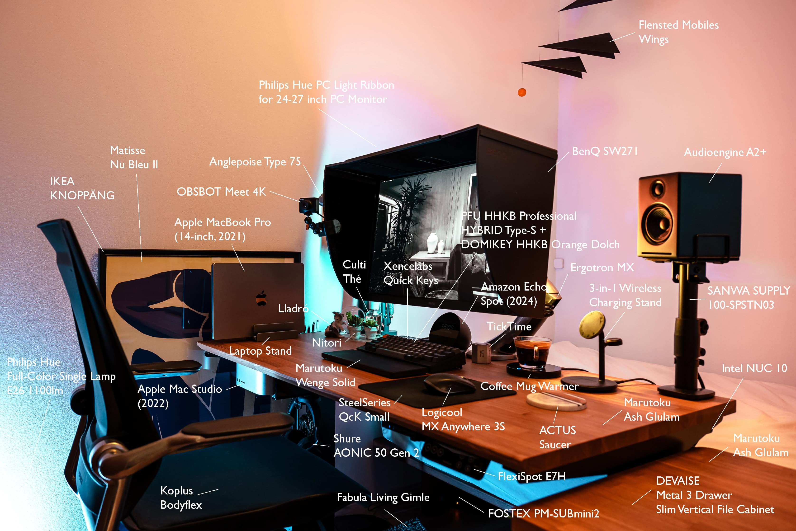
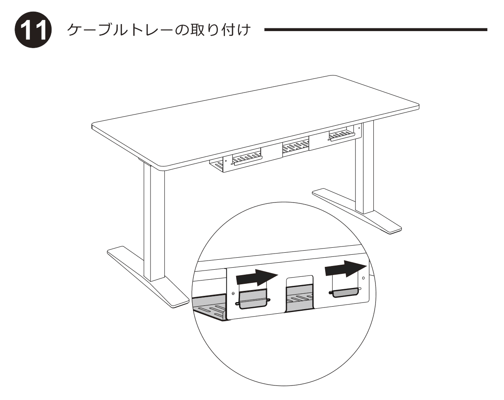
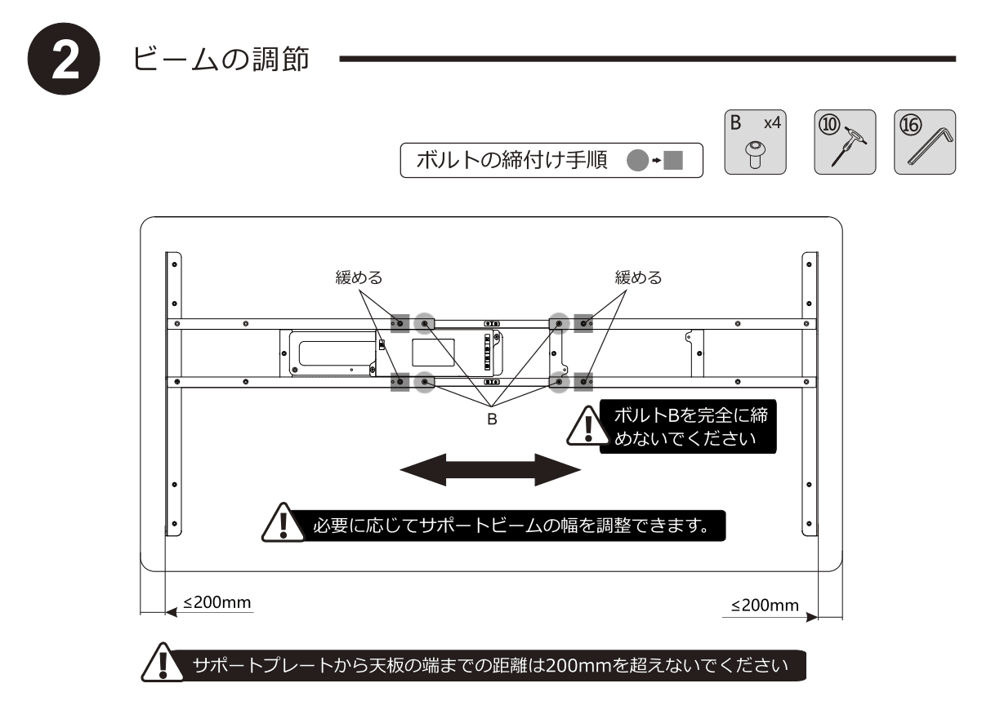

今年は模様替えをして書斎を作りました。それに伴ってデスク回りがいろいろ変わったのでデスクレシピは上記の通りです。

## デスク

[FlexiSpot E7H](https://www.flexispot.jp/e7h.html) 昇降デスクを導入しました。FlexiSpotの中でも、E7Hは耐荷重が2番目に高い160kgです。これは160kg実際に載せるかどうかというよりも、天板を上げたときの揺れの少なさにも関係します。タイピングによってちょっとでも天板が揺れるとモニターがけっこう揺れて気になるところですが、E7Hは安定しています。また、脚の取り付けが差し込み式になったので、鬼目ナットを入れなくても脚が取り外しできるようになりました。

昇降デスクの最適な高さは [机の高さと椅子の座面の高さの関連性 | Bauhütte®](https://www.bauhutte.jp/bauhutte-life/tip2/) に自動計算ツールがあり、身長170cmの人がキーボード作業を行う場合の最適な高さは67cmです。安価な昇降デスクは70cmまでしか下がらなかったりしますが、E7Hは63.5cmまで下がる点も特徴です。

天板は [MARUTOKU SHOP タモ集成材](https://shop.woodworks-marutoku.com/cart/multi_order.php?g_goodtype=2&g_good=21) にしました。サイズは1,200 × 600 × 25mm です。木目が表れた天板にしたかったので、木目の美しいタモをランダムに並べた集成材にしました。エレガントすぎず、カジュアルすぎない良いバランスだと思います。塗装は水に強いウレタンクリアーにしました。MARUTOKU SHOP のウレタン塗装は木材の凹凸を感じられてオイル塗装と変わらない見た目です。

こだわった点は、ダイニングテーブルとして使用している [arflex](https://www.arflex.co.jp/) AURORA を参考に、手前側の面取りを[B面](https://shop.woodworks-marutoku.com/shared/blog/images/detail/POP3.html)（船底面）にしたところです。基本的に天板は厚いほうが高級感が出ますが、B面はシャープでエレガントな印象になることで、天板が薄くてもバランスが取れます。全面ともB面でも良かったのですが、クランプでいろいろ付ける将来を考えて手前以外は糸面にしています。

組み立ては大人一人で1時間ほどでできます。ケーブルトレーは説明書の通りだとクランプが付けられなくなるので、前後反対に付けています。おかげで再ケーブリング時のメンテナンス性も良くなりました。

一方、足元が広いほうが良いだろうと、サポートプレートは天板の端から20mmのところに付けたのですが、横にクランプが付けられないことに後で気づきました。60mmくらいあったほうが良いでしょう。あと、B面にしていたことでコントローラーが出っ張っていなかったので助かりましたが、最後にデスクをひっくり返すときに手前側を下にして回すとコントローラーが壊れることに、ひっくり返した後に気づきました。

E7Hが34.9kg + 天板が21.9kg = 合計56.8kgという非常に重いデスクですが、おかげで安定感があります。アジャスターを付けずに大型フットパッドの状態で、フローリングでも徐々に滑ることはないけど、強く押せば移動できるくらいのちょうどよい摩擦になっています。

もともと使っていた [DEVAISE Metal 3 Drawer Slim Vertical File Cabinet with Lock](https://www.devaise.com/products/devaise-3-drawer-slim-mobile-file-cabinet-with-lock-legal-letter-size-white?variant=37783703093435) の天板に、デスクに合わせて厚さ20mmのタモ集成材を貼りました。これによってデスクとの統一感が出ただけでなく、キャビエットが移動式サイドデスクのようになり、ちょっとした作業で便利に使う気分になりました。キャビネットの天板は [ニトムズ 強力両面テープ No.541](https://www.nitoms.com/products/proself_dbst_str/) で貼っています。発泡ブチルゴム系の両面テープで、厚さが0.75mmとちょうど良く、私が一番信頼している両面テープです。





|  |  |
| --- | --- |
| ブランド | [FlexiSpot](https://www.flexispot.jp/) |
| 製品名 | [E7H](https://www.flexispot.jp/e7h.html) |
| 購入場所 | [FlexiSpotヤフー店 - Yahoo!ショッピング](https://store.shopping.yahoo.co.jp/loctek/e7h.html) |
| 購入価格 | 59,000円（- 9,111円相当ポイント還元） |
| 購入日 | 2024-06-09 |

|  |  |
| --- | --- |
| 製品名 | [タモ集成材 フリーカット](https://shop.woodworks-marutoku.com/cart/multi_order.php?g_goodtype=2&g_good=21) |
| 仕様 | 1,200mm × 600mm × 25mm, 面[A]: 糸面 + 磨き, 面[B]: 糸面 + 磨き, 面[C]: B面 + 磨き, 面[D]: 糸面 + 磨き, 反り止め: 無し, 塗装: ウレタンクリアー 裏捨て塗り（ツヤ全消し）, 用途: 三方向使用 |
| 購入場所 | [MARUTOKU SHOP](https://shop.woodworks-marutoku.com/cart/multi_order.php?g_goodtype=2&g_good=21) |
| 購入価格 | 20,230円 |
| 購入日 | 2024-06-03 |
| 納品日 | 2024-06-22 |

|  |  |
| --- | --- |
| 製品名 | [タモ集成材 フリーカット](https://shop.woodworks-marutoku.com/cart/multi_order.php?g_goodtype=2&g_good=21) |
| 仕様 | 306 × 506 × 25mm, 面[A]: 糸面 + 磨き, 面[B]: 糸面 + 磨き, 面[C]: 糸面 + 磨き, 面[D]: 糸面 + 磨き, 反り止め: 無し, 塗装: ウレタンクリアー 裏捨て塗り（ツヤ全消し）, コーナーR[A]: 25mm, コーナーR[B]: 25mm, コーナーR[C]: 25mm, コーナーR[D]: 25mm, 用途: 三方向使用 |
| 購入場所 | [MARUTOKU SHOP](https://shop.woodworks-marutoku.com/cart/multi_order.php?g_goodtype=2&g_good=21) |
| 購入価格 | 6,680円 |
| 購入日 | 2024-08-14 |
| 納品日 | 2024-09-14 |

|  |  |
| --- | --- |
| ブランド | [DEVAISE](https://www.devaise.com/) |
| 製品名 | [Metal 3 Drawer Slim Vertical File Cabinet with Lock](https://www.devaise.com/products/devaise-3-drawer-slim-mobile-file-cabinet-with-lock-legal-letter-size-white?variant=37783703093435) |
| 購入場所 | Amazon |
| 購入価格 | 11,980円 |
| 購入日 | 2018-09-13 |

## チェア

チェアは、Amazonで激安で売っている時に買った [Koplus Bodyflex](https://www.koplus.com/en/products/bodyflex) です。オランダブランドの美しいデザインと、座面が硬めなのにお尻が痛くならない絶妙さで、ずっと座っていられます。



|  |  |
| --- | --- |
| ブランド | [Koplus](https://www.koplus.com/) |
| 製品名 | [Bodyflex](https://www.koplus.com/en/products/bodyflex) |
| 購入場所 | [Amazon](https://amzn.to/40f1lIs) |
| 購入価格 | 23,056円 |
| 購入日 | 2018-11-07 |

## コンピューター

個人用Macの [Apple Mac Studio (2022)](https://support.apple.com/ja-jp/111900) は、床に置いておくと昇降デスクを上げたときのためにケーブルを長く取らないといけない一方、机上に置いておくには邪魔なサイズなので、AliExpressで売っていた [For Mac Studio Desktop/Wall-mounted Mount Holder](https://www.aliexpress.com/item/1005006331011386.html) でつり下げています。しっかりした厚みのアクリル製で、内側には発泡ウレタンが貼ってあり、AliExpressの品揃えの豊富さを見せつけられます。

業務用Macの [Apple MacBook Pro (14-inch, 2021)](https://support.apple.com/ja-jp/111902) もつり下げることは不可能ではなかったのですが、頻繁に持ち運ぶので机上に置いています。こちらもAliExpressで売っていたアルミ製の [Laptop Stand Foldable Aluminum Vertical Notebook Holder](https://s.click.aliexpress.com/e/_opadH1z) で、[Apple iPad Air (5th generation)](https://www.apple.com/jp/ipad-air/) と一緒に立てています。

Windows 11 の入った [Intel NUC 10 Performance kit NUC10i5FNH](https://www.intel.co.jp/content/www/jp/ja/products/sku/189239/intel-nuc-10-performance-kit-nuc10i5fnh/specifications.html) も持っており、こちらは FlexiSpot E7H のケーブルトレーに置いています。

|  |  |
| --- | --- |
| 製品名 | For Mac Studio Desktop/Wall-mounted Mount Holder Wall Mounted |
| 購入場所 | [Hand-Woven Store - AliExpress](https://www.aliexpress.com/item/1005006331011386.html) |
| 購入価格 | 2,271円 |
| 購入日 | 2024-06-21 |

|  |  |
| --- | --- |
| 製品名 | Laptop Stand Foldable Aluminum Vertical Notebook Holder 3 gray |
| 購入場所 | [CARRIEE Official Store - AliExpress](https://s.click.aliexpress.com/e/_opadH1z) |
| 購入価格 | 1,871円 |
| 購入日 | 2024-06-21 |

## 入力デバイス

キーボードは [PFU HHKB Professional HYBRID Type-S](https://happyhackingkb.com/jp/products/hybrid_types/) 英語配列 墨 に [DOMIKEY](https://domikey.com/) HHKB Orange Dolch というキーボードキャップを付けています。HHKB用のキーボードキャップをリリースしてくれているDOMIKEYは貴重です。HHKBは一時期Bluetoothでつないでいたのですが、いちいちスリープから解除しないといけないのが面倒で、今はUSB接続しています。

パームレストは [MARUTOKU SHOP ウエンジ無垢材](https://shop.woodworks-marutoku.com/types/wenge/) で作りました。天板とのコントラストを出したかったため、ダークカラーの木材を選んでいます。ウエンジはさらさらした肌触りなので、パームレストにちょうど良いです。底面の滑り止めには [滑り止めゴム足クッション](https://amzn.to/41OUWFl) を使っており、全く滑りません。

キーボードの左奥には [Xencelabs Quick Keys](https://www.xencelabs.com/jp/store/accessories/xencelabs-quick-keys-remote) を置いています。ペンタブレット用の左手デバイスですが、ディスプレイ付きボタンと物理ダイアルという組合わせがショートカットキーボードとして有用です。[Elgato Stream Deck](https://www.elgato.com/jp/ja/p/stream-deck-mk2-black) が有名ですが、Quick Keys は物理ダイアルで音量調整できる点がとても良いです。[Keyboard Maestro](https://www.keyboardmaestro.com/main/) と組み合わせることで複雑なショートカットを作れます。

マウスは [Logicool MX Anywhere 3S](https://www.logicool.co.jp/ja-jp/products/mice/mx-anywhere-3s.html)、マウスパッドは [SteelSeries QcK](https://jp.steelseries.com/gaming-mousepads/qck-series) Small です。Webカメラはクラウドファンディングで購入した [OBSBOT Meet 4K](https://www.obsbot.com/jp/obsbot-meet-4k-pc-camera) です。Meet 4K のマイクはけっこう優秀なので、メインのマイクはこれです。















|  |  |
| --- | --- |
| ブランド | [PFU](https://www.pfu.ricoh.com/) |
| 製品名 | [HHKB Professional HYBRID Type-S](https://happyhackingkb.com/jp/products/hybrid_types/) 英語配列 墨 |
| 型番 | PD-KB800BS |
| 購入場所 | [PFUダイレクト - Yahoo!ショッピング](https://store.shopping.yahoo.co.jp/pfudirect/pd-kb800bs.html) |
| 購入価格 | 35,200円（- 2,760円相当ポイント還元） |
| 購入日 | 2021-05-09 |

|  |  |
| --- | --- |
| ブランド | [DOMIKEY](https://domikey.com/) |
| 製品名 | HHKB Orange Dolch |
| 購入場所 | [KPrepublic Store - AliExpress](https://www.aliexpress.com/item/4000095659889.html) |
| 購入価格 | 60.56米ドル |
| 購入日 | 2021-05-09 |

|  |  |
| --- | --- |
| 製品名 | ウエンジ無垢材 フリーカット |
| 仕様 | 294 × 100 × 11mm, 面[A]: 上R面 (3R) + 下糸面 + 磨き, 面[B]: 上R面 (3R) + 下糸面 + 磨き, 面[C]: 上R面( 3R) + 下糸面 + 磨き, 面[D]: 上R面 (3R) + 下糸面 + 磨き, 反り止め:無し, 塗装: ウレタンクリアー 裏捨て塗り（ツヤ全消し）, コーナーR[C]: 10mm, コーナーR[D]: 10mm, 用途: 三方向使用 |
| 購入場所 | [MARUTOKU SHOP](https://shop.woodworks-marutoku.com/) |
| 購入価格 | 3,080円 |
| 購入日 | 2024-08-14 |
| 納品日 | 2024-09-14 |

|  |  |
| --- | --- |
| ブランド | [Xencelabs](https://www.xencelabs.com/jp/) |
| 製品名 | [Quick Keys](https://www.xencelabs.com/jp/products/xencelabs-quick-keys-remote) |
| 購入場所 | [Amazon](https://amzn.to/40c3If8) |
| 購入価格 | 9,980円 |
| 購入日 | 2021-10-25 |

|  |  |
| --- | --- |
| ブランド | [Logicool](https://www.logicool.co.jp/ja-jp) |
| 製品名 | [MX Anywhere 3S](https://www.logicool.co.jp/ja-jp/products/mice/mx-anywhere-3s.910-006941.html) |
| 型番 | MX1800GR |
| 購入場所 | [ロジクール公式ストア - Yahoo!ショッピング](https://store.shopping.yahoo.co.jp/logicool/4943765062080.html) |
| 購入価格 | 12,065円（- 1,531円相当ポイント還元） |
| 購入日 | 2021-05-09 |

|  |  |
| --- | --- |
| ブランド | [SteelSeries](https://jp.steelseries.com/) |
| 製品名 | [QcK](https://jp.steelseries.com/gaming-mousepads/qck-series) Small |
| 型番 | 63005 |
| 購入場所 | [Amazon](https://amzn.to/40em938) |
| 購入価格 | 993円 |
| 購入日 | 2024-02-01 |

|  |  |
| --- | --- |
| ブランド | [OBSBOT](https://www.obsbot.com/jp) |
| 製品名 | [OBSBOT Meet 4K](https://www.obsbot.com/jp/obsbot-meet-4k-pc-camera) |
| 購入場所 | [Indiegogo](https://www.indiegogo.com/projects/obsbot-meet-ai-virtual-background-4k-webcam#/) |
| 購入価格 | 1,130香港ドル（19,200円） + 送料 117香港ドル （2,000円） |
| 購入日 | 2021-10-03 |
| 納品日 | 2022-05-10 |

## 出力デバイス

モニターは 27インチ 4K Adobe RGB 99% 対応カラーマネジメントモニターの [BenQ SW271](https://www.benq.com/ja-jp/business/monitor/sw271.html) です。一度 Adobe RGB 対応モニターを使ってしまうとsRGBには戻れないのですが、最近は Display P3 (DCI-P3) 対応モニターも増えてきたので、後継機種はそちらでも良いかもしれません。遮光フードはSW271純正です。フードを付けると外光などの影響を抑えられるのはもちろん、画面に集中できる効果があります。逆に言うと見通しが悪いのですが。

モニターアームには [Ergotron MX Desk Monitor Arm](https://www.ergotron.com/ja-jp/%E8%A3%BD%E5%93%81/%E8%A3%BD%E5%93%81%E8%A9%B3%E7%B4%B0/45-214#?%E8%89%B2=%E3%82%A2%E3%83%AB%E3%83%9F%E8%89%B2) を使っています。SW271の重量的には [Ergotron LX Desk Monitor Arm](https://www.ergotron.com/ja-jp/%E8%A3%BD%E5%93%81/%E8%A3%BD%E5%93%81%E8%A9%B3%E7%B4%B0/45-241#?%E8%89%B2=%E3%82%A2%E3%83%AB%E3%83%9F%E8%89%B2&attachment%20option=2-Piece%20Clamp) が最適なのですが、MXの曲線が好きでこちらを使っています。SW271はそこそこ重いので大丈夫でしたが、軽すぎるモニターだとMXでは持ち上がってしまうかもしれません。また、LXのほうがMXよりも可動域は大きいです。

デスクトップスピーカーは今まであまり納得がいかず、数年で買い替えることが多かったのですが、今年買った [Audioengine A2+ Home Music System w/ Bluetooth aptX](https://audioengine.com/shop/wirelessspeakers/a2-wireless-computer-speakers/) と [FOSTEX PM-SUBmini2](https://www.fostex.jp/products/pm-submini2/) の組合せは、価格を大きく超えた音質が作れて満足しています。また、[SANWA SUPPLY 100-SPSTN03](https://direct.sanwa.co.jp/ItemPage/100-SPSTN03) でA2+のツイーターを耳の高さにすることも大きな効果がありました。モニター以外に高さが出て、見た目にも良いアクセントになっています。

今年買い替えた [Shure AONIC 50 Gen 2](https://www.shure.com/ja-JP/products/headphones/aonic50) ヘッドホンは FlexiSpot E7H の脚にAliExpressで買った [Sticky ABS Headphone Bracket Wall Mounted](https://s.click.aliexpress.com/e/_opVcKX9) でぶら下げていますが、デスクで使うことはあまりなく、主にリビングで使っています。

















|  |  |
| --- | --- |
| ブランド | [BenQ](https://www.benq.com/ja-jp/index.html) |
| 製品名 | [SW271](https://www.benq.com/ja-jp/business/monitor/sw271.html) |
| 購入場所 | [Amazon](https://amzn.to/4gXF9bD) |
| 購入価格 | 98,315円 |
| 購入日 | 2019-10-29 |

|  |  |
| --- | --- |
| ブランド | [Ergotron](https://www.ergotron.com/ja-jp/) |
| 製品名 | [MX Desk Monitor Arm](https://www.ergotron.com/ja-jp/%E8%A3%BD%E5%93%81/%E8%A3%BD%E5%93%81%E8%A9%B3%E7%B4%B0/45-214#?%E8%89%B2=%E3%82%A2%E3%83%AB%E3%83%9F%E8%89%B2) |
| 型番 | 45-214-026 |
| 購入場所 | [ヨドバシカメラ](https://www.yodobashi.com/product-detail/100000001001061621/) |
| 購入価格 | 16,830円 |
| 購入日 | 2021-02-25 |

|  |  |
| --- | --- |
| ブランド | [Audioengine](https://audioengine.com/) |
| 製品名 | [A2+ Home Music System w/ Bluetooth aptX](https://audioengine.com/shop/wirelessspeakers/a2-wireless-computer-speakers/) |
| 購入場所 | [Amazon](https://amzn.to/3Ah30Tq) |
| 購入価格 | 32,736円（- 4,092円相当ポイント還元） |
| 購入日 | 2024-06-28 |

|  |  |
| --- | --- |
| ブランド | [FOSTEX](https://www.fostex.jp/) |
| 製品名 | [PM-SUBmini2 Active Subwoofer](https://www.fostex.jp/products/pm-submini2/) |
| 購入場所 | [ビックカメラ](https://www.biccamera.com/bc/item/3238538/) |
| 購入価格 | 25,300円（- 2,530円相当ポイント還元） |
| 購入日 | 2024-08-14 |

|  |  |
| --- | --- |
| ブランド | [サンワサプライ](https://www.sanwa.co.jp/) |
| 製品名 | [100-SPSTN03 スピーカースタンド 小型用・クランプ式](https://direct.sanwa.co.jp/ItemPage/100-SPSTN03) |
| 購入場所 | [サンワダイレクト – Yahoo!ショッピング](https://store.shopping.yahoo.co.jp/sanwadirect/100-spstn03.html) |
| 購入価格 | 5,380円（- 343円相当ポイント還元） |
| 購入日 | 2024-08-12 |

|  |  |
| --- | --- |
| ブランド | [Shure](https://www.shure.com/ja-JP) |
| 製品名 | [AONIC 50 Gen 2](https://www.shure.com/ja-JP/products/headphones/aonic50) |
| 型番 | SBH50G2-BK-J |
| 購入場所 | [ヨドバシカメラ マルチメディア新宿東口](https://www.yodobashi.com/ec/store/0013/) |
| 購入価格 | 55,000円（-5,500円相当ポイント還元） |
| 購入日 | 2023-12-28 |

## 照明

天井のローゼットからは [Philips Hue Full-Color Single Lamp E26 1100lm (Gen 2) LCT007](https://www.philips-hue.com/ja-jp/p/hue-white-and-color-ambiance-a60---e26-smart-bulb---1100/8719514457478) を [IQ Light](https://iqlight.com/) ランプシェードに入れています。これで部屋全体の光量を確保していますが、私が大好きな『[Delicious Lighting](https://amzn.to/4fGqlwV)』に従って間接照明も多く置いています。

日本の住宅では天井真ん中のシーリングライトだけで明るさを確保している部屋が多いですが、これは部屋の中心、つまり〈人間が照らされています〉。一方、例えば外資系ホテルの部屋だと、たくさんの間接照明で全体の光量を確保し、〈壁を照らしています〉。目線より下の壁を照らすことを意識して照明を置くと、雰囲気が断然良くなります。特にシーリングライトだけだと部屋の角が部屋の中で一番暗いので、そこを間接照明で明るくするだけでも違います。

一つ目の間接照明は [Philips Hue PC Light Ribbon for 24-27 inch PC Monitor LCX005](https://www.philips-hue.com/ja-jp/p/lightstrips-play-gradient-lightstrip-for-pc/8719514434790) です。これによって、モニターから120cm先の部屋の角が大きく柔らかく明るくなりました。また、スマート照明のマルチカラーは最初は楽しいのですが「こんなピンクの色相にする機会ってある？？」となって、結局普通の電球色で使っている人が多いと思います。しかし、この Light Ribbon は1個の照明器具で複数の色相が出せるようになったことで、部屋の中でたくさんの色相を混ぜることが簡単にできるようになりました。自然界では反射などによってたくさんの色相が混ざっているので、色相を混ぜるとより自然になり、「Hueが実現したかった空間ってこれだろうな」という気持ちになります。

同様に、上記レシピには写っていない側のチェストの裏にに [Philips Hue Gradation Light Ribbon LCX004](https://www.philips-hue.com/ja-jp/p/hue-white-and-color-ambiance-gradient-lightstrip-extension-1-meter/046677582562) を貼っています。これで反対側の壁と角が明るくなりました。この Light Ribbon も一本で複数の色相を出せます。

そして、チェアの後ろに置いてある空気清浄機の裏に [ELPA コード付ソケット KP-M2615H(BK)](https://amzn.to/4fCmcKf) を置いて、[Philips Hue Full-Color Single Lamp E26 1100lm](https://www.philips-hue.com/ja-jp/p/hue-white-and-color-ambiance-a60---e26-smart-bulb---1100/8719514457478) LCA007 を立てています。これによって、三つ目の角が小さく強く照らされました。この角は部屋に入って一番最初に見える角なので、空気清浄機がシェード代わりになることでコントラストが出た見栄えになって良い感じです。

四つ目の角にはドアがあるので後回しになっていますが、何か良いものがないか探しているところです。書き物などで手元を明るくしたいときは、だいぶ昔に購入した [Anglepoise Type 75 Mini Desk Lamp](https://www.anglepoise.com/product/type-75-mini-desk-lamp-slate-grey/) を使っています。

このように日常では4個の Philips Hue を使用しています。ホテルの間接照明だと一個一個スイッチを入れるのが面倒だったりしますが、[Philips Hue Dimmer Switch](https://www.philips-hue.com/ja-jp/p/hue-dimmer-switch--latest-model-/8719514274655) RWL021 で同時に制御ができるので、多灯のデメリットがなくなっています。色相に色が付いていると写真編集に悪影響が出ますが、これもまとめて白色に変更できます。一方、Philips Hue は演色性が良くはない点が気になるところなのですが、演色性の高いマルチカラースマート照明を見つけられていません。

時間帯によって色温度や照度を自動的に変えるだけでなく、特に深夜は [City of Love](https://scenesharing.meethue.com/data/?eAFtjEEKwzAMBP-yZ7lIthxZ_krJxYkLvRV6DP57DS0U2lyGZQb2wB0VzVKx2DzcFpWge8mhdNuCSdTmqTvvDMID9Xpgm0xOTDHnldBQNQ96eyY_9ULiehamIhElTafFIsXyW_T_RhNP1VGF8ETlSx7rZy2cxPTL8QIPjDpH) というシーンにするのが好きです。このシーンにすると、ペンダントライトは満月、PC Light Ribbon はろうそくのように揺らめき、遠くの Gradation Light Ribbon は青から黄色にグラデーションで光って夜景のように見え、足元のライトは強く小さくオレンジに光って、マルチカラーの価値を感じます。

なお、上記デスクレシピの写真は撮影用にあえて派手なシーンにしています。











|  |  |
| --- | --- |
| ブランド | [Philips Hue](https://www.philips-hue.com/ja-jp) |
| 製品名 | [Full-Color Single Lamp E26 1100lm (Gen 2)](https://www.philips-hue.com/ja-jp/p/hue-white-and-color-ambiance-a60---e26-smart-bulb---1100/8719514457478) |
| 型番 | LCT007 |
| 購入場所 | [Amazon](https://amzn.to/3VXmdSd) |
| 購入価格 | 4,734円 |
| 購入日 | 2024-07-14 |

|  |  |
| --- | --- |
| ブランド | [Philips Hue](https://www.philips-hue.com/ja-jp) |
| 製品名 | [PC Light Ribbon for 24-27 inch PC Monitor](https://www.philips-hue.com/ja-jp/p/lightstrips-play-gradient-lightstrip-for-pc/8719514434790) |
| 型番 | LCX005 |
| 購入場所 | [Amazon](https://amzn.to/3VXmdSd) |
| 購入価格 | 20,554円 |
| 購入日 | 2024-07-14 |

|  |  |
| --- | --- |
| ブランド | [Philips Hue](https://www.philips-hue.com/ja-jp) |
| 製品名 | [Gradation Light Ribbon](https://www.philips-hue.com/ja-jp/p/hue-white-and-color-ambiance-gradient-lightstrip-extension-1-meter/046677582562) |
| 型番 | LCX004 |
| 購入場所 | [Amazon](https://amzn.to/4gOSPGl) |
| 購入価格 | 20,784円 |
| 購入日 | 2024-07-15 |

|  |  |
| --- | --- |
| ブランド | [Anglepoise](https://www.anglepoise.com/) |
| 製品名 | [Type 75 Mini Desk Lamp Slate Grey](https://www.anglepoise.com/product/type-75-mini-desk-lamp-slate-grey/) |
| 型番 | 32624 |
| 購入場所 | [The Conran Shop 新宿店](https://www.conranshop.jp/brand/stores?c=1) |
| 購入価格 | 26,244円 |
| 購入日 | 2014-11-23 |

## アート

デスクレシピに写っている二つの壁はコンクリート壁になっており、画びょうなどが刺さりません。また、壁紙の防汚コートによってテープも剥がれやすいため、この壁に何かを飾ることが難しいです。

そのため、まずは [Flensted Mobiles](https://www.flenstedmobile.com/) Wings を天井から吊るして空白を埋めました。Wingsはすでに生産終了していることもあって在庫を探すのに苦労しましたが、スウェーデンの [NORDIC NEST](https://www.nordicnest.jp/) から輸入できました。

もう一つの方法は、床から大きな額縁を置くことです。そのため、[IKEA KNOPPÄNG](https://www.ikea.com/jp/ja/p/knoppaeng-frame-black-90429653/) の最大サイズである 61 × 91cm に合わせて、AliExpressでアンリ・マティスの [Nu Bleu](https://en.wikipedia.org/wiki/Blue_Nudes) II を買いました。アリエクのウォールアートの多くは紙ではなくコットンキャンバスに印刷されているため安っぽくないので、デスクレシピには写っていない壁にも何枚も飾っています。

|  |  |
| --- | --- |
| ブランド | [Flensted Mobiles](https://www.flenstedmobile.com/) |
| 製品名 | Wings |
| 購入場所 | [NORDIC NEST](https://www.nordicnest.jp/brands/flensted-mobiles/wings-mobile/) |
| 購入価格 | 6,462円 + 送料1,990円 |
| 購入日 | 2024-07-16 |
| 納品日 | 2024-07-31 |

|  |  |
| --- | --- |
| 製品名 | Abstract Henri Matisse Nude Woman Minimalist Poster |
| 購入場所 | [Shop109 Store - AliExpress](https://www.aliexpress.com/item/1005006245830728.html) |
| 購入価格 | 1,654円 |
| 購入日 | 2024-11-12 |
| 納品日 | 2024-12-25 |

|  |  |
| --- | --- |
| ブランド | [IKEA](https://www.ikea.com/jp/ja/) |
| 製品名 | [KNOPPÄNG](https://www.ikea.com/jp/ja/p/knoppaeng-frame-black-90429653/) |
| 購入場所 | [IKEA](https://www.ikea.com/jp/ja/p/knoppaeng-frame-black-90429653/) |
| 購入価格 | 2,999円 |
| 購入日 | 2024-11-19 |
| 納品日 | 2024-11-30 |

## その他の雑貨

デスクレシピの右から簡単に紹介していきます。

コースターはACTUSで買ったもので、石に木を埋め込んだものです。白地なのがどうなのかと購入前は思ったのですが、置いてみると机上のワンポイントになって良かったです。

iPhoneと Apple Watch のQi充電には 3-in-1 Magnetic Wireless Charging Stand を使っています。MFi認証品ではないためiPhoneの充電は7.5Wまでしかできませんが、Apple Watch の充電箇所が後ろという製品がなかなかなくて。プラスチック製で価格が安い割りに金属っぽい質感で良いです。

日中はコーヒーを常に飲んでいるので、保温できるカップウォーマーを置いています。さまざまなカップウォーマーがある中で、見た目がすっきりしていて自動オフタイマーが付いているのでこれにしました。USBではなくコンセントから給電するので18W出ます。ひっくり返したときに底に水がたまるカップは設置面積の小ささからカップウォーマーで温めることは難しいです。つまり、一般的な陶器のマグカップは向いていません。私は底面が平らな [Nespresso VIEW Cappuccino Cup](https://www.nespresso.com/jp/ja/order/accessories/vertuo/view-cappuccino-coffee-cups) を使っています。

ポモドーロタイマーとして[TickTime](https://www.ticktime.store/collections/featured-by-ticktime/products/ticktime)を使っています。[Amazon Echo Spot (2024)](https://amzn.to/3DzfXtH) はスピーカーとしては使っておらず、主に時計とAlexa用です。

左端にはアロマディフューザーとして [Culti Thé](https://www.culti.com/en/diffusore-stile-the-250ml-3525.html) 100ml を置いています。煎茶とベルガモット（アールグレイ）の香りで、ACTUSでいろいろ試した結果、一番人気のThéに結局なりました。スティックは1本しか挿しておらず、風向きによってたまに香るというくらいにしています。

[Lladró Gatito Pasmado](https://www.lladro.com/ja_jp/ingitaiaochiyan-ja-jp-01005236.html) は学生時代に行ったスペインで買ったおみやげです。多肉植物の小さなフェイクグリーンを探していたら、[ニトリ フェイクグリーン（多肉 3pcsセット トレー付き WH）](https://www.nitori-net.jp/ec/product/8241592/)がプラスチックの光沢感が3個中2個はなくて気に入りました。トレーには接着されていますが、強く押すと剥がれます。

足元は [Fabula Living Gimle](https://fabulaliving.dk/en/quick-guide/2/) ow/black 60 × 90cmです。ウール100%の平織りなので、夏はさらさらで、冬は常温です。













|  |  |
| --- | --- |
| 製品名 | 3-in-1 Magnetic Wireless Charging Stand |
| 型番 | T585-F |
| 購入場所 | [Amazon](https://amzn.to/3VXMcJ2) |
| 購入価格 | 3,213円 |
| 購入日 | 2023-09-16 |

|  |  |
| --- | --- |
| 製品名 | Coffee Mug Warmer |
| 購入場所 | [Amazon](https://amzn.to/49WU03K) |
| 購入価格 | 2,099円 |
| 購入日 | 2024-06-23 |

|  |  |
| --- | --- |
| ブランド | [Amazon](https://www.amazon.co.jp/) |
| 製品名 | [Echo Spot (2024)](https://amzn.to/4iPFgrv) |
| 購入場所 | [Amazon](https://amzn.to/4iPFgrv) |
| 購入価格 | 5,742円 |
| 購入日 | 2024-07-09 |

|  |  |
| --- | --- |
| ブランド | [Culti](https://www.culti.com/en/) |
| 製品名 | [Thé](https://www.culti.com/en/diffusore-stile-the-250ml-3525.html) 100ml |
| 購入場所 | [ACTUS 新宿店](https://www.actus-interior.com/shop/shinjuku/) |
| 購入価格 | 6,380円 |
| 購入日 | 2024-07-15 |

|  |  |
| --- | --- |
| ブランド | [ニトリ](https://www.nitori-net.jp/) |
| 製品名 | [フェイクグリーン（多肉 3pcsセット トレー付き WH）](https://www.nitori-net.jp/ec/product/8241592/) |
| 型番 | 8241592 |
| 購入場所 | [ニトリ 新宿タカシマヤタイムズスクエア店](https://shop.nitori-net.jp/nitori/spot/detail?code=0000000876) |
| 購入価格 | 1,490円 |
| 購入日 | 2024-07-04 |

|  |  |
| --- | --- |
| ブランド | [Fabula Living](https://fabulaliving.dk/en/) |
| 製品名 | [Gimle](https://fabulaliving.dk/en/quick-guide/2/) ow/black |
| 型番 | 1215 |
| 購入場所 | [ACTUS 新宿店](https://www.actus-interior.com/shop/shinjuku/) |
| 購入価格 | 9,405円 |
| 購入日 | 2024-07-15 |

## まとめ

今回の書斎づくりでは、機能性と快適性を重視しながら、デザイン性も大切にしました。FlexiSpot E7H の昇降デスクにタモ集成材の木目の美しい天板を組み合わせることで、エレガントさとカジュアルさのバランスを取りました。

入力デバイスはHHKBを中心に、出力デバイスでは BenQ SW271 の4Kカラーマネジメントモニターと Audioengine A2+ / FOSTEX PM-SUBmini2 の音響システムで、作業効率と品質を確保しました。照明は Philips Hue を活用した複数の間接照明で空間全体を柔らかく照らすことで、快適な作業環境を実現しています。

アートや小物も取り入れ、Flensted Mobiles のモビールやマティスのポスターなど、空間に彩りを添える要素を取り入れました。机上の小物も、コースターやアロマディフューザーなど、デザインと機能性の両立を意識して選びました。
