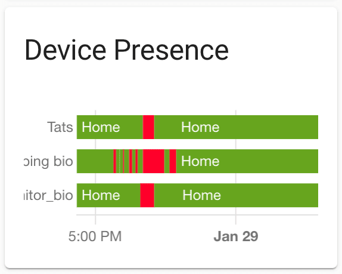
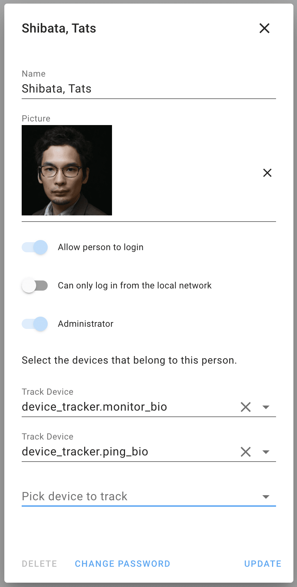
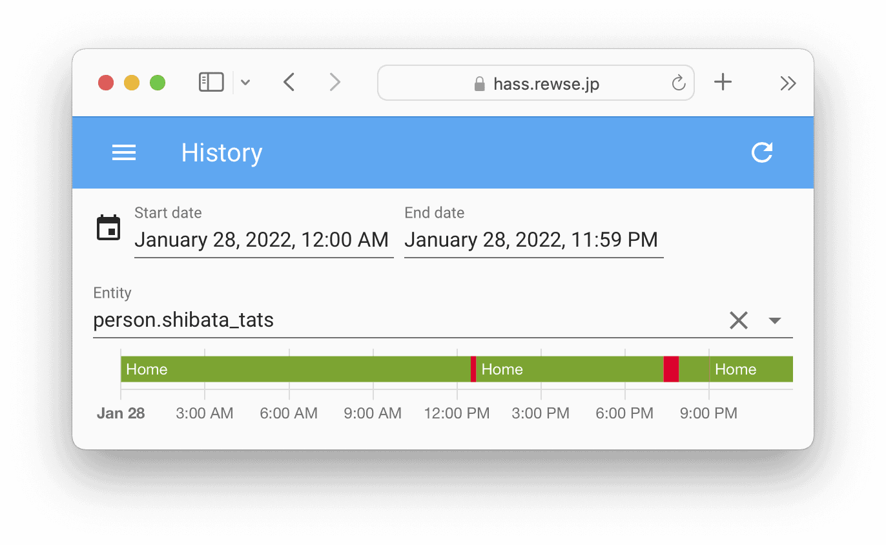

スマートホーム化を進めていると「在宅しているかを知りたい」という機会があります。たとえば「誰かが在宅しているときだけエアコンをオンにしたい」とか「誰かが在宅しているときは警戒レベルを下げたい」などです。不特定の誰かが在宅しているかどうかは [Philips Hue Motion Sensor](https://www.philips-hue.com/ja-jp/p/hue-motion-sensor/8719514342149) を使えば多くの場合でうまくいくでしょう。


しかし、より高度なホームオートメーションを組んでいると「ある特定の人物が在宅しているかどうか」を知りたいときがあります。たとえば「特定の人物が帰宅したときだけオートメーションをトリガーしたい」「在宅している人にだけ通知を送りたい」「子供しか家にいないときは警戒レベルを上げたい」「私が深夜に酔っ払って帰ってきたときには、家族にばれないように自動照明をつけない」などです。この記事では[monitor](https://github.com/andrewjfreyer/monitor)を使ってBluetooth通信の可否を確認し、そのBluetoothデバイスの所有者が在宅しているかどうかを検知します。


Pingの応答によっても似たようなことができますが、最近のスマートフォンはディープスリープに入るとPingに応答しなくなることが Home Assistant の [Device Tracker Integration](https://www.home-assistant.io/integrations/device_tracker/) で指摘されています。そのため、Ping (Wi-Fi) とBluetoothのOR条件（PingとBluetoothのどちらかに応答したら在宅）にしておくと、より良い結果が得られます。以下は私の Home Assistant の監視履歴で、2行目がPing (Wi-Fi)、3行目がmonitor (Bluetooth) の履歴です。緑が在宅、赤が不在を意味します。実際に不在にしていた時間はmonitorが正しく、Pingの結果は False Negative（在宅しているのに不在と判断）が発生しています。自宅のBluetoothの届かない場所にいるときはmonitor側に False Negative が発生するため、2行目と3行目のORになっている1行目の結果を「Tatsが在宅しているかどうか」に使用しています。





さらに、Ping (Wi-Fi) と違ってBluetoothの場合は、複数のmonitorサーバーを各階や各部屋に置くことで「どの階にいる」「どの部屋にいる」まで把握することが比較的簡単に行えます。そのような条件でホームオートメーションを組みたい場合も、monitorが役に立ちます。


## monitorのインストールとセットアップ


私はmonitorを [Raspberry Pi 4 Model B](https://www.raspberrypi.com/products/raspberry-pi-4-model-b/) 上の Ubuntu 20.04 にインストールしました。[Raspberry Pi Zero W](https://www.raspberrypi.com/products/raspberry-pi-zero-w/) 上のRaspbianでも動作するようなので、ハードウェアは極小で良さそうです。


まずはmonitorをGitHubからダウンロードします。


```
tats@fox:~$ cd /opt
tats@fox:/opt$ sudo git clone git://github.com/andrewjfreyer/monitor
Cloning into 'monitor'...
remote: Enumerating objects: 6978, done.
remote: Total 6978 (delta 0), reused 0 (delta 0), pack-reused 6978
Receiving objects: 100% (6978/6978), 1.22 MiB | 1.65 MiB/s, done.
Resolving deltas: 100% (3474/3474), done.
```


monitorをデーモンとして動作させるためのファイルを作成し、 `/etc/systemd/system/monitor.service` として保存します。


/etc/systemd/system/monitor.service


```
[Unit]
Description=Monitor Service
After=network.target

[Service]
User=root
ExecStart=/bin/bash /opt/monitor/monitor.sh &
WorkingDirectory=/opt/monitor
Restart=always
RestartSec=10

[Install]
WantedBy=multi-user.target network.target
```


監視したいBluetoothデバイスのMACアドレスと名前を `/opt/monitor/known_static_addresses` として保存します。名前は自分が分かりやすいもので構いません。我が家の場合、大人はiPhoneを持たずに外出することがないので、iPhoneのBluetoothが検知できるかどうかで判断することにしました。Apple Watch などでも可能です。[Apple AirTag](https://www.apple.com/jp/airtag/) はMACアドレスがランダム化されているっぽいので、できなさそうです。[Tile](https://thetileapp.jp/)はランダム化されていないっぽいです。


/opt/monitor/known\_static\_addresses


```
f8:10:00:00:00:00 bio
fc:66:00:00:00:00 wifes-iphone
```


monitorが登録されたデバイスを検知したときにメッセージを送るMQTTブローカーを設定します。私は同じ Rasbperry Pi にインストール済みの [Eclipse Mosquitto](https://mosquitto.org/) を使っています。複数のmonitorサーバーがある場合の区別をするための値が`mqtt_publisher_identity`で、MQTTトピックのパスとして使われます。以下ではMQTTブローカーにSSL接続しています。ファイルを `/opt/monitor/mqtt_preferences` として保存します。


/opt/monitor/mqtt\_preferences


```
# IP ADDRESS OR HOSTNAME OF MQTT BROKER
mqtt_address='hass.rewse.jp'

# MQTT BROKER USERNAME
mqtt_user='monitor'

# MQTT BROKER PASSWORD
mqtt_password='abcd1234'

# MQTT PUBLISH TOPIC ROOT 
mqtt_topicpath='monitor'

# PUBLISHER IDENTITY 
mqtt_publisher_identity='living_room'

# MQTT PORT 
mqtt_port='8883'

# MQTT CERTIFICATE FILE
mqtt_certificate_path='/etc/ssl/certs/ISRG_Root_X1.pem'

#MQTT VERSION (EXAMPLE: 'mqttv311')
mqtt_version=''
```


monitorサービスを有効にし、起動します。


```
tats@fox:~$ sudo systemctl enable monitor
tats@fox:~$ sudo systemctl start monitor
```


journalctlや `/var/log/syslog` からログを参照できます。以下では、14:04頃にconfidence（信頼度）が徐々に下がって0になっているため外出したことが分かり、14:30頃にconfidenceが100になっているので帰宅したことが分かります。なお、iPhoneの「設定」>「Bluetooth」をオフにすると、外出をシミュレーションできます。コントロールセンターからのBluetoothオフは全接続解除であって停波ではないので、必ず「設定」からオフにする必要があります。


```
tats@fox:~$ journalctl -u monitor -r
Jan 28 14:30:36 fox.rewse.jp bash[2145]: [+] 0.2.200 28-01-2022 02:30:36 PM [CMD-MQTT]        monitor/living_room/bio { ... confidence : 100 ... }
Jan 28 14:30:36 fox.rewse.jp bash[2145]: [+] 0.2.200 28-01-2022 02:30:36 PM [CMD-NAME]        F8:10:00:00:00:00 bio  Apple Inc
Jan 28 14:25:43 fox.rewse.jp bash[2145]: [+] 0.2.200 28-01-2022 02:25:43 PM [CMD-NAME]        F8:10:00:00:00:00 bio  Apple Inc
Jan 28 14:20:43 fox.rewse.jp bash[2145]: [+] 0.2.200 28-01-2022 02:20:43 PM [CMD-NAME]        F8:10:00:00:00:00 bio  Apple Inc
Jan 28 14:15:43 fox.rewse.jp bash[2145]: [+] 0.2.200 28-01-2022 02:15:43 PM [CMD-NAME]        F8:10:00:00:00:00 bio  Apple Inc
Jan 28 14:10:43 fox.rewse.jp bash[2145]: [+] 0.2.200 28-01-2022 02:10:43 PM [CMD-NAME]        F8:10:00:00:00:00 bio  Apple Inc
Jan 28 14:05:43 fox.rewse.jp bash[2145]: [+] 0.2.200 28-01-2022 02:05:43 PM [CMD-NAME]        F8:10:00:00:00:00 bio  Apple Inc
Jan 28 14:04:47 fox.rewse.jp bash[2145]: [+] 0.2.200 28-01-2022 02:04:47 PM [CMD-NAME]        F8:10:00:00:00:00 bio  Apple Inc
Jan 28 14:04:47 fox.rewse.jp bash[2145]: [+] 0.2.200 28-01-2022 02:04:47 PM [CMD-MQTT]        monitor/living_room/bio { ... confidence : 0 ... }
Jan 28 14:04:44 fox.rewse.jp bash[2145]: [+] 0.2.200 28-01-2022 02:04:44 PM [CMD-MQTT]        monitor/living_room/bio { ... confidence : 45 ... }
Jan 28 14:04:32 fox.rewse.jp bash[2145]: [+] 0.2.200 28-01-2022 02:04:32 PM [CMD-MQTT]        monitor/living_room/bio { ... confidence : 90 ... }
```


MQTTからもconfidenceを確認できます。以下ではMQTTブローカーにSSL接続しています。


```
tats@fox:~$ mosquitto_sub -h hass.rewse.jp -p 8883 -u sub_client -P abcd1234 -t monitor/living_room/bio --cafile /etc/ssl/certs/ISRG_Root_X1.pem
{"id":"F8:10:00:00:00:00","confidence":"100","name":"bio","manufacturer":"Apple Inc","type":"KNOWN_MAC","retained":"true","timestamp":"Sat Jan 28 2022 14:30:36 GMT+0900 (JST)","version":"0.2.200"}
```


monitorは、デフォルトでは気配をトリガーにデバイスをスキャンします。詳しくは [Readme](https://github.com/andrewjfreyer/monitor/blob/master/README.md) > Background & Technical Details を参照してください。しかし、私の環境では気配が多すぎてmonitorが動作しすぎ、monitorがインストールされた Raspberry Pi のWi-Fi通信が断続的に切れるほど2.4GHz帯域が汚れてしまいました。monitorにはトリガーを減らす方法がいくつかありますが、私は`-tad`オプションをつけてMQTTからトリガーメッセージを受け取ったときだけスキャンするようにしました（`-r`を使用すれば一定時間ごとのスキャンも可能です）。 `/etc/systemd/system/monitor.service` の`ExecStart`にオプションを追加します。


/etc/systemd/system/monitor.service


```
[Unit]
Description=Monitor Service
After=network.target

[Service]
User=root
ExecStart=/bin/bash /opt/monitor/monitor.sh -tad &
WorkingDirectory=/opt/monitor
Restart=always
RestartSec=10

[Install]
WantedBy=multi-user.target network.target
```


デバイスが到着した（家に帰ってきた）かどうかをスキャンするためには `monitor/scan/arrive` トピックに何らかのペイロードを投げます。また、デバイスが出発した（家から出た）かどうかをスキャンするためには `monitor/scan/depart` トピックに何らかのペイロードを投げます。この後、玄関ドアが開いたら Home Assistant がペイロードを投げるように設定しますが、mosquitto\_pubで動作確認が行えます。iPhoneの「設定」>「Bluetooth」をオフにして、テストメッセージを出版してみましょう。以下ではMQTTブローカーにSSL接続しています。


```
tats@fox:~$ mosquitto_pub -h hass.rewse.jp -p 8883 -u pub_client -P abcd1234 -t monitor/scan/depart -r --cafile /etc/ssl/certs/ISRG_Root_X1.pem -m "$(date) TEST"
```


ログを確認すると、スキャンが実行され、Bluetoothをオフにしたbioのconfidenceが0になっていることが確認できます。Bluetoothがオンのままのwifes-iphoneのconfidenceは100のままです。


```
tats@fox:~$ journalctl -u monitor -r
Jan 29 01:50:05 fox.rewse.jp bash[2145]: [+] 0.2.200 29-01-2022 01:50:05 AM [CMD-MQTT]        monitor/living_room/wifes-iphone { ... confidence : 100 .>
Jan 29 01:50:05 fox.rewse.jp bash[2145]: [+] 0.2.200 29-01-2022 01:50:05 AM [CMD-NAME]        FC:66:00:00:00:00 wifes-iphone  Apple Inc
Jan 29 01:50:01 fox.rewse.jp bash[2145]: [+] 0.2.200 29-01-2022 01:50:01 AM [CMD-NAME]        F8:10:00:00:00:00 bio  Apple Inc
Jan 29 01:50:01 fox.rewse.jp bash[2145]: [+] 0.2.200 29-01-2022 01:50:01 AM [CMD-MQTT]        monitor/living_room/bio { ... confidence : 0 ... }
```


## Home Assistant の設定


まずはMQTTの設定をします。


```
mqtt:
  broker: hass.rewse.jp
  port: 8883
  username: homeassistant
  password: !secret mosquitto_password
  certificate: /config/certs/ISRG_Root_X1.pem
```


玄関ドアが閉じたらMQTTに出版するオートメーションを作成します。外出する場合には玄関ドアが閉じてから十分な距離を離れるのを待つために、1分間遅らせています。ペイロードは何でも良いのですが、デバッグ時に分かりやすいように Home Assistant のIDにしてあります。retainを設定しないと Home Assistant 再起動直後はオフ（不在）になってしまうので、`retain: true` を追加しています。


```
- id: automation.trigger_monitor_by_entrance_door
  alias: Trigger monitor by Entrance Door
  mode: restart
  trigger:
    - platform: state
      entity_id: binary_sensor.entrance_door
      from: "on"
      to: "off"
  action:
    - delay:
        minutes: 1
    - service: mqtt.publish
      data:
        topic: monitor/scan/arrive
        payload: '{"identity": "automation.trigger_monitor_by_entrance_door"}'
        retain: true
    - service: mqtt.publish
      data:
        topic: monitor/scan/depart
        payload: '{"identity": "automation.trigger_monitor_by_entrance_door"}'
        retain: true
```


玄関ドアが閉まったタイミングで何らかの理由でスキャンに失敗した場合、次の玄関ドアが閉まるタイミングまで状態が更新されないため、念のため以下のオートメーションによって、5分ごとにもスキャンしています。


```
- id: automation.trigger_monitor
  alias: Trigger monitor
  trigger:
    - platform: time_pattern
      minutes: "/5"
      seconds: 33
  action:
    - service: mqtt.publish
      data:
        topic: monitor/scan/arrive
        payload: '{"identity": "automation.trigger_monitor"}'
        retain: true
    - service: mqtt.publish
      data:
        topic: monitor/scan/depart
        payload: '{"identity": "automation.trigger_monitor"}'
        retain: true
```


MQTTから取得したconfidenceの値をセンサーにします。


```
sensor:
  - platform: mqtt
    unique_id: sensor.monitor_living_room_bio
    name: monitor Living Room bio
    state_topic: monitor/living_room/bio
    value_template: "{{ value_json.confidence }}"
    unit_of_measurement: "%"
    state_class: measurement
```


私の環境では2個のmonitorサーバーがあるため、2個の値の大きいほうを使用します。つまり、どちらかが検知したら在宅とします。


```
sensor:
  - platform: min_max
    name: monitor bio
    type: max
    round_digits: 0
    entity_ids:
      - sensor.monitor_living_room_bio
      - sensor.monitor_storage_bio
```


confidenceが10%を上回った場合は在宅とするオートメーションを作成します。同様に、10%を下回った場合は不在とします。トリガーは「10%を上回った（下回った）場合」OR「5分間隔」の2つを設定しています。


```
- id: automation.turn_on_monitor_bio
  alias: Turn on monitor bio
  trigger:
    - platform: numeric_state
      entity_id: sensor.monitor_bio
      above: 10
    - platform: time_pattern
      minutes: "/5"
      seconds: 53
  condition:
    - condition: numeric_state
      entity_id: sensor.monitor_bio
      above: 10
  action:
    - service: device_tracker.see
      data:
        dev_id: monitor_bio
        location_name: home
        source_type: bluetooth
- id: automation.turn_off_monitor_bio
  alias: Turn off monitor bio
  trigger:
    - platform: numeric_state
      entity_id: sensor.monitor_bio
      below: 10
    - platform: time_pattern
      minutes: "/5"
      seconds: 53
  condition:
    - condition: numeric_state
      entity_id: sensor.monitor_bio
      below: 10
  action:
    - service: device_tracker.see
      data:
        dev_id: monitor_bio
        location_name: not_home
        source_type: bluetooth
```


ちなみにPing監視のための [Device Tracker Integration](https://www.home-assistant.io/integrations/device_tracker/) の設定は以下のようになります。IPアドレスを固定で割り振って [Ping (ICMP) Integration](https://www.home-assistant.io/integrations/ping/) を使用していますが、IPアドレスを固定で割り振れない場合は [Nmap Tracker Integration](https://www.home-assistant.io/integrations/nmap_tracker/) が使えます。ディープスリープによる False Negative の影響を減らすため、600秒以上応答がない場合に不在になるようにしています。


```
device_tracker:
  - platform: ping
    hosts:
      ping_bio: bio.rewse.jp
      ping_wifes_iphone: wifes-iphone.rewse.jp
    consider_home: 600
```


Home Assistant のGUIから Configuration > People & Zones > 監視したい人物を選び、Track Device にmonitorとPingを設定します。





以上で設定は完了です。精度の高い在宅監視ができるようになりました。





## まとめ


「ある特定の人物が在宅しているかどうか」を知りたい場合、monitorを使ってBluetooth通信の可否を確認すことで実現できます。また、Ping監視と組み合わせることで、より精度の高い監視が可能になります。


## 付録: スマホのWi-Fiが在宅中もオフになっている場合に警告する


外出時に遅いWi-Fiをつかんでしまったために、Wi-Fiを一時的にオフにすることがあります。しかし、オンに戻すことを忘れて、在宅中もWi-Fiではなくデータ通信しているときがたまにあります。そのため、「monitor (Bluetooth) は1時間以上オンラインなのに、Ping (Wi-Fi) は1時間以上オフライン」の場合に警告するようにしました。


最後に1時間なにもしないけどオートメーションとしては動いている時間を作り、`mode: single` （同じオートメーションが動いている場合は、新規のオートメーションを破棄）にすることで、モーションセンサーをトリガーにしているものの、このアラームは1時間に2回以上の頻度では送られないようにしています。


```
- id: automation.alarm_bio_wifi_might_be_off
  alias: "ALARM: bio WiFi might be Off"
  mode: single
  trigger:
    - platform: state
      entity_id: binary_sensor.living_room_motion
      to: "on"
  condition:
    - condition: state
      entity_id: device_tracker.monitor_bio
      state: home
      for:
        hours: 1
    - condition: state
      entity_id: device_tracker.ping_bio
      state: not_home
      for:
        hours: 1
  action:
    - service: notify.tats_devices
      data:
        title: "⚠️ ALARM"
        message: bio WiFi might be off
        data:
          url: /lovelace-machines/machines
          push:
            interruption-level: time-sensitive
    - delay:
        hours: 1
```
