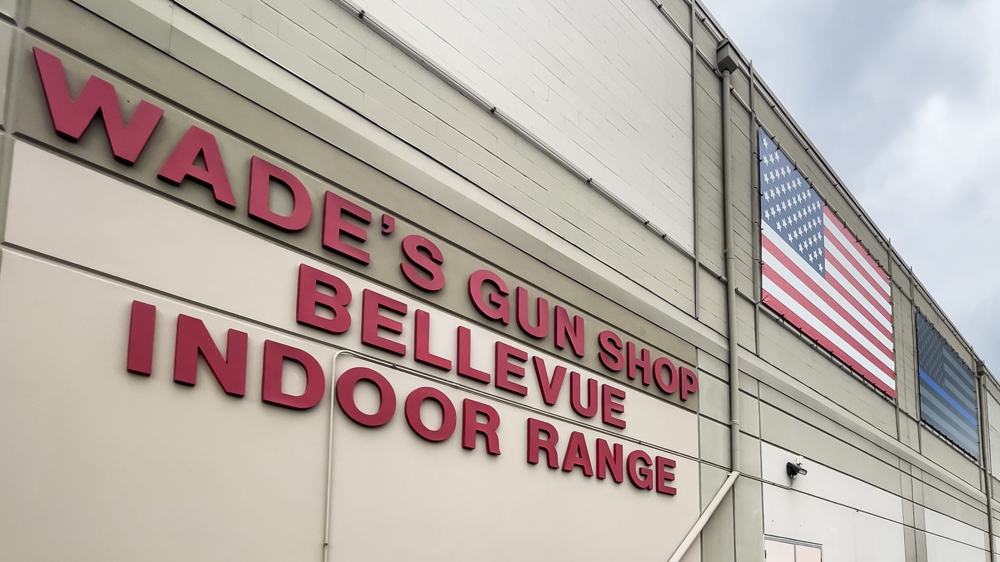
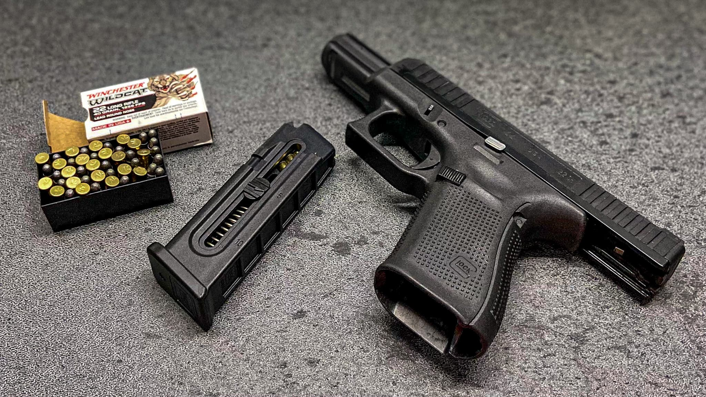
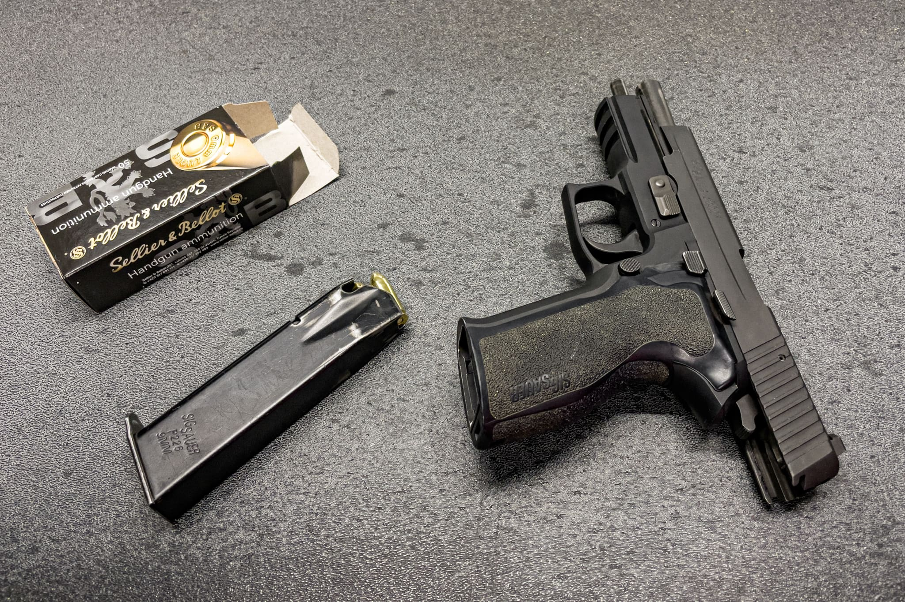

シアトル出張が土日を挟んでいたので、週末に [Bellevue Indoor Range](https://www.bellevueindoorrange.com/) に同僚と行って、銃を撃ってきました。米国では旅行者であっても銃を撃つことができます。Bellevue Indoor Range はシアトルから車で15分ほどの、ワシントン湖を挟んだ向かいのベルビューにあります。銃を販売している [Wade’s Gun Shop](https://www.wadesguns.com/) は日曜日が休みですが、併設している射撃場の Bellevue Indoor Range は日曜日も営業しています。

店員に銃をレンタルして射撃したいとパスポートを見せたあと、[Customer Safety & Rental Agreement](https://waiver.smartwaiver.com/w/5c701db80351f/web/) にスマートフォンから回答します。長いですが、命に関わる事故を起こしかねないため、きちんと理解して同意しましょう。銃特有の英単語に自信がない方は、事前に読んでおくことをお勧めします。特に、どこで銃を持って良くて、どこで持ってはいけないかは重要です。

10分程度の無料の講習を受けることもできます。同意書で確認した禁止事項のほか、正しい射撃姿勢、リロード方法、照準の合わせ方なども教えてくれます。[FPS](https://ja.wikipedia.org/wiki/%E3%83%95%E3%82%A1%E3%83%BC%E3%82%B9%E3%83%88%E3%83%91%E3%83%BC%E3%82%BD%E3%83%B3%E3%83%BB%E3%82%B7%E3%83%A5%E3%83%BC%E3%83%86%E3%82%A3%E3%83%B3%E3%82%B0%E3%82%B2%E3%83%BC%E3%83%A0)で学んだ英単語がたくさん出てきます。

続いてレンタルする銃を決めます。私が銃を撃つのが初めてだったため、同僚が [GLOCK 44](https://eu.glock.com/en/products/pistols/g44) (G44) を選んでくれました。.22ロングライフル弾 (22LR) は一般的な拳銃弾の中で、最も小型な物です。弾薬と標的を購入し、イヤーマフとメガネを掛けていない場合は保護メガネを借りたら射撃場に向かいます。

Glock 44

G44はプラスチックが多用されていることもあり、持った感触はほぼエアガンです。22LR弾も長いBB弾といったサイズ感です。打ってみた感覚もエアガンに近く、反動もそれほど強くはありません。標的に付いた弾痕が小さく、どこに当たったのかよく見失いました。入門にはちょうど良いでしょう。

慣れてきたところで、最も一般的な9x19mmパラベラム弾 (9mm Lugar) を使う [SIG SAUER P226](https://www.sigsauer.com/firearms/pistols/p226.html) に変更しました。G44が465gだったのに対してP226は964gもあり、ずしりとくるようになりました。また、22LRが直径5.7mmだったのに対して9mmと1.6倍になりました。パチンコ玉の直径が11mmなので、それより少し小さいくらいのサイズ感です。

SIG SAUER P226

9mmにもなると、エアガンとは全く違う反動があります。映画やマンガで片手で撃っていますが、私には到底無理そうです。ただ、弾痕が見えやすくなったので、2発目を修正しやすくなりました。

22LRを3人合計で100発、9mmも3人合計で100発撃ったところで、その日は終えました。

## まとめ

米国では身分証明書さえだけで誰でも射撃場で銃を撃つことができます。未成年も保護者同伴であれば可能です。自動車運転や飲酒は年齢制限があるのに銃は誰でもOKというバランスが日本に住んでいると謎ですが、米国文化を学ぶ機会に良いと思います。