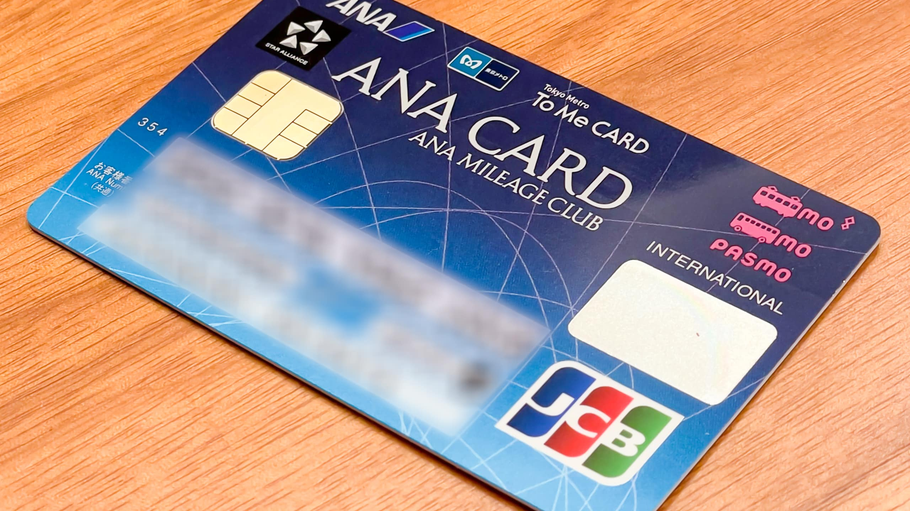
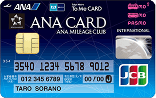
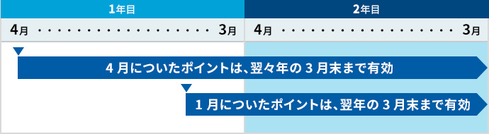

有効期限が切れそうなANAマイルの退避目的に、ANA To Me CARD PASMO JCB、通称ソラチカ一般カードを作りました。

ANA To Me CARD PASMO JCB（ソラチカ一般カード）

2020年3月までの海外出張や [ANAスーパーフライヤーズ ゴールドカード](https://www.ana.co.jp/ja/jp/amc/reference/premium/sfc/) で貯めたANAマイルは、コロナ禍では使う機会がまったくなくなってしまいました。ANAはマイルの有効期限を延長できるキャンペーンを繰り返してくれましたが、~~2022年3月31日までで延長キャンペーンもなくなり、3月31日に有効期限が切れるマイルが発生してしまう状況です~~（2022年2月14日追記: ANAは2023年3月31日までの[延長キャンペーン](https://www.ana.co.jp/ja/jp/amc/cpn/exdates-mile-skycoin20-11/)を発表しました）。しかし、ANA To Me CARD PASMO JCB（ソラチカ一般カード）を使うと、10%目減りするものの、ANAマイルの有効期限を4年間程度延長することができます。

通常のANAカードでは、10,000ANAマイル → 10,000メトロポイントで交換できるのは年間20,000マイルまでで、それを超えると10,000ANAマイル → 5,000メトロポイントと、大幅に交換レートが悪くなります。しかし、ANA To Me CARD PASMO JCB（ソラチカ一般カード）の場合は無制限に10,000ANAマイル → 10,000メトロポイントに[交換できます](https://www.ana.co.jp/ja/jp/amc/reference/tukau/point/tokyometro.html)。そして、通常の To Me CARD では1,000メトロポイント → 600ANAマイルですが、ANA To Me CARD PASMO JCB（ソラチカ一般カード）場合は100メトロポイント → 90ANAマイルで[交換できます](https://www.to-me-card.jp/use/)。

[メトロポイントの有効期限](https://www.to-me-card.jp/use/)は翌年度の3月末日なので、2022年3月にANAマイルから交換したポイントの有効期限は2023年3月31日になります。[ANAマイルの有効期限](https://www.ana.co.jp/ja/jp/amc/reference/tameru/valid.html#:~:text=%E3%83%9E%E3%82%A4%E3%83%AB%E3%81%AF3%E5%B9%B4%E9%96%93%E6%9C%89%E5%8A%B9,%E3%81%AB%E3%81%A6%E3%81%94%E7%A2%BA%E8%AA%8D%E3%81%8F%E3%81%A0%E3%81%95%E3%81%84%E3%80%82)は3年後の月末なので、2023年3月にメトロポイントから交換したマイルの有効期限は2026年3月31日になります。

[メトロポイントの有効期限](https://www.to-me-card.jp/use/)

つまり、10,000ANAマイル → 10,000メトロポイント → 9,000ANAマイルに交換することで、ANAマイルの有効期限を2022年3月から2026年3月31日まで伸ばすことができます。ただし、毎月20,000メトロポイントしかANAマイルに交換できないため、すべてのメトロポイントをANAマイルに交換するには何カ月掛かるかを割り引く必要があります。

|  |  |
| --- | --- |
| 発行会社 | [JCB](https://www.jcb.co.jp/) |
| カード名 | [ANA To Me CARD PASMO JCB（ソラチカ一般カード）](https://www.jcb.co.jp/ordercard/teikei/ana_tome.html) |
| 年会費 | 2,200円。初年度無料 |
| 入会日 | 2022-01-28 |