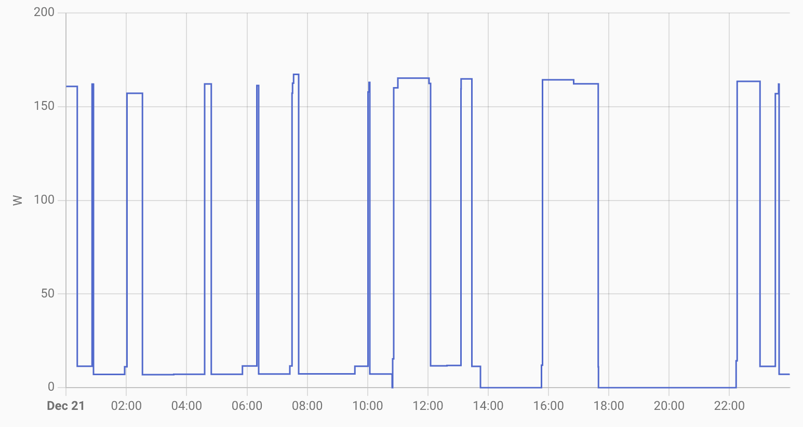

模様替えに伴って5畳用の加湿器が追加で必要になったので、ふるさと納税で [Dainichi HD-RX324](https://www.dainichi-net.co.jp/products/humidifier/lineup/rx2024/) を入手しました。


加湿器には以下のような4種類の方式があり、Dainichiの加湿器はハイブリッド式（気化式 + ヒーター）です。


- スチーム式
  * 水を沸騰させて湯気で加湿する。やかんのようなもの
  * メリット
    + 沸騰させるので滅菌されて衛生的
    + 湯気なので部屋の温度も上がる
    + 清掃が1カ月に一回程度で良い。清掃しなくても臭わない
    + 素早く湿度を上げられる
  * デメリット
    + 電気代が非常に高い
    + コポコポと沸騰音が常に鳴っている
    + 湯気が熱い
    + 水の粒子が大きいので遠くまで飛びづらく、広い部屋ではムラが大きい
    + 過加湿しやすい
- 気化式
  * 水に風を当てて蒸発させて加湿する。ぬれた洗濯物を乾かすようなもの
  * メリット
    + 水の粒子が雑菌より小さいので衛生的
    + 水の粒子が小さいので、広い部屋でもムラなく広がる
    + 電気代が安い
    + 過加湿しづらい
  * デメリット
    + 気化熱によって、室温よりも寒い風が出る
    + 清掃を2週間に一回程度しないと雑菌臭がしてくる
    + 70%などの高めの湿度にしづらい
- 超音波式
  * 水を超音波で震わせてしぶきで加湿する。霧吹きのようなもの
  * メリット
    + 本体も電気代も安い
  * デメリット
    + 水の粒子がウイルスや菌よりも大きいため、ウイルスや菌も同時にまく
    + 使用するたびに清掃が必要。しないと雑菌を室内にまくことになる
    + 水道水内のミネラルも同時にまくため、家具が白っぽくなったり、電化製品の故障の原因になる
    + 水の粒子が大きいため遠くまで飛びづらく、広い部屋ではムラが大きい
- ハイブリッド式（気化式 + ヒーター）
  * 気化式の風をヒーターで温める
  * メリット
    + 水が粒子が雑菌より小さいので衛生的
    + 水の粒子が小さいので、広い部屋でもムラなく広がる
    + 過加湿しづらい
    + 部屋の温度を下げない
  * デメリット
    + 電気代がやや高い
    + 清掃を2週間に一回程度しないと雑菌臭がしてくる
    + 70%などの高めの湿度にしづらい


我が家にはネコがいるのでスチーム式は危ないのと、沸騰音が常にするのが苦手なので、気化式かハイブリッド式から選んでいます。


## 製品選定


加湿性能のカタログ値はプレハブと木造和室の二つで書かれていることが多いですが、最近のマンションは24時間換気で湿度がとどまらないため、木造和室のほうの値を参考にしたほうが良いです。今回は5畳の部屋なので、300mL/h程度にしました。気化式は過加湿しづらいため大きめでも良いですが、本体サイズが大きくなります。


リビングではハイブリッド式の [SHARP HV-L75](https://jp.sharp/kashitsu/products/hvl75/)、寝室では気化式の [SHARP HV-J30](https://jp.sharp/kashitsu/products/hvj30/) を使っていて気に入っていたので、HV-J30の後継機の[HV-R30](https://jp.sharp/kashitsu/products/hvr30/)を検討したのですが生産終了しており、SHARPは500mL/h未満の加湿器から撤退していました。そのため、SHARP同様に定評のあるハイブリッド式のDainichiにすることにしました。Dainichiは[HD-RXT724](https://www.dainichi-net.co.jp/products/humidifier/lineup/rxt2024/)が[家電批評2024年ベストバイ](https://360life.shinyusha.co.jp/articles/-/50032)になっています。また、Dainichiは[カンタン取替えフィルター](https://www.dainichi-net.co.jp/products/humidifier/lineup/filter/)というのが使え、フィルター清掃せずに3カ月一回使い捨てるフィルターを選ぶこともできます。


Dainichiには27畳以上用リモコン対応の LX Type (LXC Type)、14畳から24畳までの RXT Type (RXC Type)、8畳用の RX Type などがあります。LX (LXC) とRXT (RXC) はカンタン取替えトレイカバーに対応していますが、清掃不要になるわけでもなさそうなのであまり重要視せず、RX Type にしました。


## 使用してみて


Dainichi製品は新潟市のふるさと納税にあるので、そちらに寄付し、2週間程度で Dainichi HD-RX324 が到着しました。


使ってみて最も印象的だったのは静音性です。標準モードでは50cmくらいまで近づかないと動作音が感じられません。静音モードにするとほぼ無音です。ターボだと2mくらいで動作音が聞こえますが、風切り音が中心でモーター音は静かです。SHARP HV-J30 はけっこううるさいので、Dainichi HD-RX324 のほうが優れています。


静音にも関わらず加湿性能は十分で、24時間稼働させていると毎日2，3回給水しています。タンクは3.2Lなので、24時間で3.2L × 2.5回 = 8L/day程度加湿しており、カタログスペック 300mL/h × 24時間 = 7.2L/dayと同等です。


ハイブリッド式ですが、部屋の湿度が目標に達するとヒーターが自動的に切れて電気代を抑えます。以下はスマートプラグで取得した電力ですが、ヒーター使用中は160W程度なものの、ヒーターが切れると7W程度に抑えられます。常にヒーターを使わずに7Wで動かすエコモードもあります。SHARP HV-L75 もエコモードはあるものの、おまかせモードではヒーターが常についているので、Dainichiのほうが優れています。





唯一気になるのは、下から給水するタンクなので、空気が入るゴボッゴボッという音がたまに鳴ります。これがうちのネコの嘔吐直前に喉から鳴る音に非常に似ており、最初はこの音が鳴るたびに警戒度マックスになっていました。最近は慣れてきましたが。SHARP HV-L75 のようにバケツ状の給水トレイだと、このような音は鳴りません。


## スマートホーム化


[Home Assistant](https://www.home-assistant.io/) から自動でオン/オフさせるため、[SwitchBot Bot](https://www.switchbot.jp/products/switchbot-bot) と [Gosund WP6](https://us.ghomesmart.com/collections/smart-electrician/products/gosund-smart-plug-wp6-2-pack) スマートプラグを付けています。SwitchBot Bot だけで自動制御しようとすると「加湿器はすでにオンなのに湿度が上がりきっていないと、SwitchBot Bot でオンにしたつもりが、トグルスイッチなのでオフにしてしまう」という問題を避けるのが難しくなります。そのため、スマートプラグで電力を計測することで、加湿器がオンなのかオフなのかが分かるようにしています。


Home Assistant の定義ファイルは以下のとおりです。最新のものは [ansible-playbooks/roles/homeassistant at master · rewse/ansible-playbooks](https://github.com/rewse/ansible-playbooks/tree/master/roles/homeassistant) をご覧ください。


configuration.yaml

```
switch:
  - platform: template
    switches:
      dads_room_humidifier:
        friendly_name: Dad’s Room humidifier
        unique_id: switch.dads_room_humidifier
        value_template: "{{ states('sensor.dads_room_humidifier_plug_power') | float(0) > 3 }}"
        availability_template: "{{ states('switch.dads_room_humidifier_plug_socket_1') }}"
        turn_on:
          service: switch.toggle
          target:
            entity_id: switch.dads_room_humidifier_switch
        turn_off:
          service: switch.toggle
          target:
            entity_id: switch.dads_room_humidifier_switch
        icon_template: mdi:air-humidifier
automation:
  - id: automation.turn_off_dads_room_humidifier
    alias: Turn off Dad’s Room Humidifier
    trigger:
      - platform: state
        entity_id: binary_sensor.dads_room_motion
        to: "on"
    condition:
      - condition: numeric_state
        entity_id: sensor.dads_room_humidity
        above: input_number.dads_room_humidifier_turned_off_threshold
      - condition: state
        entity_id: switch.dads_room_humidifier
        state: "on"
    action:
      - service: switch.turn_off
        entity_id: switch.dads_room_humidifier
      - service: notify.tats_devices
        data:
          message: "Turned off Dad’s Room Humidifier. Current: {{ states('sensor.dads_room_humidity') }}%"
          data:
          url: /lovelace/home
          push:
            interruption-level: time-sensitive
      - delay:
        hours: 1
    trace:
      stored_traces: 100
  - id: automation.turn_off_dads_room_humidifier_due_to_nobody
    alias: Turn off Dad’s Room Humidifier Due to Nobody
    trigger:
      - platform: time_pattern
        minutes: "/5"
        seconds: 18
    condition:
      - condition: state
        entity_id: binary_sensor.dads_room_presence
        state: "off"
        for:
          minutes: 30
      - condition: time
        after: "12:00:00"
        before: "20:00:00"
      - condition: state
        entity_id: switch.dads_room_humidifier
        state: "on"
    action:
      - service: switch.turn_off
        entity_id: switch.dads_room_humidifier_switch
      - service: notify.tats_devices
        data:
          message: "Turned off Dad’s Room Humidifier Due to Nobody. Current: {{ states('sensor.dads_room_humidity') }}%"
          data:
            url: /lovelace/home
            push:
              interruption-level: time-sensitive
      - delay:
        hours: 1
    trace:
      stored_traces: 100
  - id: automation.turn_on_dads_room_humidifier
    alias: Turn on Dad’s Room Humidifier
    trigger:
      - platform: state
        entity_id: binary_sensor.dads_room_motion
        to: "on"
    condition:
      - condition: numeric_state
        entity_id: sensor.dads_room_humidity
        below: input_number.dads_room_humidifier_turned_on_threshold
      - condition: state
        entity_id: switch.dads_room_humidifier
        state: "off"
        for:
          minutes: 30
      - condition: state
        entity_id: binary_sensor.dads_room_presence
        state: "on"
    action:
      - service: switch.turn_on
        entity_id: switch.dads_room_humidifier
      - service: notify.tats_devices
        data:
          message: "Turned on Dad’s Room Humidifier. Current: {{ states('sensor.dads_room_humidity') }}%"
          data:
          url: /lovelace/home
          push:
            interruption-level: time-sensitive
      - delay:
        hours: 1
    trace:
      stored_traces: 100
```


## まとめ


5畳の部屋に加湿器が必要になり、ふるさと納税でハイブリッド式加湿 Dainichi HD-RX324 を入手しました。気化式にヒーターが付いているため、部屋の温度を下げずに加湿できます。


実際に使ってみると、静音性と十分な加湿能力に満足です。標準モードでも50cm以内でないと音が聞こえないほど静かです。一日8L近く加湿し、カタログ値とほぼ同等の性能があります。ヒーターは湿度が一定になると自動で切れます。唯一の難点は空気の入る音がたまに鳴るくらいです。


全体的に静音性 / 加湿能力 / 電気代の面でバランスが取れた製品だと思います。


|  |  |
| --- | --- |
| ブランド | [Dainichi](https://www.dainichi-net.co.jp/) |
| 型番 | [HD-RX324](https://www.dainichi-net.co.jp/products/humidifier/lineup/rx2024/) |
| 寄付先 | [新潟県新潟市 - ふるなび - Yahoo!ショッピング](https://store.shopping.yahoo.co.jp/furunavi/1318144.html) |
| 寄付金 | 80,000円（- 10,000円相当ポイント還元） |
| 寄付日 | 2024-10-20 |
| 納品日 | 2024-11-03 |


|  |  |
| --- | --- |
| ブランド | [SwitchBot](https://www.switchbot.jp/) |
| 製品名 | [Bot](https://www.switchbot.jp/products/switchbot-bot) |
| 購入先 | [Amazon](https://amzn.to/49NJ0Wl) |
| 購入価格 | 4,280円 |
| 購入日 | 2024-11-04 |


|  |  |
| --- | --- |
| ブランド | [Gosund](https://us.ghomesmart.com/) |
| 型番 | [WP6](https://us.ghomesmart.com/collections/smart-electrician/products/gosund-smart-plug-wp6-2-pack) |
| 購入先 | [Amazon](https://amzn.to/3ZWkeyS) |
| 購入価格 | 1,624円 |
| 購入日 | 2024-11-04 |
