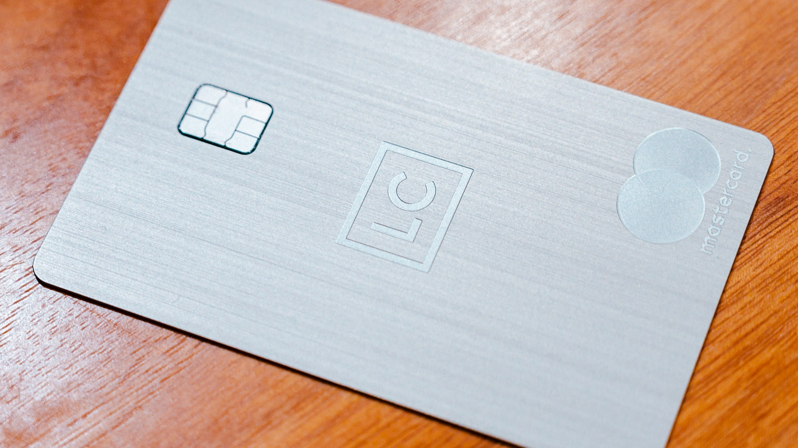
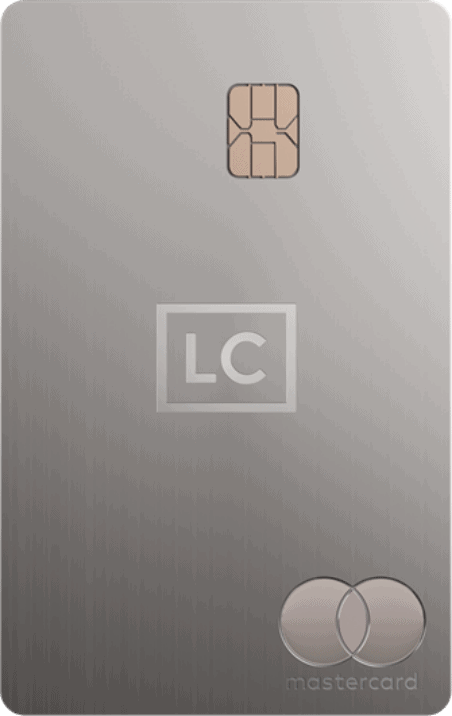

飲み会が増えてきて店を選ぶのが面倒になってきたので、コンシェルジュが使えるカードが欲しくなりました。中でも、コンシェルジュ以外にも魅力的なサービスが多かった [Luxury Card Mastercard Titanium Card](https://www.luxurycard.co.jp/titaniumcard) を作成しました。4月3日に申し込んだところ、4月6日にカード発行のメール受信、4月9日にカードを受け取りました。

Luxury Card Mastercard Titanium Card

すべての Luxury Card は金属製カードで、Mastercard Titanium Card の表面はブラシ加工ステンレス、裏面はカーボンで作られています。裏面のカーボンや磁気ストライプを貼った感じがまったくなく、どうやって作られているのか不思議です。カード製造技術に特許があるというのも納得です。ずっしりとした重みがあり、机に雑に置くとガシャンと鳴ります。中央のLCロゴとMastercardロゴはプリントではなくエンボス加工になっており、表面にプリントが一切ありません。Mastercard Titanium Card のポイント還元率は1%なのでショッピングにも常用できるため、これで支払うと店員とちょっとした会話になりそうな雰囲気があります。

一方でATMなどの吸い込み式では金属製カードを想定しておらず、傷ついて出てきたり、最悪、中で詰まるという事故もあるようです。Luxury Card の海外キャッシング手数料は12%で、一般的な18%に比べると安いので、海外キャッシングには Luxury Card を使いたいのですが、海外ATMで詰まったら最悪です。私は為替レートの良さと手数料の安さ、いつでもどこでも下ろせる気軽さから、海外の現地通貨はATMキャッシングで入手することがほとんどです。Luxury Card はキャッシングの[繰り上げ返済に対応している](https://faq.aplus.co.jp/faq_detail.html?id=516&category=420&page=1)ので、数日分の利息で済ますことができます。ちなみに、国内ATMキャッシングには非対応です。

ショッピング利用の観点では、ポイントをANA / JALマイルに交換してしまうと還元率が0.6%になってしまうところが気になるところです。私はANAマイルが不足気味の時は [ANAスーパーフライヤーズ ゴールドカード](https://www.ana.co.jp/ja/jp/amc/premium/sfc/) をメインに、過剰気味の時は Luxury Card Mastercard Titanium Card をメインに使い分けようと思っています。新しい [ANA Pay（タッチ払い）](https://www.ana.co.jp/ja/jp/amc/ana-pay/)では1マイル1円でチャージできる予定なので、還元率1.5%の [ANA VISAプラチナ プレミアムカード](https://www.smbc-card.com/nyukai/platinum/ana/) のほうがマイルとの互換性と高還元率の観点では有利です。

[コンシェルジュサービス](https://www.luxurycard.co.jp/concierge)はメールでの回答受信だけでなく、メールでの問い合わせもできるのが便利です。電話も休日の昼間でも数コールでつながり、音声自動応答などもなくすぐにオペレーターにつながります。提供会社は [Aspire Lifestyles](https://www.aspirelifestyles.com/japan/) です。

旅行関連サービスでは、[VIPホテル優待](https://jp.travel.luxurycard.co.jp/)が魅力的です。5つ星クラスのホテルで朝食無料やルームアップグレードの優待があり、ホテルのブランドを超えた上級ステータスの価値があります。国際線手荷物宅配は往復3個まで無料です。3人家族なら本カードだけで全員分がカバーでき、これはカード優待としては最多クラスでしょう。往路は3日前までに予約して2日前までに発送が必要ですが、手ぶらで空港に行けるのは身軽です。通常なら1個2,500円程度なので、3個往復なら15,000円相当の価値があります。

ラウンジについては [Priority Pass](https://www.prioritypass.com/ja) がついていますが、同伴者は32米ドルが必要です。Priority Pass 会員登録は不要で、Luxury Card と航空券を出せばそのまま使えます。また、羽田空港第3ターミナルの保安検査後にある [TIAT Lounge](https://tokyo-haneda.com/service/facilities/lounge.html) が使えます。このラウンジが使える航空会社とカード会社の利用者は少ないため、いつも空いているそうです。ANAラウンジはいつも混んでいて、シャワーを浴びるどころか座るところすらままならない状況なので、代わりに TIAT Lounge が使えるのは魅力的です。また、最近は海外旅⾏傷害保険が利用付帯に変わったカードが多いですが、Luxury Card は引き続き自動付帯です。

ダイニング関連のサービスでは、[Mastercard Taste of Premium](https://www.mastercard.co.jp/tasteofpremium/jp.html) のサービスの一つである ダイニング by 招待日和 が使えます。Mastercard Titanium Card は [World Elite](https://www.mastercard.co.jp/ja-jp/personal/find-a-card/world-elite.html) というMastercardの最上位ランクのため、コース2名以上の予約で1名が無料になる[招待日和](https://syotaibiyori.com/)が1カ月に2回まで使用できます。通常の招待日和は都内で135店舗な一方、ダイニング by 招待日和 は85店舗と少なくなっていますが、8,000円程度のコースからそろっており、使いやすそうです。[Ken’s Cafe Tokyo](https://kenscafe.jp/) のガトーショコラ毎日取り置きは、Ken’s Cafe Tokyo が自宅からすぐのところにあるため、個人的には利用しやすいです。

[ラグジュアリーカード ラウンジ](https://myluxurycard.co.jp/info/dining/lounge.html) のカフェ優待は提携店がもっと増えると魅力的なのですが、今の数では使える機会は限られるでしょう。ホテルやラウンジが利用できるラウンジバーも提携先が増えると良いのですが。自分の行動範囲に提携先があるならば魅力的な内容でしょう。

ライフスタイル関連のサービスでは、映画鑑賞券が毎月1枚無料になるのが魅力的です。[TOHOシネマズ](https://www.tohotheater.jp/)で使えるので、個人的には利用しやすいです。[東京国⽴近代美術館](https://www.momat.go.jp/)などの国立美術館で同伴者1名無料も使えそうですが、Mastercard Titanium Card の場合は常設展のみなので、そう何度も行くことはなさそうです。

気になる点はカード業務をしている[APLUS](https://www.aplus.co.jp/)のネット関連の弱さです。オンラインサービスが毎日2:00から5:30までサービス停止し、カード利用通知に5日ほどかかり、メールでしか受信できません。

年会費は55,000円ですが、[SBI新生銀行のページ](https://www.sbishinseibank.co.jp/retail/credit_card/luxury_card/titanium.html)から申し込むと初年度半額の27,500円になります。また、家族カードも本来の年会費は16,500円ですが、初年度無料になりました。SBI新生銀行の口座は不要です。

|  |  |
| --- | --- |
| 発行会社 | [Black Card](https://www.luxurycard.co.jp/) |
| カード名 | [Luxury Card Mastercard Titanum Card](https://www.luxurycard.co.jp/titaniumcard) |
| 年会費 | 55,000円 |
| 入会日 | 2023-04-06 |