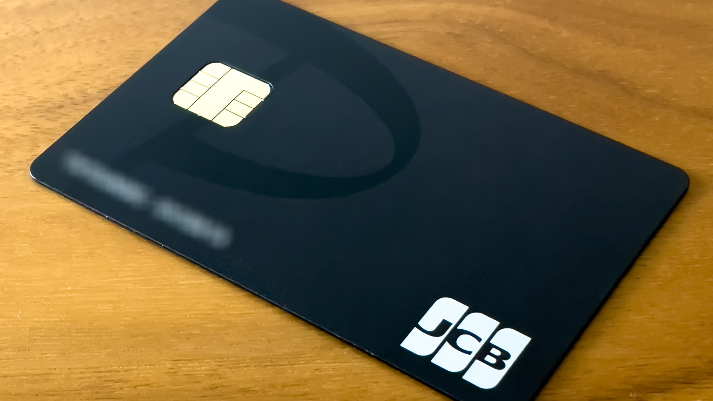

Yahoo! JAPANカード（ヤフーカード）を持っていたので、そのまま待っていれば自動切り替えになったのですが、自動切り替え時期が2022年11月でしばらく先なのに、最近の各種キャンペーンはPayPayカードを前提としており、ヤフーカードだとどうなるのかの細かい条件を確認するのが面倒でした。また、ヤフーカード会員は解約したとしてもPayPayカードの新規入会特典対象外ですが、ヤフーカードを解約してからハピタス経由でPayPayカードを申し込むと3,800ハピタスポイント（3,800円相当）はもらえるので、ヤフーカードを解約してPayPayカードを作成しました。

PayPayカード

## ヤフーカードの解約方法

解約するとヤフーカード内のTポイントが使えなくなるため、解約前にその他のTカードに移行する必要があります。私はクレジットカード機能のないファミマTカード（ポイントカード）を以前から持っていたのでそちらに移行しましたが、ヤフーカード以外のTカードを持っていない場合はTポイントアプリから[モバイルTカード専用Tカード](https://ssl.help.tsite.jp/faq/show/35496?site_domain=qa-tsite)を作成できます。移行先のTカードを確保したら、[Tカードポイント移動手続き](https://tsite.jp/r/ptido/)を行います。

ヤフーカードの解約はナビダイヤルへの連絡が通常の方法ですが、[PayPayカード切替案内サイト](https://card.yahoo.co.jp/yjc-paypay)でPayPayカードへの切替停止を行うと即座にヤフーカードの解約手続きが始まるので、こちらが簡単でお薦めです。

なお、ヤフーカードを [Apple Pay に追加](https://support.apple.com/ja-jp/guide/iphone/iph9b7f53382/ios)しておくと解約手続きが完了したタイミングで Apple Pay からヤフーカードが強制削除されるので、タイミングが把握しやすいです。

## ハピタス経由でのPayPayカードの申し込み

ヤフーカードの解約手続きが完了したら、ハピタスからPayPayカードを申し込みます。ハピタスのアカウントがまだない場合は、私の紹介で2022年7月31日までに新規登録して、8月31日までに合計500pt以上獲得すると、追加であなたが700ptもらえます。

ハピタスのアカウントを作成したら、[ハピタスのPayPayカードのページ](https://hapitas.jp/item/detail/itemid/81753/)から申し込みます。2022年2月15日時点では、新規カード発行で3,800pt獲得となっています。ハピタスの3,800ptは、Amazonギフト券3,877円分やPayPayボーナス3,800円相当に[交換可能](https://hapitas.jp/exchange/)です。ポイント獲得条件を見ると、以下の通り、ヤフーカードを解約していればポイント獲得対象になることが確認できます。

> Yahoo! JAPANカード保持者は、Yahoo! JAPANカード解約の上、PayPayカードに申込んだ場合のみポイント獲得対象となります。
>
> [PayPayカードの詳細 | ハピタス | PayPayカードの利用がもっとお得になるポイントサイト | ハピタスは高還元で交換先多数！](https://hapitas.jp/item/detail/itemid/81753/)

なお、私はヤフーカードと同額の限度額でPayPayカードが発行されましたが、再作成することで限度額が下がったり、発行を拒否される可能性があります。

## 2022年4月5日追記

問題なくハピタスの3,800ptを獲得しました。

## まとめ

ヤフーカードを解約してからハピタス経由でPayPayカードを申し込むと、3,800円相当のポイントをもらえます。ヤフーカード解約前にTポイントを移行し、PayPayカード切替案内サイトから解約しましょう。

|  |  |
| --- | --- |
| 発行会社 | [PayPayカード](https://www.paypay-card.co.jp/company/) |
| カード名 | [PayPayカード](https://www.paypay-card.co.jp/) |
| 年会費 | 無料 |
| 入会日 | 2022-02-06 |