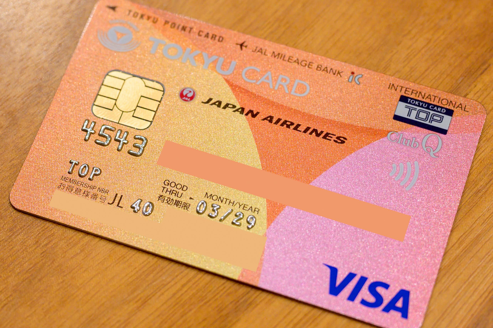
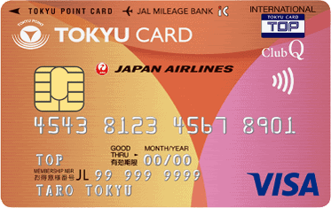
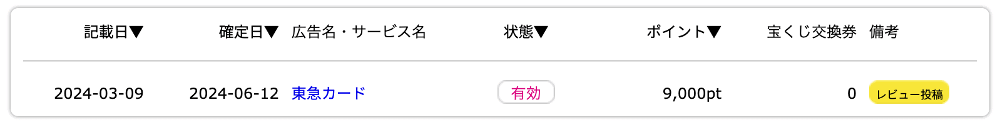
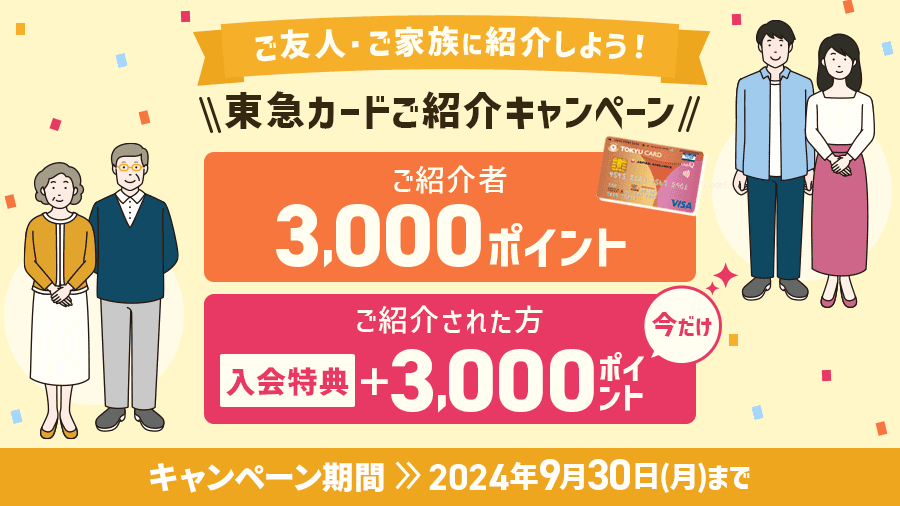

娘が通塾のために電車に乗る機会が増えましたが、Suicaをなくす可能性を考慮すると高額チャージできません。そのため頻繁にチャージすることになって面倒なので、保護者のクレジットカードで子どものPASMOにオートチャージできる[ジュニアオートチャージ](https://www.topcard.co.jp/services/autocharge/topjr.html)が使える [TOKYU CARD ClubQ JMB](https://www.topcard.co.jp/entry/tokyu-card/) を作成しました。PASMOとクレジットカードの両方を発行している事業者はたくさんありますが、ジュニアオートチャージに対応しているのは東急だけです。

TOKYU CARD ClubQ JMB

## 必要な手続き

ジュニアオートチャージ機能についてはだいぶ前から存在は知っていたのですが、申込みが面倒なので今まで作成する気になっていませんでした。また、小児用Suicaと小児用PASMOは同時に持てないため、現在持っているカードが小児用Suicaの場合、さらに手間が増えます。私の場合、以下のように進めました。

- **2024/3/9:** TOKYU CARD ClubQ JMB をオンライン申込み
- **2024/3/16:** 紙の申込書が届く。東急カードは引き落とし口座が都市銀行でないとオンライン申込みが完了しない [1](#26c7065b-39ca-473d-b3ce-cf3ee9923230)
- **2024/3/17:** 申込書を投函（とうかん）
- **2024/4/2:** 審査結果のメール受信
- **2024/4/6:** カード到着
- **2024/4/6:** 小児用Suicaを返却 & 残高返金。返却は[みどりの窓口](https://www.jreast.co.jp/estation/)でしかできない
- **2024/4/6:** 小児用PASMOを発行。小児用Suicaを返却しないと小児用PASMOは発行できない。小児用PASMOは東京メトロの場合は[定期券うりば](https://www.tokyometro.jp/ticket/pass/counter/index.html)で発行
- **2024/4/6:** ジュニアオートチャージをオンライン申込み。この時にオートチャージするPASMO番号が必要。申込みフォームがキャンペーン申込みフォームを流用しているので違和感が
- **2024/4/12:** 東急カードからジュニアオートチャージの手続き完了の手紙到着
- **2024/4/26:** パスモからPASMOオートチャージサービスの受付完了のはがき到着
- **2024/4/27:** PASMOオートチャージサービスの設定。東京メトロの券売機でできる

東急カードとパスモの手続きがかなり遅いので、カード申込みからジュニアオートチャージできるようになるまでに2カ月近く掛かりました。

また、ジュニアオートチャージは与信枠10万円のバーチャルカードが別途発行された扱いになり、[TOKYU POINT Webサービス](https://ssl.topcard.co.jp/member/)や[東急カードプラス](https://apps.apple.com/jp/app/%E6%9D%B1%E6%80%A5%E3%82%AB%E3%83%BC%E3%83%89%E3%83%97%E3%83%A9%E3%82%B9/id684161442)モバイルアプリに利用明細が反映されず、紙の明細書が毎月届きます。明細書をオンラインに切り替えることはできません。手続きもシステム実装も洗練されていないのですが、ほかに選択肢がないので背に腹は代えられません。

## 申込みキャンペーン

手続きの面倒さで諦めてしまいがちですが、救いは[ハピタス](https://m.hapitas.jp/item/detail/itemid/87615?i=21438109&route=pcText&apn=itemsharelink)経由で TOKYU CARD ClubQ JMB を申し込むと8,000pt（8,000円相当）もらえることでしょうか。さらにハピタスのアカウントがまだない場合は、以下から私の紹介で2024/8/31までに新規登録すると、最大1,500ptもらえます。

私のときは9,000ptだったのですが、6/12に確定しました。

ハピタス経由で申し込みたくない場合、以下から2024/9/30までに TOKYU CARD ClubQ JMB を申し込むと、あなたと私がそれぞれ TOKYU POINT 3,000ポイント（3,000円相当）をもらえます。

## 中学生からの代替案

なお、中学生になると [Apple Pay のSuica](https://www.jreast.co.jp/appsuica/)が発行できるようになるのですが、中学生ではクレジットカードを発行できないのでオートチャージは設定できず、[ワンタイムクレカ決済](https://apfaq.mobilesuica.com/faq/show/6002)を利用してオンラインチャージすることになります。ただし、このシステムは「クレジットカードの名義人さまが直接クレジットカード番号等を入力する必要があり、当該手続きは決済の都度必要」「入力いただいたクレジットカード番号等の情報がアプリ内に残ることはありません」という面倒な仕様になっています。

そのため、[かぞくのおさいふ](https://www.smbc-card.com/prepaid/kazokunoosaifu/index.jsp)を発行し、保護者が子どものカードに送金し、子どもが自分のカードをSuicaアプリに登録してオンラインチャージすることで、ワンタイムクレカ決済に比べるとだいぶ手間が減らせます。

## まとめ

娘の通塾に伴い、小児用PASMOにオートチャージできる TOKYU CARD ClubQ JMB を作成しました。ジュニアオートチャージ機能に対応しているのは東急カードだけです。申込みから手続き完了までには2カ月近くかかり、手続きの過程で小児用Suicaの返却と小児用PASMOの新規発行が必要でした。ジュニアオートチャージは別のバーチャルカードが発行され、明細はオンラインではなく紙で届くなど、システム的な洗練さに欠けています。

一方で、ハピタス経由で TOKYU CARD ClubQ JMB を申し込むと8,000pt（8,000円相当）がもらえるメリットがあります。子どもにチャージする手段は限られていますが、こうしたキャンペーンを活用することで少しは心理的負担が軽減されます。

|  |  |
| --- | --- |
| 発行会社 | [東急カード](https://www.topcard.co.jp/) |
| カード名 | [TOKYU CARD ClubQ JMB](https://www.topcard.co.jp/entry/tokyu-card/) |
| 年会費 | 2年目以降1,100円 + ジュニアオートチャージ年会費1,320円 |
| 入会日 | 2024-04-06 |